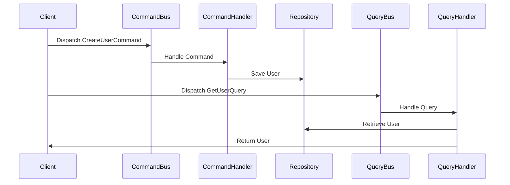

## 7.16 Command Query Responsibility Segregation (CQRS)

Command Query Responsibility Segregation (CQRS) is a powerful architectural pattern that separates the read and write operations of a system into distinct models. This separation allows for optimized performance, scalability, and maintainability, especially in complex applications. In this guide, we will delve into the intricacies of CQRS, its implementation in PHP, and its applicability in modern software development.

### Intent

The primary intent of CQRS is to segregate the responsibilities of commands (write operations) and queries (read operations) into separate models. This separation allows each model to be optimized independently, leading to more efficient and scalable systems.

### Understanding CQRS

CQRS is based on the principle that a system's read and write operations often have different requirements and can benefit from being handled separately. By dividing these operations, developers can:

- **Optimize Read and Write Operations Independently:** Tailor each model to its specific needs, improving performance and scalability.
- **Enhance System Scalability:** Distribute read and write loads across different servers or services.
- **Improve Maintainability:** Simplify the codebase by separating concerns, making it easier to understand and modify.

### Key Concepts of CQRS

1. **Commands and Queries:** In CQRS, commands are responsible for making changes to the system's state, while queries are used to retrieve data without altering the state.
2. **Separation of Models:** The system is divided into two distinct models: the command model for handling write operations and the query model for handling read operations.
3. **Event Sourcing (Optional):** Often used in conjunction with CQRS, event sourcing involves storing changes to the system as a sequence of events, allowing for a complete history of state changes.

### Implementing CQRS in PHP

Implementing CQRS in PHP involves creating separate layers for handling commands and queries. Let's explore how to achieve this with practical examples.

#### Step 1: Define Commands and Queries

Commands and queries are the building blocks of CQRS. Commands represent actions that change the state, while queries retrieve data.

```php
// Command: CreateUserCommand.php
class CreateUserCommand {
    private $username;
    private $email;

    public function __construct(string $username, string $email) {
        $this->username = $username;
        $this->email = $email;
    }

    public function getUsername(): string {
        return $this->username;
    }

    public function getEmail(): string {
        return $this->email;
    }
}

// Query: GetUserQuery.php
class GetUserQuery {
    private $userId;

    public function __construct(int $userId) {
        $this->userId = $userId;
    }

    public function getUserId(): int {
        return $this->userId;
    }
}
```

#### Step 2: Implement Command Handlers

Command handlers are responsible for executing commands and making changes to the system's state.

```php
// CommandHandler: CreateUserHandler.php
class CreateUserHandler {
    private $userRepository;

    public function __construct(UserRepository $userRepository) {
        $this->userRepository = $userRepository;
    }

    public function handle(CreateUserCommand $command): void {
        $user = new User($command->getUsername(), $command->getEmail());
        $this->userRepository->save($user);
    }
}
```

#### Step 3: Implement Query Handlers

Query handlers are responsible for retrieving data without modifying the system's state.

```php
// QueryHandler: GetUserHandler.php
class GetUserHandler {
    private $userRepository;

    public function __construct(UserRepository $userRepository) {
        $this->userRepository = $userRepository;
    }

    public function handle(GetUserQuery $query): User {
        return $this->userRepository->findById($query->getUserId());
    }
}
```

#### Step 4: Set Up the Infrastructure

To facilitate the execution of commands and queries, we need a dispatcher or bus system.

```php
// CommandBus.php
class CommandBus {
    private $handlers = [];

    public function registerHandler(string $commandClass, $handler): void {
        $this->handlers[$commandClass] = $handler;
    }

    public function dispatch($command): void {
        $commandClass = get_class($command);
        if (!isset($this->handlers[$commandClass])) {
            throw new Exception("No handler registered for $commandClass");
        }
        $this->handlers[$commandClass]->handle($command);
    }
}

// QueryBus.php
class QueryBus {
    private $handlers = [];

    public function registerHandler(string $queryClass, $handler): void {
        $this->handlers[$queryClass] = $handler;
    }

    public function dispatch($query) {
        $queryClass = get_class($query);
        if (!isset($this->handlers[$queryClass])) {
            throw new Exception("No handler registered for $queryClass");
        }
        return $this->handlers[$queryClass]->handle($query);
    }
}
```

#### Step 5: Execute Commands and Queries

With the infrastructure in place, we can now execute commands and queries.

```php
// Example Usage
$commandBus = new CommandBus();
$queryBus = new QueryBus();

$userRepository = new UserRepository();
$createUserHandler = new CreateUserHandler($userRepository);
$getUserHandler = new GetUserHandler($userRepository);

$commandBus->registerHandler(CreateUserCommand::class, $createUserHandler);
$queryBus->registerHandler(GetUserQuery::class, $getUserHandler);

// Dispatch a command
$createUserCommand = new CreateUserCommand('john_doe', 'john@example.com');
$commandBus->dispatch($createUserCommand);

// Dispatch a query
$getUserQuery = new GetUserQuery(1);
$user = $queryBus->dispatch($getUserQuery);
```

### Visualizing CQRS Architecture

To better understand the flow of CQRS, let's visualize the architecture using a sequence diagram.



### Use Cases and Examples

CQRS is particularly beneficial in scenarios where read and write operations have distinct requirements. Here are some common use cases:

- **High-Performance Applications:** Systems with high read-to-write ratios can benefit from optimized query models.
- **Scalable Systems:** Distributing read and write operations across different services or databases enhances scalability.
- **Complex Business Logic:** Separating commands and queries simplifies the implementation of complex business rules.

### Design Considerations

When implementing CQRS, consider the following:

- **Complexity:** CQRS introduces additional complexity by separating models. Ensure the benefits outweigh the costs.
- **Consistency:** In distributed systems, eventual consistency may be necessary. Plan for data synchronization.
- **Event Sourcing:** Consider using event sourcing to maintain a complete history of state changes.

### PHP Unique Features

PHP's flexibility and rich ecosystem make it well-suited for implementing CQRS. Utilize PHP's object-oriented features, such as classes and interfaces, to structure commands and queries effectively. Leverage PHP frameworks like Symfony or Laravel, which offer built-in support for command and query buses.

### Differences and Similarities

CQRS is often confused with event sourcing, but they are distinct patterns. While CQRS focuses on separating read and write models, event sourcing involves storing state changes as events. These patterns can be used together but serve different purposes.

### Try It Yourself

Experiment with the provided code examples by modifying the command and query handlers to include additional logic or integrate with a database. Try implementing CQRS in a small project to experience its benefits firsthand.

### Knowledge Check

- What are the main components of CQRS?
- How does CQRS improve system scalability?
- What are the potential challenges of implementing CQRS?

### Embrace the Journey

Remember, CQRS is a powerful tool in your architectural toolkit. As you explore its implementation, you'll gain insights into building scalable and maintainable systems. Keep experimenting, stay curious, and enjoy the journey!

## Quiz: Command Query Responsibility Segregation (CQRS)



### What is the primary intent of CQRS?

- [x] To segregate read and write operations into separate models
- [ ] To combine read and write operations into a single model
- [ ] To optimize only read operations
- [ ] To optimize only write operations

> **Explanation:** CQRS aims to separate read and write operations into distinct models for optimization.

### Which of the following is a key benefit of CQRS?

- [x] Improved system scalability
- [ ] Simplified codebase
- [ ] Reduced complexity
- [ ] Increased data redundancy

> **Explanation:** CQRS enhances scalability by allowing independent optimization of read and write operations.

### What is a common use case for CQRS?

- [x] High-performance applications
- [ ] Simple CRUD applications
- [ ] Static websites
- [ ] Single-page applications

> **Explanation:** CQRS is beneficial for high-performance applications with distinct read and write requirements.

### In CQRS, what is the role of a command?

- [x] To change the system's state
- [ ] To retrieve data
- [ ] To handle queries
- [ ] To manage user sessions

> **Explanation:** Commands in CQRS are responsible for making changes to the system's state.

### What is the role of a query in CQRS?

- [x] To retrieve data without altering the state
- [ ] To change the system's state
- [ ] To handle commands
- [ ] To manage transactions

> **Explanation:** Queries in CQRS are used to retrieve data without modifying the system's state.

### How does CQRS handle read and write operations?

- [x] By separating them into distinct models
- [ ] By combining them into a single model
- [ ] By prioritizing write operations
- [ ] By prioritizing read operations

> **Explanation:** CQRS separates read and write operations into different models for optimization.

### What is a potential challenge of implementing CQRS?

- [x] Increased complexity
- [ ] Reduced performance
- [ ] Decreased scalability
- [ ] Simplified architecture

> **Explanation:** CQRS can introduce additional complexity due to the separation of models.

### Which pattern is often used in conjunction with CQRS?

- [x] Event sourcing
- [ ] Singleton pattern
- [ ] Factory pattern
- [ ] Observer pattern

> **Explanation:** Event sourcing is commonly used with CQRS to maintain a history of state changes.

### What is a key consideration when using CQRS in distributed systems?

- [x] Eventual consistency
- [ ] Immediate consistency
- [ ] Data redundancy
- [ ] Reduced latency

> **Explanation:** In distributed systems, eventual consistency may be necessary when using CQRS.

### True or False: CQRS is only suitable for large-scale applications.

- [ ] True
- [x] False

> **Explanation:** While CQRS is beneficial for large-scale applications, it can also be applied to smaller projects with distinct read and write requirements.


