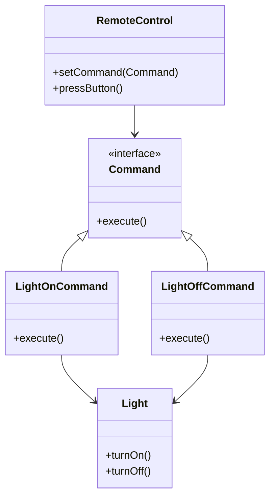

## 7.2 Command Pattern

The Command Pattern is a fundamental behavioral design pattern that encapsulates a request as an object, thereby allowing for parameterization of clients with queues, requests, and operations. This pattern is particularly useful in scenarios where you need to decouple the sender of a request from its receiver, allowing for more flexible and reusable code.

### Intent

The primary intent of the Command Pattern is to encapsulate a request as an object. This encapsulation allows for:

- **Parameterization of objects** with operations.
- **Queuing of requests**.
- **Logging of requests**.
- **Supporting undoable operations**.

By encapsulating requests, the Command Pattern provides a way to decouple the sender of a request from the receiver, promoting loose coupling and enhancing flexibility in code design.

### Key Participants

1. **Command Interface**: Declares an interface for executing an operation.
2. **Concrete Command**: Implements the Command interface and defines a binding between a Receiver object and an action.
3. **Receiver**: Knows how to perform the operations associated with carrying out a request.
4. **Invoker**: Asks the command to carry out the request.
5. **Client**: Creates a ConcreteCommand object and sets its receiver.

### Applicability

Use the Command Pattern when you want to:

- **Parameterize objects** with operations.
- **Specify, queue, and execute requests** at different times.
- **Support undoable operations**.
- **Structure a system around high-level operations** built on primitive operations.

### Implementing Command in PHP

Let's explore how to implement the Command Pattern in PHP by defining command interfaces, concrete command classes, and implementing invoker and receiver classes.

#### Step 1: Define the Command Interface

The Command interface declares a method for executing a command. In PHP, this can be represented as follows:

```php
<?php

interface Command {
    public function execute();
}
```

#### Step 2: Create Concrete Command Classes

Concrete Command classes implement the Command interface and define a binding between a Receiver object and an action. Here's an example:

```php
<?php

class LightOnCommand implements Command {
    private $light;

    public function __construct(Light $light) {
        $this->light = $light;
    }

    public function execute() {
        $this->light->turnOn();
    }
}

class LightOffCommand implements Command {
    private $light;

    public function __construct(Light $light) {
        $this->light = $light;
    }

    public function execute() {
        $this->light->turnOff();
    }
}
```

#### Step 3: Implement the Receiver Class

The Receiver class knows how to perform the operations associated with carrying out a request. Here's an example of a simple Light class:

```php
<?php

class Light {
    public function turnOn() {
        echo "The light is on.\n";
    }

    public function turnOff() {
        echo "The light is off.\n";
    }
}
```

#### Step 4: Create the Invoker Class

The Invoker class is responsible for executing the command. It can store a command and execute it at a later time:

```php
<?php

class RemoteControl {
    private $command;

    public function setCommand(Command $command) {
        $this->command = $command;
    }

    public function pressButton() {
        $this->command->execute();
    }
}
```

#### Step 5: Implement the Client

The Client is responsible for creating a ConcreteCommand object and setting its receiver. Here's how you can use the Command Pattern:

```php
<?php

// Client code
$light = new Light();
$lightOn = new LightOnCommand($light);
$lightOff = new LightOffCommand($light);

$remote = new RemoteControl();
$remote->setCommand($lightOn);
$remote->pressButton(); // Output: The light is on.

$remote->setCommand($lightOff);
$remote->pressButton(); // Output: The light is off.
```

### Use Cases and Examples

The Command Pattern is versatile and can be used in various scenarios. Let's explore some common use cases.

#### Implementing Undo/Redo Functionality

The Command Pattern is ideal for implementing undo/redo functionality. By maintaining a history of executed commands, you can easily reverse or reapply actions.

```php
<?php

class CommandHistory {
    private $history = [];

    public function push(Command $command) {
        $this->history[] = $command;
    }

    public function pop() {
        return array_pop($this->history);
    }
}

class UndoableRemoteControl extends RemoteControl {
    private $history;

    public function __construct() {
        $this->history = new CommandHistory();
    }

    public function pressButton() {
        parent::pressButton();
        $this->history->push($this->command);
    }

    public function undo() {
        $command = $this->history->pop();
        if ($command) {
            // Assuming each command has an undo method
            $command->undo();
        }
    }
}
```

#### Task Scheduling and Macros

The Command Pattern can also be used for task scheduling and executing macros, where a macro is a sequence of commands executed together.

```php
<?php

class MacroCommand implements Command {
    private $commands = [];

    public function addCommand(Command $command) {
        $this->commands[] = $command;
    }

    public function execute() {
        foreach ($this->commands as $command) {
            $command->execute();
        }
    }
}

// Client code
$macro = new MacroCommand();
$macro->addCommand(new LightOnCommand($light));
$macro->addCommand(new LightOffCommand($light));

$remote->setCommand($macro);
$remote->pressButton(); // Executes all commands in the macro
```

### Visualizing the Command Pattern

To better understand the Command Pattern, let's visualize the relationships between the components using a class diagram.



### Design Considerations

When implementing the Command Pattern, consider the following:

- **Complexity**: The pattern can introduce additional complexity due to the number of classes involved.
- **Flexibility**: It provides flexibility in terms of adding new commands without changing existing code.
- **Undo/Redo**: Implementing undo/redo functionality requires careful management of command history.

### PHP Unique Features

PHP offers unique features that can enhance the implementation of the Command Pattern:

- **Anonymous Classes**: Use anonymous classes for simple command implementations.
- **Closures**: Utilize closures for lightweight command implementations without creating separate classes.

### Differences and Similarities

The Command Pattern is often confused with the Strategy Pattern. While both encapsulate behavior, the Command Pattern focuses on encapsulating requests, whereas the Strategy Pattern encapsulates algorithms.

### Try It Yourself

Experiment with the Command Pattern by modifying the code examples:

- **Add new commands**: Create additional command classes for different operations.
- **Implement undo functionality**: Extend the example to support undo operations.
- **Create macros**: Combine multiple commands into a macro and execute them together.

### Knowledge Check

- **What is the primary intent of the Command Pattern?**
- **How does the Command Pattern promote loose coupling?**
- **What are some common use cases for the Command Pattern?**

### Embrace the Journey

Remember, mastering design patterns is a journey. The Command Pattern is just one of many tools in your software design toolkit. Keep experimenting, stay curious, and enjoy the journey!

## Quiz: Command Pattern



### What is the primary intent of the Command Pattern?

- [x] To encapsulate a request as an object
- [ ] To encapsulate an algorithm as an object
- [ ] To encapsulate a data structure as an object
- [ ] To encapsulate a user interface as an object

> **Explanation:** The Command Pattern encapsulates a request as an object, allowing for parameterization and queuing of requests.

### Which component in the Command Pattern is responsible for executing the command?

- [ ] Client
- [ ] Receiver
- [x] Invoker
- [ ] Command

> **Explanation:** The Invoker is responsible for executing the command in the Command Pattern.

### What is a common use case for the Command Pattern?

- [x] Implementing undo/redo functionality
- [ ] Implementing data structures
- [ ] Implementing user interfaces
- [ ] Implementing database connections

> **Explanation:** The Command Pattern is commonly used for implementing undo/redo functionality.

### How does the Command Pattern promote loose coupling?

- [x] By decoupling the sender of a request from its receiver
- [ ] By tightly coupling the sender and receiver
- [ ] By using global variables
- [ ] By using static methods

> **Explanation:** The Command Pattern promotes loose coupling by decoupling the sender of a request from its receiver.

### Which of the following is NOT a participant in the Command Pattern?

- [ ] Command
- [ ] Receiver
- [ ] Invoker
- [x] Observer

> **Explanation:** The Observer is not a participant in the Command Pattern.

### What is the role of the Receiver in the Command Pattern?

- [ ] To execute the command
- [x] To perform the operations associated with carrying out a request
- [ ] To create the command
- [ ] To store the command

> **Explanation:** The Receiver performs the operations associated with carrying out a request in the Command Pattern.

### Which PHP feature can be used for lightweight command implementations?

- [ ] Interfaces
- [x] Closures
- [ ] Abstract classes
- [ ] Traits

> **Explanation:** Closures can be used for lightweight command implementations in PHP.

### What is the difference between the Command Pattern and the Strategy Pattern?

- [x] Command Pattern encapsulates requests, Strategy Pattern encapsulates algorithms
- [ ] Command Pattern encapsulates algorithms, Strategy Pattern encapsulates requests
- [ ] Both encapsulate requests
- [ ] Both encapsulate algorithms

> **Explanation:** The Command Pattern encapsulates requests, while the Strategy Pattern encapsulates algorithms.

### True or False: The Command Pattern can be used for task scheduling.

- [x] True
- [ ] False

> **Explanation:** The Command Pattern can be used for task scheduling by encapsulating tasks as commands.

### True or False: The Command Pattern is only useful for GUI applications.

- [ ] True
- [x] False

> **Explanation:** The Command Pattern is versatile and can be used in various applications, not just GUI applications.


