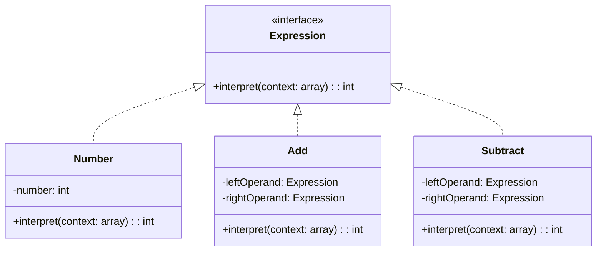

## 7.3 Interpreter Pattern

The Interpreter Pattern is a behavioral design pattern that provides a way to evaluate language grammar or expressions. It is particularly useful when you need to interpret or parse a language, whether it's a simple scripting language, a configuration file, or any domain-specific language (DSL).

### Intent

The primary intent of the Interpreter Pattern is to define a representation for a language's grammar and provide an interpreter to process sentences in that language. This pattern is particularly useful when you have a language to interpret and a set of rules that define the language's grammar.

### Implementing Interpreter in PHP

To implement the Interpreter Pattern in PHP, we need to follow these steps:

1. **Define a Class Hierarchy for Grammar Rules:**
   - Create classes for each grammar rule or expression.
   - Each class should implement a common interface or abstract class.

2. **Implement an Interpret Method for Evaluation:**
   - Each class should have an `interpret` method that evaluates the expression it represents.
   - The `interpret` method should take a context as an argument, which holds the state or variables needed for evaluation.

#### Step 1: Defining a Class Hierarchy for Grammar Rules

Let's start by defining a simple grammar for arithmetic expressions. We'll create classes for numbers, addition, and subtraction.

```php
<?php

interface Expression {
    public function interpret(array $context): int;
}

class Number implements Expression {
    private $number;

    public function __construct(int $number) {
        $this->number = $number;
    }

    public function interpret(array $context): int {
        return $this->number;
    }
}

class Add implements Expression {
    private $leftOperand;
    private $rightOperand;

    public function __construct(Expression $leftOperand, Expression $rightOperand) {
        $this->leftOperand = $leftOperand;
        $this->rightOperand = $rightOperand;
    }

    public function interpret(array $context): int {
        return $this->leftOperand->interpret($context) + $this->rightOperand->interpret($context);
    }
}

class Subtract implements Expression {
    private $leftOperand;
    private $rightOperand;

    public function __construct(Expression $leftOperand, Expression $rightOperand) {
        $this->leftOperand = $leftOperand;
        $this->rightOperand = $rightOperand;
    }

    public function interpret(array $context): int {
        return $this->leftOperand->interpret($context) - $this->rightOperand->interpret($context);
    }
}

?>
```

In this example, we have defined an `Expression` interface with an `interpret` method. The `Number`, `Add`, and `Subtract` classes implement this interface. Each class represents a different part of the grammar.

#### Step 2: Implementing an Interpret Method for Evaluation

The `interpret` method in each class evaluates the expression it represents. For example, the `Add` class adds the results of interpreting its left and right operands.

### Use Cases and Examples

The Interpreter Pattern is useful in various scenarios, such as:

- **Parsing and Executing Scripting Languages:** You can use the Interpreter Pattern to parse and execute simple scripting languages. Each command or expression in the language can be represented by a class.

- **Configuration Files:** If you have a complex configuration file format, you can use the Interpreter Pattern to parse and evaluate the configuration settings.

- **Mathematical Expressions:** The pattern is ideal for evaluating mathematical expressions, as shown in the example above.

#### Example: Evaluating a Simple Expression

Let's see how we can use the classes we defined to evaluate a simple expression like "5 + 3 - 2".

```php
<?php

// Create the expression tree
$expression = new Subtract(
    new Add(
        new Number(5),
        new Number(3)
    ),
    new Number(2)
);

// Interpret the expression
$result = $expression->interpret([]);
echo "Result: " . $result; // Output: Result: 6

?>
```

In this example, we create an expression tree that represents the expression "5 + 3 - 2". We then call the `interpret` method to evaluate the expression.

### Visualizing the Interpreter Pattern

To better understand the structure of the Interpreter Pattern, let's visualize it using a class diagram.



This diagram shows the relationship between the `Expression` interface and the classes that implement it. Each class represents a different part of the grammar.

### Design Considerations

When using the Interpreter Pattern, consider the following:

- **Complexity:** The pattern can become complex if the grammar is large. Each rule or expression requires a separate class, which can lead to a large number of classes.

- **Performance:** The pattern may not be suitable for performance-critical applications, as it involves creating many objects and recursive method calls.

- **Maintainability:** The pattern makes it easy to add new expressions or rules to the grammar. You can simply add new classes that implement the `Expression` interface.

### PHP Unique Features

PHP offers several features that can be leveraged when implementing the Interpreter Pattern:

- **Dynamic Typing:** PHP's dynamic typing allows for flexible handling of different data types within the `interpret` method.

- **Anonymous Classes:** PHP supports anonymous classes, which can be useful for creating simple expressions without defining a separate class.

- **Closures:** PHP closures can be used to encapsulate behavior and state, which can be useful when implementing complex expressions.

### Differences and Similarities

The Interpreter Pattern is often confused with the **Visitor Pattern**. While both patterns involve traversing a structure, the Interpreter Pattern focuses on evaluating expressions, whereas the Visitor Pattern is used to perform operations on elements of an object structure.

### Try It Yourself

To deepen your understanding of the Interpreter Pattern, try modifying the code examples:

- **Add New Operations:** Implement additional operations, such as multiplication or division, by creating new classes that implement the `Expression` interface.

- **Extend the Grammar:** Add support for variables by creating a `Variable` class that looks up values in the context.

- **Optimize the Pattern:** Experiment with optimizing the pattern for performance by reducing the number of objects created.

### Knowledge Check

- **What is the primary intent of the Interpreter Pattern?**
- **How does the Interpreter Pattern handle language grammar?**
- **What are some common use cases for the Interpreter Pattern?**

### Embrace the Journey

Remember, mastering design patterns is a journey. The Interpreter Pattern is just one of many patterns that can enhance your PHP development skills. Keep experimenting, stay curious, and enjoy the process of learning and applying design patterns in your projects.

## Quiz: Interpreter Pattern



### What is the primary intent of the Interpreter Pattern?

- [x] To define a representation for a language's grammar and provide an interpreter to process sentences in that language.
- [ ] To separate the construction of a complex object from its representation.
- [ ] To provide a way to access the elements of an aggregate object sequentially.
- [ ] To define a family of algorithms, encapsulate each one, and make them interchangeable.

> **Explanation:** The Interpreter Pattern is used to define a representation for a language's grammar and provide an interpreter to process sentences in that language.

### Which of the following is a key participant in the Interpreter Pattern?

- [x] Expression
- [ ] Builder
- [ ] Iterator
- [ ] Strategy

> **Explanation:** The `Expression` interface is a key participant in the Interpreter Pattern, representing the grammar rules.

### What is a common use case for the Interpreter Pattern?

- [x] Parsing and executing scripting languages
- [ ] Building complex objects
- [ ] Iterating over collections
- [ ] Encapsulating algorithms

> **Explanation:** The Interpreter Pattern is commonly used for parsing and executing scripting languages.

### How does the Interpreter Pattern handle language grammar?

- [x] By defining a class hierarchy for grammar rules
- [ ] By using a single class to handle all grammar rules
- [ ] By separating grammar rules into different modules
- [ ] By using a procedural approach

> **Explanation:** The Interpreter Pattern handles language grammar by defining a class hierarchy for grammar rules.

### What is a potential drawback of the Interpreter Pattern?

- [x] Complexity due to a large number of classes
- [ ] Difficulty in adding new grammar rules
- [ ] Lack of flexibility in handling different data types
- [ ] Poor encapsulation of grammar rules

> **Explanation:** The Interpreter Pattern can become complex if the grammar is large, as each rule or expression requires a separate class.

### How can PHP's dynamic typing be leveraged in the Interpreter Pattern?

- [x] By allowing flexible handling of different data types within the `interpret` method
- [ ] By enforcing strict type checking in the `interpret` method
- [ ] By using type declarations for all method parameters
- [ ] By avoiding the use of dynamic typing altogether

> **Explanation:** PHP's dynamic typing allows for flexible handling of different data types within the `interpret` method.

### What is a similarity between the Interpreter Pattern and the Visitor Pattern?

- [x] Both involve traversing a structure
- [ ] Both focus on evaluating expressions
- [ ] Both are used for building complex objects
- [ ] Both are used for encapsulating algorithms

> **Explanation:** Both the Interpreter Pattern and the Visitor Pattern involve traversing a structure, but they have different focuses.

### How can PHP closures be used in the Interpreter Pattern?

- [x] By encapsulating behavior and state for complex expressions
- [ ] By replacing the need for the `Expression` interface
- [ ] By avoiding the use of class hierarchies
- [ ] By simplifying the `interpret` method to a single line

> **Explanation:** PHP closures can be used to encapsulate behavior and state, which can be useful when implementing complex expressions.

### What is the role of the `interpret` method in the Interpreter Pattern?

- [x] To evaluate the expression it represents
- [ ] To construct complex objects
- [ ] To iterate over collections
- [ ] To encapsulate algorithms

> **Explanation:** The `interpret` method evaluates the expression it represents in the Interpreter Pattern.

### True or False: The Interpreter Pattern is suitable for performance-critical applications.

- [ ] True
- [x] False

> **Explanation:** The Interpreter Pattern may not be suitable for performance-critical applications, as it involves creating many objects and recursive method calls.




