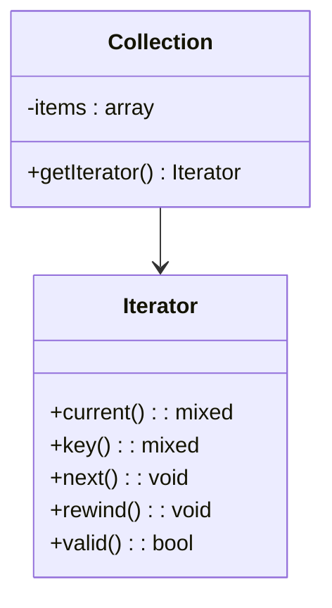

## 7.4 Iterator Pattern

The Iterator Pattern is a fundamental design pattern in software development, particularly useful in PHP for providing a way to access elements of a collection sequentially without exposing its underlying representation. This pattern is part of the behavioral design patterns family, which focuses on how objects interact and communicate with each other.

### Intent

The primary intent of the Iterator Pattern is to allow sequential access to the elements of a collection without exposing the details of the collection's structure. This abstraction is crucial for maintaining encapsulation and flexibility in your code.

### Implementing Iterator in PHP

PHP provides a built-in `Iterator` interface that allows developers to create custom iterators for traversing complex data structures. Let's explore how to implement this interface and create custom iterators.

#### PHP's `Iterator` Interface

The `Iterator` interface in PHP requires the implementation of five methods:

- `current()`: Returns the current element.
- `key()`: Returns the key of the current element.
- `next()`: Moves the pointer to the next element.
- `rewind()`: Rewinds the iterator to the first element.
- `valid()`: Checks if the current position is valid.

Here's a simple example of implementing the `Iterator` interface:

```php
<?php

class MyCollection implements Iterator {
    private $items = [];
    private $position = 0;

    public function __construct($items) {
        $this->items = $items;
        $this->position = 0;
    }

    public function current() {
        return $this->items[$this->position];
    }

    public function key() {
        return $this->position;
    }

    public function next() {
        ++$this->position;
    }

    public function rewind() {
        $this->position = 0;
    }

    public function valid() {
        return isset($this->items[$this->position]);
    }
}

$collection = new MyCollection(["apple", "banana", "cherry"]);
foreach ($collection as $key => $value) {
    echo "$key: $value\n";
}
```

**Explanation:**

- **`current()`**: Returns the current item in the collection.
- **`key()`**: Returns the current position in the collection.
- **`next()`**: Moves the pointer to the next item.
- **`rewind()`**: Resets the pointer to the beginning of the collection.
- **`valid()`**: Checks if the current position is valid.

#### Creating Custom Iterators for Complex Data Structures

Custom iterators are particularly useful when dealing with complex data structures. Let's create a custom iterator for a binary tree.

```php
<?php

class TreeNode {
    public $value;
    public $left;
    public $right;

    public function __construct($value) {
        $this->value = $value;
        $this->left = null;
        $this->right = null;
    }
}

class BinaryTreeIterator implements Iterator {
    private $stack = [];
    private $currentNode;

    public function __construct($root) {
        $this->currentNode = $root;
    }

    public function current() {
        return $this->currentNode->value;
    }

    public function key() {
        return null; // Keys are not relevant in this context
    }

    public function next() {
        if ($this->currentNode->right !== null) {
            $this->stack[] = $this->currentNode->right;
        }
        if ($this->currentNode->left !== null) {
            $this->currentNode = $this->currentNode->left;
        } else {
            $this->currentNode = array_pop($this->stack);
        }
    }

    public function rewind() {
        // Reset logic for the iterator
    }

    public function valid() {
        return $this->currentNode !== null;
    }
}

// Example usage
$root = new TreeNode(1);
$root->left = new TreeNode(2);
$root->right = new TreeNode(3);
$root->left->left = new TreeNode(4);
$root->left->right = new TreeNode(5);

$iterator = new BinaryTreeIterator($root);
foreach ($iterator as $value) {
    echo $value . "\n";
}
```

**Explanation:**

- **Binary Tree Structure**: The `TreeNode` class represents a node in a binary tree.
- **Iterator Logic**: The `BinaryTreeIterator` traverses the tree in a depth-first manner, using a stack to keep track of nodes.

### Use Cases and Examples

The Iterator Pattern is widely used in scenarios where you need to traverse collections or implement standard interfaces for compatibility. Here are some common use cases:

#### Traversing Collections

Iterators are ideal for traversing collections such as arrays, lists, and trees. They provide a consistent interface for accessing elements, regardless of the collection's underlying structure.

#### Implementing Standard Interfaces

By implementing the `Iterator` interface, you can ensure that your custom collections are compatible with PHP's built-in functions and constructs, such as `foreach`.

### Visualizing the Iterator Pattern

To better understand the Iterator Pattern, let's visualize the interaction between the iterator and the collection.



**Diagram Explanation:**

- **Collection**: Represents the collection of items.
- **Iterator**: Provides methods to traverse the collection.

### Design Considerations

When using the Iterator Pattern, consider the following:

- **Performance**: Iterators can be more memory-efficient than loading entire collections into memory.
- **Complexity**: Custom iterators can add complexity to your codebase. Ensure they are necessary for your use case.
- **Consistency**: Implementing the `Iterator` interface ensures consistency with PHP's built-in constructs.

### PHP Unique Features

PHP's `Iterator` interface is part of the SPL (Standard PHP Library), which provides a set of interfaces and classes for common data structures and algorithms. Leveraging SPL can enhance your PHP applications by providing robust and efficient solutions.

### Differences and Similarities

The Iterator Pattern is often confused with the Composite Pattern, as both deal with collections. However, the Composite Pattern focuses on treating individual objects and compositions uniformly, while the Iterator Pattern focuses on sequential access.

### Try It Yourself

Experiment with the provided code examples by modifying the data structures or adding new methods to the iterator. Try creating an iterator for a different data structure, such as a linked list or a graph.

### Knowledge Check

- What is the primary intent of the Iterator Pattern?
- How does the `Iterator` interface enhance PHP's built-in constructs?
- What are some common use cases for the Iterator Pattern?

### Embrace the Journey

Remember, mastering design patterns like the Iterator Pattern is a journey. As you progress, you'll build more complex and efficient PHP applications. Keep experimenting, stay curious, and enjoy the journey!

## Quiz: Iterator Pattern



### What is the primary intent of the Iterator Pattern?

- [x] To provide a way to access elements of a collection sequentially without exposing its underlying representation.
- [ ] To allow objects to be composed into tree structures to represent part-whole hierarchies.
- [ ] To define a family of algorithms, encapsulate each one, and make them interchangeable.
- [ ] To separate the construction of a complex object from its representation.

> **Explanation:** The Iterator Pattern's primary intent is to provide a way to access elements of a collection sequentially without exposing its underlying representation.

### Which method in the `Iterator` interface returns the current element?

- [x] `current()`
- [ ] `key()`
- [ ] `next()`
- [ ] `rewind()`

> **Explanation:** The `current()` method in the `Iterator` interface returns the current element.

### What does the `valid()` method in the `Iterator` interface do?

- [x] Checks if the current position is valid.
- [ ] Moves the pointer to the next element.
- [ ] Returns the current element.
- [ ] Rewinds the iterator to the first element.

> **Explanation:** The `valid()` method checks if the current position is valid.

### What is a common use case for the Iterator Pattern?

- [x] Traversing collections.
- [ ] Implementing singleton objects.
- [ ] Managing object creation.
- [ ] Defining object interfaces.

> **Explanation:** A common use case for the Iterator Pattern is traversing collections.

### Which PHP feature is associated with the Iterator Pattern?

- [x] SPL (Standard PHP Library)
- [ ] PDO (PHP Data Objects)
- [ ] GD (Graphics Draw)
- [ ] cURL (Client URL Library)

> **Explanation:** The Iterator Pattern is associated with the SPL (Standard PHP Library) in PHP.

### What is the role of the `rewind()` method in the `Iterator` interface?

- [x] Rewinds the iterator to the first element.
- [ ] Returns the current element.
- [ ] Moves the pointer to the next element.
- [ ] Checks if the current position is valid.

> **Explanation:** The `rewind()` method rewinds the iterator to the first element.

### How does the Iterator Pattern differ from the Composite Pattern?

- [x] The Iterator Pattern focuses on sequential access, while the Composite Pattern focuses on part-whole hierarchies.
- [ ] The Iterator Pattern focuses on part-whole hierarchies, while the Composite Pattern focuses on sequential access.
- [ ] Both patterns focus on sequential access.
- [ ] Both patterns focus on part-whole hierarchies.

> **Explanation:** The Iterator Pattern focuses on sequential access, while the Composite Pattern focuses on part-whole hierarchies.

### What is a benefit of using iterators?

- [x] They can be more memory-efficient than loading entire collections into memory.
- [ ] They simplify object creation.
- [ ] They enhance object composition.
- [ ] They define object interfaces.

> **Explanation:** Iterators can be more memory-efficient than loading entire collections into memory.

### Which method in the `Iterator` interface moves the pointer to the next element?

- [x] `next()`
- [ ] `current()`
- [ ] `key()`
- [ ] `rewind()`

> **Explanation:** The `next()` method moves the pointer to the next element.

### True or False: The Iterator Pattern is part of the behavioral design patterns family.

- [x] True
- [ ] False

> **Explanation:** True. The Iterator Pattern is part of the behavioral design patterns family.


