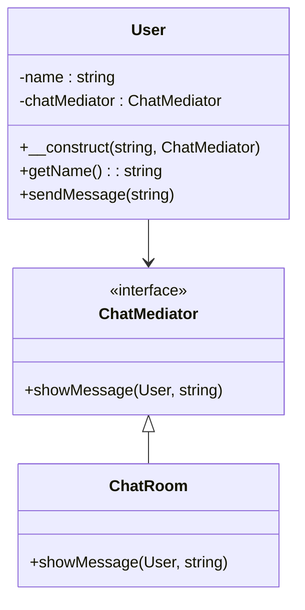

## 7.5 Mediator Pattern

The Mediator Pattern is a behavioral design pattern that defines an object to encapsulate how a set of objects interact. By promoting loose coupling, it allows objects to communicate without directly referencing each other, thus reducing dependencies and enhancing maintainability.

### Intent

The primary intent of the Mediator Pattern is to centralize complex communication and control logic between related objects. Instead of having objects refer to each other explicitly, they communicate through a mediator. This approach simplifies object protocols, prevents tight coupling, and enhances the flexibility of the system.

### Key Participants

1. **Mediator**: Defines an interface for communicating with Colleague objects.
2. **ConcreteMediator**: Implements cooperative behavior by coordinating Colleague objects.
3. **Colleague**: Each Colleague class knows its Mediator object and communicates with it whenever it would have otherwise communicated with another Colleague.

### Applicability

Use the Mediator Pattern when:

- A set of objects communicate in well-defined but complex ways.
- Reusing an object is difficult because it refers to and communicates with many other objects.
- A behavior that's distributed between several classes should be customizable without a lot of subclassing.

### Implementing Mediator in PHP

To implement the Mediator Pattern in PHP, follow these steps:

1. **Define the Mediator Interface**: This interface will declare the methods used for communication between Colleague objects.
2. **Create Concrete Mediator**: Implement the Mediator interface and manage the communication between Colleague objects.
3. **Define Colleague Classes**: These classes will interact with each other through the Mediator.

#### Step-by-Step Implementation

Let's consider a chat room scenario where users can send messages to each other through a central mediator.

#### Step 1: Define the Mediator Interface

```php
<?php

interface ChatMediator {
    public function showMessage(User $user, string $message);
}
```

#### Step 2: Create Concrete Mediator

```php
<?php

class ChatRoom implements ChatMediator {
    public function showMessage(User $user, string $message) {
        $time = date('H:i');
        $username = $user->getName();
        echo "$time [$username]: $message\n";
    }
}
```

#### Step 3: Define Colleague Classes

```php
<?php

class User {
    private $name;
    private $chatMediator;

    public function __construct(string $name, ChatMediator $chatMediator) {
        $this->name = $name;
        $this->chatMediator = $chatMediator;
    }

    public function getName(): string {
        return $this->name;
    }

    public function sendMessage(string $message) {
        $this->chatMediator->showMessage($this, $message);
    }
}
```

#### Usage Example

```php
<?php

$mediator = new ChatRoom();

$user1 = new User("Alice", $mediator);
$user2 = new User("Bob", $mediator);

$user1->sendMessage("Hello, Bob!");
$user2->sendMessage("Hi, Alice!");
```

### Visualizing the Mediator Pattern



### Design Considerations

- **Decoupling**: The Mediator Pattern effectively decouples the colleagues, allowing them to vary independently.
- **Complexity**: While it simplifies communication, it can introduce a single point of control that might become complex.
- **Flexibility**: It allows for easy addition of new colleague classes without altering existing code.

### PHP Unique Features

- **Type Declarations**: PHP allows for strict typing, which can be leveraged in the Mediator Pattern to ensure type safety.
- **Anonymous Classes**: PHP's anonymous classes can be used for quick implementations of mediators or colleagues for testing purposes.

### Differences and Similarities

- **Mediator vs. Observer**: While both patterns promote loose coupling, the Mediator centralizes communication, whereas the Observer pattern allows for dynamic subscription to events.
- **Mediator vs. Facade**: The Facade pattern provides a simplified interface to a subsystem, while the Mediator pattern centralizes communication between objects.

### Use Cases and Examples

- **GUI Component Interactions**: In GUI applications, the Mediator Pattern can manage interactions between buttons, text fields, and other components.
- **Chat Room Implementations**: As demonstrated, chat applications can use the Mediator Pattern to manage message exchanges between users.

### Try It Yourself

Experiment with the code by adding more users or modifying the message format. Try implementing additional features like private messaging or user status updates.

### Knowledge Check

- How does the Mediator Pattern promote loose coupling?
- What are the key participants in the Mediator Pattern?
- How can the Mediator Pattern be used in a GUI application?

### Embrace the Journey

Remember, mastering design patterns is a journey. As you continue to explore and implement these patterns, you'll gain deeper insights into building robust and maintainable PHP applications. Keep experimenting, stay curious, and enjoy the process!

## Quiz: Mediator Pattern



### What is the primary intent of the Mediator Pattern?

- [x] To centralize communication between objects
- [ ] To provide a simplified interface to a subsystem
- [ ] To allow objects to subscribe to events
- [ ] To encapsulate object creation

> **Explanation:** The Mediator Pattern centralizes communication between objects, promoting loose coupling.

### Which of the following is a key participant in the Mediator Pattern?

- [x] Mediator
- [ ] Observer
- [ ] Singleton
- [ ] Adapter

> **Explanation:** The Mediator is a key participant that defines communication between Colleague objects.

### How does the Mediator Pattern differ from the Observer Pattern?

- [x] Mediator centralizes communication; Observer allows dynamic subscription
- [ ] Mediator simplifies interfaces; Observer centralizes communication
- [ ] Mediator is used for object creation; Observer is for communication
- [ ] Mediator and Observer are identical

> **Explanation:** The Mediator centralizes communication, while the Observer allows objects to subscribe to events dynamically.

### What is a common use case for the Mediator Pattern?

- [x] GUI component interactions
- [ ] Object creation
- [ ] Simplifying interfaces
- [ ] Dynamic event subscription

> **Explanation:** The Mediator Pattern is commonly used to manage interactions between GUI components.

### In PHP, what feature can enhance the Mediator Pattern's implementation?

- [x] Type Declarations
- [ ] Global Variables
- [ ] Singleton Pattern
- [ ] Facade Pattern

> **Explanation:** Type Declarations in PHP can enhance the Mediator Pattern by ensuring type safety.

### Which pattern is often confused with the Mediator Pattern?

- [x] Observer Pattern
- [ ] Factory Pattern
- [ ] Strategy Pattern
- [ ] Decorator Pattern

> **Explanation:** The Observer Pattern is often confused with the Mediator Pattern due to their focus on communication.

### What is a potential downside of the Mediator Pattern?

- [x] It can introduce a single point of control that becomes complex
- [ ] It tightly couples objects
- [ ] It makes object reuse difficult
- [ ] It prevents communication between objects

> **Explanation:** The Mediator Pattern can introduce complexity by centralizing control.

### How can the Mediator Pattern improve maintainability?

- [x] By reducing dependencies between objects
- [ ] By increasing object coupling
- [ ] By simplifying object creation
- [ ] By allowing direct communication between objects

> **Explanation:** The Mediator Pattern improves maintainability by reducing dependencies between objects.

### Which PHP feature allows for quick implementations of mediators or colleagues?

- [x] Anonymous Classes
- [ ] Global Variables
- [ ] Singleton Pattern
- [ ] Facade Pattern

> **Explanation:** PHP's anonymous classes allow for quick implementations of mediators or colleagues.

### True or False: The Mediator Pattern is primarily used for object creation.

- [ ] True
- [x] False

> **Explanation:** The Mediator Pattern is not used for object creation; it is used for managing communication between objects.


