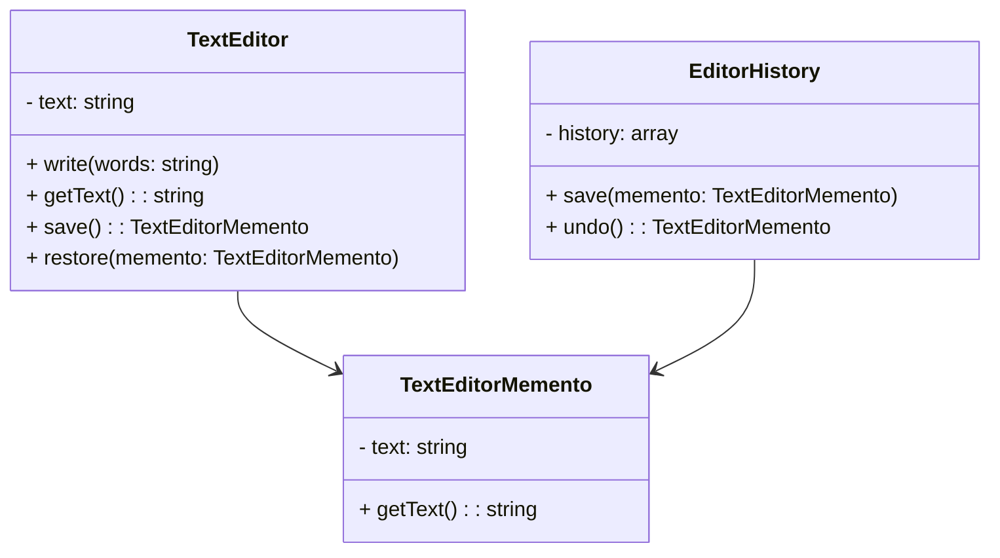

## 7.6 Memento Pattern

The Memento Pattern is a behavioral design pattern that provides the ability to restore an object to its previous state. This pattern is particularly useful for implementing features like undo mechanisms, checkpoints in games, or any scenario where you need to revert an object to a previous state without exposing its internal structure.

### Intent

The primary intent of the Memento Pattern is to capture and externalize an object's internal state without violating encapsulation, allowing it to be restored later. This is achieved by storing the state in a separate object, known as the memento, which can be used to restore the original object to its previous state.

### Key Participants

1. **Originator**: The object whose state needs to be saved and restored. It creates a memento containing a snapshot of its current state and can use the memento to restore its state.
2. **Memento**: The object that stores the internal state of the originator. It is opaque to other objects and is only used by the originator.
3. **Caretaker**: Manages the mementos and is responsible for storing and restoring them. It does not modify or inspect the contents of the memento.

### Applicability

Use the Memento Pattern when:
- You need to implement an undo mechanism.
- You want to save and restore the state of an object without exposing its internal structure.
- You need to maintain checkpoints in applications like games or simulations.

### Implementing Memento in PHP

Let's explore how to implement the Memento Pattern in PHP by creating a simple text editor application that supports undo functionality.

#### Step 1: Define the Originator

The `TextEditor` class acts as the originator. It maintains the current text and can create and restore mementos.

```php
<?php

class TextEditor {
    private $text = '';

    public function write($words) {
        $this->text .= $words;
    }

    public function getText() {
        return $this->text;
    }

    public function save() {
        return new TextEditorMemento($this->text);
    }

    public function restore(TextEditorMemento $memento) {
        $this->text = $memento->getText();
    }
}
```

#### Step 2: Create the Memento

The `TextEditorMemento` class stores the state of the `TextEditor`.

```php
<?php

class TextEditorMemento {
    private $text;

    public function __construct($text) {
        $this->text = $text;
    }

    public function getText() {
        return $this->text;
    }
}
```

#### Step 3: Implement the Caretaker

The `EditorHistory` class acts as the caretaker, managing the mementos.

```php
<?php

class EditorHistory {
    private $history = [];

    public function save(TextEditorMemento $memento) {
        $this->history[] = $memento;
    }

    public function undo() {
        if (!empty($this->history)) {
            return array_pop($this->history);
        }
        return null;
    }
}
```

#### Step 4: Demonstrate the Memento Pattern

Let's see how these classes work together to provide undo functionality.

```php
<?php

$editor = new TextEditor();
$history = new EditorHistory();

$editor->write("Hello, ");
$history->save($editor->save());

$editor->write("World!");
$history->save($editor->save());

echo "Current Text: " . $editor->getText() . "\n"; // Output: Hello, World!

$editor->restore($history->undo());
echo "After Undo: " . $editor->getText() . "\n"; // Output: Hello, 

$editor->restore($history->undo());
echo "After Undo: " . $editor->getText() . "\n"; // Output: (empty string)
```

### Visualizing the Memento Pattern

To better understand the interactions between the components of the Memento Pattern, let's visualize it using a class diagram.



### Design Considerations

- **Encapsulation**: The Memento Pattern maintains encapsulation by keeping the memento's state private and only accessible to the originator.
- **Memory Usage**: Be cautious of memory usage when storing large states or a large number of mementos.
- **Complexity**: The pattern can add complexity to your codebase, so use it judiciously.

### PHP Unique Features

PHP's object-oriented capabilities make it well-suited for implementing the Memento Pattern. The use of classes and encapsulation aligns with the pattern's requirements. PHP's dynamic typing allows for flexible handling of different types of state data.

### Differences and Similarities

The Memento Pattern is often confused with the Command Pattern, as both can be used to implement undo functionality. However, the Command Pattern encapsulates actions, while the Memento Pattern encapsulates state.

### Use Cases and Examples

1. **Undo Mechanisms**: Implementing undo functionality in applications like text editors, drawing applications, or any software that requires state rollback.
2. **Checkpoints in Games**: Saving game states at checkpoints to allow players to revert to a previous point in the game.
3. **State History**: Maintaining a history of changes in applications like document editors or version control systems.

### Try It Yourself

Experiment with the code examples by modifying the `TextEditor` class to include additional features, such as:
- Adding a redo functionality.
- Storing additional state information, like cursor position.
- Implementing a limit on the number of mementos stored to manage memory usage.

### Knowledge Check

- What is the primary intent of the Memento Pattern?
- How does the Memento Pattern maintain encapsulation?
- What are some common use cases for the Memento Pattern?

### Embrace the Journey

Remember, mastering design patterns is a journey. The Memento Pattern is just one of many tools in your toolkit. As you continue to explore and implement design patterns, you'll gain a deeper understanding of how to create robust and maintainable software. Keep experimenting, stay curious, and enjoy the journey!

## Quiz: Memento Pattern



### What is the primary intent of the Memento Pattern?

- [x] To capture and externalize an object's internal state without violating encapsulation, allowing it to be restored later.
- [ ] To encapsulate actions as objects.
- [ ] To define a family of algorithms and make them interchangeable.
- [ ] To provide a way to access the elements of an aggregate object sequentially.

> **Explanation:** The Memento Pattern is designed to capture and externalize an object's state so it can be restored later, without violating encapsulation.

### Which component of the Memento Pattern is responsible for storing the state of the originator?

- [ ] Originator
- [x] Memento
- [ ] Caretaker
- [ ] Observer

> **Explanation:** The Memento is the component that stores the internal state of the originator.

### What is the role of the Caretaker in the Memento Pattern?

- [ ] To modify the state of the originator.
- [ ] To create mementos.
- [x] To manage the mementos and restore them when needed.
- [ ] To encapsulate actions as objects.

> **Explanation:** The Caretaker is responsible for managing the mementos and restoring them when needed, without modifying their contents.

### How does the Memento Pattern maintain encapsulation?

- [x] By keeping the memento's state private and only accessible to the originator.
- [ ] By exposing the memento's state to the caretaker.
- [ ] By allowing the caretaker to modify the memento's state.
- [ ] By storing the state in the originator.

> **Explanation:** The Memento Pattern maintains encapsulation by keeping the memento's state private and only accessible to the originator.

### What is a common use case for the Memento Pattern?

- [x] Implementing undo functionality in applications.
- [ ] Encapsulating actions as objects.
- [ ] Defining a family of algorithms.
- [ ] Providing a way to access elements of an aggregate object sequentially.

> **Explanation:** A common use case for the Memento Pattern is implementing undo functionality in applications.

### Which of the following is NOT a key participant in the Memento Pattern?

- [ ] Originator
- [ ] Memento
- [x] Command
- [ ] Caretaker

> **Explanation:** The Command is not a key participant in the Memento Pattern; it is part of the Command Pattern.

### What is a potential drawback of using the Memento Pattern?

- [ ] It violates encapsulation.
- [ ] It makes the code less maintainable.
- [x] It can increase memory usage.
- [ ] It exposes the internal state of the originator.

> **Explanation:** A potential drawback of using the Memento Pattern is increased memory usage due to storing multiple states.

### How can you manage memory usage when using the Memento Pattern?

- [x] By limiting the number of mementos stored.
- [ ] By exposing the memento's state to the caretaker.
- [ ] By allowing the caretaker to modify the memento's state.
- [ ] By storing the state in the originator.

> **Explanation:** You can manage memory usage by limiting the number of mementos stored.

### What is the difference between the Memento Pattern and the Command Pattern?

- [x] The Memento Pattern encapsulates state, while the Command Pattern encapsulates actions.
- [ ] The Memento Pattern encapsulates actions, while the Command Pattern encapsulates state.
- [ ] Both patterns encapsulate state.
- [ ] Both patterns encapsulate actions.

> **Explanation:** The Memento Pattern encapsulates state, while the Command Pattern encapsulates actions.

### True or False: The Memento Pattern can be used to implement redo functionality.

- [x] True
- [ ] False

> **Explanation:** The Memento Pattern can be extended to implement redo functionality by managing multiple states.



---
