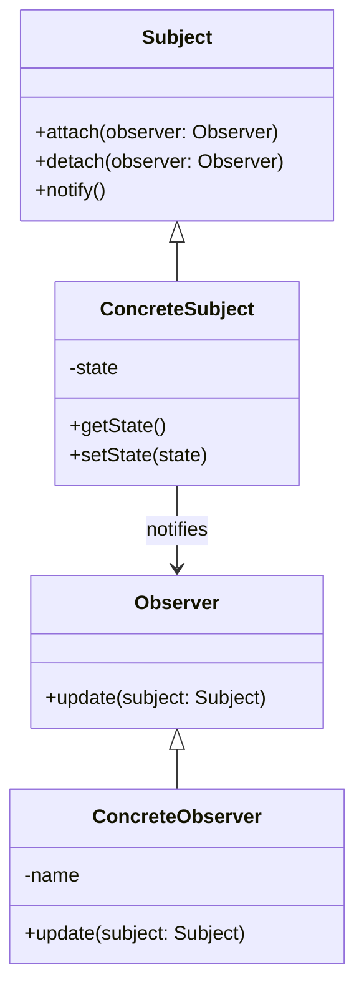

## 7.7 Observer Pattern

### Introduction

The Observer Pattern is a fundamental behavioral design pattern that establishes a one-to-many dependency between objects. When one object, known as the subject, changes state, all its dependents, called observers, are automatically notified and updated. This pattern is particularly useful in scenarios where a change in one object requires changes in others, without tightly coupling them.

### Intent

The primary intent of the Observer Pattern is to promote loose coupling between the subject and its observers. By decoupling these components, the pattern allows for more flexible and maintainable code. This is achieved by defining a clear protocol for communication between the subject and its observers.

### Key Participants

1. **Subject**: The object that holds the state and notifies observers of changes. In PHP, this can be implemented using the `SplSubject` interface.
2. **Observer**: The object that needs to be notified of changes in the subject. In PHP, this can be implemented using the `SplObserver` interface.
3. **ConcreteSubject**: A concrete implementation of the subject that maintains the state of interest.
4. **ConcreteObserver**: A concrete implementation of the observer that reacts to changes in the subject.

### Implementing Observer in PHP

PHP provides built-in interfaces, `SplSubject` and `SplObserver`, to facilitate the implementation of the Observer Pattern. Let's explore how to implement this pattern using these interfaces.

#### Step-by-Step Implementation

1. **Define the Subject Interface**

   The `SplSubject` interface requires two methods: `attach()` to add an observer and `detach()` to remove an observer. Additionally, the `notify()` method is used to update all observers.

   ```php
   <?php

   class ConcreteSubject implements SplSubject {
       private $observers;
       private $state;

       public function __construct() {
           $this->observers = new SplObjectStorage();
       }

       public function attach(SplObserver $observer) {
           $this->observers->attach($observer);
       }

       public function detach(SplObserver $observer) {
           $this->observers->detach($observer);
       }

       public function notify() {
           foreach ($this->observers as $observer) {
               $observer->update($this);
           }
       }

       public function setState($state) {
           $this->state = $state;
           $this->notify();
       }

       public function getState() {
           return $this->state;
       }
   }
   ```

2. **Define the Observer Interface**

   The `SplObserver` interface requires the `update()` method, which is called when the subject's state changes.

   ```php
   <?php

   class ConcreteObserver implements SplObserver {
       private $name;

       public function __construct($name) {
           $this->name = $name;
       }

       public function update(SplSubject $subject) {
           echo "{$this->name} received update: New state is " . $subject->getState() . "\n";
       }
   }
   ```

3. **Demonstrate the Observer Pattern**

   Now, let's see how these classes work together.

   ```php
   <?php

   $subject = new ConcreteSubject();

   $observer1 = new ConcreteObserver("Observer 1");
   $observer2 = new ConcreteObserver("Observer 2");

   $subject->attach($observer1);
   $subject->attach($observer2);

   $subject->setState("State 1");
   $subject->setState("State 2");

   $subject->detach($observer1);

   $subject->setState("State 3");
   ```

   **Output:**

   ```
   Observer 1 received update: New state is State 1
   Observer 2 received update: New state is State 1
   Observer 1 received update: New state is State 2
   Observer 2 received update: New state is State 2
   Observer 2 received update: New state is State 3
   ```

### Use Cases and Examples

The Observer Pattern is widely used in various scenarios, particularly in event-driven systems and MVC frameworks.

#### Event Systems

In event-driven systems, the Observer Pattern is used to manage subscriptions to events. When an event occurs, all registered listeners (observers) are notified. This is commonly seen in GUI applications, where user actions trigger events that update the UI.

#### Data Binding in MVC Frameworks

In MVC frameworks, the Observer Pattern is often used for data binding. When the model (subject) changes, the view (observer) is automatically updated to reflect the new state. This ensures that the UI is always in sync with the underlying data.

### Visualizing the Observer Pattern

To better understand the Observer Pattern, let's visualize the interaction between the subject and its observers.



### Design Considerations

- **Decoupling**: The Observer Pattern decouples the subject from its observers, allowing for independent development and maintenance.
- **Performance**: Be cautious of performance implications when notifying a large number of observers.
- **Memory Leaks**: Ensure that observers are properly detached to avoid memory leaks.

### PHP Unique Features

PHP's `SplSubject` and `SplObserver` interfaces provide a straightforward way to implement the Observer Pattern. The `SplObjectStorage` class is particularly useful for managing collections of objects, such as observers.

### Differences and Similarities

The Observer Pattern is often confused with the Publish-Subscribe pattern. While both involve notifying multiple listeners, the Publish-Subscribe pattern typically involves a message broker, adding an additional layer of abstraction.

### Try It Yourself

Experiment with the Observer Pattern by modifying the code examples. Try adding more observers, changing the state multiple times, or implementing additional functionality in the `update()` method.

### Knowledge Check

- What is the primary intent of the Observer Pattern?
- How does the Observer Pattern promote loose coupling?
- What are the key participants in the Observer Pattern?
- How can the Observer Pattern be used in event-driven systems?
- What are some design considerations when implementing the Observer Pattern?

### Embrace the Journey

Remember, mastering design patterns like the Observer Pattern is a journey. As you continue to explore and implement these patterns, you'll gain a deeper understanding of how to create flexible and maintainable code. Keep experimenting, stay curious, and enjoy the journey!

## Quiz: Observer Pattern



### What is the primary intent of the Observer Pattern?

- [x] To define a one-to-many dependency between objects
- [ ] To encapsulate a request as an object
- [ ] To provide a way to access the elements of an aggregate object sequentially
- [ ] To define a family of algorithms

> **Explanation:** The Observer Pattern's primary intent is to define a one-to-many dependency between objects, allowing observers to be notified of changes in the subject.

### Which PHP interfaces are used to implement the Observer Pattern?

- [x] SplSubject and SplObserver
- [ ] Iterator and IteratorAggregate
- [ ] ArrayAccess and Countable
- [ ] Serializable and JsonSerializable

> **Explanation:** PHP provides the SplSubject and SplObserver interfaces to facilitate the implementation of the Observer Pattern.

### What method is used to notify observers in the Observer Pattern?

- [x] notify()
- [ ] update()
- [ ] attach()
- [ ] detach()

> **Explanation:** The notify() method is used by the subject to notify all attached observers of a change in state.

### In the Observer Pattern, what role does the ConcreteObserver play?

- [x] It reacts to changes in the subject
- [ ] It maintains the state of interest
- [ ] It defines the protocol for communication
- [ ] It manages subscriptions to events

> **Explanation:** The ConcreteObserver is responsible for reacting to changes in the subject, typically by implementing the update() method.

### How does the Observer Pattern promote loose coupling?

- [x] By decoupling the subject from its observers
- [ ] By encapsulating requests as objects
- [ ] By providing a way to access elements sequentially
- [ ] By defining a family of algorithms

> **Explanation:** The Observer Pattern promotes loose coupling by decoupling the subject from its observers, allowing them to be developed and maintained independently.

### What is a common use case for the Observer Pattern?

- [x] Event systems
- [ ] Sorting algorithms
- [ ] Data compression
- [ ] Memory management

> **Explanation:** The Observer Pattern is commonly used in event systems to manage subscriptions and notify listeners of events.

### What is a potential drawback of the Observer Pattern?

- [x] Performance implications with a large number of observers
- [ ] Difficulty in encapsulating requests
- [ ] Complexity in accessing elements sequentially
- [ ] Challenges in defining a family of algorithms

> **Explanation:** A potential drawback of the Observer Pattern is the performance implications when notifying a large number of observers.

### What should be ensured to avoid memory leaks in the Observer Pattern?

- [x] Observers should be properly detached
- [ ] Requests should be encapsulated as objects
- [ ] Elements should be accessed sequentially
- [ ] Algorithms should be defined as families

> **Explanation:** To avoid memory leaks, it is important to ensure that observers are properly detached when they are no longer needed.

### How can the Observer Pattern be used in MVC frameworks?

- [x] For data binding between the model and view
- [ ] For encapsulating requests as objects
- [ ] For accessing elements sequentially
- [ ] For defining a family of algorithms

> **Explanation:** In MVC frameworks, the Observer Pattern is often used for data binding, ensuring that the view is updated when the model changes.

### True or False: The Observer Pattern is often confused with the Publish-Subscribe pattern.

- [x] True
- [ ] False

> **Explanation:** True. The Observer Pattern is often confused with the Publish-Subscribe pattern, although they have distinct differences, such as the use of a message broker in Publish-Subscribe.


