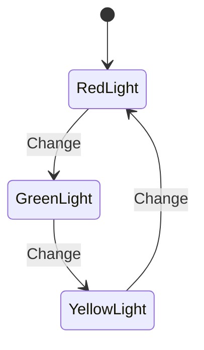

## 7.8 State Pattern

The State Pattern is a behavioral design pattern that allows an object to change its behavior when its internal state changes. This pattern is particularly useful in scenarios where an object must exhibit different behaviors in different states, such as in finite state machines or workflow systems. In this section, we will explore the State Pattern in PHP, its implementation, use cases, and best practices.

### Intent

The primary intent of the State Pattern is to allow an object to alter its behavior when its internal state changes. The object will appear to change its class, enabling it to behave differently without altering its code structure.

### Key Participants

1. **Context**: Maintains an instance of a ConcreteState subclass that defines the current state.
2. **State**: Defines an interface for encapsulating the behavior associated with a particular state of the Context.
3. **ConcreteState**: Each subclass implements a behavior associated with a state of the Context.

### Implementing State in PHP

To implement the State Pattern in PHP, we need to define state interfaces and concrete state classes. The Context class will change its behavior based on the current state.

#### Step 1: Define the State Interface

The State interface declares methods that all ConcreteState classes should implement. These methods represent behaviors that change with the state.

```php
<?php

interface State
{
    public function handleRequest(): void;
}
```

#### Step 2: Create Concrete State Classes

ConcreteState classes implement the State interface and define specific behaviors for each state.

```php
<?php

class ConcreteStateA implements State
{
    public function handleRequest(): void
    {
        echo "Handling request in State A.\n";
    }
}

class ConcreteStateB implements State
{
    public function handleRequest(): void
    {
        echo "Handling request in State B.\n";
    }
}
```

#### Step 3: Implement the Context Class

The Context class maintains an instance of a ConcreteState subclass and delegates state-specific behavior to the current state object.

```php
<?php

class Context
{
    private State $state;

    public function __construct(State $state)
    {
        $this->setState($state);
    }

    public function setState(State $state): void
    {
        $this->state = $state;
    }

    public function request(): void
    {
        $this->state->handleRequest();
    }
}
```

#### Step 4: Demonstrate State Transitions

We can now demonstrate how the Context class changes its behavior based on the current state.

```php
<?php

$context = new Context(new ConcreteStateA());
$context->request(); // Output: Handling request in State A.

$context->setState(new ConcreteStateB());
$context->request(); // Output: Handling request in State B.
```

### Use Cases and Examples

The State Pattern is particularly useful in scenarios where an object must exhibit different behaviors in different states. Here are some common use cases:

#### Finite State Machines

Finite state machines (FSMs) are a classic example of the State Pattern. An FSM consists of a finite number of states, transitions between those states, and actions. The State Pattern allows you to model these states and transitions in a clean and maintainable way.

#### Workflow Systems

In workflow systems, tasks often have different states such as "Pending", "In Progress", "Completed", etc. The State Pattern can be used to manage these states and define behaviors for each state.

#### Example: Traffic Light System

Let's consider a traffic light system as an example of the State Pattern. A traffic light can be in one of three states: Red, Yellow, or Green. Each state has a specific behavior.

```php
<?php

interface TrafficLightState
{
    public function change(TrafficLight $light): void;
}

class RedLight implements TrafficLightState
{
    public function change(TrafficLight $light): void
    {
        echo "Changing from Red to Green.\n";
        $light->setState(new GreenLight());
    }
}

class YellowLight implements TrafficLightState
{
    public function change(TrafficLight $light): void
    {
        echo "Changing from Yellow to Red.\n";
        $light->setState(new RedLight());
    }
}

class GreenLight implements TrafficLightState
{
    public function change(TrafficLight $light): void
    {
        echo "Changing from Green to Yellow.\n";
        $light->setState(new YellowLight());
    }
}

class TrafficLight
{
    private TrafficLightState $state;

    public function __construct(TrafficLightState $state)
    {
        $this->setState($state);
    }

    public function setState(TrafficLightState $state): void
    {
        $this->state = $state;
    }

    public function change(): void
    {
        $this->state->change($this);
    }
}

$light = new TrafficLight(new RedLight());
$light->change(); // Output: Changing from Red to Green.
$light->change(); // Output: Changing from Green to Yellow.
$light->change(); // Output: Changing from Yellow to Red.
```

### Design Considerations

When implementing the State Pattern, consider the following:

- **State Explosion**: Be cautious of creating too many state classes, which can lead to complexity. Group similar states or use a state table if necessary.
- **State Transition Logic**: Ensure that state transitions are well-defined and do not lead to invalid states.
- **Performance**: Consider the performance implications of frequent state changes, especially in high-load systems.

### PHP Unique Features

PHP offers several unique features that can enhance the implementation of the State Pattern:

- **Anonymous Classes**: Use anonymous classes for simple state implementations that do not require a separate class file.
- **Traits**: Use traits to share common behavior among different state classes.
- **Type Declarations**: Leverage PHP's type declarations to enforce type safety in state transitions.

### Differences and Similarities

The State Pattern is often confused with the Strategy Pattern. While both patterns involve changing behavior, the key difference is that the State Pattern is used for objects that change behavior based on internal state, whereas the Strategy Pattern is used to change behavior based on external factors.

### Visualizing the State Pattern

To better understand the State Pattern, let's visualize it using a state diagram.



This diagram represents the traffic light system, showing the transitions between states.

### Try It Yourself

Experiment with the code examples provided. Try adding a new state to the traffic light system, such as a "Flashing" state. Observe how the system behaves with the new state.

### Knowledge Check

- What is the primary intent of the State Pattern?
- How does the State Pattern differ from the Strategy Pattern?
- What are some common use cases for the State Pattern?
- How can PHP's unique features enhance the implementation of the State Pattern?

### Embrace the Journey

Remember, mastering design patterns is a journey. The State Pattern is just one of many patterns that can enhance your PHP development skills. Keep experimenting, stay curious, and enjoy the journey!

## Quiz: State Pattern



### What is the primary intent of the State Pattern?

- [x] To allow an object to alter its behavior when its internal state changes.
- [ ] To separate the construction of a complex object from its representation.
- [ ] To define a family of algorithms, encapsulate each one, and make them interchangeable.
- [ ] To provide a way to access the elements of an aggregate object sequentially.

> **Explanation:** The State Pattern allows an object to change its behavior when its internal state changes, making it appear to change its class.

### Which of the following is a key participant in the State Pattern?

- [x] Context
- [ ] Builder
- [ ] Observer
- [ ] Singleton

> **Explanation:** The Context class maintains an instance of a ConcreteState subclass that defines the current state.

### How does the State Pattern differ from the Strategy Pattern?

- [x] The State Pattern is used for objects that change behavior based on internal state, while the Strategy Pattern is used to change behavior based on external factors.
- [ ] The State Pattern is used for creating complex objects, while the Strategy Pattern is used for defining algorithms.
- [ ] The State Pattern is used for managing object lifecycles, while the Strategy Pattern is used for managing object dependencies.
- [ ] The State Pattern is used for accessing elements of an aggregate object, while the Strategy Pattern is used for encapsulating algorithms.

> **Explanation:** The State Pattern focuses on internal state changes, while the Strategy Pattern focuses on external factors affecting behavior.

### What is a common use case for the State Pattern?

- [x] Finite state machines
- [ ] Dependency injection
- [ ] Singleton management
- [ ] Factory creation

> **Explanation:** Finite state machines are a classic example of the State Pattern, where objects change behavior based on state transitions.

### What PHP feature can enhance the implementation of the State Pattern?

- [x] Anonymous Classes
- [ ] Global Variables
- [ ] Static Methods
- [ ] Singleton Pattern

> **Explanation:** Anonymous classes can be used for simple state implementations without creating separate class files.

### What should be considered when implementing the State Pattern?

- [x] State Explosion
- [ ] Singleton Management
- [ ] Algorithm Complexity
- [ ] Object Serialization

> **Explanation:** Be cautious of creating too many state classes, which can lead to complexity.

### What is the role of the Context class in the State Pattern?

- [x] It maintains an instance of a ConcreteState subclass and delegates state-specific behavior to the current state object.
- [ ] It defines the interface for encapsulating the behavior associated with a particular state.
- [ ] It implements the behavior associated with a state of the Context.
- [ ] It provides a way to access the elements of an aggregate object sequentially.

> **Explanation:** The Context class maintains the current state and delegates behavior to it.

### How can state transitions be visualized in the State Pattern?

- [x] Using a state diagram
- [ ] Using a class diagram
- [ ] Using a sequence diagram
- [ ] Using a flowchart

> **Explanation:** A state diagram is used to represent state transitions in the State Pattern.

### What is a potential pitfall of the State Pattern?

- [x] State Explosion
- [ ] Tight Coupling
- [ ] Lack of Flexibility
- [ ] Poor Performance

> **Explanation:** Creating too many state classes can lead to complexity, known as state explosion.

### True or False: The State Pattern and Strategy Pattern are interchangeable.

- [ ] True
- [x] False

> **Explanation:** The State Pattern and Strategy Pattern serve different purposes and are not interchangeable.


