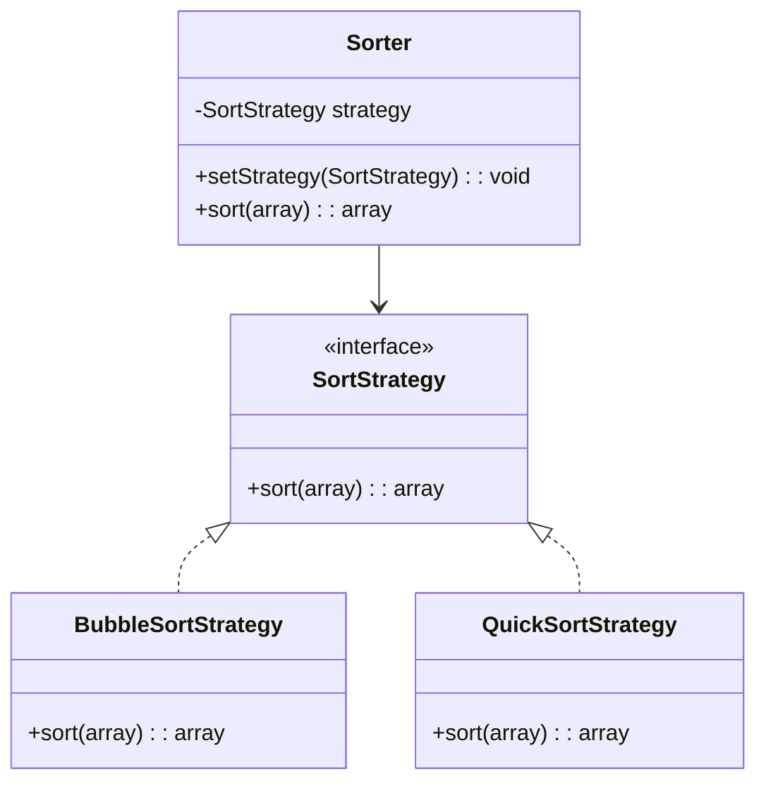

## 7.9 Strategy Pattern

The Strategy Pattern is a behavioral design pattern that enables selecting an algorithm's behavior at runtime. It defines a family of algorithms, encapsulates each one, and makes them interchangeable. This pattern is particularly useful when you need to switch between different algorithms or strategies based on the context.

### Intent

The primary intent of the Strategy Pattern is to define a family of algorithms, encapsulate each one, and make them interchangeable. This pattern allows the algorithm to vary independently from the clients that use it.

### Key Participants

1. **Strategy Interface**: Declares a common interface for all supported algorithms.
2. **Concrete Strategies**: Implement the algorithm defined in the Strategy interface.
3. **Context**: Maintains a reference to a Strategy object and delegates the algorithm execution to the current Strategy.

### Applicability

- Use the Strategy Pattern when you have multiple related algorithms that need to be interchangeable.
- When you want to avoid exposing complex, algorithm-specific data structures.
- When a class defines many behaviors and these appear as multiple conditional statements in its operations.

### Implementing Strategy in PHP

Let's dive into implementing the Strategy Pattern in PHP. We'll create a simple example involving different sorting algorithms.

#### Step 1: Define the Strategy Interface

First, we define a `SortStrategy` interface that declares a method for sorting.

```php
<?php

interface SortStrategy
{
    public function sort(array $data): array;
}
```

#### Step 2: Implement Concrete Strategies

Next, we implement different sorting algorithms as concrete strategies.

```php
<?php

class BubbleSortStrategy implements SortStrategy
{
    public function sort(array $data): array
    {
        $n = count($data);
        for ($i = 0; $i < $n; $i++) {
            for ($j = 0; $j < $n - $i - 1; $j++) {
                if ($data[$j] > $data[$j + 1]) {
                    $temp = $data[$j];
                    $data[$j] = $data[$j + 1];
                    $data[$j + 1] = $temp;
                }
            }
        }
        return $data;
    }
}

class QuickSortStrategy implements SortStrategy
{
    public function sort(array $data): array
    {
        if (count($data) < 2) {
            return $data;
        }
        $left = $right = [];
        reset($data);
        $pivot_key = key($data);
        $pivot = array_shift($data);
        foreach ($data as $k => $v) {
            if ($v < $pivot)
                $left[$k] = $v;
            else
                $right[$k] = $v;
        }
        return array_merge($this->sort($left), [$pivot_key => $pivot], $this->sort($right));
    }
}
```

#### Step 3: Create the Context

The `Sorter` class acts as the context, which uses a strategy to perform its behavior.

```php
<?php

class Sorter
{
    private SortStrategy $strategy;

    public function __construct(SortStrategy $strategy)
    {
        $this->strategy = $strategy;
    }

    public function setStrategy(SortStrategy $strategy): void
    {
        $this->strategy = $strategy;
    }

    public function sort(array $data): array
    {
        return $this->strategy->sort($data);
    }
}
```

#### Step 4: Using the Strategy Pattern

Now, let's see how we can use the `Sorter` class with different strategies.

```php
<?php

$data = [64, 34, 25, 12, 22, 11, 90];

$sorter = new Sorter(new BubbleSortStrategy());
echo "Bubble Sort: ";
print_r($sorter->sort($data));

$sorter->setStrategy(new QuickSortStrategy());
echo "Quick Sort: ";
print_r($sorter->sort($data));
```

### Design Considerations

- **Flexibility**: The Strategy Pattern provides flexibility in choosing algorithms at runtime.
- **Complexity**: It can increase the number of classes in your application.
- **Performance**: Switching strategies at runtime can have performance implications.

### PHP Unique Features

PHP's dynamic nature and support for interfaces make it an excellent fit for implementing the Strategy Pattern. The use of type declarations and type hinting enhances code readability and maintainability.

### Differences and Similarities

The Strategy Pattern is often confused with the State Pattern. While both patterns involve changing behavior at runtime, the Strategy Pattern is focused on selecting algorithms, whereas the State Pattern is concerned with changing the object's state.

### Visualizing the Strategy Pattern

To better understand the Strategy Pattern, let's visualize the relationships between the components using a class diagram.



### Use Cases and Examples

The Strategy Pattern is widely used in various scenarios, such as:

- **Sorting Algorithms**: As demonstrated in our example, different sorting strategies can be applied based on the context.
- **Payment Processing**: Different payment methods (e.g., credit card, PayPal, bank transfer) can be encapsulated as strategies.
- **Compression Algorithms**: Different file compression algorithms can be applied based on the file type or user preference.

### Try It Yourself

Experiment with the Strategy Pattern by implementing additional sorting algorithms, such as Merge Sort or Insertion Sort. Modify the `Sorter` class to handle different data types or add logging functionality to track the sorting process.

### Knowledge Check

- What is the primary intent of the Strategy Pattern?
- How does the Strategy Pattern differ from the State Pattern?
- Can you think of other scenarios where the Strategy Pattern might be useful?

### Embrace the Journey

Remember, mastering design patterns is a journey. The Strategy Pattern is just one of many tools in your software design toolkit. As you continue to explore and experiment, you'll gain a deeper understanding of how to apply these patterns effectively in your projects. Keep learning, stay curious, and enjoy the process!

## Quiz: Strategy Pattern



### What is the primary intent of the Strategy Pattern?

- [x] To define a family of algorithms, encapsulate each one, and make them interchangeable.
- [ ] To manage object creation and lifecycle.
- [ ] To provide a way to access the elements of an aggregate object sequentially.
- [ ] To ensure a class has only one instance.

> **Explanation:** The Strategy Pattern's primary intent is to define a family of algorithms, encapsulate each one, and make them interchangeable.

### Which component in the Strategy Pattern is responsible for maintaining a reference to a Strategy object?

- [x] Context
- [ ] Strategy Interface
- [ ] Concrete Strategy
- [ ] Client

> **Explanation:** The Context maintains a reference to a Strategy object and delegates the algorithm execution to the current Strategy.

### How does the Strategy Pattern differ from the State Pattern?

- [x] Strategy Pattern focuses on selecting algorithms, while State Pattern focuses on changing the object's state.
- [ ] Strategy Pattern focuses on object creation, while State Pattern focuses on object behavior.
- [ ] Strategy Pattern is used for managing object lifecycles, while State Pattern is used for managing object states.
- [ ] Strategy Pattern is used for accessing elements of an aggregate object, while State Pattern is used for encapsulating algorithms.

> **Explanation:** The Strategy Pattern is focused on selecting algorithms, whereas the State Pattern is concerned with changing the object's state.

### Which of the following is a use case for the Strategy Pattern?

- [x] Sorting algorithms
- [ ] Singleton instance management
- [ ] Object creation and lifecycle management
- [ ] Sequential access to elements of an aggregate object

> **Explanation:** Sorting algorithms are a common use case for the Strategy Pattern, as different sorting strategies can be applied based on the context.

### What is a potential drawback of using the Strategy Pattern?

- [x] It can increase the number of classes in your application.
- [ ] It limits the flexibility of choosing algorithms at runtime.
- [ ] It makes it difficult to switch strategies at runtime.
- [ ] It reduces code readability and maintainability.

> **Explanation:** A potential drawback of the Strategy Pattern is that it can increase the number of classes in your application.

### In PHP, what feature enhances code readability and maintainability when implementing the Strategy Pattern?

- [x] Type declarations and type hinting
- [ ] Global variables
- [ ] Anonymous functions
- [ ] Dynamic typing

> **Explanation:** Type declarations and type hinting enhance code readability and maintainability when implementing the Strategy Pattern in PHP.

### Which of the following is NOT a key participant in the Strategy Pattern?

- [x] Observer
- [ ] Strategy Interface
- [ ] Concrete Strategy
- [ ] Context

> **Explanation:** The Observer is not a key participant in the Strategy Pattern. The key participants are the Strategy Interface, Concrete Strategy, and Context.

### What is the role of the Concrete Strategy in the Strategy Pattern?

- [x] To implement the algorithm defined in the Strategy interface.
- [ ] To maintain a reference to a Strategy object.
- [ ] To declare a common interface for all supported algorithms.
- [ ] To manage object creation and lifecycle.

> **Explanation:** The Concrete Strategy implements the algorithm defined in the Strategy interface.

### Which PHP feature makes it an excellent fit for implementing the Strategy Pattern?

- [x] Support for interfaces
- [ ] Use of global variables
- [ ] Lack of type declarations
- [ ] Dynamic typing

> **Explanation:** PHP's support for interfaces makes it an excellent fit for implementing the Strategy Pattern.

### True or False: The Strategy Pattern allows the algorithm to vary independently from the clients that use it.

- [x] True
- [ ] False

> **Explanation:** True. The Strategy Pattern allows the algorithm to vary independently from the clients that use it.




