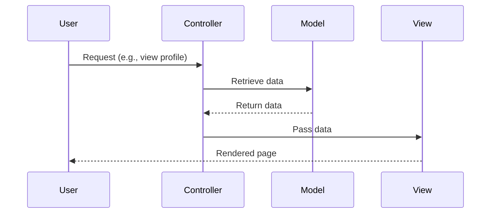

## 8.1 Model-View-Controller (MVC) Pattern

The Model-View-Controller (MVC) pattern is a foundational architectural pattern in software development, especially prevalent in web applications. It separates an application into three interconnected components, each with distinct responsibilities: the Model, the View, and the Controller. This separation facilitates modular development, easier maintenance, and scalability.

### Intent of MVC

The primary intent of the MVC pattern is to separate concerns within an application, allowing developers to focus on specific aspects without affecting others. This separation enhances code reusability, testability, and maintainability.

- **Model**: Manages the data and business logic of the application.
- **View**: Handles the presentation layer, displaying data to the user.
- **Controller**: Acts as an intermediary, processing user input and coordinating between the Model and the View.

### Implementing MVC in PHP

Implementing the MVC pattern in PHP involves creating separate classes or files for each component. Let's explore how each component functions and interacts within a PHP application.

#### Model

The Model is responsible for managing the data of the application. It interacts with the database, performs data validation, and contains the business logic.

```php
<?php

class UserModel {
    private $db;

    public function __construct($database) {
        $this->db = $database;
    }

    // Fetch user data from the database
    public function getUser($userId) {
        $query = $this->db->prepare("SELECT * FROM users WHERE id = :id");
        $query->bindParam(':id', $userId, PDO::PARAM_INT);
        $query->execute();
        return $query->fetch(PDO::FETCH_ASSOC);
    }

    // Save user data to the database
    public function saveUser($userData) {
        $query = $this->db->prepare("INSERT INTO users (name, email) VALUES (:name, :email)");
        $query->bindParam(':name', $userData['name']);
        $query->bindParam(':email', $userData['email']);
        return $query->execute();
    }
}
```

#### View

The View is responsible for rendering the user interface. It receives data from the Controller and displays it to the user.

```php
<!DOCTYPE html>
<html lang="en">
<head>
    <meta charset="UTF-8">
    <title>User Profile</title>
</head>
<body>
    <h1>User Profile</h1>
    <p>Name: <?php echo htmlspecialchars($user['name']); ?></p>
    <p>Email: <?php echo htmlspecialchars($user['email']); ?></p>
</body>
</html>
```

#### Controller

The Controller handles user input, interacts with the Model to retrieve or update data, and selects the appropriate View for rendering.

```php
<?php

class UserController {
    private $model;

    public function __construct($model) {
        $this->model = $model;
    }

    // Display user profile
    public function showProfile($userId) {
        $user = $this->model->getUser($userId);
        include 'views/userProfile.php';
    }

    // Save user data
    public function saveUser($userData) {
        $this->model->saveUser($userData);
        header('Location: /user/profile/' . $userData['id']);
    }
}
```

### Key Participants

- **Model**: Represents the data and business rules.
- **View**: Displays the data to the user.
- **Controller**: Manages the flow of the application and user interactions.

### Applicability

The MVC pattern is applicable in scenarios where:

- There is a need to separate the user interface from business logic.
- The application requires a scalable and maintainable architecture.
- Multiple developers are working on different parts of the application simultaneously.

### Use Cases and Examples

Most PHP frameworks, such as Laravel, Symfony, and CodeIgniter, implement the MVC pattern. These frameworks provide a structured way to build web applications, ensuring that developers adhere to best practices.

#### Laravel Example

Laravel, a popular PHP framework, uses MVC to organize code. Here's a brief overview of how MVC is implemented in Laravel:

- **Model**: Defined in the `app/Models` directory, interacting with the database using Eloquent ORM.
- **View**: Stored in the `resources/views` directory, using Blade templating engine.
- **Controller**: Located in the `app/Http/Controllers` directory, handling requests and responses.

```php
// Laravel Controller Example
namespace App\Http\Controllers;

use App\Models\User;
use Illuminate\Http\Request;

class UserController extends Controller {
    public function show($id) {
        $user = User::find($id);
        return view('user.profile', ['user' => $user]);
    }

    public function store(Request $request) {
        $user = User::create($request->all());
        return redirect()->route('user.profile', ['id' => $user->id]);
    }
}
```

### Design Considerations

When implementing the MVC pattern, consider the following:

- **Separation of Concerns**: Ensure that each component has a single responsibility.
- **Reusability**: Design components to be reusable across different parts of the application.
- **Testability**: Write unit tests for Models and Controllers to ensure functionality.
- **Scalability**: Structure the application to accommodate future growth and changes.

### PHP Unique Features

PHP offers several features that enhance the implementation of the MVC pattern:

- **PDO for Database Interaction**: Provides a consistent interface for accessing databases.
- **Composer for Dependency Management**: Facilitates the inclusion of external libraries and packages.
- **PSR Standards**: Ensure consistent coding practices across PHP projects.

### Differences and Similarities

The MVC pattern is often confused with other architectural patterns like MVVM (Model-View-ViewModel) and MVP (Model-View-Presenter). While all these patterns aim to separate concerns, they differ in how they handle user interactions and data binding.

- **MVC**: The Controller handles user input and updates the Model and View.
- **MVVM**: The ViewModel handles data binding and updates the View automatically.
- **MVP**: The Presenter acts as an intermediary between the View and the Model.

### Visualizing MVC

To better understand the MVC pattern, let's visualize the interaction between its components using a sequence diagram.



### Try It Yourself

Experiment with the MVC pattern by modifying the code examples provided. Try adding new features, such as user authentication or data validation, to see how the MVC components interact.

### Knowledge Check

- What are the main components of the MVC pattern?
- How does the Controller interact with the Model and View?
- What are some benefits of using the MVC pattern in PHP applications?

### Embrace the Journey

Remember, mastering the MVC pattern is just the beginning. As you continue to build more complex applications, you'll appreciate the structure and organization that MVC provides. Keep experimenting, stay curious, and enjoy the journey!

## Quiz: Model-View-Controller (MVC) Pattern



### What is the primary intent of the MVC pattern?

- [x] To separate an application into three main components: Model, View, and Controller.
- [ ] To combine all application logic into a single component.
- [ ] To focus solely on the presentation layer.
- [ ] To eliminate the need for user input handling.

> **Explanation:** The MVC pattern aims to separate an application into three main components, each with distinct responsibilities, enhancing modularity and maintainability.

### Which component of MVC is responsible for managing the data and business logic?

- [x] Model
- [ ] View
- [ ] Controller
- [ ] Router

> **Explanation:** The Model component is responsible for managing the data and business logic of the application.

### In the MVC pattern, which component handles user input and coordinates between the Model and View?

- [ ] Model
- [ ] View
- [x] Controller
- [ ] Router

> **Explanation:** The Controller handles user input and coordinates between the Model and View.

### Which PHP framework is known for implementing the MVC pattern?

- [x] Laravel
- [ ] WordPress
- [ ] Joomla
- [ ] Magento

> **Explanation:** Laravel is a popular PHP framework known for implementing the MVC pattern.

### What is a key benefit of using the MVC pattern in web applications?

- [x] Separation of concerns
- [ ] Increased code duplication
- [ ] Reduced testability
- [ ] Decreased modularity

> **Explanation:** The MVC pattern provides separation of concerns, which enhances modularity and maintainability.

### Which component of MVC is responsible for rendering the user interface?

- [ ] Model
- [x] View
- [ ] Controller
- [ ] Router

> **Explanation:** The View component is responsible for rendering the user interface.

### How does the Controller interact with the Model in MVC?

- [x] It retrieves and updates data.
- [ ] It renders the user interface.
- [ ] It handles database connections.
- [ ] It manages user sessions.

> **Explanation:** The Controller interacts with the Model to retrieve and update data.

### What is a common misconception about the MVC pattern?

- [x] That it eliminates the need for user input handling.
- [ ] That it separates concerns within an application.
- [ ] That it enhances code reusability.
- [ ] That it improves testability.

> **Explanation:** A common misconception is that MVC eliminates the need for user input handling, whereas the Controller is specifically responsible for this task.

### Which component of MVC is responsible for displaying data to the user?

- [ ] Model
- [x] View
- [ ] Controller
- [ ] Router

> **Explanation:** The View component is responsible for displaying data to the user.

### True or False: The MVC pattern is only applicable to web applications.

- [ ] True
- [x] False

> **Explanation:** While the MVC pattern is commonly used in web applications, it is not limited to them and can be applied to other types of software development.




