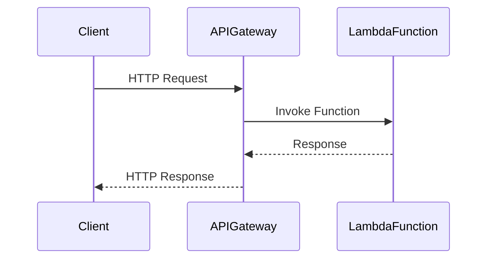

## 8.10 Serverless Architecture

Serverless architecture represents a paradigm shift in how we build and deploy applications. By abstracting away the underlying infrastructure, developers can focus on writing code and delivering features without worrying about server management. In this section, we will explore the concept of serverless architecture, its implementation in PHP, and its various use cases and benefits.

### What is Serverless Architecture?

Serverless architecture allows developers to build and run applications without managing the underlying infrastructure. Instead of provisioning and maintaining servers, developers can deploy their code to a cloud provider, which automatically handles the scaling, availability, and maintenance of the infrastructure. This approach enables developers to focus on writing code and delivering features, while the cloud provider takes care of the operational aspects.

#### Key Characteristics of Serverless Architecture

- **Event-Driven Execution:** Serverless functions are triggered by events, such as HTTP requests, database changes, or message queue events.
- **Automatic Scaling:** Serverless platforms automatically scale the application based on demand, ensuring optimal performance without manual intervention.
- **Pay-as-You-Go Pricing:** Developers only pay for the compute resources used during the execution of their functions, leading to cost savings.
- **No Server Management:** The cloud provider manages the servers, allowing developers to focus on writing code.

### Implementing Serverless in PHP

PHP, a popular server-side scripting language, can be effectively used in a serverless architecture. Several cloud providers offer serverless platforms that support PHP, either natively or through custom runtimes. Let's explore how to implement serverless architecture in PHP using AWS Lambda as an example.

#### Deploying PHP Functions on AWS Lambda

AWS Lambda is a serverless compute service that allows you to run code without provisioning or managing servers. Although AWS Lambda does not natively support PHP, you can create a custom runtime to execute PHP code. Here's how you can deploy a PHP function on AWS Lambda:

1. **Create a PHP Lambda Function:**

   First, create a PHP script that will serve as your Lambda function. For example, let's create a simple function that returns a greeting message:

   ```php
   <?php

   function handler($event, $context) {
       return [
           'statusCode' => 200,
           'body' => json_encode(['message' => 'Hello from PHP Lambda!'])
       ];
   }
   ```

2. **Set Up a Custom Runtime:**

   AWS Lambda allows you to create custom runtimes to run languages not natively supported. You can use the AWS Lambda Runtime API to create a custom PHP runtime. Here's a basic Dockerfile to set up a PHP runtime:

   ```dockerfile
   FROM amazonlinux:2

   RUN yum install -y php-cli zip

   COPY bootstrap /var/runtime/
   COPY handler.php /var/task/

   CMD ["handler.handler"]
   ```

   The `bootstrap` file is a script that initializes the runtime and invokes the handler function.

3. **Package and Deploy the Function:**

   Package your PHP script and runtime files into a ZIP archive and deploy it to AWS Lambda using the AWS CLI or AWS Management Console.

   ```bash
   zip function.zip handler.php bootstrap
   aws lambda create-function --function-name phpLambda \
       --zip-file fileb://function.zip --handler handler.handler \
       --runtime provided --role <execution-role-arn>
   ```

4. **Invoke the Function:**

   Once deployed, you can invoke your PHP Lambda function using the AWS CLI or AWS SDKs.

   ```bash
   aws lambda invoke --function-name phpLambda output.json
   ```

   This command triggers the function and stores the output in `output.json`.

#### Other Serverless Platforms for PHP

In addition to AWS Lambda, several other serverless platforms support PHP, including:

- **Google Cloud Functions:** Supports PHP through custom runtimes.
- **Azure Functions:** Offers support for PHP via custom handlers.
- **OpenFaaS:** An open-source serverless platform that supports PHP.

### Use Cases and Examples

Serverless architecture is well-suited for a variety of use cases, particularly those that benefit from event-driven processing and automatic scaling. Here are some common use cases for serverless architecture in PHP:

#### Event-Driven Processing

Serverless functions can be triggered by various events, such as HTTP requests, database changes, or message queue events. This makes serverless architecture ideal for event-driven processing, where functions are executed in response to specific events.

**Example:** A PHP function that processes image uploads by resizing and storing them in a cloud storage service.

#### APIs Without Server Maintenance

Serverless architecture is an excellent choice for building APIs, as it eliminates the need for server maintenance and allows for automatic scaling based on demand.

**Example:** A PHP-based RESTful API that handles user authentication and data retrieval.

#### Scheduled Tasks

Serverless functions can be scheduled to run at specific intervals, making them ideal for tasks such as data backups, report generation, or periodic data processing.

**Example:** A PHP function that generates daily sales reports and sends them via email.

### Benefits of Serverless Architecture

Serverless architecture offers several benefits that make it an attractive choice for modern application development:

- **Reduced Operational Overhead:** By offloading server management to the cloud provider, developers can focus on writing code and delivering features.
- **Scalability:** Serverless platforms automatically scale applications based on demand, ensuring optimal performance without manual intervention.
- **Cost Efficiency:** With pay-as-you-go pricing, developers only pay for the compute resources used during the execution of their functions, leading to cost savings.
- **Faster Time to Market:** By eliminating the need for server provisioning and management, serverless architecture enables faster development and deployment cycles.

### Challenges and Considerations

While serverless architecture offers numerous benefits, it also presents some challenges and considerations:

- **Cold Starts:** Serverless functions may experience latency during initial invocation, known as a "cold start." This can impact performance for latency-sensitive applications.
- **Vendor Lock-In:** Relying on a specific cloud provider's serverless platform can lead to vendor lock-in, making it difficult to switch providers.
- **Complexity in Debugging:** Debugging serverless applications can be more complex due to the distributed nature of the architecture.
- **Resource Limitations:** Serverless platforms impose limits on execution time, memory, and other resources, which may impact certain applications.

### Visualizing Serverless Architecture

To better understand serverless architecture, let's visualize the flow of a serverless application using a sequence diagram. This diagram illustrates the interaction between a client, an API Gateway, and a serverless function.



**Diagram Description:** This sequence diagram shows how a client sends an HTTP request to an API Gateway, which then invokes a serverless function (e.g., AWS Lambda). The function processes the request and returns a response to the API Gateway, which forwards it to the client.

### Try It Yourself

To gain hands-on experience with serverless architecture in PHP, try deploying a simple PHP function on AWS Lambda using the steps outlined above. Experiment with different event sources and triggers to see how serverless functions can be used in various scenarios.

### Knowledge Check

- **What are the key characteristics of serverless architecture?**
- **How can you deploy a PHP function on AWS Lambda?**
- **What are some common use cases for serverless architecture in PHP?**
- **What are the benefits and challenges of serverless architecture?**

### Conclusion

Serverless architecture represents a powerful paradigm for building and deploying applications in the cloud. By abstracting away the underlying infrastructure, developers can focus on writing code and delivering features without worrying about server management. With its scalability, cost efficiency, and reduced operational overhead, serverless architecture is an attractive choice for modern application development.

Remember, this is just the beginning. As you progress, you'll discover more advanced use cases and techniques for leveraging serverless architecture in PHP. Keep experimenting, stay curious, and enjoy the journey!

## Quiz: Serverless Architecture



### What is a key characteristic of serverless architecture?

- [x] Event-driven execution
- [ ] Manual server management
- [ ] Fixed pricing model
- [ ] Limited scalability

> **Explanation:** Serverless architecture is characterized by event-driven execution, where functions are triggered by specific events.

### Which cloud provider offers AWS Lambda?

- [x] Amazon Web Services
- [ ] Google Cloud Platform
- [ ] Microsoft Azure
- [ ] IBM Cloud

> **Explanation:** AWS Lambda is a serverless compute service offered by Amazon Web Services.

### What is a common use case for serverless architecture?

- [x] Event-driven processing
- [ ] Manual server provisioning
- [ ] Fixed resource allocation
- [ ] Static website hosting

> **Explanation:** Serverless architecture is well-suited for event-driven processing, where functions are executed in response to specific events.

### What is a benefit of serverless architecture?

- [x] Reduced operational overhead
- [ ] Increased server management
- [ ] Fixed pricing model
- [ ] Limited scalability

> **Explanation:** Serverless architecture reduces operational overhead by offloading server management to the cloud provider.

### What is a challenge of serverless architecture?

- [x] Cold starts
- [ ] Unlimited resource allocation
- [ ] Manual server management
- [ ] Fixed pricing model

> **Explanation:** Cold starts, or latency during initial invocation, can be a challenge in serverless architecture.

### How can you deploy a PHP function on AWS Lambda?

- [x] Using a custom runtime
- [ ] Using a native PHP runtime
- [ ] Using a fixed server
- [ ] Using a static website

> **Explanation:** AWS Lambda allows you to deploy PHP functions using a custom runtime.

### What is a benefit of pay-as-you-go pricing in serverless architecture?

- [x] Cost efficiency
- [ ] Fixed pricing model
- [ ] Unlimited resource allocation
- [ ] Manual server management

> **Explanation:** Pay-as-you-go pricing in serverless architecture leads to cost efficiency, as developers only pay for the compute resources used.

### What is a common trigger for serverless functions?

- [x] HTTP requests
- [ ] Manual server provisioning
- [ ] Fixed resource allocation
- [ ] Static website hosting

> **Explanation:** Serverless functions can be triggered by HTTP requests, among other events.

### What is a potential drawback of vendor lock-in in serverless architecture?

- [x] Difficulty switching providers
- [ ] Unlimited resource allocation
- [ ] Manual server management
- [ ] Fixed pricing model

> **Explanation:** Vendor lock-in can make it difficult to switch providers in serverless architecture.

### True or False: Serverless architecture eliminates the need for server management.

- [x] True
- [ ] False

> **Explanation:** Serverless architecture eliminates the need for server management by offloading it to the cloud provider.


