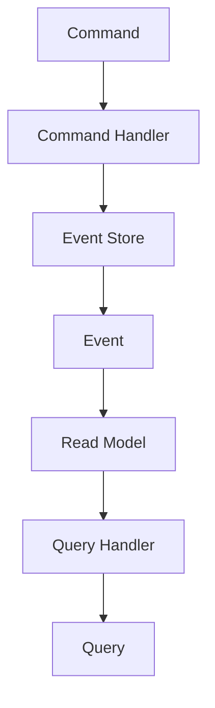

## 8.11 Event Sourcing and CQRS

In the realm of software architecture, Event Sourcing and Command Query Responsibility Segregation (CQRS) are two powerful patterns that, when combined, can significantly enhance the robustness and scalability of applications. This section will delve into these patterns, focusing on their implementation in PHP, and explore their use cases, benefits, and potential challenges.

### Understanding Event Sourcing

**Event Sourcing** is an architectural pattern where state changes in an application are stored as a sequence of events. Instead of storing the current state of an entity, you store a log of all the changes (events) that have occurred. This approach provides a complete history of changes, which can be replayed to reconstruct the current state.

#### Key Concepts of Event Sourcing

- **Event Store**: A specialized database that stores events. Each event is immutable and represents a state change.
- **Event**: A record of a change in state, typically including a timestamp and other metadata.
- **Rehydration**: The process of reconstructing the current state of an entity by replaying its events.

#### Benefits of Event Sourcing

- **Auditability**: Every change is recorded, providing a complete audit trail.
- **Reproducibility**: The ability to replay events to reconstruct past states or debug issues.
- **Scalability**: Events can be processed asynchronously, allowing for scalable architectures.

### Implementing Event Sourcing in PHP

To implement Event Sourcing in PHP, follow these steps:

1. **Define Events**: Create classes for each type of event. Each event should contain the necessary data to describe a state change.

```php
class UserRegistered {
    private $userId;
    private $email;
    private $registeredAt;

    public function __construct($userId, $email, $registeredAt) {
        $this->userId = $userId;
        $this->email = $email;
        $this->registeredAt = $registeredAt;
    }

    // Getters for event properties
}
```

2. **Store Events**: Use an event store to persist events. This can be a database table specifically designed to store events.

```php
class EventStore {
    private $pdo;

    public function __construct(PDO $pdo) {
        $this->pdo = $pdo;
    }

    public function append($event) {
        $stmt = $this->pdo->prepare("INSERT INTO events (type, data) VALUES (?, ?)");
        $stmt->execute([get_class($event), serialize($event)]);
    }
}
```

3. **Rehydrate State**: Reconstruct the current state by replaying events.

```php
class User {
    private $userId;
    private $email;
    private $registeredAt;

    public static function rehydrate(array $events) {
        $user = new self();
        foreach ($events as $event) {
            if ($event instanceof UserRegistered) {
                $user->userId = $event->getUserId();
                $user->email = $event->getEmail();
                $user->registeredAt = $event->getRegisteredAt();
            }
            // Handle other event types
        }
        return $user;
    }
}
```

### Understanding CQRS

**Command Query Responsibility Segregation (CQRS)** is a pattern that separates the read and write operations of a data model. This separation allows for optimized handling of commands (writes) and queries (reads).

#### Key Concepts of CQRS

- **Command**: An operation that changes the state of the system. Commands are write operations.
- **Query**: An operation that retrieves data without modifying it. Queries are read operations.
- **Read Model**: A model optimized for querying data.
- **Write Model**: A model optimized for handling commands.

#### Benefits of CQRS

- **Performance**: Optimized read and write models can improve performance.
- **Scalability**: Allows independent scaling of read and write operations.
- **Flexibility**: Different models can be used for reading and writing, allowing for more flexible architectures.

### Implementing CQRS in PHP

To implement CQRS in PHP, follow these steps:

1. **Define Commands**: Create classes for each command. Commands should encapsulate all the data needed to perform an operation.

```php
class RegisterUserCommand {
    private $userId;
    private $email;

    public function __construct($userId, $email) {
        $this->userId = $userId;
        $this->email = $email;
    }

    // Getters for command properties
}
```

2. **Handle Commands**: Implement command handlers to process commands and produce events.

```php
class RegisterUserHandler {
    private $eventStore;

    public function __construct(EventStore $eventStore) {
        $this->eventStore = $eventStore;
    }

    public function handle(RegisterUserCommand $command) {
        $event = new UserRegistered($command->getUserId(), $command->getEmail(), new DateTime());
        $this->eventStore->append($event);
    }
}
```

3. **Define Queries**: Create classes for queries. Queries should be simple and focused on retrieving data.

```php
class GetUserByEmailQuery {
    private $email;

    public function __construct($email) {
        $this->email = $email;
    }

    // Getter for email
}
```

4. **Handle Queries**: Implement query handlers to process queries and return results.

```php
class UserQueryHandler {
    private $pdo;

    public function __construct(PDO $pdo) {
        $this->pdo = $pdo;
    }

    public function handle(GetUserByEmailQuery $query) {
        $stmt = $this->pdo->prepare("SELECT * FROM users WHERE email = ?");
        $stmt->execute([$query->getEmail()]);
        return $stmt->fetch(PDO::FETCH_ASSOC);
    }
}
```

### Combining Event Sourcing and CQRS

When combined, Event Sourcing and CQRS provide a powerful architecture for building scalable and maintainable applications. Event Sourcing provides a reliable way to store and replay state changes, while CQRS optimizes the handling of commands and queries.

#### Use Cases for Event Sourcing and CQRS

- **Financial Systems**: Track every transaction as an event for auditability and accuracy.
- **Audit Trails**: Maintain a complete history of changes for compliance and debugging.
- **Complex Business Logic**: Separate read and write models to handle complex business rules efficiently.

### Design Considerations

- **Consistency**: Ensure eventual consistency between read and write models.
- **Complexity**: Be aware of the increased complexity in managing separate models and event stores.
- **Eventual Consistency**: Design your system to handle eventual consistency, where the read model may not immediately reflect the latest state.

### PHP Unique Features

PHP offers several features that can be leveraged when implementing Event Sourcing and CQRS:

- **PDO**: Use PHP Data Objects (PDO) for database interactions, providing a consistent interface for event storage and retrieval.
- **Anonymous Classes**: Utilize anonymous classes for lightweight command and query handlers.
- **Traits**: Use traits to share common functionality between event and command handlers.

### Differences and Similarities

- **Event Sourcing vs. CQRS**: Event Sourcing focuses on storing state changes as events, while CQRS separates read and write operations. They complement each other but serve different purposes.
- **Event Store vs. Database**: An event store is specialized for storing events, whereas a traditional database may be used for the read model in CQRS.

### Visualizing Event Sourcing and CQRS

To better understand the flow of Event Sourcing and CQRS, let's visualize the architecture:



**Diagram Description**: This diagram illustrates the flow of commands and events in an Event Sourcing and CQRS architecture. Commands are processed by command handlers, which store events in the event store. Events update the read model, which is queried by query handlers.

### Try It Yourself

Experiment with the provided code examples by modifying event types, command structures, or query logic. Consider implementing a simple application that uses Event Sourcing and CQRS to manage user registrations and logins.

### Knowledge Check

- **What is the primary benefit of using Event Sourcing?**
- **How does CQRS improve application performance?**
- **What are the potential challenges of combining Event Sourcing and CQRS?**

### Embrace the Journey

Remember, mastering Event Sourcing and CQRS is a journey. As you explore these patterns, you'll gain insights into building more scalable and maintainable applications. Keep experimenting, stay curious, and enjoy the process!

### References and Links

- [Martin Fowler on Event Sourcing](https://martinfowler.com/eaaDev/EventSourcing.html)
- [CQRS Documentation](https://martinfowler.com/bliki/CQRS.html)
- [PHP PDO Documentation](https://www.php.net/manual/en/book.pdo.php)

## Quiz: Event Sourcing and CQRS



### What is Event Sourcing primarily used for?

- [x] Storing state changes as events
- [ ] Separating read and write models
- [ ] Optimizing database queries
- [ ] Handling user authentication

> **Explanation:** Event Sourcing is primarily used for storing state changes as events, providing a complete history of changes.

### What does CQRS stand for?

- [x] Command Query Responsibility Segregation
- [ ] Command Query Resource Segmentation
- [ ] Centralized Query Response System
- [ ] Command Queue Resource Sharing

> **Explanation:** CQRS stands for Command Query Responsibility Segregation, which separates read and write operations.

### How does Event Sourcing enhance auditability?

- [x] By recording every change as an event
- [ ] By optimizing read models
- [ ] By using a centralized database
- [ ] By separating commands and queries

> **Explanation:** Event Sourcing enhances auditability by recording every change as an event, providing a complete audit trail.

### What is a key benefit of CQRS?

- [x] Improved performance through optimized models
- [ ] Simplified database schema
- [ ] Reduced code complexity
- [ ] Enhanced security features

> **Explanation:** A key benefit of CQRS is improved performance through optimized read and write models.

### Which PHP feature is useful for database interactions in Event Sourcing?

- [x] PDO (PHP Data Objects)
- [ ] PHP Sessions
- [ ] PHP Streams
- [ ] PHP Filters

> **Explanation:** PDO (PHP Data Objects) is useful for database interactions in Event Sourcing, providing a consistent interface.

### What is rehydration in Event Sourcing?

- [x] Reconstructing state by replaying events
- [ ] Optimizing database queries
- [ ] Separating read and write models
- [ ] Handling user authentication

> **Explanation:** Rehydration in Event Sourcing is the process of reconstructing state by replaying events.

### What is a potential challenge of combining Event Sourcing and CQRS?

- [x] Increased complexity in managing models
- [ ] Reduced performance
- [ ] Lack of scalability
- [ ] Limited auditability

> **Explanation:** A potential challenge of combining Event Sourcing and CQRS is increased complexity in managing separate models and event stores.

### What is the role of a command handler in CQRS?

- [x] Processing commands and producing events
- [ ] Querying data from the database
- [ ] Optimizing read models
- [ ] Handling user authentication

> **Explanation:** The role of a command handler in CQRS is to process commands and produce events.

### How does CQRS improve scalability?

- [x] By allowing independent scaling of read and write operations
- [ ] By using a centralized database
- [ ] By reducing code complexity
- [ ] By enhancing security features

> **Explanation:** CQRS improves scalability by allowing independent scaling of read and write operations.

### True or False: Event Sourcing and CQRS are always used together.

- [ ] True
- [x] False

> **Explanation:** Event Sourcing and CQRS are often used together, but they can be implemented independently depending on the application's needs.


