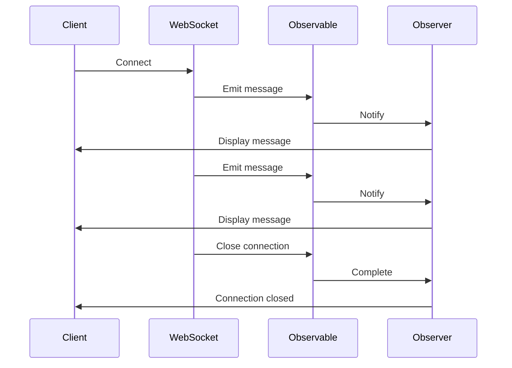

## 8.12 Reactive Programming in PHP

In the ever-evolving landscape of software development, building applications that are responsive, resilient, and scalable is crucial. Reactive Programming is a paradigm that helps developers create systems that react to changes asynchronously, making them ideal for real-time applications and data streams. In this section, we will delve into the principles of Reactive Programming, explore how it can be implemented in PHP, and provide practical examples using libraries like RxPHP.

### Understanding Reactive Programming

Reactive Programming is a programming paradigm oriented around data flows and the propagation of change. It allows developers to express static or dynamic data flows with ease, and automatically propagate changes through the data flow. This paradigm is particularly useful for applications that require real-time updates, such as live data feeds, user interfaces, and collaborative tools.

#### Key Concepts

1. **Observables**: The core building block of Reactive Programming. Observables represent a stream of data or events that can be observed over time.
2. **Observers**: These are entities that subscribe to observables to receive notifications about changes or new data.
3. **Operators**: Functions that enable the transformation, combination, and manipulation of data streams.
4. **Schedulers**: Components that control the execution context of observables, allowing for asynchronous operations.

### Implementing Reactive Programming in PHP

PHP, traditionally a synchronous language, can leverage Reactive Programming through libraries like RxPHP. RxPHP is a PHP port of the Reactive Extensions (Rx) library, which provides a powerful API for working with asynchronous data streams.

#### Using RxPHP

RxPHP allows developers to work with asynchronous data streams using observables. It provides a rich set of operators for transforming and combining streams, making it easier to handle complex data flows.

**Installation**

To get started with RxPHP, you need to install it via Composer:

```bash
composer require reactive/rxphp
```

**Basic Example**

Let's start with a simple example of creating an observable and subscribing to it:

```php
<?php

require 'vendor/autoload.php';

use Rx\Observable;

// Create an observable from an array
$observable = Observable::fromArray([1, 2, 3, 4, 5]);

// Subscribe to the observable
$observable->subscribe(
    function ($value) {
        echo "Received value: $value\n";
    },
    function ($error) {
        echo "Error: $error\n";
    },
    function () {
        echo "Completed\n";
    }
);
```

In this example, we create an observable from an array and subscribe to it. The observer receives each value from the observable and prints it to the console.

#### Handling Streams and Events

Reactive Programming is particularly useful for handling streams and events in a responsive manner. Let's explore how we can use RxPHP to handle real-time data streams.

**Example: Real-Time Data Stream**

Consider a scenario where we need to process a stream of data from a WebSocket connection. We can use RxPHP to handle this stream efficiently:

```php
<?php

use Rx\Observable;
use Rx\Scheduler\EventLoopScheduler;
use React\EventLoop\Factory;

// Create an event loop
$loop = Factory::create();

// Create an observable from a WebSocket connection
$observable = Observable::create(function ($observer) use ($loop) {
    $client = new \Ratchet\Client\WebSocket('ws://example.com/socket', [], [], $loop);

    $client->on('message', function ($message) use ($observer) {
        $observer->onNext($message);
    });

    $client->on('close', function () use ($observer) {
        $observer->onCompleted();
    });

    return function () use ($client) {
        $client->close();
    };
});

// Subscribe to the observable
$observable->subscribe(
    function ($message) {
        echo "Received message: $message\n";
    },
    function ($error) {
        echo "Error: $error\n";
    },
    function () {
        echo "Connection closed\n";
    }
);

// Run the event loop
$loop->run();
```

In this example, we create an observable from a WebSocket connection using the Ratchet library. The observable emits messages received from the WebSocket, allowing us to process them in real-time.

### Use Cases and Examples

Reactive Programming is well-suited for a variety of use cases, particularly those involving real-time data and asynchronous operations.

#### Real-Time Applications

Applications that require real-time updates, such as chat applications, live data feeds, and collaborative tools, can benefit greatly from Reactive Programming. By using observables to represent data streams, developers can easily manage and propagate changes throughout the application.

**Example: Real-Time Chat Application**

Consider a real-time chat application where messages are sent and received over a WebSocket connection. Using RxPHP, we can handle incoming messages as a stream and update the user interface in real-time.

```php
<?php

use Rx\Observable;
use Rx\Scheduler\EventLoopScheduler;
use React\EventLoop\Factory;

// Create an event loop
$loop = Factory::create();

// Create an observable from a WebSocket connection
$observable = Observable::create(function ($observer) use ($loop) {
    $client = new \Ratchet\Client\WebSocket('ws://chat.example.com/socket', [], [], $loop);

    $client->on('message', function ($message) use ($observer) {
        $observer->onNext($message);
    });

    $client->on('close', function () use ($observer) {
        $observer->onCompleted();
    });

    return function () use ($client) {
        $client->close();
    };
});

// Subscribe to the observable
$observable->subscribe(
    function ($message) {
        echo "New chat message: $message\n";
    },
    function ($error) {
        echo "Error: $error\n";
    },
    function () {
        echo "Chat connection closed\n";
    }
);

// Run the event loop
$loop->run();
```

In this example, we create an observable from a WebSocket connection to a chat server. The observable emits new chat messages, which are then displayed to the user in real-time.

#### Data Streams

Reactive Programming is also ideal for processing data streams, such as sensor data, financial market data, or any other continuous data source. By using operators to transform and filter data streams, developers can build powerful data processing pipelines.

**Example: Processing Sensor Data**

Consider a scenario where we need to process data from a temperature sensor. We can use RxPHP to handle the data stream and apply transformations to extract meaningful insights.

```php
<?php

use Rx\Observable;
use Rx\Scheduler\EventLoopScheduler;
use React\EventLoop\Factory;

// Create an event loop
$loop = Factory::create();

// Simulate a temperature sensor data stream
$observable = Observable::interval(1000, new EventLoopScheduler($loop))
    ->map(function () {
        return rand(20, 30); // Simulate temperature readings
    })
    ->filter(function ($temperature) {
        return $temperature > 25; // Filter temperatures above 25 degrees
    });

// Subscribe to the observable
$observable->subscribe(
    function ($temperature) {
        echo "High temperature alert: $temperature\n";
    },
    function ($error) {
        echo "Error: $error\n";
    },
    function () {
        echo "Sensor data stream completed\n";
    }
);

// Run the event loop
$loop->run();
```

In this example, we simulate a temperature sensor data stream using an interval observable. We apply a filter operator to only emit temperatures above 25 degrees, triggering an alert for high temperatures.

### Visualizing Reactive Programming

To better understand the flow of data in Reactive Programming, let's visualize the process using a sequence diagram.



**Description:** This sequence diagram illustrates the flow of data in a reactive system. The client connects to a WebSocket, which emits messages to an observable. The observable notifies the observer, which then updates the client interface. When the WebSocket connection is closed, the observable completes, and the observer notifies the client.

### PHP Unique Features

PHP's unique features, such as its extensive library support and ease of integration with web technologies, make it a suitable choice for implementing Reactive Programming. While PHP is traditionally synchronous, libraries like RxPHP enable developers to build asynchronous and reactive applications.

### Design Considerations

When implementing Reactive Programming in PHP, consider the following:

- **Performance**: Reactive Programming can introduce overhead due to the abstraction of data streams. Optimize performance by minimizing unnecessary transformations and using efficient operators.
- **Error Handling**: Ensure robust error handling by implementing error observers and handling exceptions gracefully.
- **Scalability**: Design your application to handle varying loads by leveraging reactive patterns and scaling resources as needed.

### Differences and Similarities

Reactive Programming is often compared to other asynchronous programming paradigms, such as event-driven programming and promises. While all these paradigms deal with asynchronous operations, Reactive Programming provides a more declarative approach to handling data streams and changes.

### Try It Yourself

To deepen your understanding of Reactive Programming in PHP, try modifying the code examples provided:

- Experiment with different operators, such as `map`, `filter`, and `reduce`, to transform data streams.
- Create a new observable from a different data source, such as an HTTP request or a file stream.
- Implement a real-time application, such as a stock ticker or a collaborative document editor, using RxPHP.

### Knowledge Check

- What are the key components of Reactive Programming?
- How does RxPHP enable Reactive Programming in PHP?
- What are some common use cases for Reactive Programming?
- How can you handle errors in a reactive system?
- What are the differences between Reactive Programming and event-driven programming?

### Embrace the Journey

Remember, Reactive Programming is a powerful paradigm that can transform the way you build applications. As you explore this approach, keep experimenting, stay curious, and enjoy the journey of creating responsive and resilient systems.

## Quiz: Reactive Programming in PHP



### What is the primary purpose of Reactive Programming?

- [x] To build systems that react to changes asynchronously
- [ ] To improve the performance of synchronous applications
- [ ] To replace traditional programming paradigms
- [ ] To simplify database interactions

> **Explanation:** Reactive Programming is designed to build systems that react to changes asynchronously, making them ideal for real-time applications.

### Which library is commonly used for Reactive Programming in PHP?

- [x] RxPHP
- [ ] Laravel
- [ ] Symfony
- [ ] CodeIgniter

> **Explanation:** RxPHP is a PHP port of the Reactive Extensions library, commonly used for implementing Reactive Programming in PHP.

### What is an observable in Reactive Programming?

- [x] A stream of data or events that can be observed over time
- [ ] A function that transforms data
- [ ] A static data structure
- [ ] A type of database

> **Explanation:** An observable represents a stream of data or events that can be observed over time, forming the core building block of Reactive Programming.

### How can you handle errors in a reactive system?

- [x] By implementing error observers
- [ ] By ignoring them
- [ ] By using synchronous error handling
- [ ] By restarting the application

> **Explanation:** In Reactive Programming, errors can be handled by implementing error observers that react to and manage exceptions gracefully.

### What is a common use case for Reactive Programming?

- [x] Real-time applications
- [ ] Batch processing
- [ ] Static website generation
- [ ] File compression

> **Explanation:** Reactive Programming is particularly useful for real-time applications that require immediate updates and responsiveness.

### Which operator would you use to transform data in a stream?

- [x] map
- [ ] filter
- [ ] reduce
- [ ] subscribe

> **Explanation:** The `map` operator is used to transform data in a stream by applying a function to each item.

### What is the role of an observer in Reactive Programming?

- [x] To subscribe to observables and receive notifications
- [ ] To create new data streams
- [ ] To manage database connections
- [ ] To handle HTTP requests

> **Explanation:** An observer subscribes to observables and receives notifications about changes or new data.

### How does Reactive Programming differ from event-driven programming?

- [x] It provides a more declarative approach to handling data streams
- [ ] It is less efficient
- [ ] It requires more manual coding
- [ ] It is only used for UI development

> **Explanation:** Reactive Programming provides a more declarative approach to handling data streams, whereas event-driven programming focuses on responding to discrete events.

### What is the purpose of a scheduler in Reactive Programming?

- [x] To control the execution context of observables
- [ ] To manage database transactions
- [ ] To optimize memory usage
- [ ] To handle user authentication

> **Explanation:** A scheduler controls the execution context of observables, allowing for asynchronous operations in Reactive Programming.

### True or False: Reactive Programming can only be used for web applications.

- [ ] True
- [x] False

> **Explanation:** Reactive Programming can be used for a wide range of applications, not just web applications, including real-time data processing and IoT systems.



By embracing Reactive Programming in PHP, you can build applications that are not only responsive and resilient but also scalable and maintainable. Keep exploring and experimenting with this powerful paradigm to unlock new possibilities in your development journey.
