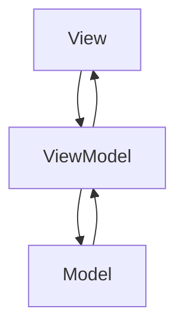

## 8.2 Model-View-ViewModel (MVVM) Pattern

The Model-View-ViewModel (MVVM) pattern is a powerful architectural pattern that enhances the separation of concerns in software applications, particularly in the context of PHP web development. By introducing a ViewModel as an intermediary between the View and the Model, MVVM facilitates a more organized and maintainable codebase. In this section, we will explore the intent, implementation, use cases, and benefits of the MVVM pattern in PHP.

### Intent

The primary intent of the MVVM pattern is to enhance the separation of concerns by introducing a ViewModel between the View and the Model. This separation allows for more modular, testable, and maintainable code. The ViewModel acts as an intermediary, handling the logic and state for views, and facilitates two-way data binding between the View and the ViewModel.

### Key Participants

1. **Model**: Represents the data and business logic of the application. It is responsible for retrieving, storing, and processing data.
2. **View**: Represents the user interface of the application. It displays data to the user and captures user input.
3. **ViewModel**: Acts as an intermediary between the View and the Model. It handles the presentation logic and state management, and facilitates two-way data binding.

### Implementing MVVM in PHP

Implementing the MVVM pattern in PHP involves creating a clear separation between the Model, View, and ViewModel components. Let's explore each component in detail and provide a comprehensive example to illustrate the implementation.

#### Model

The Model is responsible for managing the data and business logic of the application. It typically interacts with the database and other data sources to retrieve and store data.

```php
<?php

class ProductModel {
    private $db;

    public function __construct($db) {
        $this->db = $db;
    }

    public function getProductById($id) {
        // Retrieve product data from the database
        $stmt = $this->db->prepare("SELECT * FROM products WHERE id = :id");
        $stmt->bindParam(':id', $id, PDO::PARAM_INT);
        $stmt->execute();
        return $stmt->fetch(PDO::FETCH_ASSOC);
    }

    public function saveProduct($productData) {
        // Save product data to the database
        $stmt = $this->db->prepare("UPDATE products SET name = :name, price = :price WHERE id = :id");
        $stmt->bindParam(':name', $productData['name']);
        $stmt->bindParam(':price', $productData['price']);
        $stmt->bindParam(':id', $productData['id'], PDO::PARAM_INT);
        return $stmt->execute();
    }
}
```

#### ViewModel

The ViewModel acts as an intermediary between the View and the Model. It handles the presentation logic and state management, and facilitates two-way data binding.

```php
<?php

class ProductViewModel {
    private $model;
    private $productData;

    public function __construct($model) {
        $this->model = $model;
    }

    public function loadProduct($id) {
        $this->productData = $this->model->getProductById($id);
    }

    public function getProductName() {
        return $this->productData['name'] ?? '';
    }

    public function getProductPrice() {
        return $this->productData['price'] ?? 0;
    }

    public function updateProduct($name, $price) {
        $this->productData['name'] = $name;
        $this->productData['price'] = $price;
        return $this->model->saveProduct($this->productData);
    }
}
```

#### View

The View is responsible for displaying data to the user and capturing user input. It interacts with the ViewModel to retrieve and update data.

```php
<?php

class ProductView {
    private $viewModel;

    public function __construct($viewModel) {
        $this->viewModel = $viewModel;
    }

    public function render() {
        echo "<h1>Product Details</h1>";
        echo "<p>Name: " . htmlspecialchars($this->viewModel->getProductName()) . "</p>";
        echo "<p>Price: $" . htmlspecialchars($this->viewModel->getProductPrice()) . "</p>";
        echo '<form method="post" action="update_product.php">';
        echo '<input type="text" name="name" value="' . htmlspecialchars($this->viewModel->getProductName()) . '">';
        echo '<input type="text" name="price" value="' . htmlspecialchars($this->viewModel->getProductPrice()) . '">';
        echo '<input type="submit" value="Update">';
        echo '</form>';
    }
}
```

### Two-Way Data Binding

One of the key features of the MVVM pattern is two-way data binding, which allows changes in the View to automatically update the ViewModel and vice versa. In PHP, this can be achieved by using event listeners or observer patterns to synchronize data between the View and the ViewModel.

### Use Cases and Examples

The MVVM pattern is particularly useful in rich client applications, where there is a need to integrate with frontend frameworks such as Angular, React, or Vue.js. It allows for a clean separation of concerns, making it easier to manage complex user interfaces and interactions.

#### Example: Integrating with Vue.js

Let's consider an example where we integrate the MVVM pattern with Vue.js to create a dynamic and interactive user interface.

```html
<!DOCTYPE html>
<html lang="en">
<head>
    <meta charset="UTF-8">
    <meta name="viewport" content="width=device-width, initial-scale=1.0">
    <title>Product Details</title>
    <script src="https://cdn.jsdelivr.net/npm/vue@2"></script>
</head>
<body>
    <div id="app">
        <h1>Product Details</h1>
        <p>Name: {{ productName }}</p>
        <p>Price: ${{ productPrice }}</p>
        <form @submit.prevent="updateProduct">
            <input type="text" v-model="productName">
            <input type="text" v-model="productPrice">
            <input type="submit" value="Update">
        </form>
    </div>

    <script>
        new Vue({
            el: '#app',
            data: {
                productName: 'Sample Product',
                productPrice: 100
            },
            methods: {
                updateProduct() {
                    // Logic to update the product using the ViewModel
                    console.log('Product updated:', this.productName, this.productPrice);
                }
            }
        });
    </script>
</body>
</html>
```

In this example, we use Vue.js to create a dynamic user interface that binds to the ViewModel. The `v-model` directive in Vue.js facilitates two-way data binding, allowing changes in the input fields to automatically update the ViewModel.

### Visualizing the MVVM Pattern

To better understand the flow of data and interactions in the MVVM pattern, let's visualize the architecture using a Mermaid.js diagram.



**Diagram Description:** The diagram illustrates the flow of data and interactions in the MVVM pattern. The View interacts with the ViewModel, which in turn interacts with the Model. The ViewModel acts as an intermediary, facilitating communication between the View and the Model.

### Design Considerations

When implementing the MVVM pattern in PHP, consider the following design considerations:

- **Separation of Concerns**: Ensure a clear separation between the Model, View, and ViewModel components to enhance maintainability and testability.
- **Two-Way Data Binding**: Implement mechanisms for two-way data binding to synchronize data between the View and the ViewModel.
- **Scalability**: Design the architecture to accommodate future changes and scalability requirements.
- **Integration with Frontend Frameworks**: Consider integrating with frontend frameworks to enhance the user interface and user experience.

### PHP Unique Features

PHP offers several unique features that can be leveraged when implementing the MVVM pattern:

- **PHP Data Objects (PDO)**: Use PDO for secure and efficient database interactions in the Model component.
- **Anonymous Functions and Closures**: Utilize anonymous functions and closures for event handling and data binding in the ViewModel.
- **Namespaces and Autoloading**: Organize code using namespaces and autoloading to enhance modularity and maintainability.

### Differences and Similarities

The MVVM pattern is often compared to the Model-View-Controller (MVC) pattern. While both patterns aim to separate concerns, they differ in their approach:

- **MVC**: The Controller handles user input and updates the Model and View.
- **MVVM**: The ViewModel acts as an intermediary, handling presentation logic and state management.

### Try It Yourself

To deepen your understanding of the MVVM pattern, try modifying the code examples provided. Experiment with different data models, views, and viewmodels to see how changes affect the overall architecture. Consider integrating with other frontend frameworks or libraries to enhance the user interface.

### Knowledge Check

- What is the primary intent of the MVVM pattern?
- How does the ViewModel facilitate two-way data binding?
- What are the key differences between MVVM and MVC?
- How can PHP's unique features be leveraged in the MVVM pattern?

### Embrace the Journey

Remember, mastering design patterns like MVVM is a journey. As you progress, you'll build more complex and interactive applications. Keep experimenting, stay curious, and enjoy the journey!

## Quiz: Model-View-ViewModel (MVVM) Pattern



### What is the primary intent of the MVVM pattern?

- [x] To enhance separation of concerns by introducing a ViewModel between the View and the Model.
- [ ] To combine the View and Model into a single component.
- [ ] To eliminate the need for a Model in the architecture.
- [ ] To simplify the user interface design.

> **Explanation:** The MVVM pattern enhances separation of concerns by introducing a ViewModel as an intermediary between the View and the Model.

### Which component in the MVVM pattern handles the presentation logic and state management?

- [ ] Model
- [x] ViewModel
- [ ] View
- [ ] Controller

> **Explanation:** The ViewModel handles the presentation logic and state management in the MVVM pattern.

### How does the ViewModel facilitate two-way data binding?

- [x] By acting as an intermediary between the View and the Model.
- [ ] By directly modifying the Model.
- [ ] By eliminating the need for a View.
- [ ] By combining the View and Model into a single component.

> **Explanation:** The ViewModel facilitates two-way data binding by acting as an intermediary between the View and the Model.

### What is a key difference between MVVM and MVC?

- [x] MVVM uses a ViewModel to handle presentation logic, while MVC uses a Controller.
- [ ] MVVM eliminates the need for a Model, while MVC does not.
- [ ] MVVM combines the View and Model, while MVC separates them.
- [ ] MVVM is only used for backend development, while MVC is used for frontend development.

> **Explanation:** MVVM uses a ViewModel to handle presentation logic, whereas MVC uses a Controller.

### Which PHP feature can be used for secure database interactions in the Model component?

- [x] PHP Data Objects (PDO)
- [ ] Anonymous Functions
- [ ] Namespaces
- [ ] Closures

> **Explanation:** PHP Data Objects (PDO) can be used for secure and efficient database interactions in the Model component.

### What is the role of the View in the MVVM pattern?

- [x] To display data to the user and capture user input.
- [ ] To handle business logic and data processing.
- [ ] To act as an intermediary between the Model and ViewModel.
- [ ] To manage the application's state.

> **Explanation:** The View is responsible for displaying data to the user and capturing user input.

### How can two-way data binding be achieved in PHP?

- [x] By using event listeners or observer patterns.
- [ ] By directly modifying the Model from the View.
- [ ] By eliminating the ViewModel component.
- [ ] By combining the View and Model into a single component.

> **Explanation:** Two-way data binding can be achieved by using event listeners or observer patterns to synchronize data between the View and the ViewModel.

### Which frontend framework is commonly used with the MVVM pattern?

- [x] Vue.js
- [ ] Laravel
- [ ] Symfony
- [ ] CodeIgniter

> **Explanation:** Vue.js is a frontend framework commonly used with the MVVM pattern for creating dynamic user interfaces.

### What is the role of the Model in the MVVM pattern?

- [x] To manage data and business logic.
- [ ] To display data to the user.
- [ ] To handle presentation logic and state management.
- [ ] To act as an intermediary between the View and ViewModel.

> **Explanation:** The Model is responsible for managing data and business logic in the MVVM pattern.

### True or False: The MVVM pattern is only applicable to frontend development.

- [ ] True
- [x] False

> **Explanation:** The MVVM pattern is applicable to both frontend and backend development, as it enhances separation of concerns and facilitates a more organized codebase.


