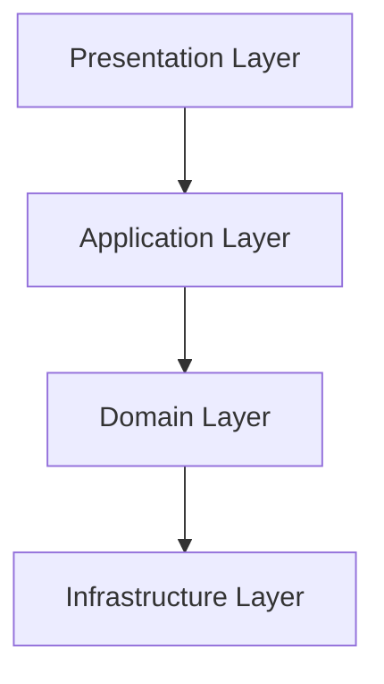

## 8.3 Layered Architecture

The Layered Architecture pattern is a widely adopted architectural style in software development, particularly in enterprise applications. It organizes code into distinct layers, each with a specific responsibility, promoting separation of concerns and enhancing maintainability. In this section, we will explore the Layered Architecture pattern in PHP, its implementation, benefits, and practical examples.

### Intent

The primary intent of the Layered Architecture pattern is to organize code into layers with distinct responsibilities. This separation allows for easier maintenance, testing, and scalability of applications. Each layer in the architecture has a specific role and communicates only with the layer directly beneath it, ensuring a clear separation of concerns.

### Implementing Layered Architecture in PHP

Implementing a Layered Architecture in PHP involves dividing the application into several layers, each responsible for a specific aspect of the application. The most common layers include:

1. **Presentation Layer**: This layer is responsible for handling user interactions and presenting information to the user. It includes views, templates, and controllers that manage the user interface.

2. **Application Layer**: This layer acts as a mediator between the Presentation and Domain layers. It contains the business logic and orchestrates the flow of data between the layers.

3. **Domain Layer**: Also known as the Business Logic Layer, this layer contains the core business logic and rules. It is independent of the user interface and infrastructure, focusing solely on the business domain.

4. **Infrastructure Layer**: This layer handles technical concerns such as data persistence, external services, and system integration. It includes databases, file systems, and network communication.

#### Communication Between Layers

In a Layered Architecture, each layer communicates only with the layer directly beneath it. This ensures a clear separation of concerns and prevents tight coupling between layers. For example, the Presentation Layer communicates with the Application Layer, which in turn communicates with the Domain Layer.

### Use Cases and Examples

Layered Architecture is particularly useful in enterprise applications that require a clear separation of concerns. It is commonly used in applications that need to be scalable, maintainable, and testable. Let's explore a practical example of implementing Layered Architecture in a PHP application.

#### Example: Building a Simple E-commerce Application

Consider a simple e-commerce application with the following requirements:

- Display a list of products to users.
- Allow users to add products to their shopping cart.
- Process user orders and payments.

##### Presentation Layer

The Presentation Layer handles user interactions and displays information to the user. In our e-commerce application, this layer includes views and controllers that manage the user interface.

```php
// src/Controller/ProductController.php

namespace App\Controller;

use App\Service\ProductService;

class ProductController
{
    private $productService;

    public function __construct(ProductService $productService)
    {
        $this->productService = $productService;
    }

    public function listProducts()
    {
        $products = $this->productService->getAllProducts();
        include 'views/product_list.php';
    }
}
```

##### Application Layer

The Application Layer contains the business logic and orchestrates the flow of data between the layers. It acts as a mediator between the Presentation and Domain layers.

```php
// src/Service/ProductService.php

namespace App\Service;

use App\Domain\ProductRepository;

class ProductService
{
    private $productRepository;

    public function __construct(ProductRepository $productRepository)
    {
        $this->productRepository = $productRepository;
    }

    public function getAllProducts()
    {
        return $this->productRepository->findAll();
    }
}
```

##### Domain Layer

The Domain Layer contains the core business logic and rules. It is independent of the user interface and infrastructure.

```php
// src/Domain/Product.php

namespace App\Domain;

class Product
{
    private $id;
    private $name;
    private $price;

    public function __construct($id, $name, $price)
    {
        $this->id = $id;
        $this->name = $name;
        $this->price = $price;
    }

    // Getters and business logic methods...
}
```

```php
// src/Domain/ProductRepository.php

namespace App\Domain;

interface ProductRepository
{
    public function findAll();
}
```

##### Infrastructure Layer

The Infrastructure Layer handles technical concerns such as data persistence and external services.

```php
// src/Infrastructure/DatabaseProductRepository.php

namespace App\Infrastructure;

use App\Domain\ProductRepository;
use App\Domain\Product;

class DatabaseProductRepository implements ProductRepository
{
    public function findAll()
    {
        // Fetch products from the database
        // For simplicity, returning a static array
        return [
            new Product(1, 'Product A', 100),
            new Product(2, 'Product B', 150),
        ];
    }
}
```

### Benefits of Layered Architecture

Implementing a Layered Architecture in PHP offers several benefits:

- **Separation of Concerns**: Each layer has a specific responsibility, making the codebase easier to understand and maintain.
- **Scalability**: The architecture allows for easy scaling of applications by adding or modifying layers without affecting the entire system.
- **Testability**: Layers can be tested independently, improving the overall testability of the application.
- **Reusability**: Components within a layer can be reused across different parts of the application.

### Design Considerations

When implementing a Layered Architecture, consider the following:

- **Layer Dependencies**: Ensure that each layer communicates only with the layer directly beneath it to maintain separation of concerns.
- **Performance**: Be mindful of potential performance overhead due to multiple layers of abstraction.
- **Complexity**: Avoid over-engineering by keeping the architecture simple and only adding layers when necessary.

### PHP Unique Features

PHP offers several unique features that can enhance the implementation of Layered Architecture:

- **Namespaces**: Use namespaces to organize code within layers and avoid naming conflicts.
- **Autoloading**: Leverage PHP's autoloading capabilities to automatically load classes within layers.
- **Interfaces and Traits**: Use interfaces to define contracts between layers and traits to share common functionality.

### Differences and Similarities

Layered Architecture is often compared to other architectural patterns such as Microservices and Hexagonal Architecture. While all these patterns aim to improve maintainability and scalability, they differ in their approach:

- **Layered Architecture**: Focuses on organizing code into layers with specific responsibilities.
- **Microservices**: Breaks down applications into small, independent services that communicate over a network.
- **Hexagonal Architecture**: Emphasizes the separation of business logic from external systems through ports and adapters.

### Visualizing Layered Architecture

To better understand the Layered Architecture pattern, let's visualize the layers and their interactions using a Mermaid.js diagram.



**Diagram Description**: The diagram illustrates the flow of communication between the layers in a Layered Architecture. The Presentation Layer communicates with the Application Layer, which interacts with the Domain Layer. The Domain Layer relies on the Infrastructure Layer for technical concerns.

### Try It Yourself

To deepen your understanding of Layered Architecture, try modifying the code examples provided:

- **Add a new feature**: Implement a feature that allows users to search for products by name.
- **Refactor the code**: Introduce a new layer or modify existing layers to improve the architecture.
- **Test the layers**: Write unit tests for each layer to ensure they function correctly.

### Knowledge Check

- **Question**: What are the main benefits of using a Layered Architecture?
- **Exercise**: Implement a simple blog application using Layered Architecture.

### Embrace the Journey

Remember, mastering Layered Architecture is just the beginning of your journey in building scalable and maintainable PHP applications. Keep experimenting, stay curious, and enjoy the process of learning and growing as a developer.

## Quiz: Layered Architecture



### What is the primary intent of the Layered Architecture pattern?

- [x] To organize code into layers with distinct responsibilities
- [ ] To increase the complexity of the application
- [ ] To reduce the number of classes in the application
- [ ] To eliminate the need for testing

> **Explanation:** The primary intent of the Layered Architecture pattern is to organize code into layers with distinct responsibilities, promoting separation of concerns.

### Which layer in the Layered Architecture is responsible for handling user interactions?

- [x] Presentation Layer
- [ ] Application Layer
- [ ] Domain Layer
- [ ] Infrastructure Layer

> **Explanation:** The Presentation Layer is responsible for handling user interactions and presenting information to the user.

### What is the role of the Application Layer in a Layered Architecture?

- [x] To act as a mediator between the Presentation and Domain layers
- [ ] To handle data persistence and external services
- [ ] To manage user interfaces and views
- [ ] To define core business logic and rules

> **Explanation:** The Application Layer acts as a mediator between the Presentation and Domain layers, orchestrating the flow of data.

### Which layer contains the core business logic and rules?

- [ ] Presentation Layer
- [ ] Application Layer
- [x] Domain Layer
- [ ] Infrastructure Layer

> **Explanation:** The Domain Layer contains the core business logic and rules, independent of the user interface and infrastructure.

### What is a common use case for Layered Architecture?

- [x] Enterprise applications requiring clear separation of concerns
- [ ] Small scripts with minimal functionality
- [ ] Applications with no user interface
- [ ] Systems that do not require scalability

> **Explanation:** Layered Architecture is commonly used in enterprise applications that require a clear separation of concerns.

### How does the Infrastructure Layer contribute to a Layered Architecture?

- [x] By handling technical concerns such as data persistence and external services
- [ ] By managing user interactions and views
- [ ] By defining business logic and rules
- [ ] By orchestrating the flow of data between layers

> **Explanation:** The Infrastructure Layer handles technical concerns such as data persistence and external services.

### What is a potential drawback of Layered Architecture?

- [x] Performance overhead due to multiple layers of abstraction
- [ ] Lack of separation of concerns
- [ ] Difficulty in scaling the application
- [ ] Inability to test layers independently

> **Explanation:** A potential drawback of Layered Architecture is performance overhead due to multiple layers of abstraction.

### Which PHP feature can enhance the implementation of Layered Architecture?

- [x] Namespaces
- [ ] Global variables
- [ ] Inline HTML
- [ ] Hardcoded database queries

> **Explanation:** Namespaces can enhance the implementation of Layered Architecture by organizing code and avoiding naming conflicts.

### How does Layered Architecture differ from Microservices?

- [x] Layered Architecture organizes code into layers, while Microservices break down applications into independent services
- [ ] Layered Architecture focuses on network communication, while Microservices focus on layers
- [ ] Layered Architecture is used for small applications, while Microservices are for large applications
- [ ] Layered Architecture eliminates the need for infrastructure, while Microservices rely on it

> **Explanation:** Layered Architecture organizes code into layers with specific responsibilities, while Microservices break down applications into independent services.

### True or False: In a Layered Architecture, each layer can communicate with any other layer.

- [ ] True
- [x] False

> **Explanation:** In a Layered Architecture, each layer communicates only with the layer directly beneath it to maintain separation of concerns.


