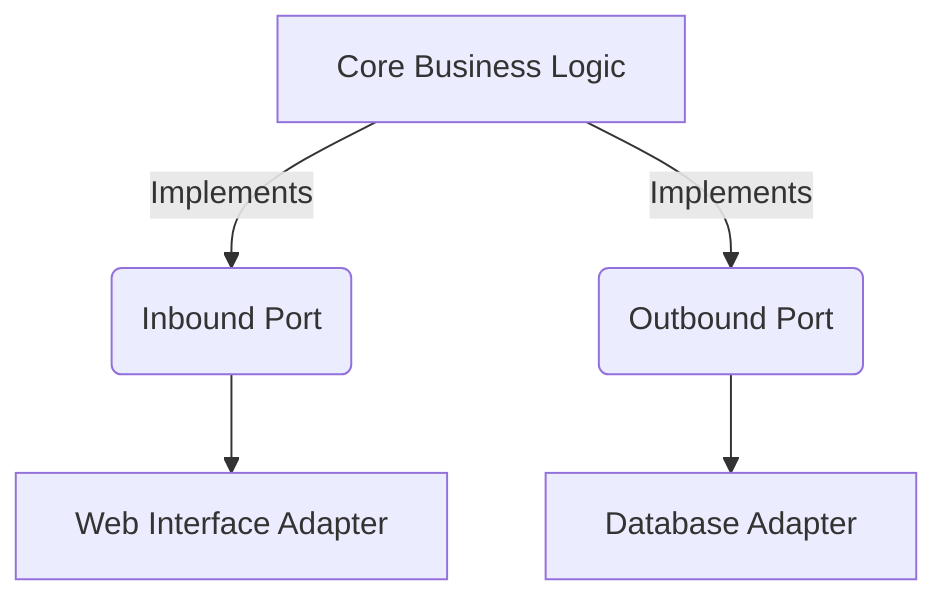

## 8.4 Hexagonal Architecture (Ports and Adapters)

Hexagonal Architecture, also known as Ports and Adapters, is a software design pattern that aims to create applications that are easier to maintain and test by isolating core business logic from external concerns. This architecture promotes a clean separation between the application's core logic and its interactions with the outside world, such as databases, user interfaces, and external services.

### Intent

The primary intent of Hexagonal Architecture is to make applications more adaptable to change by decoupling the core business logic from external systems. This separation allows developers to modify or replace external components without affecting the core logic, leading to more maintainable and testable applications.

### Implementing Hexagonal Architecture in PHP

To implement Hexagonal Architecture in PHP, we need to understand its key components: the core business logic, ports, and adapters.

#### Core Business Logic

The core business logic resides at the center of the architecture. It contains the essential rules and processes that define the application's functionality. This core should be independent of any external systems, ensuring that it can be tested in isolation.

#### Ports

Ports define the interfaces through which the core interacts with the outside world. They act as a contract between the core and external systems, specifying the methods that need to be implemented by adapters. Ports can be divided into two types:

- **Inbound Ports:** These are interfaces that define how external systems can interact with the core. They are typically implemented by controllers or services that handle user input or external requests.

- **Outbound Ports:** These are interfaces that define how the core interacts with external systems. They are implemented by adapters that connect to databases, APIs, or other external services.

#### Adapters

Adapters are responsible for implementing the ports and providing the necessary logic to interact with external systems. They translate the data and operations between the core and the external systems, ensuring that the core remains isolated from any specific implementation details.

### Use Cases and Examples

Hexagonal Architecture is particularly useful in applications that require high adaptability to change. It allows developers to easily swap out external components, such as databases or third-party services, without affecting the core business logic.

#### Example: Building a Simple E-commerce Application

Let's consider a simple e-commerce application to demonstrate Hexagonal Architecture in PHP. The application will have the following components:

- **Core Business Logic:** Handles product management and order processing.
- **Inbound Port:** Defines the interface for managing products.
- **Outbound Port:** Defines the interface for interacting with the database.
- **Adapters:** Implement the ports to connect the core logic with a web interface and a database.

#### Step-by-Step Implementation

1. **Define the Core Business Logic**

```php
<?php

namespace App\Core;

class ProductService
{
    private $productRepository;

    public function __construct(ProductRepositoryInterface $productRepository)
    {
        $this->productRepository = $productRepository;
    }

    public function addProduct(string $name, float $price): void
    {
        $product = new Product($name, $price);
        $this->productRepository->save($product);
    }

    public function getProduct(int $id): ?Product
    {
        return $this->productRepository->findById($id);
    }
}
```

2. **Define the Ports**

```php
<?php

namespace App\Ports;

interface ProductRepositoryInterface
{
    public function save(Product $product): void;
    public function findById(int $id): ?Product;
}

interface ProductServiceInterface
{
    public function addProduct(string $name, float $price): void;
    public function getProduct(int $id): ?Product;
}
```

3. **Implement the Adapters**

- **Database Adapter**

```php
<?php

namespace App\Adapters;

use App\Ports\ProductRepositoryInterface;
use App\Core\Product;

class DatabaseProductRepository implements ProductRepositoryInterface
{
    public function save(Product $product): void
    {
        // Code to save product to the database
    }

    public function findById(int $id): ?Product
    {
        // Code to find product by ID from the database
    }
}
```

- **Web Interface Adapter**

```php
<?php

namespace App\Adapters;

use App\Ports\ProductServiceInterface;
use App\Core\ProductService;

class WebProductService implements ProductServiceInterface
{
    private $productService;

    public function __construct(ProductService $productService)
    {
        $this->productService = $productService;
    }

    public function addProduct(string $name, float $price): void
    {
        $this->productService->addProduct($name, $price);
    }

    public function getProduct(int $id): ?Product
    {
        return $this->productService->getProduct($id);
    }
}
```

### Visualizing Hexagonal Architecture

To better understand the structure of Hexagonal Architecture, let's visualize it using a diagram. This diagram illustrates the separation between the core business logic, ports, and adapters.



**Diagram Description:** The diagram shows the core business logic at the center, interacting with inbound and outbound ports. The ports are connected to their respective adapters, which handle communication with external systems.

### PHP Unique Features

PHP offers several unique features that make it well-suited for implementing Hexagonal Architecture:

- **Interfaces and Traits:** PHP's support for interfaces allows for clear separation of concerns, enabling the definition of ports. Traits can be used to share common functionality across adapters.

- **Dependency Injection:** PHP's support for dependency injection facilitates the decoupling of components, making it easier to swap out adapters.

- **Namespaces:** PHP's namespace feature helps organize code and avoid naming conflicts, which is particularly useful in large applications with multiple adapters.

### Design Considerations

When implementing Hexagonal Architecture in PHP, consider the following:

- **Separation of Concerns:** Ensure that the core business logic is completely isolated from external systems. This separation is crucial for maintainability and testability.

- **Interface Design:** Carefully design the interfaces for ports to ensure they provide the necessary functionality without exposing implementation details.

- **Testing:** With the core logic isolated, unit testing becomes more straightforward. Use mock objects to test the core logic without relying on external systems.

- **Performance:** While Hexagonal Architecture promotes flexibility, it may introduce additional layers of abstraction. Consider the performance implications and optimize where necessary.

### Differences and Similarities

Hexagonal Architecture is often compared to other architectural patterns, such as:

- **Layered Architecture:** Both patterns promote separation of concerns, but Hexagonal Architecture emphasizes isolating the core logic from external systems, while Layered Architecture focuses on organizing code into layers.

- **Clean Architecture:** Similar to Hexagonal Architecture, Clean Architecture also aims to decouple the core logic from external systems. However, Clean Architecture introduces additional layers, such as use cases and entities.

### Try It Yourself

To gain a deeper understanding of Hexagonal Architecture, try modifying the code examples provided:

- **Add a new adapter:** Implement a new adapter for a different database or a third-party API.
- **Extend the core logic:** Add new functionality to the core business logic and update the ports and adapters accordingly.
- **Test the core logic:** Write unit tests for the core business logic using mock objects for the ports.

### Knowledge Check

- **What is the primary intent of Hexagonal Architecture?**
- **How do ports and adapters contribute to the architecture?**
- **What are the benefits of isolating core business logic from external systems?**

### Embrace the Journey

Remember, implementing Hexagonal Architecture is just the beginning. As you progress, you'll build more robust and adaptable applications. Keep experimenting, stay curious, and enjoy the journey!

## Quiz: Hexagonal Architecture (Ports and Adapters)



### What is the primary intent of Hexagonal Architecture?

- [x] To make applications easier to maintain and test by isolating core logic from external concerns.
- [ ] To increase the complexity of the application.
- [ ] To tightly couple the core logic with external systems.
- [ ] To eliminate the need for interfaces.

> **Explanation:** The primary intent of Hexagonal Architecture is to isolate the core logic from external concerns, making applications easier to maintain and test.

### What are ports in Hexagonal Architecture?

- [x] Interfaces that define how the core interacts with external systems.
- [ ] The core business logic of the application.
- [ ] Adapters that implement the interfaces.
- [ ] External systems that interact with the application.

> **Explanation:** Ports are interfaces that define how the core interacts with external systems, acting as a contract between the core and the outside world.

### What role do adapters play in Hexagonal Architecture?

- [x] They implement ports and provide logic to interact with external systems.
- [ ] They define the core business logic.
- [ ] They act as external systems.
- [ ] They eliminate the need for interfaces.

> **Explanation:** Adapters implement ports and provide the necessary logic to interact with external systems, ensuring the core remains isolated.

### Which of the following is an example of an inbound port?

- [x] An interface that defines how external systems can interact with the core.
- [ ] An adapter that connects to a database.
- [ ] The core business logic of the application.
- [ ] An external API.

> **Explanation:** An inbound port is an interface that defines how external systems can interact with the core, typically implemented by controllers or services.

### How does Hexagonal Architecture promote testability?

- [x] By isolating the core logic, allowing it to be tested in isolation.
- [ ] By tightly coupling the core logic with external systems.
- [ ] By eliminating the need for interfaces.
- [ ] By increasing the complexity of the application.

> **Explanation:** Hexagonal Architecture promotes testability by isolating the core logic, allowing it to be tested without relying on external systems.

### What is an outbound port?

- [x] An interface that defines how the core interacts with external systems.
- [ ] The core business logic of the application.
- [ ] An adapter that connects to a web interface.
- [ ] An external API.

> **Explanation:** An outbound port is an interface that defines how the core interacts with external systems, implemented by adapters that connect to databases or APIs.

### What is a key benefit of using Hexagonal Architecture?

- [x] It allows for easy swapping of external components without affecting the core logic.
- [ ] It increases the complexity of the application.
- [ ] It tightly couples the core logic with external systems.
- [ ] It eliminates the need for interfaces.

> **Explanation:** A key benefit of Hexagonal Architecture is that it allows for easy swapping of external components without affecting the core logic, promoting adaptability.

### Which PHP feature is particularly useful for implementing Hexagonal Architecture?

- [x] Interfaces and Traits
- [ ] Global Variables
- [ ] Static Methods
- [ ] Inline SQL Queries

> **Explanation:** Interfaces and Traits in PHP are particularly useful for implementing Hexagonal Architecture as they allow for clear separation of concerns and code reuse.

### How can you test the core logic in Hexagonal Architecture?

- [x] By using mock objects for the ports.
- [ ] By testing the adapters directly.
- [ ] By relying on external systems.
- [ ] By eliminating the need for interfaces.

> **Explanation:** You can test the core logic in Hexagonal Architecture by using mock objects for the ports, allowing you to test the core in isolation.

### True or False: Hexagonal Architecture eliminates the need for interfaces.

- [ ] True
- [x] False

> **Explanation:** False. Hexagonal Architecture relies on interfaces (ports) to define how the core interacts with external systems, making interfaces a crucial part of the architecture.




