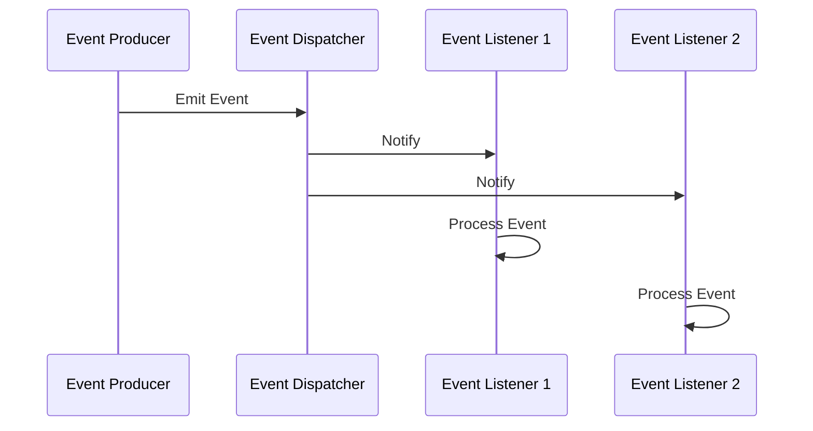

## 8.5 Event-Driven Architecture

Event-Driven Architecture (EDA) is a powerful design pattern that enables the decoupling of components within a system through the use of events. This architecture is particularly useful for building high-performance, scalable applications that require asynchronous processing and real-time responsiveness. In this section, we will explore the core concepts of EDA, how to implement it in PHP, and its various use cases.

### Intent

The primary intent of Event-Driven Architecture is to decouple components in a system by allowing them to communicate through events. This approach facilitates asynchronous processing, enabling systems to handle high loads and complex workflows efficiently.

### Key Concepts of Event-Driven Architecture

Before diving into implementation details, let's clarify some key concepts associated with EDA:

- **Event:** A significant change in state or occurrence within a system that components can react to.
- **Event Producer:** A component that generates events.
- **Event Consumer:** A component that listens for and processes events.
- **Event Channel:** A medium through which events are transmitted from producers to consumers.
- **Event Processing:** The act of handling and responding to events.

### Implementing Event-Driven Architecture in PHP

Implementing EDA in PHP involves using event dispatchers, listeners, and message queues. Let's explore these components in detail.

#### Using Event Dispatchers and Listeners

Event dispatchers and listeners form the backbone of EDA. The dispatcher is responsible for broadcasting events, while listeners react to these events.

**Example: Implementing an Event Dispatcher and Listener in PHP**

```php
// Define an Event class
class UserRegisteredEvent {
    public $user;

    public function __construct($user) {
        $this->user = $user;
    }
}

// Define an Event Dispatcher
class EventDispatcher {
    private $listeners = [];

    public function addListener($eventName, callable $listener) {
        $this->listeners[$eventName][] = $listener;
    }

    public function dispatch($eventName, $event) {
        if (isset($this->listeners[$eventName])) {
            foreach ($this->listeners[$eventName] as $listener) {
                $listener($event);
            }
        }
    }
}

// Define a Listener
function sendWelcomeEmail($event) {
    echo "Sending welcome email to " . $event->user . "\n";
}

// Usage
$dispatcher = new EventDispatcher();
$dispatcher->addListener('user.registered', 'sendWelcomeEmail');

$userEvent = new UserRegisteredEvent('john.doe@example.com');
$dispatcher->dispatch('user.registered', $userEvent);
```

In this example, we define a simple event system where a `UserRegisteredEvent` is dispatched, and a listener sends a welcome email.

#### Implementing Message Queues with RabbitMQ

For more complex systems, message queues like RabbitMQ can be used to manage event-driven communication. RabbitMQ allows for reliable, asynchronous message passing between components.

**Link:** [RabbitMQ - Messaging that just works](https://www.rabbitmq.com/)

**Example: Using RabbitMQ in PHP**

```php
require_once __DIR__ . '/vendor/autoload.php';

use PhpAmqpLib\Connection\AMQPStreamConnection;
use PhpAmqpLib\Message\AMQPMessage;

// Establish a connection to RabbitMQ
$connection = new AMQPStreamConnection('localhost', 5672, 'guest', 'guest');
$channel = $connection->channel();

// Declare a queue
$channel->queue_declare('user_registration', false, false, false, false);

// Create a message
$messageBody = json_encode(['user' => 'john.doe@example.com']);
$message = new AMQPMessage($messageBody);

// Publish the message to the queue
$channel->basic_publish($message, '', 'user_registration');

echo " [x] Sent 'User Registered'\n";

// Close the channel and connection
$channel->close();
$connection->close();
```

In this example, we use RabbitMQ to send a message to a queue. This message can be consumed by another service or component, allowing for asynchronous processing.

### Use Cases and Examples

Event-Driven Architecture is ideal for applications that require high scalability and real-time processing. Here are some common use cases:

- **Real-Time Analytics:** EDA can be used to process and analyze data streams in real-time, providing immediate insights.
- **Microservices Communication:** In a microservices architecture, EDA facilitates communication between services without tight coupling.
- **User Activity Tracking:** Track user actions and behaviors in real-time for analytics and personalization.
- **IoT Applications:** Handle data from IoT devices asynchronously, enabling efficient processing and response.

### Visualizing Event-Driven Architecture

To better understand EDA, let's visualize the flow of events in a typical system.



In this diagram, an event producer emits an event, which is dispatched to multiple listeners. Each listener processes the event independently.

### Design Considerations

When implementing EDA, consider the following:

- **Scalability:** Ensure your system can handle a large number of events and listeners.
- **Reliability:** Use message queues to ensure events are not lost.
- **Latency:** Minimize latency by optimizing event processing and network communication.
- **Error Handling:** Implement robust error handling to manage failures gracefully.

### PHP Unique Features

PHP offers several features that make it suitable for implementing EDA:

- **Simplicity:** PHP's straightforward syntax makes it easy to implement event-driven systems.
- **Community Libraries:** Libraries like Symfony's EventDispatcher provide ready-to-use solutions for EDA.
- **Integration:** PHP can easily integrate with message brokers like RabbitMQ and Kafka.

### Differences and Similarities

EDA is often compared to other architectural patterns like Microservices and Service-Oriented Architecture (SOA). While they share similarities, EDA focuses on decoupling through events, whereas Microservices and SOA emphasize service boundaries and communication protocols.

### Try It Yourself

Experiment with the code examples provided. Try modifying the event dispatcher to handle different types of events or integrate RabbitMQ with a real-world application.

### Knowledge Check

- What is the primary intent of Event-Driven Architecture?
- How do event dispatchers and listeners work together in PHP?
- What are some common use cases for EDA?
- How can RabbitMQ be used to implement EDA in PHP?
- What are the key design considerations when implementing EDA?

### Embrace the Journey

Remember, mastering Event-Driven Architecture is a journey. As you continue to explore and experiment, you'll discover new ways to build scalable and responsive applications. Keep learning, stay curious, and enjoy the process!

## Quiz: Event-Driven Architecture



### What is the primary intent of Event-Driven Architecture?

- [x] To decouple components through events that trigger reactions asynchronously.
- [ ] To tightly couple components for synchronous processing.
- [ ] To ensure all components are always aware of each other's state.
- [ ] To eliminate the need for message queues.

> **Explanation:** The primary intent of Event-Driven Architecture is to decouple components through events that trigger reactions asynchronously, allowing for scalable and flexible systems.

### Which component is responsible for broadcasting events in an Event-Driven Architecture?

- [ ] Event Consumer
- [x] Event Dispatcher
- [ ] Event Producer
- [ ] Event Channel

> **Explanation:** The Event Dispatcher is responsible for broadcasting events to the appropriate listeners in an Event-Driven Architecture.

### What is a common use case for Event-Driven Architecture?

- [x] Real-time analytics
- [ ] Batch processing
- [ ] Static website hosting
- [ ] Single-threaded applications

> **Explanation:** Event-Driven Architecture is commonly used for real-time analytics, where events are processed and analyzed as they occur.

### Which PHP library provides a ready-to-use solution for implementing Event-Driven Architecture?

- [ ] Laravel
- [x] Symfony's EventDispatcher
- [ ] CodeIgniter
- [ ] Zend Framework

> **Explanation:** Symfony's EventDispatcher library provides a ready-to-use solution for implementing Event-Driven Architecture in PHP.

### How can RabbitMQ be used in an Event-Driven Architecture?

- [x] As a message broker to manage event-driven communication
- [ ] As a database for storing events
- [ ] As a web server for hosting applications
- [ ] As a front-end framework for building user interfaces

> **Explanation:** RabbitMQ can be used as a message broker to manage event-driven communication, allowing for asynchronous processing of events.

### What is a key design consideration when implementing Event-Driven Architecture?

- [x] Scalability
- [ ] Tightly coupling components
- [ ] Minimizing event producers
- [ ] Using synchronous processing

> **Explanation:** Scalability is a key design consideration when implementing Event-Driven Architecture to ensure the system can handle a large number of events and listeners.

### Which of the following is NOT a feature of PHP that makes it suitable for Event-Driven Architecture?

- [ ] Simplicity
- [ ] Community Libraries
- [ ] Integration with message brokers
- [x] Built-in message queue

> **Explanation:** PHP does not have a built-in message queue, but it can integrate with external message brokers like RabbitMQ.

### What is the role of an Event Consumer in Event-Driven Architecture?

- [ ] To broadcast events
- [ ] To generate events
- [x] To listen for and process events
- [ ] To store events in a database

> **Explanation:** An Event Consumer listens for and processes events in an Event-Driven Architecture.

### How does Event-Driven Architecture differ from Microservices Architecture?

- [x] EDA focuses on decoupling through events, while Microservices emphasize service boundaries.
- [ ] EDA requires synchronous communication, while Microservices use asynchronous communication.
- [ ] EDA is only suitable for small applications, while Microservices are for large applications.
- [ ] EDA and Microservices are identical in implementation.

> **Explanation:** Event-Driven Architecture focuses on decoupling components through events, while Microservices Architecture emphasizes service boundaries and communication protocols.

### True or False: Event-Driven Architecture is only suitable for web applications.

- [ ] True
- [x] False

> **Explanation:** Event-Driven Architecture is suitable for a wide range of applications, including web, IoT, and real-time analytics, not just web applications.


