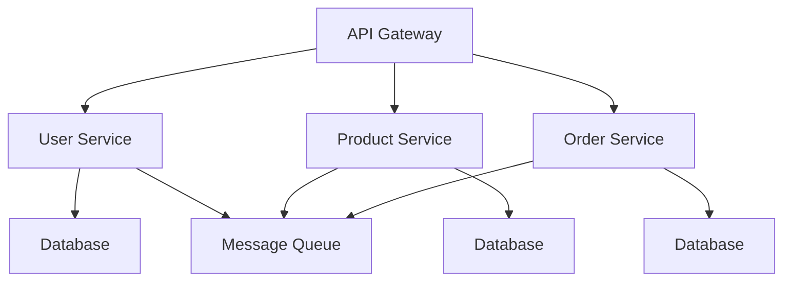

## 8.6 Microservices Architecture

Microservices Architecture is a modern approach to software development that structures applications as a collection of small, autonomous services. This architectural style has gained popularity due to its ability to enhance modularity, scalability, and maintainability of large-scale applications. In this section, we will delve into the principles of Microservices Architecture, its implementation in PHP, and explore various use cases and examples.

### Intent

The primary intent of Microservices Architecture is to decompose a monolithic application into smaller, independent services that can be developed, deployed, and scaled independently. This approach allows teams to work on different services simultaneously, leading to faster development cycles and more resilient applications.

### Key Concepts of Microservices Architecture

Before diving into the implementation details, let's explore some key concepts that underpin Microservices Architecture:

1. **Service Independence**: Each microservice is a self-contained unit that encapsulates a specific business capability. This independence allows services to be developed, deployed, and scaled independently.

2. **API Communication**: Microservices communicate with each other over APIs, typically using HTTP/REST or messaging protocols like AMQP or Kafka. This decoupling of services enables flexibility in technology choices and deployment strategies.

3. **Decentralized Data Management**: Each microservice manages its own data, often using a database that best suits its needs. This approach avoids the bottleneck of a single, centralized database and allows for more efficient data management.

4. **Continuous Deployment**: Microservices Architecture supports continuous deployment by enabling teams to deploy individual services without affecting the entire application. This capability facilitates rapid iterations and quick responses to changing business requirements.

5. **Resilience and Fault Tolerance**: Microservices are designed to handle failures gracefully. Techniques like circuit breakers, retries, and fallbacks are employed to ensure that the failure of one service does not bring down the entire system.

### Implementing Microservices in PHP

Implementing Microservices Architecture in PHP involves several steps, from designing the services to deploying them in a production environment. Let's explore these steps in detail:

#### Designing Microservices

1. **Identify Business Capabilities**: Start by identifying the core business capabilities that your application needs to support. Each capability can potentially be a separate microservice.

2. **Define Service Boundaries**: Clearly define the boundaries of each service. A service should encapsulate a specific business function and have a well-defined API for interaction with other services.

3. **Choose the Right Technology Stack**: While PHP is a great choice for building microservices, consider using other technologies where appropriate. For example, you might use Node.js for real-time services or Python for data processing.

4. **Design APIs**: Design RESTful APIs for communication between services. Ensure that APIs are versioned and well-documented to facilitate integration and maintenance.

5. **Data Management**: Decide on the data storage strategy for each service. Consider using different databases for different services based on their specific requirements.

#### Developing Microservices in PHP

1. **Use Frameworks and Libraries**: Leverage PHP frameworks like Laravel or Symfony to speed up development. These frameworks provide tools for building RESTful APIs, managing dependencies, and handling requests.

2. **Implement Service Logic**: Develop the core logic of each service. Ensure that services are stateless and can handle multiple requests simultaneously.

3. **Handle Asynchronous Communication**: Use message queues like RabbitMQ or Kafka for asynchronous communication between services. This approach helps decouple services and improves scalability.

4. **Implement Security**: Secure your services by implementing authentication and authorization mechanisms. Consider using OAuth2 or JWT for secure API access.

5. **Testing**: Write unit and integration tests for each service to ensure reliability. Use tools like PHPUnit for testing PHP code.

#### Deploying Microservices

1. **Containerization**: Use Docker to containerize your services. Containers provide a consistent environment for running services and simplify deployment.

2. **Orchestration**: Use orchestration tools like Kubernetes or Docker Swarm to manage the deployment, scaling, and operation of your microservices.

3. **Service Discovery**: Implement service discovery mechanisms to enable services to find and communicate with each other. Tools like Consul or Eureka can be used for this purpose.

4. **API Gateway**: Use an API gateway to manage and route requests to the appropriate services. An API gateway can also handle cross-cutting concerns like authentication, logging, and rate limiting.

5. **Monitoring and Logging**: Implement monitoring and logging solutions to track the performance and health of your services. Tools like Prometheus and Grafana can be used for monitoring, while ELK Stack can be used for centralized logging.

### Use Cases and Examples

Microservices Architecture is particularly well-suited for large-scale applications that require modularity and scalability. Here are some common use cases:

1. **E-commerce Platforms**: E-commerce platforms often have multiple components like product catalogs, user accounts, payment processing, and order management. Each of these components can be implemented as a separate microservice, allowing for independent scaling and development.

2. **Social Media Applications**: Social media applications require handling large volumes of user-generated content, notifications, and real-time interactions. Microservices can be used to manage different aspects of the application, such as user profiles, messaging, and content feeds.

3. **Financial Services**: Financial applications often require high levels of security and compliance. Microservices can be used to isolate sensitive functions like payment processing and fraud detection, ensuring that these services are secure and compliant.

4. **Healthcare Systems**: Healthcare systems need to manage patient records, appointments, billing, and more. Microservices can be used to separate these functions, allowing for more efficient data management and compliance with healthcare regulations.

### Code Example: Building a Simple Microservice in PHP

Let's build a simple microservice in PHP that manages a product catalog. We'll use the Laravel framework to speed up development.

```php
<?php

namespace App\Http\Controllers;

use App\Models\Product;
use Illuminate\Http\Request;

class ProductController extends Controller
{
    // Display a listing of products
    public function index()
    {
        return response()->json(Product::all());
    }

    // Store a newly created product
    public function store(Request $request)
    {
        $product = Product::create($request->all());
        return response()->json($product, 201);
    }

    // Display the specified product
    public function show($id)
    {
        $product = Product::find($id);
        if (!$product) {
            return response()->json(['message' => 'Product not found'], 404);
        }
        return response()->json($product);
    }

    // Update the specified product
    public function update(Request $request, $id)
    {
        $product = Product::find($id);
        if (!$product) {
            return response()->json(['message' => 'Product not found'], 404);
        }
        $product->update($request->all());
        return response()->json($product);
    }

    // Remove the specified product
    public function destroy($id)
    {
        $product = Product::find($id);
        if (!$product) {
            return response()->json(['message' => 'Product not found'], 404);
        }
        $product->delete();
        return response()->json(['message' => 'Product deleted']);
    }
}
```

### Visualizing Microservices Architecture

To better understand how microservices interact, let's visualize a typical microservices architecture using a Mermaid.js diagram.



**Diagram Description:** This diagram illustrates a microservices architecture with an API gateway routing requests to different services. Each service has its own database, and a message queue is used for asynchronous communication between services.

### PHP Unique Features for Microservices

PHP offers several unique features that make it suitable for building microservices:

1. **Simplicity and Ease of Use**: PHP's simplicity and ease of use make it an excellent choice for developing microservices quickly.

2. **Rich Ecosystem**: PHP has a rich ecosystem of frameworks and libraries, such as Laravel and Symfony, that provide tools for building RESTful APIs and managing dependencies.

3. **Community Support**: PHP has a large and active community that provides support and resources for developers building microservices.

4. **Compatibility**: PHP is compatible with a wide range of databases and messaging systems, making it easy to integrate with other technologies.

### Differences and Similarities with Other Patterns

Microservices Architecture is often compared to other architectural patterns, such as monolithic and service-oriented architectures. Here are some key differences and similarities:

- **Monolithic vs. Microservices**: Monolithic architectures bundle all components into a single application, while microservices decompose the application into independent services. Microservices offer greater flexibility and scalability but can be more complex to manage.

- **Service-Oriented Architecture (SOA) vs. Microservices**: Both SOA and microservices focus on service decomposition, but microservices emphasize smaller, more granular services and decentralized data management.

### Design Considerations

When implementing Microservices Architecture, consider the following:

- **Service Granularity**: Determine the appropriate level of granularity for your services. Too fine-grained services can lead to increased complexity, while too coarse-grained services can reduce flexibility.

- **Data Consistency**: Ensure data consistency across services, especially when using decentralized data management. Techniques like eventual consistency and distributed transactions can help manage data consistency.

- **Security**: Implement robust security measures to protect your services from unauthorized access and attacks. Consider using API gateways and secure communication protocols.

- **Monitoring and Logging**: Implement comprehensive monitoring and logging solutions to track the performance and health of your services. This capability is crucial for identifying and resolving issues quickly.

### Try It Yourself

Experiment with the provided code example by adding new features or modifying existing ones. For instance, you could:

- Add authentication to the product service using Laravel's built-in authentication features.
- Implement a new service for managing product categories and integrate it with the product service.
- Use a message queue to handle asynchronous tasks, such as sending notifications when a new product is added.

### Knowledge Check

- What are the key benefits of using Microservices Architecture?
- How do microservices communicate with each other?
- What are some common use cases for Microservices Architecture?
- How can you ensure data consistency across microservices?
- What tools can be used for deploying and managing microservices?

### Embrace the Journey

Remember, transitioning to Microservices Architecture is a journey. It requires careful planning, design, and implementation. As you progress, you'll gain valuable insights into building scalable and resilient applications. Keep experimenting, stay curious, and enjoy the journey!

## Quiz: Microservices Architecture



### What is the primary intent of Microservices Architecture?

- [x] To decompose a monolithic application into smaller, independent services
- [ ] To centralize all application logic into a single service
- [ ] To eliminate the need for APIs
- [ ] To use a single database for all services

> **Explanation:** The primary intent of Microservices Architecture is to decompose a monolithic application into smaller, independent services that can be developed, deployed, and scaled independently.

### How do microservices typically communicate with each other?

- [x] Over APIs
- [ ] Through shared memory
- [ ] Using direct database connections
- [ ] Via file system

> **Explanation:** Microservices typically communicate with each other over APIs, using protocols like HTTP/REST or messaging systems.

### Which of the following is a common use case for Microservices Architecture?

- [x] Large-scale applications requiring modularity and scalability
- [ ] Small, single-purpose applications
- [ ] Applications with no need for scalability
- [ ] Applications that do not require independent deployment

> **Explanation:** Microservices Architecture is well-suited for large-scale applications that require modularity and scalability.

### What is a key benefit of using an API gateway in Microservices Architecture?

- [x] It manages and routes requests to the appropriate services
- [ ] It eliminates the need for service discovery
- [ ] It centralizes all business logic
- [ ] It replaces the need for individual service APIs

> **Explanation:** An API gateway manages and routes requests to the appropriate services, handling cross-cutting concerns like authentication and logging.

### Which tool can be used for containerizing microservices?

- [x] Docker
- [ ] PHP
- [ ] MySQL
- [ ] Apache

> **Explanation:** Docker is a tool used for containerizing microservices, providing a consistent environment for running services.

### What is a common challenge when implementing Microservices Architecture?

- [x] Managing data consistency across services
- [ ] Centralizing all application logic
- [ ] Eliminating the need for APIs
- [ ] Using a single database for all services

> **Explanation:** Managing data consistency across services is a common challenge in Microservices Architecture, especially with decentralized data management.

### Which PHP framework is commonly used for building microservices?

- [x] Laravel
- [ ] WordPress
- [ ] Joomla
- [ ] Drupal

> **Explanation:** Laravel is a PHP framework commonly used for building microservices, providing tools for RESTful APIs and dependency management.

### What is the role of service discovery in Microservices Architecture?

- [x] To enable services to find and communicate with each other
- [ ] To centralize all service logic
- [ ] To eliminate the need for APIs
- [ ] To replace the need for an API gateway

> **Explanation:** Service discovery enables services to find and communicate with each other, facilitating dynamic service interaction.

### What is a key feature of Microservices Architecture that supports continuous deployment?

- [x] Independent deployment of services
- [ ] Centralized deployment of all services
- [ ] Elimination of APIs
- [ ] Use of a single database

> **Explanation:** Microservices Architecture supports continuous deployment by enabling the independent deployment of services without affecting the entire application.

### True or False: Microservices Architecture is only suitable for large organizations.

- [ ] True
- [x] False

> **Explanation:** Microservices Architecture is not limited to large organizations; it can be beneficial for any organization that requires modularity, scalability, and independent service deployment.


