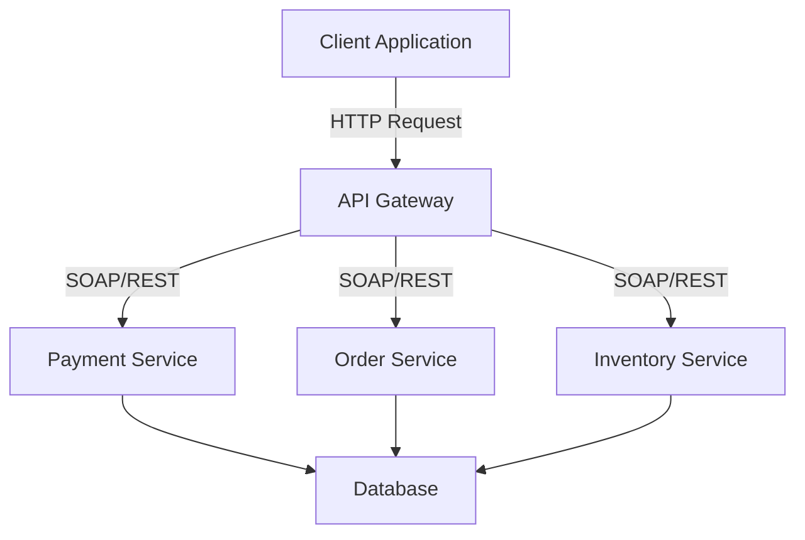

## 8.7 Service-Oriented Architecture (SOA)

Service-Oriented Architecture (SOA) is a design pattern that organizes applications into a collection of services. These services are designed to be reusable, loosely coupled, and interoperable, allowing for seamless integration across different systems and platforms. In this section, we will explore the principles of SOA, how to implement it in PHP, and the benefits it brings to enterprise-level applications.

### Intent

The primary intent of SOA is to create a flexible architecture that promotes reusability and integration. By defining services with standardized interfaces, SOA enables different parts of an application, or even different applications, to communicate and work together efficiently.

### Key Concepts of SOA

Before diving into the implementation details, let's explore some key concepts of SOA:

1. **Service**: A service is a self-contained unit of functionality that performs a specific task. It is designed to be reusable and can be accessed over a network.

2. **Loose Coupling**: Services in SOA are loosely coupled, meaning that changes in one service do not directly affect others. This is achieved by using standardized interfaces and communication protocols.

3. **Interoperability**: SOA promotes interoperability by allowing services to communicate using common protocols such as SOAP (Simple Object Access Protocol) or REST (Representational State Transfer).

4. **Reusability**: Services are designed to be reusable across different applications and contexts, reducing redundancy and improving efficiency.

5. **Discoverability**: Services should be easily discoverable and accessible, often through a service registry or directory.

### Implementing SOA in PHP

Implementing SOA in PHP involves defining services, facilitating communication between them, and ensuring they are reusable and interoperable. Let's explore these steps in detail.

#### Defining Services with Standardized Interfaces

To define a service in PHP, you need to create a standardized interface that specifies the operations the service can perform. This interface acts as a contract between the service provider and the consumer.

```php
interface PaymentServiceInterface {
    public function processPayment(float $amount, string $currency): bool;
    public function refundPayment(int $transactionId): bool;
}
```

In this example, we define a `PaymentServiceInterface` with two methods: `processPayment` and `refundPayment`. Any service implementing this interface must provide concrete implementations for these methods.

#### Facilitating Communication Between Services

Communication between services in SOA can be achieved using various protocols. The two most common protocols are SOAP and REST.

##### SOAP

SOAP is a protocol that uses XML to encode messages. It is highly standardized and supports complex operations and security features.

```php
// Example of a SOAP client in PHP
$client = new SoapClient("http://example.com/paymentService?wsdl");

try {
    $result = $client->processPayment(['amount' => 100.0, 'currency' => 'USD']);
    if ($result) {
        echo "Payment processed successfully.";
    }
} catch (SoapFault $fault) {
    echo "Error: {$fault->faultstring}";
}
```

In this example, we create a SOAP client to communicate with a payment service. The `processPayment` method is called with the required parameters, and the result is handled accordingly.

##### REST

REST is an architectural style that uses HTTP methods to perform operations on resources. It is simpler and more lightweight compared to SOAP.

```php
// Example of a REST client in PHP using cURL
$ch = curl_init("http://example.com/api/payments");
curl_setopt($ch, CURLOPT_POST, true);
curl_setopt($ch, CURLOPT_POSTFIELDS, json_encode(['amount' => 100.0, 'currency' => 'USD']));
curl_setopt($ch, CURLOPT_RETURNTRANSFER, true);
curl_setopt($ch, CURLOPT_HTTPHEADER, ['Content-Type: application/json']);

$response = curl_exec($ch);
curl_close($ch);

if ($response) {
    echo "Payment processed successfully.";
} else {
    echo "Error processing payment.";
}
```

In this example, we use cURL to send a POST request to a RESTful payment service. The request payload is encoded in JSON, and the response is handled accordingly.

#### Use Cases and Examples

SOA is particularly beneficial for enterprise-level applications that require integration across different systems. Here are some common use cases:

1. **Enterprise Application Integration**: SOA allows different applications within an enterprise to communicate and share data seamlessly. For example, a CRM system can integrate with an ERP system to synchronize customer data.

2. **Microservices Architecture**: SOA principles are foundational to microservices architecture, where applications are composed of small, independent services that communicate over a network.

3. **Cloud-Based Services**: SOA enables the creation of cloud-based services that can be accessed and consumed by different clients, such as web applications, mobile apps, and IoT devices.

### Visualizing SOA

To better understand the structure and flow of SOA, let's visualize a simple SOA architecture using a Mermaid.js diagram.



**Diagram Description:** This diagram represents a simple SOA architecture where a client application communicates with an API Gateway. The API Gateway routes requests to different services (Payment, Order, Inventory), which interact with a shared database.

### Design Considerations

When implementing SOA in PHP, consider the following design considerations:

- **Service Granularity**: Determine the appropriate level of granularity for your services. Too fine-grained services can lead to increased complexity, while too coarse-grained services may limit reusability.

- **Security**: Implement security measures such as authentication, authorization, and encryption to protect your services and data.

- **Performance**: Optimize the performance of your services by minimizing network latency and efficiently managing resources.

- **Scalability**: Design your services to be scalable, allowing them to handle increased load and demand.

### PHP Unique Features

PHP offers several unique features that make it suitable for implementing SOA:

- **Built-in Support for Web Services**: PHP provides built-in support for creating and consuming web services using SOAP and REST.

- **Flexibility and Ease of Use**: PHP's flexibility and ease of use make it an ideal choice for rapidly developing and deploying services.

- **Rich Ecosystem**: PHP has a rich ecosystem of libraries and frameworks that support SOA, such as Symfony and Laravel.

### Differences and Similarities

SOA is often compared to microservices architecture. While both share similar principles, there are key differences:

- **Scope**: SOA is typically used for enterprise-level integration, while microservices focus on building small, independent services.

- **Communication**: SOA often uses enterprise-level protocols like SOAP, while microservices prefer lightweight protocols like REST.

- **Deployment**: SOA services are often deployed on centralized servers, while microservices are deployed independently.

### Try It Yourself

To get hands-on experience with SOA in PHP, try modifying the code examples provided. For instance, create a new service that interacts with the existing services, or experiment with different communication protocols.

### Knowledge Check

- What is the primary intent of SOA?
- How do SOAP and REST differ in terms of communication?
- What are some common use cases for SOA?

### Embrace the Journey

Remember, implementing SOA is just the beginning of building scalable and maintainable applications. As you progress, you'll discover more advanced techniques and patterns. Keep experimenting, stay curious, and enjoy the journey!

## Quiz: Service-Oriented Architecture (SOA)



### What is the primary intent of Service-Oriented Architecture (SOA)?

- [x] To organize applications into services for reusability and integration
- [ ] To create monolithic applications
- [ ] To replace all existing architectures
- [ ] To focus solely on frontend development

> **Explanation:** The primary intent of SOA is to organize applications into services, promoting reusability and integration.

### Which protocol is commonly used in SOA for complex operations and security features?

- [x] SOAP
- [ ] HTTP
- [ ] FTP
- [ ] SMTP

> **Explanation:** SOAP is commonly used in SOA for complex operations and security features due to its standardized XML-based protocol.

### What is a key characteristic of services in SOA?

- [x] Loose coupling
- [ ] Tight integration
- [ ] Monolithic design
- [ ] Single point of failure

> **Explanation:** A key characteristic of services in SOA is loose coupling, allowing changes in one service without directly affecting others.

### What is the role of an API Gateway in SOA?

- [x] To route requests to different services
- [ ] To store data
- [ ] To manage user authentication
- [ ] To handle frontend rendering

> **Explanation:** An API Gateway routes requests to different services, acting as an intermediary between clients and services.

### How does REST differ from SOAP in terms of communication?

- [x] REST uses HTTP methods and is lightweight
- [ ] REST uses XML and is complex
- [x] SOAP uses XML and is standardized
- [ ] SOAP uses HTTP methods and is lightweight

> **Explanation:** REST uses HTTP methods and is lightweight, while SOAP uses XML and is standardized for complex operations.

### What is a common use case for SOA?

- [x] Enterprise application integration
- [ ] Building static websites
- [ ] Developing mobile games
- [ ] Creating desktop applications

> **Explanation:** A common use case for SOA is enterprise application integration, allowing different systems to communicate and share data.

### Which PHP feature supports the creation of web services?

- [x] Built-in support for SOAP and REST
- [ ] Built-in support for FTP
- [ ] Built-in support for SMTP
- [ ] Built-in support for SSH

> **Explanation:** PHP provides built-in support for creating and consuming web services using SOAP and REST.

### What is a benefit of using SOA?

- [x] Reusability of services
- [ ] Increased complexity
- [ ] Limited scalability
- [ ] Reduced security

> **Explanation:** A benefit of using SOA is the reusability of services, allowing them to be used across different applications.

### What should be considered when designing services in SOA?

- [x] Service granularity
- [ ] Monolithic design
- [ ] Single point of failure
- [ ] Lack of security

> **Explanation:** When designing services in SOA, consider service granularity to balance complexity and reusability.

### True or False: SOA and microservices architecture are identical.

- [ ] True
- [x] False

> **Explanation:** SOA and microservices architecture share similar principles but differ in scope, communication, and deployment.


