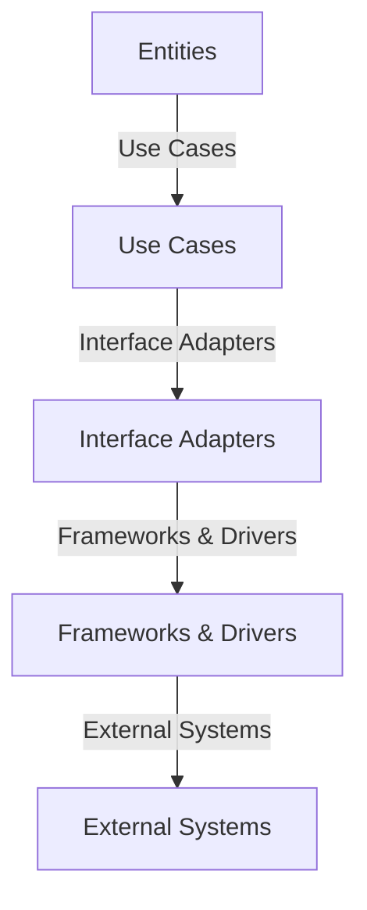

## 8.8 Clean Architecture

Clean Architecture is a software design philosophy that emphasizes the separation of concerns, ensuring that each layer of an application has clear responsibilities and dependencies. This approach is particularly beneficial for PHP applications that require high maintainability and testability. In this section, we will delve into the principles of Clean Architecture, demonstrate how to implement it in PHP, and provide practical examples to solidify your understanding.

### Intent of Clean Architecture

The primary intent of Clean Architecture is to create systems that are:

- **Independent of Frameworks:** The architecture does not depend on the existence of some library of feature-laden software. This allows you to use such frameworks as tools, rather than having your system built around them.
- **Testable:** The business rules can be tested without the user interface, database, web server, or any other external element.
- **Independent of UI:** The UI can change easily, without changing the rest of the system. A web UI could be replaced with a console UI, for example, without changing the business rules.
- **Independent of Database:** You can swap out Oracle or SQL Server for MongoDB, BigTable, CouchDB, or something else. Your business rules are not bound to the database.
- **Independent of any external agency:** In fact, your business rules simply don’t know anything at all about the outside world.

### Implementing Clean Architecture in PHP

Implementing Clean Architecture in PHP involves organizing your code into distinct layers, each with specific responsibilities. The typical layers include:

1. **Entities:** These are the business objects of the application. They encapsulate the most general and high-level rules. An entity can be an object with methods, or it can be a set of data structures and functions.

2. **Use Cases:** This layer contains application-specific business rules. It orchestrates the flow of data to and from the entities, and it directs those entities to use their enterprise-wide business rules to achieve the goals of the use case.

3. **Interface Adapters:** This layer is a set of adapters that convert data from the format most convenient for the use cases and entities, to the format most convenient for some external agency such as the Database or the Web.

4. **Frameworks and Drivers:** This is where all the details go. The web is a detail. The database is a detail. We keep these things on the outside where they can do little harm.

#### Dividing Code into Layers

Let's explore how to divide your PHP code into these layers:

- **Entities Layer:**
  - Define your core business logic and rules.
  - Ensure that this layer is independent of any other layer.
  
```php
<?php

class User {
    private $id;
    private $name;
    private $email;

    public function __construct($id, $name, $email) {
        $this->id = $id;
        $this->name = $name;
        $this->email = $email;
    }

    public function changeEmail($newEmail) {
        // Business rule: Email must be valid
        if (!filter_var($newEmail, FILTER_VALIDATE_EMAIL)) {
            throw new InvalidArgumentException("Invalid email address.");
        }
        $this->email = $newEmail;
    }

    // Other business logic methods...
}
```

- **Use Cases Layer:**
  - Implement application-specific logic.
  - Orchestrate interactions between entities.
  
```php
<?php

class ChangeUserEmail {
    private $userRepository;

    public function __construct(UserRepository $userRepository) {
        $this->userRepository = $userRepository;
    }

    public function execute($userId, $newEmail) {
        $user = $this->userRepository->findById($userId);
        $user->changeEmail($newEmail);
        $this->userRepository->save($user);
    }
}
```

- **Interface Adapters Layer:**
  - Convert data formats between use cases and external systems.
  
```php
<?php

class UserController {
    private $changeUserEmail;

    public function __construct(ChangeUserEmail $changeUserEmail) {
        $this->changeUserEmail = $changeUserEmail;
    }

    public function changeEmailAction($request) {
        $userId = $request->get('user_id');
        $newEmail = $request->get('new_email');
        $this->changeUserEmail->execute($userId, $newEmail);
        // Return response to the client
    }
}
```

- **Frameworks and Drivers Layer:**
  - Handle framework-specific code and external dependencies.
  
```php
<?php

class MySQLUserRepository implements UserRepository {
    public function findById($userId) {
        // Fetch user from MySQL database
    }

    public function save(User $user) {
        // Save user to MySQL database
    }
}
```

### Ensuring Core Logic Independence

One of the key principles of Clean Architecture is ensuring that your core logic is not dependent on external layers. This is achieved by:

- **Dependency Inversion:** High-level modules should not depend on low-level modules. Both should depend on abstractions.
- **Interfaces:** Use interfaces to define contracts between layers, allowing for flexibility and decoupling.

### Use Cases and Examples

Clean Architecture is particularly useful in applications that require high maintainability and testability. Here are some scenarios where Clean Architecture can be beneficial:

- **Enterprise Applications:** Large-scale applications with complex business rules.
- **Microservices:** Applications that need to be easily scalable and maintainable.
- **Test-Driven Development (TDD):** Applications where testing is a priority.

#### Example: Building a Blog Platform

Let's consider a simple blog platform to illustrate Clean Architecture in PHP.

- **Entities:** Define the core business logic for posts and comments.
  
```php
<?php

class Post {
    private $id;
    private $title;
    private $content;
    private $comments = [];

    public function __construct($id, $title, $content) {
        $this->id = $id;
        $this->title = $title;
        $this->content = $content;
    }

    public function addComment(Comment $comment) {
        $this->comments[] = $comment;
    }

    // Other business logic methods...
}
```

- **Use Cases:** Implement application-specific logic for managing posts and comments.
  
```php
<?php

class CreatePost {
    private $postRepository;

    public function __construct(PostRepository $postRepository) {
        $this->postRepository = $postRepository;
    }

    public function execute($title, $content) {
        $post = new Post(null, $title, $content);
        $this->postRepository->save($post);
    }
}
```

- **Interface Adapters:** Convert data formats between use cases and external systems.
  
```php
<?php

class PostController {
    private $createPost;

    public function __construct(CreatePost $createPost) {
        $this->createPost = $createPost;
    }

    public function createAction($request) {
        $title = $request->get('title');
        $content = $request->get('content');
        $this->createPost->execute($title, $content);
        // Return response to the client
    }
}
```

- **Frameworks and Drivers:** Handle framework-specific code and external dependencies.
  
```php
<?php

class MySQLPostRepository implements PostRepository {
    public function save(Post $post) {
        // Save post to MySQL database
    }
}
```

### Visualizing Clean Architecture

To better understand the structure of Clean Architecture, let's visualize it using a diagram. This diagram represents the layers and their dependencies.



**Diagram Description:** This diagram illustrates the flow of dependencies in Clean Architecture. The core entities are at the center, surrounded by use cases, interface adapters, and finally, frameworks and drivers. External systems interact with the outermost layer.

### PHP Unique Features

PHP offers several unique features that can enhance the implementation of Clean Architecture:

- **Traits:** Use traits to share methods across classes without inheritance.
- **Anonymous Classes:** Create lightweight, one-off classes for specific tasks.
- **Namespaces:** Organize code into logical groups, avoiding naming conflicts.
- **Composer:** Manage dependencies and autoload classes efficiently.

### Design Considerations

When implementing Clean Architecture in PHP, consider the following:

- **Complexity:** Clean Architecture can introduce complexity with multiple layers. Ensure that the benefits outweigh the complexity for your specific application.
- **Performance:** While Clean Architecture promotes separation of concerns, it may introduce performance overhead. Optimize critical paths and use caching where necessary.
- **Flexibility:** Clean Architecture provides flexibility in swapping out components. Ensure that interfaces are well-defined and stable.

### Differences and Similarities

Clean Architecture is often compared to other architectural patterns, such as:

- **Layered Architecture:** Both emphasize separation of concerns, but Clean Architecture focuses more on dependency inversion.
- **Hexagonal Architecture:** Similar in promoting independence from external systems, but with different terminology and focus areas.

### Try It Yourself

To solidify your understanding of Clean Architecture, try modifying the code examples provided:

- **Add a new feature:** Implement a feature to delete a post, ensuring that it follows the principles of Clean Architecture.
- **Swap out a component:** Replace the MySQL repository with a different database, such as MongoDB, and observe how the architecture supports this change.

### Knowledge Check

- **Question:** What is the primary intent of Clean Architecture?
- **Exercise:** Implement a simple to-do list application using Clean Architecture principles.

### Embrace the Journey

Remember, Clean Architecture is a journey, not a destination. As you continue to develop PHP applications, keep experimenting with different architectural patterns, stay curious, and enjoy the process of creating maintainable and testable software.

## Quiz: Clean Architecture



### What is the primary intent of Clean Architecture?

- [x] To create systems that are independent of frameworks and external dependencies.
- [ ] To focus solely on database optimization.
- [ ] To prioritize user interface design over business logic.
- [ ] To eliminate the need for testing.

> **Explanation:** Clean Architecture aims to create systems that are independent of frameworks, databases, and other external dependencies, ensuring maintainability and testability.

### Which layer in Clean Architecture contains the core business logic?

- [x] Entities
- [ ] Use Cases
- [ ] Interface Adapters
- [ ] Frameworks and Drivers

> **Explanation:** The Entities layer contains the core business logic and rules, independent of other layers.

### What is the role of the Use Cases layer in Clean Architecture?

- [x] To implement application-specific business rules and orchestrate interactions between entities.
- [ ] To handle database operations.
- [ ] To manage user interface components.
- [ ] To convert data formats between systems.

> **Explanation:** The Use Cases layer implements application-specific business rules and orchestrates interactions between entities.

### How does Clean Architecture ensure core logic independence?

- [x] By using dependency inversion and interfaces.
- [ ] By tightly coupling all components.
- [ ] By focusing on user interface design.
- [ ] By eliminating the need for external systems.

> **Explanation:** Clean Architecture uses dependency inversion and interfaces to ensure core logic independence from external systems.

### What is a key benefit of Clean Architecture?

- [x] High maintainability and testability.
- [ ] Faster user interface development.
- [ ] Reduced need for documentation.
- [ ] Simplified database management.

> **Explanation:** Clean Architecture provides high maintainability and testability by separating concerns and ensuring independence from external systems.

### Which PHP feature can enhance Clean Architecture implementation?

- [x] Traits
- [ ] Global Variables
- [ ] Inline SQL Queries
- [ ] Hardcoded Values

> **Explanation:** Traits in PHP can be used to share methods across classes, enhancing the implementation of Clean Architecture.

### What is a potential drawback of Clean Architecture?

- [x] Increased complexity with multiple layers.
- [ ] Lack of flexibility in component swapping.
- [ ] Difficulty in testing.
- [ ] Limited scalability.

> **Explanation:** Clean Architecture can introduce complexity with its multiple layers, which may not be suitable for all applications.

### How can Clean Architecture be visualized?

- [x] Using a diagram with layers and dependencies.
- [ ] By listing all classes in a single file.
- [ ] By focusing on database schema design.
- [ ] By emphasizing user interface components.

> **Explanation:** Clean Architecture can be visualized using a diagram that illustrates the layers and their dependencies.

### What is a common misconception about Clean Architecture?

- [x] That it eliminates the need for testing.
- [ ] That it promotes separation of concerns.
- [ ] That it supports dependency inversion.
- [ ] That it allows for component swapping.

> **Explanation:** A common misconception is that Clean Architecture eliminates the need for testing, whereas it actually promotes testability.

### True or False: Clean Architecture is only suitable for large-scale applications.

- [x] False
- [ ] True

> **Explanation:** Clean Architecture is suitable for applications of various sizes, not just large-scale ones, as it promotes maintainability and testability.


