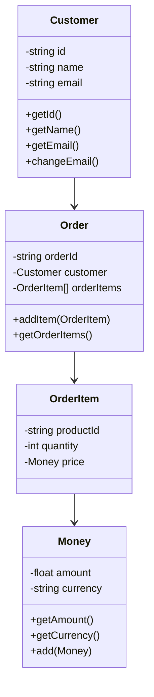

## 8.9 Domain-Driven Design (DDD) in PHP

Domain-Driven Design (DDD) is an approach to software development that emphasizes collaboration between technical and domain experts to create a model that accurately reflects the business domain. In this section, we will explore how to implement DDD in PHP, focusing on its core principles and components, such as entities, value objects, aggregates, and repositories. We will also provide practical examples and code snippets to illustrate these concepts.

### Intent of Domain-Driven Design

The primary intent of DDD is to focus on the core domain and its logic, building a model that reflects real-world business rules. This approach helps in managing complex domains with intricate business logic by ensuring that the software design is closely aligned with the business needs.

### Implementing DDD in PHP

Implementing DDD in PHP involves several key steps and components. Let's explore these in detail:

#### Collaborating with Domain Experts

The first step in DDD is to collaborate with domain experts to gain a deep understanding of the business domain. This collaboration helps in identifying the core domain, subdomains, and the ubiquitous language that will be used throughout the project.

- **Ubiquitous Language:** A common language shared by developers and domain experts, ensuring that everyone has a clear understanding of the domain concepts.

#### Defining Entities

Entities are objects that have a distinct identity that runs through time and different states. They are mutable and are often used to represent real-world objects.

```php
<?php

class Customer
{
    private string $id;
    private string $name;
    private string $email;

    public function __construct(string $id, string $name, string $email)
    {
        $this->id = $id;
        $this->name = $name;
        $this->email = $email;
    }

    public function getId(): string
    {
        return $this->id;
    }

    public function getName(): string
    {
        return $this->name;
    }

    public function getEmail(): string
    {
        return $this->email;
    }

    public function changeEmail(string $newEmail): void
    {
        $this->email = $newEmail;
    }
}
```

In this example, `Customer` is an entity with a unique identifier (`id`) and mutable properties (`name` and `email`).

#### Defining Value Objects

Value objects are immutable and represent descriptive aspects of the domain with no conceptual identity. They are defined by their attributes.

```php
<?php

class Money
{
    private float $amount;
    private string $currency;

    public function __construct(float $amount, string $currency)
    {
        $this->amount = $amount;
        $this->currency = $currency;
    }

    public function getAmount(): float
    {
        return $this->amount;
    }

    public function getCurrency(): string
    {
        return $this->currency;
    }

    public function add(Money $money): Money
    {
        if ($this->currency !== $money->getCurrency()) {
            throw new \InvalidArgumentException('Currencies must match.');
        }

        return new Money($this->amount + $money->getAmount(), $this->currency);
    }
}
```

The `Money` class is a value object that represents a monetary value with an amount and a currency. It is immutable, meaning its state cannot change after it is created.

#### Defining Aggregates

Aggregates are clusters of domain objects that can be treated as a single unit. Each aggregate has a root entity, known as the aggregate root, which is responsible for maintaining the consistency of the aggregate.

```php
<?php

class Order
{
    private string $orderId;
    private Customer $customer;
    private array $orderItems = [];

    public function __construct(string $orderId, Customer $customer)
    {
        $this->orderId = $orderId;
        $this->customer = $customer;
    }

    public function addItem(OrderItem $item): void
    {
        $this->orderItems[] = $item;
    }

    public function getOrderItems(): array
    {
        return $this->orderItems;
    }
}
```

In this example, `Order` is an aggregate with `Customer` as a part of it. The `Order` entity is the aggregate root, and it manages the `OrderItem` entities.

#### Defining Repositories

Repositories are responsible for retrieving and storing aggregates. They provide an abstraction over the data access layer, allowing the domain model to remain independent of the underlying data storage.

```php
<?php

interface OrderRepository
{
    public function save(Order $order): void;
    public function findById(string $orderId): ?Order;
}

class InMemoryOrderRepository implements OrderRepository
{
    private array $orders = [];

    public function save(Order $order): void
    {
        $this->orders[$order->getOrderId()] = $order;
    }

    public function findById(string $orderId): ?Order
    {
        return $this->orders[$orderId] ?? null;
    }
}
```

The `OrderRepository` interface defines the contract for storing and retrieving `Order` aggregates. The `InMemoryOrderRepository` is a simple implementation that stores orders in memory.

### Use Cases and Examples

Domain-Driven Design is particularly useful in complex domains with intricate business logic. Here are some scenarios where DDD can be applied effectively:

- **E-commerce Platforms:** Managing orders, customers, and inventory with complex business rules.
- **Banking Systems:** Handling transactions, accounts, and customer data with strict consistency requirements.
- **Healthcare Systems:** Managing patient records, appointments, and treatments with regulatory compliance.

### Visualizing Domain-Driven Design

To better understand the relationships between entities, value objects, and aggregates, let's visualize a simple e-commerce domain using a class diagram.



This diagram illustrates the relationships between the `Customer`, `Order`, `OrderItem`, and `Money` classes in our e-commerce domain.

### PHP Unique Features in DDD

PHP offers several unique features that can enhance the implementation of DDD:

- **Traits:** PHP traits can be used to share common behavior across multiple classes, promoting code reuse within the domain model.
- **Anonymous Classes:** Useful for creating lightweight, throwaway objects that can be used in testing or as temporary implementations of interfaces.
- **Type Declarations:** PHP's type declarations for function arguments and return values help enforce domain invariants and improve code readability.

### Differences and Similarities with Other Patterns

DDD shares some similarities with other architectural patterns, such as:

- **Hexagonal Architecture:** Both emphasize the separation of concerns and the independence of the domain model from external systems.
- **CQRS (Command Query Responsibility Segregation):** Often used in conjunction with DDD to separate read and write operations, improving scalability and performance.

However, DDD is distinct in its focus on the domain model and its collaboration with domain experts to create a shared understanding of the business domain.

### Design Considerations

When implementing DDD, consider the following:

- **Bounded Contexts:** Define clear boundaries for each subdomain to avoid ambiguity and ensure consistency within the domain model.
- **Event-Driven Architecture:** Consider using events to decouple different parts of the system and improve scalability.
- **Continuous Collaboration:** Maintain ongoing collaboration with domain experts to ensure the domain model remains aligned with business needs.

### Try It Yourself

To deepen your understanding of DDD in PHP, try modifying the code examples provided:

- **Add New Entities:** Introduce new entities, such as `Product` or `Category`, and integrate them into the existing domain model.
- **Implement New Repositories:** Create a repository for `Customer` entities and implement different storage mechanisms, such as a database or a file system.
- **Experiment with Value Objects:** Create additional value objects, such as `Address` or `PhoneNumber`, and use them within your entities.

### Knowledge Check

- **What is the primary intent of Domain-Driven Design?**
- **How do entities differ from value objects in DDD?**
- **What role do repositories play in a DDD architecture?**
- **How can PHP traits be used in a DDD implementation?**
- **What are some common use cases for DDD?**

### Embrace the Journey

Remember, mastering Domain-Driven Design is a journey. As you continue to explore and implement DDD in your PHP projects, you'll gain a deeper understanding of your domain and create more robust and maintainable software. Keep experimenting, stay curious, and enjoy the journey!

## Quiz: Domain-Driven Design (DDD) in PHP



### What is the primary intent of Domain-Driven Design (DDD)?

- [x] To focus on the core domain and its logic, building a model that reflects real-world business rules.
- [ ] To optimize database queries for performance.
- [ ] To separate the user interface from the business logic.
- [ ] To implement microservices architecture.

> **Explanation:** The primary intent of DDD is to focus on the core domain and its logic, building a model that reflects real-world business rules.

### Which of the following is a characteristic of an entity in DDD?

- [x] It has a distinct identity.
- [ ] It is immutable.
- [ ] It is defined by its attributes.
- [ ] It cannot change state.

> **Explanation:** An entity in DDD has a distinct identity that runs through time and different states.

### What is a value object in DDD?

- [x] An immutable object that represents descriptive aspects of the domain.
- [ ] An object with a unique identity.
- [ ] A mutable object that changes state.
- [ ] An object used to store data in a database.

> **Explanation:** A value object in DDD is immutable and represents descriptive aspects of the domain with no conceptual identity.

### What is the role of a repository in DDD?

- [x] To provide an abstraction over the data access layer.
- [ ] To manage the user interface components.
- [ ] To handle HTTP requests and responses.
- [ ] To perform data validation.

> **Explanation:** A repository in DDD provides an abstraction over the data access layer, allowing the domain model to remain independent of the underlying data storage.

### How can PHP traits be used in a DDD implementation?

- [x] To share common behavior across multiple classes.
- [ ] To define unique identities for entities.
- [ ] To manage database connections.
- [ ] To handle HTTP requests.

> **Explanation:** PHP traits can be used to share common behavior across multiple classes, promoting code reuse within the domain model.

### Which of the following is a common use case for DDD?

- [x] E-commerce platforms with complex business rules.
- [ ] Simple CRUD applications.
- [ ] Static websites.
- [ ] Command-line utilities.

> **Explanation:** DDD is particularly useful in complex domains with intricate business logic, such as e-commerce platforms.

### What is a bounded context in DDD?

- [x] A defined boundary within which a particular model is applicable.
- [ ] A database schema.
- [ ] A user interface component.
- [ ] A network protocol.

> **Explanation:** A bounded context in DDD is a defined boundary within which a particular model is applicable, ensuring consistency within the domain model.

### What is the relationship between DDD and CQRS?

- [x] CQRS is often used in conjunction with DDD to separate read and write operations.
- [ ] DDD is a subset of CQRS.
- [ ] CQRS replaces DDD in modern architectures.
- [ ] DDD and CQRS are unrelated concepts.

> **Explanation:** CQRS (Command Query Responsibility Segregation) is often used in conjunction with DDD to separate read and write operations, improving scalability and performance.

### What is the purpose of the ubiquitous language in DDD?

- [x] To ensure a common understanding of domain concepts among all stakeholders.
- [ ] To optimize database queries.
- [ ] To define user interface components.
- [ ] To manage network protocols.

> **Explanation:** The ubiquitous language in DDD ensures a common understanding of domain concepts among all stakeholders, facilitating collaboration and communication.

### True or False: In DDD, aggregates are clusters of domain objects that can be treated as a single unit.

- [x] True
- [ ] False

> **Explanation:** In DDD, aggregates are clusters of domain objects that can be treated as a single unit, with a root entity responsible for maintaining consistency.


