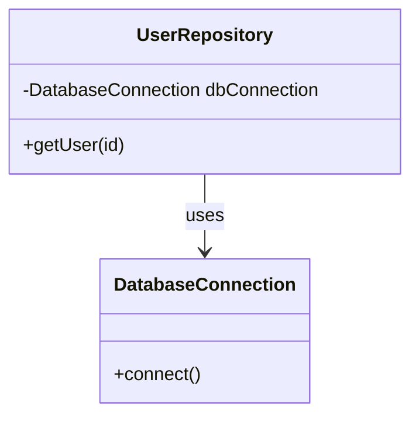

## 9.1 Understanding Dependency Injection

Dependency Injection (DI) is a fundamental design pattern in software development that promotes loose coupling and enhances the testability and maintainability of code. In PHP, DI is a powerful tool that allows developers to manage dependencies efficiently, leading to cleaner and more modular codebases.

### What is Dependency Injection?

Dependency Injection is a design pattern where an object receives its dependencies from an external source rather than creating them internally. This approach decouples the creation of an object from its usage, allowing for more flexible and testable code.

#### Key Concepts

- **Dependency**: An object that another object requires to function.
- **Injection**: The process of providing an object with its dependencies.
- **Inversion of Control (IoC)**: A broader principle where the control of object creation and management is inverted from the object itself to an external entity.

### Benefits of Dependency Injection

1. **Loose Coupling**: By decoupling dependencies from their consumers, DI promotes a more modular architecture where components can be easily swapped or modified without affecting others.

2. **Enhanced Testability**: DI facilitates unit testing by allowing developers to inject mock dependencies, making it easier to isolate and test individual components.

3. **Improved Maintainability**: With dependencies managed externally, code becomes easier to maintain and extend, as changes to dependencies do not require modifications to the dependent code.

4. **Reusability**: Components designed with DI in mind are more reusable, as they do not rely on specific implementations of their dependencies.

### Implementing Dependency Injection in PHP

Let's explore how to implement Dependency Injection in PHP through various methods, including constructor injection, setter injection, and interface injection.

#### Constructor Injection

Constructor injection is the most common form of DI, where dependencies are provided through a class's constructor.

```php
<?php

class DatabaseConnection {
    private $host;
    private $user;
    private $password;

    public function __construct($host, $user, $password) {
        $this->host = $host;
        $this->user = $user;
        $this->password = $password;
    }

    public function connect() {
        // Connection logic here
    }
}

class UserRepository {
    private $dbConnection;

    public function __construct(DatabaseConnection $dbConnection) {
        $this->dbConnection = $dbConnection;
    }

    public function getUser($id) {
        // Use $this->dbConnection to fetch user
    }
}

// Usage
$dbConnection = new DatabaseConnection('localhost', 'root', 'password');
$userRepo = new UserRepository($dbConnection);
```

**Explanation:**

- The `UserRepository` class depends on `DatabaseConnection`.
- The dependency is injected via the constructor, promoting loose coupling.

#### Setter Injection

Setter injection involves providing dependencies through setter methods, allowing for more flexibility in changing dependencies after object creation.

```php
<?php

class Logger {
    public function log($message) {
        echo $message;
    }
}

class UserService {
    private $logger;

    public function setLogger(Logger $logger) {
        $this->logger = $logger;
    }

    public function performAction() {
        // Perform some action
        if ($this->logger) {
            $this->logger->log('Action performed');
        }
    }
}

// Usage
$userService = new UserService();
$logger = new Logger();
$userService->setLogger($logger);
$userService->performAction();
```

**Explanation:**

- The `UserService` class has a `Logger` dependency.
- The dependency is injected via a setter method, allowing for dynamic changes.

#### Interface Injection

Interface injection involves defining an interface that specifies the method for injecting dependencies. This approach is less common in PHP but can be useful in certain scenarios.

```php
<?php

interface LoggerAwareInterface {
    public function setLogger(Logger $logger);
}

class OrderService implements LoggerAwareInterface {
    private $logger;

    public function setLogger(Logger $logger) {
        $this->logger = $logger;
    }

    public function processOrder() {
        // Process order
        if ($this->logger) {
            $this->logger->log('Order processed');
        }
    }
}

// Usage
$orderService = new OrderService();
$logger = new Logger();
$orderService->setLogger($logger);
$orderService->processOrder();
```

**Explanation:**

- The `OrderService` class implements `LoggerAwareInterface`.
- The interface defines the method for injecting the `Logger` dependency.

### Visualizing Dependency Injection

To better understand how Dependency Injection works, let's visualize the process using a class diagram.



**Diagram Explanation:**

- The `UserRepository` class depends on `DatabaseConnection`.
- The dependency is injected, allowing `UserRepository` to use `DatabaseConnection` without creating it internally.

### PHP Unique Features for Dependency Injection

PHP offers several features that enhance the implementation of Dependency Injection:

- **Type Declarations**: PHP allows type declarations for function parameters, enabling strict type checking for injected dependencies.
- **Anonymous Classes**: Introduced in PHP 7, anonymous classes can be used for lightweight dependency injection without defining full classes.
- **Attributes**: PHP 8 introduced attributes, which can be used to annotate dependencies for automatic injection by DI containers.

### Dependency Injection Containers

A Dependency Injection Container (DIC) is a tool that automates the process of managing dependencies. It resolves dependencies and injects them into objects, simplifying the DI process.

#### Popular PHP DI Containers

- **Symfony DependencyInjection Component**: A powerful and flexible DI container used in the Symfony framework.
- **PHP-DI**: A lightweight and easy-to-use DI container that supports autowiring and annotations.
- **Laravel Service Container**: The DI container used in the Laravel framework, known for its simplicity and elegance.

### Best Practices for Dependency Injection

1. **Favor Constructor Injection**: Use constructor injection as the default method for injecting dependencies, as it ensures that dependencies are available when the object is created.

2. **Use Interfaces for Dependencies**: Define dependencies as interfaces rather than concrete classes to promote flexibility and testability.

3. **Avoid Over-Injection**: Inject only the necessary dependencies to keep classes focused and maintainable.

4. **Leverage DI Containers**: Use DI containers to manage complex dependency graphs and automate the injection process.

5. **Document Dependencies**: Clearly document the dependencies of each class to improve code readability and maintainability.

### Try It Yourself

Experiment with the code examples provided by modifying the dependencies and observing how the changes affect the behavior of the classes. Try creating your own classes and injecting different dependencies to see how DI can improve your code structure.

### Knowledge Check

- Explain the difference between constructor injection and setter injection.
- Why is Dependency Injection important for unit testing?
- How does Dependency Injection promote loose coupling?

### Embrace the Journey

Remember, mastering Dependency Injection is a journey. As you continue to explore and implement DI in your projects, you'll discover new ways to enhance your code's flexibility and maintainability. Keep experimenting, stay curious, and enjoy the process of creating clean and efficient PHP applications.

## Quiz: Understanding Dependency Injection



### What is Dependency Injection?

- [x] A design pattern where an object receives its dependencies from an external source.
- [ ] A pattern where an object creates its own dependencies.
- [ ] A method of encapsulating data within an object.
- [ ] A technique for optimizing database queries.

> **Explanation:** Dependency Injection involves providing an object with its dependencies from an external source, promoting loose coupling.

### Which of the following is a benefit of Dependency Injection?

- [x] Loose coupling
- [ ] Increased coupling
- [ ] Reduced testability
- [ ] Decreased maintainability

> **Explanation:** Dependency Injection promotes loose coupling, making code more modular and easier to maintain.

### What is Constructor Injection?

- [x] Providing dependencies through a class's constructor.
- [ ] Providing dependencies through setter methods.
- [ ] Providing dependencies through an interface.
- [ ] Providing dependencies through global variables.

> **Explanation:** Constructor Injection involves injecting dependencies via the constructor, ensuring they are available upon object creation.

### What is a Dependency Injection Container?

- [x] A tool that automates the management of dependencies.
- [ ] A class that contains all dependencies.
- [ ] A method for creating dependencies.
- [ ] A type of database connection.

> **Explanation:** A Dependency Injection Container automates dependency management, resolving and injecting dependencies into objects.

### Which PHP feature enhances Dependency Injection?

- [x] Type Declarations
- [ ] Global Variables
- [ ] Static Methods
- [ ] Inline Functions

> **Explanation:** Type Declarations in PHP allow for strict type checking, enhancing the implementation of Dependency Injection.

### What is the primary goal of Dependency Injection?

- [x] To promote loose coupling and enhance testability.
- [ ] To increase code complexity.
- [ ] To reduce code readability.
- [ ] To eliminate the need for interfaces.

> **Explanation:** The primary goal of Dependency Injection is to promote loose coupling and enhance the testability and maintainability of code.

### Which of the following is a common DI container in PHP?

- [x] Symfony DependencyInjection Component
- [ ] PHPUnit
- [ ] Composer
- [ ] Xdebug

> **Explanation:** The Symfony DependencyInjection Component is a popular DI container in PHP, used for managing dependencies.

### What is Setter Injection?

- [x] Providing dependencies through setter methods.
- [ ] Providing dependencies through a class's constructor.
- [ ] Providing dependencies through an interface.
- [ ] Providing dependencies through global variables.

> **Explanation:** Setter Injection involves injecting dependencies via setter methods, allowing for dynamic changes after object creation.

### How does Dependency Injection improve testability?

- [x] By allowing mock dependencies to be injected for testing.
- [ ] By increasing the number of dependencies.
- [ ] By reducing the need for unit tests.
- [ ] By making code more complex.

> **Explanation:** Dependency Injection improves testability by allowing mock dependencies to be injected, facilitating isolated unit testing.

### True or False: Dependency Injection can only be implemented using constructor injection.

- [ ] True
- [x] False

> **Explanation:** Dependency Injection can be implemented using constructor injection, setter injection, and interface injection.


