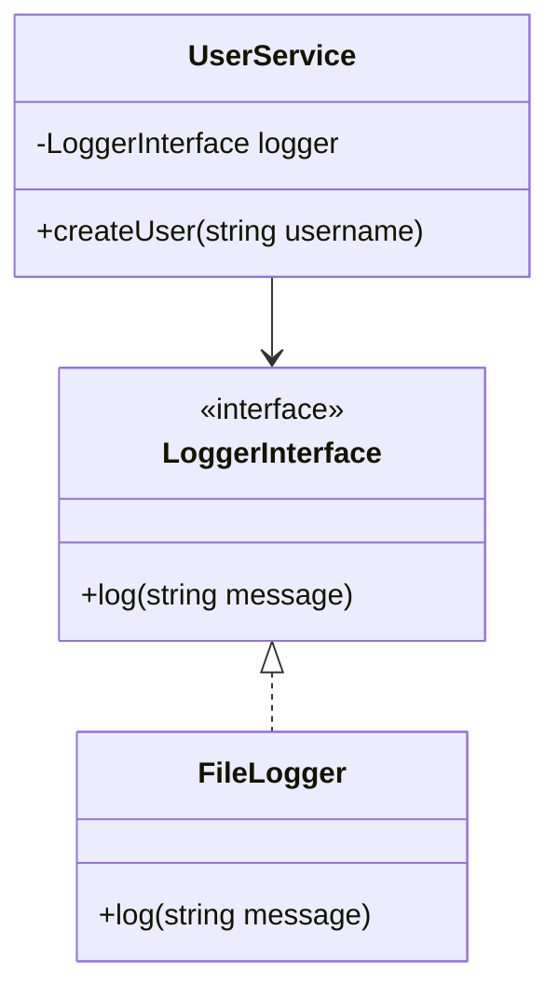

## 9.2 Implementing Dependency Injection in PHP

Dependency Injection (DI) is a fundamental design pattern in software development that promotes loose coupling and enhances the testability and maintainability of code. In PHP, implementing DI can significantly improve the architecture of your applications by decoupling the creation of dependencies from their usage. This section will guide you through the various methods of implementing Dependency Injection in PHP, including constructor injection, setter injection, and interface injection, with practical examples and best practices.

### Understanding Dependency Injection

Dependency Injection is a technique where an object receives its dependencies from an external source rather than creating them itself. This pattern is a form of Inversion of Control (IoC), where the control of creating and managing dependencies is inverted from the object to an external entity, often referred to as a container or injector.

### Benefits of Dependency Injection

- **Loose Coupling:** By decoupling dependencies, you can change or replace them without modifying the dependent class.
- **Improved Testability:** Dependencies can be easily mocked or stubbed, facilitating unit testing.
- **Enhanced Maintainability:** Changes in dependencies do not require changes in the dependent class, making the codebase easier to maintain.
- **Reusability:** Components can be reused in different contexts with different dependencies.

### Types of Dependency Injection

1. **Constructor Injection:** Dependencies are provided through a class constructor.
2. **Setter Injection:** Dependencies are assigned via setter methods.
3. **Interface Injection:** Dependencies are passed via methods defined in an interface.

Let's explore each of these methods in detail.

### Constructor Injection

Constructor Injection is the most common form of Dependency Injection. In this method, dependencies are passed to the class through its constructor. This approach ensures that the class is always in a valid state with all its dependencies satisfied.

#### Example: Constructor Injection

```php
<?php

interface LoggerInterface {
    public function log(string $message);
}

class FileLogger implements LoggerInterface {
    public function log(string $message) {
        // Log message to a file
        echo "Logging to a file: $message\n";
    }
}

class UserService {
    private $logger;

    public function __construct(LoggerInterface $logger) {
        $this->logger = $logger;
    }

    public function createUser(string $username) {
        // Create user logic
        $this->logger->log("User $username created.");
    }
}

// Usage
$logger = new FileLogger();
$userService = new UserService($logger);
$userService->createUser('john_doe');
```

In this example, `UserService` depends on a `LoggerInterface`. The `FileLogger` implementation is injected into `UserService` via its constructor, ensuring that the `UserService` has a logger available whenever it needs to log messages.

#### Advantages of Constructor Injection

- **Immutability:** Dependencies are set once and cannot be changed, promoting immutability.
- **Mandatory Dependencies:** Ensures that all required dependencies are provided at the time of object creation.

#### Disadvantages of Constructor Injection

- **Complex Constructors:** Can lead to complex constructors if a class has many dependencies.

### Setter Injection

Setter Injection involves providing dependencies through setter methods after the object is constructed. This method allows optional dependencies and can be used to change dependencies at runtime.

#### Example: Setter Injection

```php
<?php

class EmailService {
    private $logger;

    public function setLogger(LoggerInterface $logger) {
        $this->logger = $logger;
    }

    public function sendEmail(string $recipient, string $message) {
        // Send email logic
        if ($this->logger) {
            $this->logger->log("Email sent to $recipient.");
        }
    }
}

// Usage
$emailService = new EmailService();
$emailService->setLogger(new FileLogger());
$emailService->sendEmail('example@example.com', 'Hello World!');
```

In this example, `EmailService` uses a setter method to receive its `LoggerInterface` dependency. This allows the logger to be optional and set at any time before the `sendEmail` method is called.

#### Advantages of Setter Injection

- **Flexibility:** Allows optional dependencies and the ability to change dependencies at runtime.
- **Simpler Constructors:** Keeps constructors simple, especially when there are many optional dependencies.

#### Disadvantages of Setter Injection

- **Incomplete Initialization:** Objects may be in an incomplete state if dependencies are not set immediately after construction.

### Interface Injection

Interface Injection involves defining a method in an interface that accepts the dependency. Classes implementing this interface must provide the method to receive the dependency.

#### Example: Interface Injection

```php
<?php

interface LoggerAwareInterface {
    public function setLogger(LoggerInterface $logger);
}

class PaymentService implements LoggerAwareInterface {
    private $logger;

    public function setLogger(LoggerInterface $logger) {
        $this->logger = $logger;
    }

    public function processPayment(float $amount) {
        // Process payment logic
        if ($this->logger) {
            $this->logger->log("Processed payment of $$amount.");
        }
    }
}

// Usage
$paymentService = new PaymentService();
$paymentService->setLogger(new FileLogger());
$paymentService->processPayment(100.00);
```

In this example, `PaymentService` implements `LoggerAwareInterface`, which requires it to provide a `setLogger` method. This method is used to inject the `LoggerInterface` dependency.

#### Advantages of Interface Injection

- **Decoupling:** Promotes decoupling by enforcing dependency provision through interfaces.
- **Flexibility:** Allows for dynamic dependency injection.

#### Disadvantages of Interface Injection

- **Complexity:** Can add complexity by requiring additional interfaces and methods.

### Implementing Dependency Injection in PHP

Implementing Dependency Injection in PHP can be done manually or with the help of a Dependency Injection Container (DIC). Let's explore both approaches.

#### Manual Dependency Injection

Manual Dependency Injection involves explicitly creating and passing dependencies to classes. This approach is straightforward but can become cumbersome as the number of dependencies grows.

#### Example: Manual Dependency Injection

```php
<?php

class OrderService {
    private $paymentService;
    private $emailService;

    public function __construct(PaymentService $paymentService, EmailService $emailService) {
        $this->paymentService = $paymentService;
        $this->emailService = $emailService;
    }

    public function placeOrder(float $amount, string $recipient) {
        $this->paymentService->processPayment($amount);
        $this->emailService->sendEmail($recipient, "Your order has been placed.");
    }
}

// Usage
$paymentService = new PaymentService();
$emailService = new EmailService();
$emailService->setLogger(new FileLogger());

$orderService = new OrderService($paymentService, $emailService);
$orderService->placeOrder(100.00, 'customer@example.com');
```

In this example, `OrderService` manually receives its dependencies, `PaymentService` and `EmailService`, through its constructor.

#### Using a Dependency Injection Container

A Dependency Injection Container (DIC) automates the process of creating and injecting dependencies. It manages the lifecycle of dependencies and resolves them automatically.

##### Example: Using a Dependency Injection Container

```php
<?php

use Pimple\Container;

$container = new Container();

$container['logger'] = function () {
    return new FileLogger();
};

$container['emailService'] = function ($c) {
    $emailService = new EmailService();
    $emailService->setLogger($c['logger']);
    return $emailService;
};

$container['paymentService'] = function ($c) {
    $paymentService = new PaymentService();
    $paymentService->setLogger($c['logger']);
    return $paymentService;
};

$container['orderService'] = function ($c) {
    return new OrderService($c['paymentService'], $c['emailService']);
};

// Usage
$orderService = $container['orderService'];
$orderService->placeOrder(100.00, 'customer@example.com');
```

In this example, we use the Pimple container to manage dependencies. The container defines services and their dependencies, resolving them automatically when needed.

#### Advantages of Using a Dependency Injection Container

- **Automatic Resolution:** Automatically resolves and injects dependencies.
- **Centralized Configuration:** Centralizes dependency configuration and management.
- **Scalability:** Easily scales with the complexity of the application.

#### Disadvantages of Using a Dependency Injection Container

- **Learning Curve:** May require learning and understanding the container's API and configuration.
- **Overhead:** Introduces additional overhead in terms of configuration and setup.

### Best Practices for Dependency Injection in PHP

- **Favor Constructor Injection:** Use constructor injection for mandatory dependencies to ensure objects are always in a valid state.
- **Use Setter Injection for Optional Dependencies:** Use setter injection for optional dependencies that can be changed at runtime.
- **Leverage Interfaces:** Use interfaces to define dependencies, promoting decoupling and flexibility.
- **Consider Using a DI Container:** For complex applications, consider using a DI container to manage dependencies efficiently.
- **Avoid Over-Injection:** Be mindful of injecting too many dependencies into a single class, which can lead to bloated and hard-to-maintain code.

### Visualizing Dependency Injection

To better understand the flow of Dependency Injection, let's visualize the process using a class diagram.



**Diagram Description:** This class diagram illustrates the relationship between `UserService`, `LoggerInterface`, and `FileLogger`. `UserService` depends on `LoggerInterface`, and `FileLogger` implements this interface, allowing it to be injected into `UserService`.

### Try It Yourself

Experiment with the code examples provided by modifying the dependencies. Try creating a new logger implementation and injecting it into the services. Observe how the services' behavior changes with different dependencies.

### Knowledge Check

- What are the three types of Dependency Injection?
- How does constructor injection differ from setter injection?
- What are the advantages of using a Dependency Injection Container?
- Why is it important to avoid over-injection?

### Embrace the Journey

Remember, mastering Dependency Injection is a journey. As you continue to explore and implement DI in your PHP applications, you'll discover new ways to enhance your code's flexibility, testability, and maintainability. Keep experimenting, stay curious, and enjoy the process of building robust and scalable applications!

## Quiz: Implementing Dependency Injection in PHP



### What is Dependency Injection?

- [x] A technique where an object receives its dependencies from an external source.
- [ ] A method of creating dependencies within a class.
- [ ] A pattern that promotes tight coupling.
- [ ] A way to avoid using interfaces.

> **Explanation:** Dependency Injection is a technique where an object receives its dependencies from an external source, promoting loose coupling and enhancing testability.

### Which type of Dependency Injection involves passing dependencies through a class constructor?

- [x] Constructor Injection
- [ ] Setter Injection
- [ ] Interface Injection
- [ ] Factory Injection

> **Explanation:** Constructor Injection involves passing dependencies through a class constructor, ensuring that the class is always in a valid state.

### What is a disadvantage of Setter Injection?

- [x] Objects may be in an incomplete state if dependencies are not set immediately.
- [ ] Dependencies cannot be changed at runtime.
- [ ] It does not allow for optional dependencies.
- [ ] It requires complex constructors.

> **Explanation:** Setter Injection can lead to objects being in an incomplete state if dependencies are not set immediately after construction.

### What is an advantage of using a Dependency Injection Container?

- [x] Automatically resolves and injects dependencies.
- [ ] Requires manual configuration of each dependency.
- [ ] Promotes tight coupling between classes.
- [ ] Increases the complexity of the application.

> **Explanation:** A Dependency Injection Container automatically resolves and injects dependencies, centralizing configuration and management.

### Which method is recommended for injecting mandatory dependencies?

- [x] Constructor Injection
- [ ] Setter Injection
- [ ] Interface Injection
- [ ] Factory Injection

> **Explanation:** Constructor Injection is recommended for mandatory dependencies to ensure objects are always in a valid state.

### What is a potential downside of using a Dependency Injection Container?

- [x] It may introduce additional overhead in terms of configuration and setup.
- [ ] It simplifies the process of managing dependencies.
- [ ] It eliminates the need for interfaces.
- [ ] It reduces the flexibility of the application.

> **Explanation:** Using a Dependency Injection Container may introduce additional overhead in terms of configuration and setup, but it simplifies dependency management.

### How does Interface Injection promote decoupling?

- [x] By enforcing dependency provision through interfaces.
- [ ] By requiring dependencies to be set at runtime.
- [ ] By allowing dependencies to be optional.
- [ ] By using complex constructors.

> **Explanation:** Interface Injection promotes decoupling by enforcing dependency provision through interfaces, allowing for dynamic dependency injection.

### What is a key benefit of Dependency Injection?

- [x] Improved testability of code.
- [ ] Increased complexity of code.
- [ ] Reduced flexibility of code.
- [ ] Tight coupling between classes.

> **Explanation:** Dependency Injection improves the testability of code by allowing dependencies to be easily mocked or stubbed.

### What should be avoided to prevent bloated and hard-to-maintain code?

- [x] Over-injection of dependencies into a single class.
- [ ] Using interfaces for dependencies.
- [ ] Leveraging a Dependency Injection Container.
- [ ] Using constructor injection for mandatory dependencies.

> **Explanation:** Over-injection of dependencies into a single class should be avoided to prevent bloated and hard-to-maintain code.

### True or False: Dependency Injection is a form of Inversion of Control.

- [x] True
- [ ] False

> **Explanation:** Dependency Injection is indeed a form of Inversion of Control, where the control of creating and managing dependencies is inverted from the object to an external entity.


