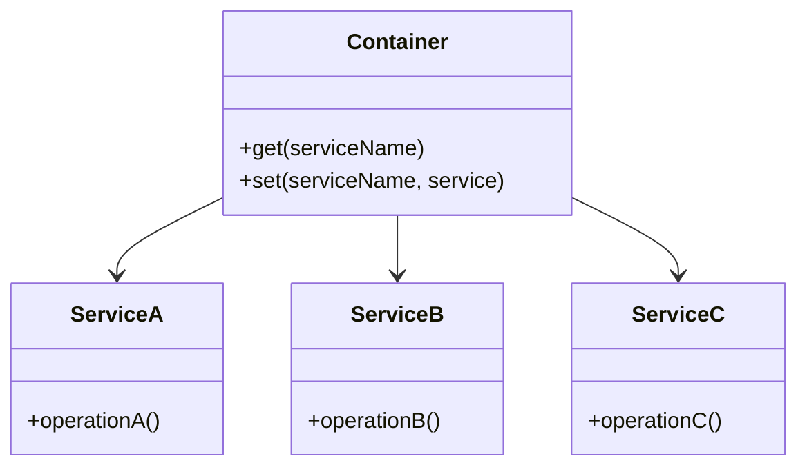

## 9.3 Dependency Injection Containers

In the realm of PHP development, managing dependencies efficiently is crucial for building scalable and maintainable applications. Dependency Injection Containers (DICs) play a pivotal role in this process by automating object creation and dependency resolution. Let's delve into the world of Dependency Injection Containers, exploring their purpose, features, and how they can be leveraged to enhance your PHP applications.

### Understanding Dependency Injection Containers

**Purpose:** Dependency Injection Containers manage object creation and dependency resolution automatically. They provide a centralized mechanism for defining how objects and their dependencies are instantiated, configured, and managed throughout the lifecycle of an application.

#### Key Concepts

- **Dependency Injection (DI):** A design pattern that allows an object to receive its dependencies from an external source rather than creating them internally. This promotes loose coupling and enhances testability.
- **Inversion of Control (IoC):** A principle where the control of object creation and lifecycle management is inverted from the application code to a container or framework.
- **Container:** A component that manages the lifecycle of objects and their dependencies, often providing features like automatic resolution, configuration, and scope management.

### Popular PHP Dependency Injection Containers

Several PHP frameworks and libraries provide robust Dependency Injection Containers. Here are some of the most popular ones:

#### PHP-DI

**PHP-DI** is a powerful and flexible Dependency Injection Container for PHP. It emphasizes simplicity and ease of use, allowing developers to define dependencies using annotations, configuration files, or PHP code.

- **Link:** [PHP-DI - Dependency Injection Container](https://php-di.org/)

#### Symfony DependencyInjection Component

The **Symfony DependencyInjection Component** is a core part of the Symfony framework, but it can also be used standalone. It offers a comprehensive set of features for managing dependencies, including service definitions, autowiring, and configuration.

- **Link:** [Symfony DependencyInjection](https://symfony.com/doc/current/components/dependency_injection.html)

#### Laravel Service Container

The **Laravel Service Container** is a powerful tool for managing class dependencies and performing dependency injection. It is a key component of the Laravel framework, providing automatic resolution and binding capabilities.

- **Link:** [Laravel Service Container](https://laravel.com/docs/container)

### Features of Dependency Injection Containers

Dependency Injection Containers offer a range of features that simplify dependency management and enhance application architecture:

- **Configurable Bindings and Scopes:** Define how objects are instantiated and managed, including singleton, prototype, and request scopes.
- **Automatic Resolution and Injection:** Automatically resolve dependencies and inject them into constructors or methods.
- **Service Definitions:** Define services and their dependencies using configuration files or annotations.
- **Autowiring:** Automatically resolve dependencies based on type hints, reducing the need for explicit configuration.
- **Lazy Loading:** Delay the instantiation of objects until they are needed, improving performance and resource utilization.

### Implementing Dependency Injection Containers in PHP

Let's explore how to implement and utilize Dependency Injection Containers in PHP, using examples from popular containers like PHP-DI, Symfony, and Laravel.

#### Example: Using PHP-DI

```php
// Install PHP-DI via Composer
// composer require php-di/php-di

use DI\ContainerBuilder;

// Create a container builder
$containerBuilder = new ContainerBuilder();

// Define dependencies
$containerBuilder->addDefinitions([
    'DatabaseConnection' => DI\create('MyApp\DatabaseConnection')
        ->constructor('localhost', 'root', 'password', 'my_database'),
    'UserRepository' => DI\autowire('MyApp\UserRepository')
        ->constructorParameter('dbConnection', DI\get('DatabaseConnection')),
]);

// Build the container
$container = $containerBuilder->build();

// Retrieve an instance of UserRepository
$userRepository = $container->get('UserRepository');
```

**Explanation:**

- **ContainerBuilder:** Used to create and configure the container.
- **addDefinitions:** Defines how services and their dependencies are instantiated.
- **DI\create:** Specifies the class to instantiate.
- **DI\autowire:** Automatically resolves dependencies based on type hints.
- **DI\get:** Retrieves a service from the container.

#### Example: Using Symfony DependencyInjection Component

```php
// Install Symfony DependencyInjection Component via Composer
// composer require symfony/dependency-injection

use Symfony\Component\DependencyInjection\ContainerBuilder;
use Symfony\Component\DependencyInjection\Reference;

// Create a container builder
$containerBuilder = new ContainerBuilder();

// Define services
$containerBuilder->register('database_connection', 'MyApp\DatabaseConnection')
    ->addArgument('localhost')
    ->addArgument('root')
    ->addArgument('password')
    ->addArgument('my_database');

$containerBuilder->register('user_repository', 'MyApp\UserRepository')
    ->addArgument(new Reference('database_connection'));

// Compile the container
$containerBuilder->compile();

// Retrieve an instance of UserRepository
$userRepository = $containerBuilder->get('user_repository');
```

**Explanation:**

- **ContainerBuilder:** Manages the registration and configuration of services.
- **register:** Registers a service with the container.
- **addArgument:** Adds constructor arguments for the service.
- **Reference:** Specifies a dependency on another service.

#### Example: Using Laravel Service Container

```php
// Define a service provider in Laravel
namespace App\Providers;

use Illuminate\Support\ServiceProvider;
use MyApp\DatabaseConnection;
use MyApp\UserRepository;

class AppServiceProvider extends ServiceProvider
{
    public function register()
    {
        // Bind DatabaseConnection to the container
        $this->app->singleton(DatabaseConnection::class, function ($app) {
            return new DatabaseConnection('localhost', 'root', 'password', 'my_database');
        });

        // Bind UserRepository to the container
        $this->app->bind(UserRepository::class, function ($app) {
            return new UserRepository($app->make(DatabaseConnection::class));
        });
    }
}

// Retrieve an instance of UserRepository
$userRepository = app(UserRepository::class);
```

**Explanation:**

- **ServiceProvider:** A class that registers services with the Laravel container.
- **singleton:** Binds a class to the container as a singleton.
- **bind:** Binds a class to the container with a closure that defines how it is instantiated.
- **app:** A helper function to retrieve services from the container.

### Visualizing Dependency Injection Containers

To better understand how Dependency Injection Containers work, let's visualize the process using a class diagram.



**Description:** This diagram illustrates a simple Dependency Injection Container managing three services: `ServiceA`, `ServiceB`, and `ServiceC`. The container provides methods to retrieve (`get`) and register (`set`) services.

### Best Practices for Using Dependency Injection Containers

- **Define Services Clearly:** Use configuration files or annotations to define services and their dependencies clearly.
- **Leverage Autowiring:** Utilize autowiring to reduce boilerplate code and simplify dependency management.
- **Use Scopes Wisely:** Choose appropriate scopes (singleton, prototype, etc.) based on the application's needs.
- **Avoid Overuse:** While DI containers are powerful, avoid overusing them for simple applications where manual dependency injection suffices.
- **Test Thoroughly:** Ensure that services and their dependencies are tested independently to maintain code quality.

### PHP Unique Features

PHP offers unique features that enhance the use of Dependency Injection Containers:

- **Type Hinting:** PHP's type hinting allows for precise dependency resolution, enabling containers to automatically inject the correct dependencies.
- **Anonymous Functions:** PHP's support for anonymous functions and closures facilitates dynamic service definitions and lazy loading.
- **Reflection API:** PHP's Reflection API provides insights into class structures, aiding in automatic dependency resolution and autowiring.

### Differences and Similarities with Other Patterns

Dependency Injection Containers are often compared with the Service Locator pattern. While both manage dependencies, DI containers promote loose coupling by injecting dependencies, whereas Service Locators require objects to request their dependencies, leading to tighter coupling.

### Try It Yourself

Experiment with the code examples provided by modifying the service definitions and dependencies. Try adding new services or changing the configuration to see how the container handles different scenarios.

### Knowledge Check

- **What is the primary purpose of a Dependency Injection Container?**
- **How does autowiring simplify dependency management?**
- **What are the benefits of using scopes in a DI container?**

### Embrace the Journey

Remember, mastering Dependency Injection Containers is a journey. As you progress, you'll discover new ways to optimize your PHP applications, making them more robust and maintainable. Keep experimenting, stay curious, and enjoy the journey!

## Quiz: Dependency Injection Containers



### What is the primary purpose of a Dependency Injection Container?

- [x] To manage object creation and dependency resolution automatically.
- [ ] To provide a user interface for applications.
- [ ] To handle database connections.
- [ ] To manage file uploads.

> **Explanation:** Dependency Injection Containers are designed to manage object creation and dependency resolution automatically, enhancing application architecture.

### Which PHP Dependency Injection Container emphasizes simplicity and ease of use?

- [x] PHP-DI
- [ ] Symfony DependencyInjection Component
- [ ] Laravel Service Container
- [ ] Zend Service Manager

> **Explanation:** PHP-DI is known for its simplicity and ease of use, allowing developers to define dependencies using annotations, configuration files, or PHP code.

### What is autowiring in the context of Dependency Injection Containers?

- [x] Automatically resolving dependencies based on type hints.
- [ ] Manually configuring each dependency.
- [ ] Writing custom code for dependency resolution.
- [ ] Using global variables for dependencies.

> **Explanation:** Autowiring refers to the automatic resolution of dependencies based on type hints, reducing the need for explicit configuration.

### How does the Laravel Service Container bind a class as a singleton?

- [x] Using the `singleton` method.
- [ ] Using the `bind` method.
- [ ] Using the `register` method.
- [ ] Using the `resolve` method.

> **Explanation:** The `singleton` method in Laravel's Service Container binds a class as a singleton, ensuring a single instance is used throughout the application.

### What is the benefit of using scopes in a Dependency Injection Container?

- [x] To control the lifecycle and reuse of objects.
- [ ] To increase the complexity of the application.
- [ ] To reduce the number of services.
- [ ] To eliminate the need for configuration files.

> **Explanation:** Scopes in a Dependency Injection Container control the lifecycle and reuse of objects, optimizing resource utilization.

### Which PHP feature aids in automatic dependency resolution and autowiring?

- [x] Type Hinting
- [ ] Global Variables
- [ ] Static Methods
- [ ] Inline Comments

> **Explanation:** PHP's type hinting allows for precise dependency resolution, enabling containers to automatically inject the correct dependencies.

### What is the difference between Dependency Injection Containers and Service Locators?

- [x] DI containers inject dependencies, while Service Locators require objects to request dependencies.
- [ ] DI containers are used for UI design, while Service Locators manage databases.
- [ ] DI containers are faster, while Service Locators are more secure.
- [ ] DI containers are for frontend, while Service Locators are for backend.

> **Explanation:** Dependency Injection Containers inject dependencies, promoting loose coupling, while Service Locators require objects to request their dependencies, leading to tighter coupling.

### What is the role of the `ContainerBuilder` in Symfony's DependencyInjection Component?

- [x] To manage the registration and configuration of services.
- [ ] To handle user authentication.
- [ ] To manage database migrations.
- [ ] To create frontend templates.

> **Explanation:** The `ContainerBuilder` in Symfony's DependencyInjection Component manages the registration and configuration of services.

### True or False: Dependency Injection Containers can delay the instantiation of objects until they are needed.

- [x] True
- [ ] False

> **Explanation:** Dependency Injection Containers can implement lazy loading, delaying the instantiation of objects until they are needed, improving performance.

### Which method in PHP-DI is used to specify the class to instantiate?

- [x] DI\create
- [ ] DI\bind
- [ ] DI\register
- [ ] DI\resolve

> **Explanation:** The `DI\create` method in PHP-DI is used to specify the class to instantiate.


