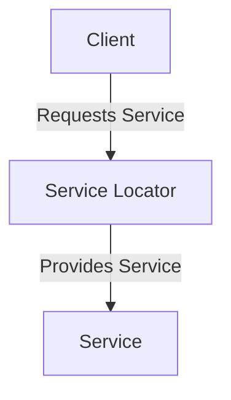

## 9.4 Service Locator Pattern

In the realm of software design patterns, the Service Locator Pattern is a well-known pattern that provides a centralized registry for obtaining services and dependencies. This pattern is often discussed alongside Dependency Injection (DI) and Inversion of Control (IoC) due to their overlapping purposes in managing dependencies within an application. In this section, we will delve into the Service Locator Pattern, its implementation in PHP, its benefits, criticisms, and how it compares to other dependency management techniques.

### Concept of the Service Locator Pattern

The Service Locator Pattern is a design pattern that provides a mechanism to locate services or dependencies at runtime. It acts as a registry where services are registered and can be retrieved by clients when needed. This pattern is particularly useful in scenarios where you need to decouple the service creation logic from the service usage logic.

#### Key Participants

1. **Service Locator**: The central registry that holds references to services.
2. **Service**: The actual service or dependency that is being requested.
3. **Client**: The consumer that requests services from the Service Locator.

### Implementing Service Locator in PHP

Let's explore how to implement the Service Locator Pattern in PHP. We will create a simple service locator class and demonstrate how clients can request services from it.

#### Step 1: Creating a Central Service Locator Class

The first step is to create a Service Locator class that will act as a registry for services. This class will have methods to register and retrieve services.

```php
<?php

class ServiceLocator
{
    private $services = [];

    // Register a service with a unique key
    public function register($key, $service)
    {
        $this->services[$key] = $service;
    }

    // Retrieve a service by its key
    public function get($key)
    {
        if (!isset($this->services[$key])) {
            throw new Exception("Service not found: " . $key);
        }
        return $this->services[$key];
    }
}
```

#### Step 2: Registering Services

Next, we need to register services with the Service Locator. This is typically done during the application initialization phase.

```php
<?php

// Create an instance of the Service Locator
$serviceLocator = new ServiceLocator();

// Register services
$serviceLocator->register('logger', new Logger());
$serviceLocator->register('database', new DatabaseConnection());
```

#### Step 3: Requesting Services

Clients can now request services from the Service Locator using the unique keys.

```php
<?php

// Retrieve the logger service
$logger = $serviceLocator->get('logger');
$logger->log("This is a log message.");

// Retrieve the database service
$database = $serviceLocator->get('database');
$database->connect();
```

### Criticism and Alternatives

While the Service Locator Pattern provides a straightforward way to manage dependencies, it has been criticized for several reasons:

1. **Hidden Dependencies**: The pattern can lead to hidden dependencies, as clients do not explicitly declare their dependencies. This can make the code harder to understand and maintain.

2. **Testing Challenges**: Since dependencies are not explicitly passed to clients, it can be challenging to mock or replace them during testing.

3. **Tight Coupling**: The pattern can lead to tight coupling between the client and the Service Locator, making it difficult to change the underlying implementation.

#### Alternatives: Dependency Injection

Dependency Injection (DI) is often preferred over the Service Locator Pattern because it addresses many of the criticisms mentioned above. DI involves explicitly passing dependencies to clients, which makes the code more transparent and easier to test.

### Visualizing the Service Locator Pattern

To better understand the Service Locator Pattern, let's visualize its workflow using a Mermaid.js diagram.



**Diagram Description:** The diagram illustrates the interaction between the Client, Service Locator, and Service. The Client requests a service from the Service Locator, which then provides the requested service.

### PHP Unique Features

PHP offers several features that can enhance the implementation of the Service Locator Pattern:

- **Dynamic Typing**: PHP's dynamic typing allows for flexible service registration and retrieval without strict type constraints.
- **Anonymous Functions**: PHP's support for anonymous functions can be used to register services as closures, providing lazy initialization.
- **Namespaces**: PHP namespaces can help organize services and avoid naming conflicts.

### Differences and Similarities with Dependency Injection

While both the Service Locator Pattern and Dependency Injection aim to manage dependencies, they differ in their approach:

- **Service Locator**: Centralizes service retrieval, leading to potential hidden dependencies.
- **Dependency Injection**: Explicitly passes dependencies to clients, promoting transparency and testability.

### Sample Code Snippet

Let's revisit our implementation with a more comprehensive example that includes a service interface and multiple service implementations.

```php
<?php

interface LoggerInterface
{
    public function log($message);
}

class FileLogger implements LoggerInterface
{
    public function log($message)
    {
        echo "Logging to a file: $message\n";
    }
}

class DatabaseLogger implements LoggerInterface
{
    public function log($message)
    {
        echo "Logging to a database: $message\n";
    }
}

class ServiceLocator
{
    private $services = [];

    public function register($key, $service)
    {
        $this->services[$key] = $service;
    }

    public function get($key)
    {
        if (!isset($this->services[$key])) {
            throw new Exception("Service not found: " . $key);
        }
        return $this->services[$key];
    }
}

// Register services
$serviceLocator = new ServiceLocator();
$serviceLocator->register('fileLogger', new FileLogger());
$serviceLocator->register('dbLogger', new DatabaseLogger());

// Retrieve and use services
$logger = $serviceLocator->get('fileLogger');
$logger->log("This is a log message.");
```

### Design Considerations

When deciding whether to use the Service Locator Pattern, consider the following:

- **Complexity**: For simple applications, the pattern may introduce unnecessary complexity.
- **Testability**: If testability is a priority, consider using Dependency Injection instead.
- **Flexibility**: The pattern can be useful in scenarios where services need to be swapped or reconfigured at runtime.

### Try It Yourself

Experiment with the code examples by modifying the services or adding new ones. Try implementing lazy initialization using closures or explore how the pattern behaves in a larger application.

### Knowledge Check

- What are the key participants in the Service Locator Pattern?
- How does the Service Locator Pattern differ from Dependency Injection?
- What are some criticisms of the Service Locator Pattern?

### Embrace the Journey

Remember, understanding design patterns is a journey. As you explore the Service Locator Pattern, consider its strengths and weaknesses in the context of your projects. Keep experimenting, stay curious, and enjoy the journey!

## Quiz: Service Locator Pattern



### What is the primary purpose of the Service Locator Pattern?

- [x] To provide a centralized registry for obtaining services and dependencies.
- [ ] To enforce strict type constraints on services.
- [ ] To eliminate the need for dependency management.
- [ ] To replace all instances of Dependency Injection.

> **Explanation:** The Service Locator Pattern provides a centralized registry for obtaining services and dependencies, allowing clients to request services at runtime.

### Which of the following is a criticism of the Service Locator Pattern?

- [x] It can lead to hidden dependencies.
- [ ] It enforces strict type constraints.
- [ ] It eliminates the need for testing.
- [ ] It is incompatible with PHP.

> **Explanation:** The Service Locator Pattern can lead to hidden dependencies, making the code harder to understand and maintain.

### How does Dependency Injection differ from the Service Locator Pattern?

- [x] Dependency Injection explicitly passes dependencies to clients.
- [ ] Dependency Injection centralizes service retrieval.
- [ ] Dependency Injection eliminates the need for services.
- [ ] Dependency Injection is only used in PHP.

> **Explanation:** Dependency Injection explicitly passes dependencies to clients, promoting transparency and testability, unlike the Service Locator Pattern.

### What is a potential benefit of using the Service Locator Pattern?

- [x] It allows for flexible service retrieval at runtime.
- [ ] It enforces strict type constraints.
- [ ] It eliminates the need for dependency management.
- [ ] It is only used in PHP.

> **Explanation:** The Service Locator Pattern allows for flexible service retrieval at runtime, enabling dynamic service configuration.

### Which PHP feature can enhance the implementation of the Service Locator Pattern?

- [x] Anonymous Functions
- [ ] Strict Typing
- [ ] Static Methods
- [ ] Global Variables

> **Explanation:** PHP's support for anonymous functions can be used to register services as closures, providing lazy initialization.

### What is a key participant in the Service Locator Pattern?

- [x] Service Locator
- [ ] Dependency Injector
- [ ] Type Enforcer
- [ ] Global Registry

> **Explanation:** The Service Locator is the central registry that holds references to services in the pattern.

### What is a common alternative to the Service Locator Pattern?

- [x] Dependency Injection
- [ ] Global Variables
- [ ] Static Methods
- [ ] Type Enforcer

> **Explanation:** Dependency Injection is a common alternative to the Service Locator Pattern, addressing many of its criticisms.

### What is a potential drawback of using the Service Locator Pattern?

- [x] It can lead to tight coupling between the client and the Service Locator.
- [ ] It eliminates the need for dependency management.
- [ ] It enforces strict type constraints.
- [ ] It is incompatible with PHP.

> **Explanation:** The Service Locator Pattern can lead to tight coupling between the client and the Service Locator, making it difficult to change the underlying implementation.

### How can the Service Locator Pattern affect testability?

- [x] It can make it challenging to mock or replace dependencies during testing.
- [ ] It eliminates the need for testing.
- [ ] It enforces strict type constraints.
- [ ] It is only used in PHP.

> **Explanation:** Since dependencies are not explicitly passed to clients, the Service Locator Pattern can make it challenging to mock or replace them during testing.

### True or False: The Service Locator Pattern is always preferred over Dependency Injection.

- [ ] True
- [x] False

> **Explanation:** False. Dependency Injection is generally preferred over the Service Locator Pattern due to its transparency and testability benefits.


