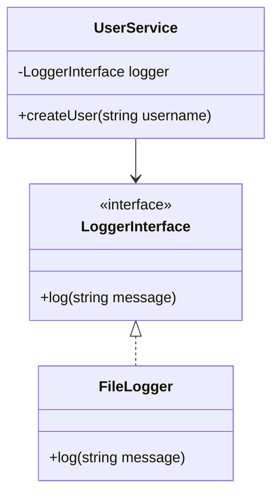

## 9.5 Inversion of Control Principles

Inversion of Control (IoC) is a fundamental design principle in software engineering that plays a crucial role in creating flexible and maintainable applications. By understanding and applying IoC principles, developers can enhance the modularity of their code, making it easier to manage and extend. In this section, we will delve into the concept of IoC, its relationship with Dependency Injection (DI), and how it can be effectively implemented in PHP.

### Understanding Inversion of Control

**Definition:** Inversion of Control is a design principle where the control of object creation and binding is transferred from the application code to a container or framework. This principle allows for the decoupling of components, enabling more flexible and testable code.

#### Key Concepts

- **Control Flow:** Traditionally, the flow of control in a program is dictated by the application code. With IoC, this control is inverted, meaning that the framework or container dictates the flow.
- **Decoupling:** IoC promotes loose coupling between components, making it easier to change or replace parts of the system without affecting others.
- **Flexibility:** By decoupling components, IoC allows for greater flexibility in how components are used and composed.

### Relation to Dependency Injection

Dependency Injection is a specific form of Inversion of Control. It involves injecting dependencies into a component rather than having the component create them itself. This is typically managed by a container that handles the lifecycle and configuration of objects.

#### How Dependency Injection Implements IoC

- **Container Management:** The DI container manages object lifecycles and injections, ensuring that dependencies are provided to components as needed.
- **Configuration:** Dependencies are configured externally, often through configuration files or annotations, allowing for easy changes without modifying the code.
- **Testing:** By injecting dependencies, components can be easily tested in isolation using mock objects.

### Implementing IoC in PHP

PHP, being a versatile and widely-used language, supports IoC through various frameworks and libraries. Let's explore how IoC can be implemented in PHP, focusing on practical examples and best practices.

#### Using Dependency Injection Containers

A DI container is a tool that facilitates IoC by managing the creation and injection of dependencies. Popular PHP frameworks like Laravel and Symfony provide robust DI containers that simplify the implementation of IoC.

##### Example: Implementing IoC with a DI Container

```php
// Define an interface for a service
interface LoggerInterface {
    public function log(string $message);
}

// Implement the interface
class FileLogger implements LoggerInterface {
    public function log(string $message) {
        // Log message to a file
        file_put_contents('log.txt', $message . PHP_EOL, FILE_APPEND);
    }
}

// Define a class that depends on the LoggerInterface
class UserService {
    private $logger;

    public function __construct(LoggerInterface $logger) {
        $this->logger = $logger;
    }

    public function createUser(string $username) {
        // Create user logic
        $this->logger->log("User created: $username");
    }
}

// Use a DI container to manage dependencies
$container = new \Pimple\Container();

$container[LoggerInterface::class] = function ($c) {
    return new FileLogger();
};

$container[UserService::class] = function ($c) {
    return new UserService($c[LoggerInterface::class]);
};

// Retrieve the UserService from the container
$userService = $container[UserService::class];
$userService->createUser('john_doe');
```

In this example, we define a `LoggerInterface` and a `FileLogger` implementation. The `UserService` class depends on the `LoggerInterface`, and we use a DI container to manage the creation and injection of these dependencies.

#### Benefits of Using IoC in PHP

- **Modularity:** IoC promotes modular design, allowing components to be developed and tested independently.
- **Maintainability:** By decoupling components, IoC makes it easier to maintain and extend the application.
- **Testability:** Components can be tested in isolation by injecting mock dependencies.

### Visualizing Inversion of Control

To better understand IoC, let's visualize the concept using a class diagram.



In this diagram, `UserService` depends on `LoggerInterface`, and `FileLogger` implements this interface. The DI container manages the relationship between these classes, demonstrating the IoC principle.

### Common Pitfalls and Considerations

While IoC offers numerous benefits, there are some common pitfalls to be aware of:

- **Over-Engineering:** It's easy to over-engineer a solution with IoC, leading to unnecessary complexity. Use IoC where it provides clear benefits.
- **Performance Overhead:** DI containers can introduce performance overhead due to the additional abstraction layer. Optimize container usage to minimize impact.
- **Learning Curve:** Understanding and implementing IoC can have a steep learning curve, especially for developers new to the concept.

### PHP Unique Features

PHP offers several unique features that facilitate the implementation of IoC:

- **Anonymous Classes:** PHP supports anonymous classes, which can be used to create lightweight, one-off implementations of interfaces.
- **Traits:** Traits allow for code reuse across classes, enabling more flexible and modular design.
- **Namespaces:** PHP namespaces help organize code and avoid naming conflicts, which is particularly useful in large applications using IoC.

### Differences and Similarities with Related Patterns

IoC is often confused with related patterns such as Service Locator and Factory patterns. Let's clarify the distinctions:

- **Service Locator:** Unlike IoC, the Service Locator pattern involves a central registry that provides dependencies. While it can simplify dependency management, it often leads to tighter coupling.
- **Factory Pattern:** The Factory pattern is used to create objects, but it does not inherently manage dependencies like IoC. It's often used in conjunction with IoC to create complex objects.

### Try It Yourself

To deepen your understanding of IoC, try modifying the code example provided:

- **Change the Logger Implementation:** Implement a new logger class, such as `DatabaseLogger`, and configure the DI container to use it.
- **Add More Dependencies:** Extend the `UserService` to depend on additional services, and manage these dependencies using the DI container.

### Knowledge Check

- **What is Inversion of Control?**
- **How does Dependency Injection relate to IoC?**
- **What are the benefits of using IoC in PHP?**
- **How can you implement IoC using a DI container?**

### Summary

Inversion of Control is a powerful design principle that enhances the modularity, flexibility, and testability of PHP applications. By understanding and applying IoC principles, developers can create more maintainable and scalable software. Remember, this is just the beginning. As you progress, you'll discover more advanced techniques and patterns that build upon IoC. Keep experimenting, stay curious, and enjoy the journey!

## Quiz: Inversion of Control Principles



### What is Inversion of Control?

- [x] A design principle where the control of object creation and binding is transferred from the application code to a container or framework.
- [ ] A pattern for creating objects without specifying the exact class of object that will be created.
- [ ] A method for organizing code into reusable modules.
- [ ] A technique for optimizing database queries.

> **Explanation:** Inversion of Control is a design principle that transfers the control of object creation and binding from the application code to a container or framework, promoting decoupling and flexibility.

### How does Dependency Injection relate to Inversion of Control?

- [x] Dependency Injection is a form of Inversion of Control.
- [ ] Dependency Injection is unrelated to Inversion of Control.
- [ ] Dependency Injection is a pattern for creating objects.
- [ ] Dependency Injection is a method for optimizing code performance.

> **Explanation:** Dependency Injection is a specific form of Inversion of Control, where dependencies are injected into components by a container, rather than being created by the components themselves.

### What is a benefit of using Inversion of Control in PHP?

- [x] It promotes modularity and flexibility.
- [ ] It increases code complexity.
- [ ] It reduces the need for testing.
- [ ] It makes code harder to maintain.

> **Explanation:** Inversion of Control promotes modularity and flexibility by decoupling components, making the code easier to maintain and extend.

### Which of the following is a common pitfall of Inversion of Control?

- [x] Over-engineering solutions.
- [ ] Simplifying code structure.
- [ ] Reducing code readability.
- [ ] Increasing code performance.

> **Explanation:** A common pitfall of Inversion of Control is over-engineering solutions, which can lead to unnecessary complexity.

### What is the role of a DI container in IoC?

- [x] It manages object lifecycles and injections.
- [ ] It creates objects without dependencies.
- [ ] It optimizes code performance.
- [ ] It simplifies database interactions.

> **Explanation:** A DI container manages object lifecycles and injections, ensuring that dependencies are provided to components as needed, implementing the IoC principle.

### Which PHP feature is particularly useful for implementing IoC?

- [x] Anonymous Classes
- [ ] Global Variables
- [ ] Static Methods
- [ ] Inline SQL Queries

> **Explanation:** Anonymous Classes in PHP are useful for implementing IoC as they allow for lightweight, one-off implementations of interfaces, facilitating modular design.

### What is a difference between IoC and the Service Locator pattern?

- [x] IoC promotes loose coupling, while Service Locator often leads to tighter coupling.
- [ ] IoC is a pattern for creating objects, while Service Locator is not.
- [ ] IoC is unrelated to dependency management, while Service Locator is.
- [ ] IoC is used for optimizing code performance, while Service Locator is not.

> **Explanation:** IoC promotes loose coupling by transferring control to a container, while the Service Locator pattern often leads to tighter coupling due to its central registry approach.

### What is a similarity between IoC and the Factory pattern?

- [x] Both can be used to create objects.
- [ ] Both manage dependencies.
- [ ] Both are unrelated to object creation.
- [ ] Both are used for optimizing code performance.

> **Explanation:** Both IoC and the Factory pattern can be used to create objects, but IoC also manages dependencies, which the Factory pattern does not inherently do.

### How can IoC enhance testability?

- [x] By allowing components to be tested in isolation using mock dependencies.
- [ ] By reducing the need for unit tests.
- [ ] By making code harder to understand.
- [ ] By increasing code complexity.

> **Explanation:** IoC enhances testability by allowing components to be tested in isolation using mock dependencies, making it easier to verify their behavior.

### True or False: IoC can introduce performance overhead due to the additional abstraction layer.

- [x] True
- [ ] False

> **Explanation:** True. IoC can introduce performance overhead due to the additional abstraction layer introduced by DI containers, which manage object lifecycles and injections.


