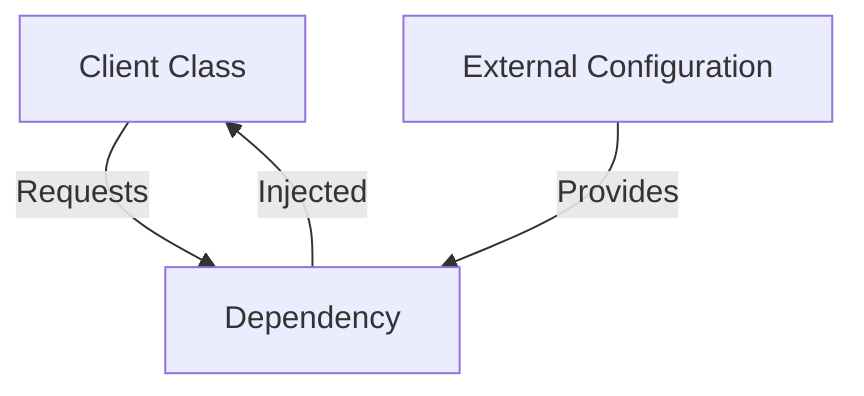
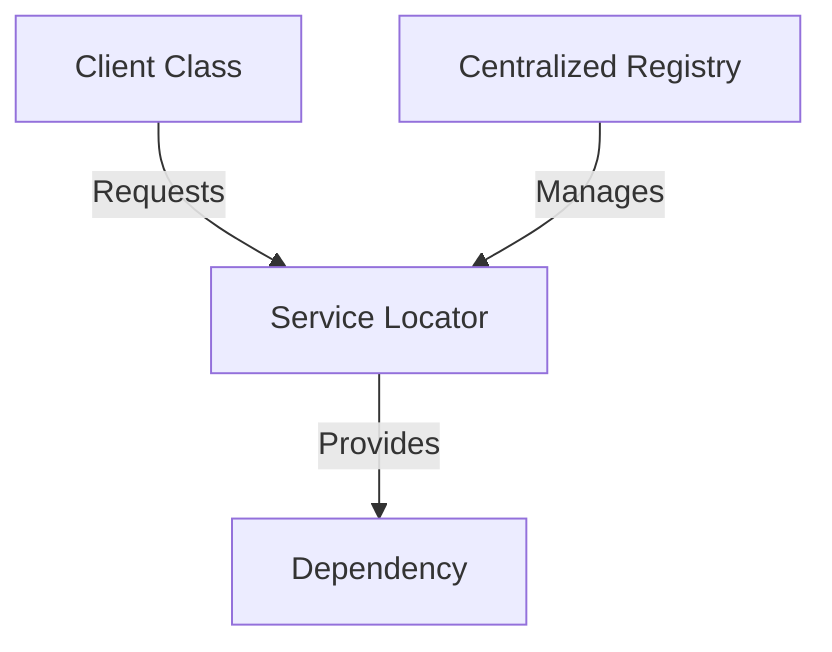

## 9.6 Comparing Dependency Injection and Service Locator

In the world of software design patterns, managing dependencies effectively is crucial for building maintainable and scalable applications. Two popular patterns for handling dependencies in PHP are Dependency Injection (DI) and the Service Locator pattern. While both aim to decouple components and manage dependencies, they do so in different ways. In this section, we will explore these patterns in depth, compare their advantages and disadvantages, and provide guidance on when to use each.

### Understanding Dependency Injection

**Dependency Injection** is a design pattern that allows a class to receive its dependencies from an external source rather than creating them internally. This pattern promotes loose coupling and enhances testability by making dependencies explicit and configurable.

#### Key Concepts of Dependency Injection

- **Explicit Dependencies**: Dependencies are clearly defined and passed to the class, often through the constructor or setter methods.
- **Inversion of Control (IoC)**: The control of creating and managing dependencies is inverted from the class to an external entity.
- **Testability**: By injecting dependencies, classes can be easily tested with mock objects or stubs.

#### Types of Dependency Injection

1. **Constructor Injection**: Dependencies are provided through a class constructor.
2. **Setter Injection**: Dependencies are set through public setter methods.
3. **Interface Injection**: Dependencies are injected through an interface that the class implements.

#### Example of Dependency Injection in PHP

```php
<?php

// Define a Logger interface
interface Logger {
    public function log(string $message);
}

// Implement the Logger interface
class FileLogger implements Logger {
    public function log(string $message) {
        echo "Logging to a file: $message";
    }
}

// Define a UserService class that depends on Logger
class UserService {
    private $logger;

    // Constructor Injection
    public function __construct(Logger $logger) {
        $this->logger = $logger;
    }

    public function createUser(string $username) {
        // Logic to create a user
        $this->logger->log("User $username created.");
    }
}

// Usage
$logger = new FileLogger();
$userService = new UserService($logger);
$userService->createUser("john_doe");

?>
```

In this example, the `UserService` class depends on a `Logger` interface. The dependency is injected through the constructor, allowing for easy substitution of different `Logger` implementations.

### Understanding the Service Locator Pattern

The **Service Locator** pattern provides a centralized registry or locator object that manages and provides dependencies upon request. Unlike Dependency Injection, where dependencies are passed directly to the class, the Service Locator pattern allows classes to request dependencies at runtime.

#### Key Concepts of Service Locator

- **Centralized Management**: A single point of access for all dependencies.
- **Runtime Resolution**: Dependencies are resolved and provided at runtime.
- **Potential for Hidden Dependencies**: Dependencies are not explicitly declared, which can obscure the relationships between components.

#### Example of Service Locator in PHP

```php
<?php

// Define a Service Locator class
class ServiceLocator {
    private $services = [];

    public function addService(string $name, $service) {
        $this->services[$name] = $service;
    }

    public function getService(string $name) {
        if (!isset($this->services[$name])) {
            throw new Exception("Service not found: $name");
        }
        return $this->services[$name];
    }
}

// Define a Logger interface and implementation
interface Logger {
    public function log(string $message);
}

class FileLogger implements Logger {
    public function log(string $message) {
        echo "Logging to a file: $message";
    }
}

// Usage
$serviceLocator = new ServiceLocator();
$serviceLocator->addService('logger', new FileLogger());

$logger = $serviceLocator->getService('logger');
$logger->log("This is a log message.");

?>
```

In this example, the `ServiceLocator` class manages the `Logger` service. The `FileLogger` is registered with the locator, and any class can request it at runtime.

### Comparing Dependency Injection and Service Locator

Both Dependency Injection and Service Locator patterns have their own strengths and weaknesses. Let's compare them based on several criteria:

#### 1. **Explicitness**

- **Dependency Injection**: Dependencies are explicit and visible in the class interface, making it clear what a class requires to function.
- **Service Locator**: Dependencies are hidden within the locator, which can make it difficult to understand what a class depends on without examining the implementation.

#### 2. **Testability**

- **Dependency Injection**: Easier to test because dependencies can be easily replaced with mocks or stubs.
- **Service Locator**: Testing can be more challenging as dependencies are resolved at runtime, requiring more setup to replace services with test doubles.

#### 3. **Flexibility**

- **Dependency Injection**: Offers greater flexibility in changing dependencies, as they are injected externally and can be easily swapped.
- **Service Locator**: Provides flexibility in managing dependencies centrally, but can lead to tight coupling between the locator and the services.

#### 4. **Complexity**

- **Dependency Injection**: Can introduce complexity in managing dependencies, especially in large applications with many dependencies.
- **Service Locator**: Simplifies dependency management by centralizing it, but can lead to a "God object" if not managed properly.

#### 5. **Performance**

- **Dependency Injection**: May have a slight overhead due to the need to inject dependencies.
- **Service Locator**: Can be more performant in scenarios where dependencies are resolved infrequently.

### Recommendations

- **Prefer Dependency Injection**: For most scenarios, Dependency Injection is preferred due to its explicitness, ease of testing, and flexibility. It promotes clean and maintainable code.
- **Use Service Locator Cautiously**: The Service Locator pattern can be useful in specific cases where centralized management of dependencies is beneficial. However, it should be used cautiously to avoid hidden dependencies and tight coupling.

### Visualizing Dependency Injection vs. Service Locator

To better understand the differences between Dependency Injection and Service Locator, let's visualize their workflows using Mermaid.js diagrams.

#### Dependency Injection Workflow



#### Service Locator Workflow



### PHP Unique Features

PHP offers several features that can enhance the implementation of these patterns:

- **Type Hinting**: PHP's type hinting allows for more explicit dependency definitions, improving code readability and reducing runtime errors.
- **Anonymous Classes**: Useful for creating lightweight service implementations on-the-fly, particularly in testing scenarios.
- **Traits**: Can be used to share common functionality across services without inheritance, promoting code reuse.

### Differences and Similarities

- **Similarities**: Both patterns aim to decouple components and manage dependencies. They can be used together in certain scenarios, such as using a Service Locator within a Dependency Injection framework.
- **Differences**: The primary difference lies in how dependencies are provided. Dependency Injection makes dependencies explicit and configurable, while Service Locator resolves them at runtime.

### Try It Yourself

To deepen your understanding, try modifying the code examples:

- **For Dependency Injection**: Implement a new `Logger` implementation, such as `DatabaseLogger`, and inject it into the `UserService`.
- **For Service Locator**: Add a new service to the locator, such as a `Mailer` service, and request it in a different class.

### Knowledge Check

- **What are the main benefits of Dependency Injection?**
- **How does the Service Locator pattern manage dependencies?**
- **When might you choose to use a Service Locator over Dependency Injection?**

### Embrace the Journey

Remember, mastering design patterns is a journey. As you continue to explore and implement these patterns, you'll gain a deeper understanding of their nuances and applications. Keep experimenting, stay curious, and enjoy the process of becoming a more skilled PHP developer!

## Quiz: Comparing Dependency Injection and Service Locator



### Which pattern makes dependencies explicit and visible in the class interface?

- [x] Dependency Injection
- [ ] Service Locator
- [ ] Both
- [ ] Neither

> **Explanation:** Dependency Injection makes dependencies explicit by passing them to the class, often through the constructor or setter methods.

### Which pattern can lead to hidden dependencies?

- [ ] Dependency Injection
- [x] Service Locator
- [ ] Both
- [ ] Neither

> **Explanation:** The Service Locator pattern can obscure dependency relationships as dependencies are resolved at runtime.

### What is a key advantage of Dependency Injection over Service Locator?

- [x] Easier to test
- [ ] Centralized management
- [ ] Runtime resolution
- [ ] Better performance

> **Explanation:** Dependency Injection is easier to test because dependencies can be easily replaced with mocks or stubs.

### Which pattern provides a centralized registry for managing dependencies?

- [ ] Dependency Injection
- [x] Service Locator
- [ ] Both
- [ ] Neither

> **Explanation:** The Service Locator pattern provides a centralized registry or locator object that manages dependencies.

### What is a potential drawback of the Service Locator pattern?

- [x] Hidden dependencies
- [ ] Explicit dependencies
- [ ] Increased testability
- [ ] Reduced flexibility

> **Explanation:** The Service Locator pattern can lead to hidden dependencies, making it difficult to understand what a class depends on.

### Which pattern is generally preferred for clean and maintainable code?

- [x] Dependency Injection
- [ ] Service Locator
- [ ] Both
- [ ] Neither

> **Explanation:** Dependency Injection is generally preferred for its explicitness, ease of testing, and flexibility.

### How does the Service Locator pattern resolve dependencies?

- [ ] At compile time
- [x] At runtime
- [ ] Through constructor injection
- [ ] Through setter injection

> **Explanation:** The Service Locator pattern resolves dependencies at runtime, providing them upon request.

### What is a common use case for the Service Locator pattern?

- [ ] Testing
- [x] Centralized management of dependencies
- [ ] Explicit dependency declaration
- [ ] Reducing complexity

> **Explanation:** The Service Locator pattern is useful for centralized management of dependencies, though it should be used cautiously.

### Which PHP feature enhances Dependency Injection implementation?

- [x] Type Hinting
- [ ] Anonymous Classes
- [ ] Traits
- [ ] All of the above

> **Explanation:** Type Hinting allows for more explicit dependency definitions, improving code readability and reducing runtime errors.

### True or False: Both Dependency Injection and Service Locator aim to decouple components and manage dependencies.

- [x] True
- [ ] False

> **Explanation:** Both patterns aim to decouple components and manage dependencies, though they do so in different ways.


