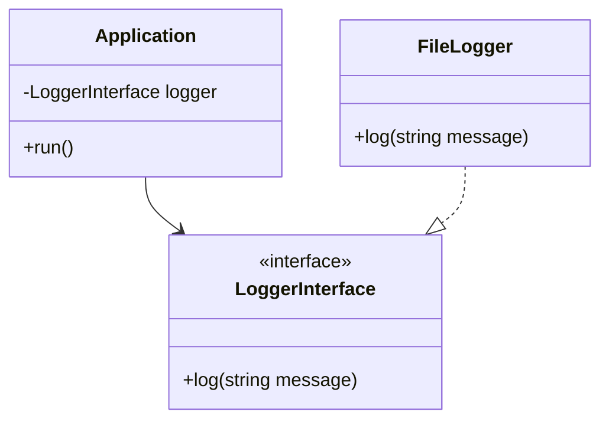

## 9.7 Best Practices for Dependency Management

In the realm of PHP development, managing dependencies effectively is crucial for building robust, maintainable, and scalable applications. Dependency management involves controlling how different parts of your application interact with each other, ensuring that changes in one part do not adversely affect others. Let's delve into the best practices for dependency management in PHP, focusing on using interfaces for abstraction, avoiding tight coupling, designing for testability, and maintaining consistency.

### Use Interfaces for Abstraction

**Program to an Interface, Not an Implementation**

One of the foundational principles of object-oriented design is to program to an interface rather than an implementation. This practice promotes flexibility and scalability by allowing different implementations to be swapped without affecting the rest of the application.

#### Why Use Interfaces?

- **Decoupling**: Interfaces help decouple the code, making it easier to change implementations without affecting dependent code.
- **Flexibility**: They allow for multiple implementations, which can be selected at runtime.
- **Testability**: Interfaces make it easier to mock dependencies during testing.

#### Example: Using Interfaces in PHP

```php
<?php

interface LoggerInterface {
    public function log(string $message): void;
}

class FileLogger implements LoggerInterface {
    public function log(string $message): void {
        // Log message to a file
        echo "Logging to a file: $message\n";
    }
}

class Application {
    private LoggerInterface $logger;

    public function __construct(LoggerInterface $logger) {
        $this->logger = $logger;
    }

    public function run(): void {
        $this->logger->log("Application is running");
    }
}

// Usage
$logger = new FileLogger();
$app = new Application($logger);
$app->run();
```

In this example, the `Application` class depends on the `LoggerInterface`, not a specific logger implementation. This allows us to easily switch to a different logger, such as a `DatabaseLogger`, without modifying the `Application` class.

### Avoid Tight Coupling

**Classes Should Not Instantiate Their Dependencies**

Tight coupling occurs when classes are directly dependent on specific implementations, making it difficult to change or replace those implementations. To avoid tight coupling, classes should not be responsible for instantiating their dependencies.

#### Dependency Injection

Dependency Injection (DI) is a design pattern that helps achieve loose coupling by injecting dependencies into a class rather than having the class create them. There are three common types of dependency injection:

- **Constructor Injection**: Dependencies are provided through the class constructor.
- **Setter Injection**: Dependencies are provided through setter methods.
- **Interface Injection**: Dependencies are provided through an interface.

#### Example: Constructor Injection

```php
<?php

class DatabaseConnection {
    // Database connection logic
}

class UserRepository {
    private DatabaseConnection $dbConnection;

    public function __construct(DatabaseConnection $dbConnection) {
        $this->dbConnection = $dbConnection;
    }

    public function findUserById(int $id) {
        // Use $this->dbConnection to find a user
    }
}

// Usage
$dbConnection = new DatabaseConnection();
$userRepo = new UserRepository($dbConnection);
```

In this example, the `UserRepository` class receives its `DatabaseConnection` dependency through the constructor, promoting loose coupling.

### Design for Testability

**Dependencies Can Be Mocked or Stubbed in Tests**

Designing for testability means structuring your code in a way that makes it easy to test. By using dependency injection and interfaces, you can easily mock or stub dependencies in your tests.

#### Example: Mocking Dependencies

```php
<?php

use PHPUnit\Framework\TestCase;

class ApplicationTest extends TestCase {
    public function testRun() {
        $loggerMock = $this->createMock(LoggerInterface::class);
        $loggerMock->expects($this->once())
                   ->method('log')
                   ->with($this->equalTo('Application is running'));

        $app = new Application($loggerMock);
        $app->run();
    }
}
```

In this PHPUnit test, we create a mock of the `LoggerInterface` and verify that the `log` method is called with the expected message. This allows us to test the `Application` class in isolation.

### Consistency

**Use a Consistent Injection Method Throughout the Application**

Consistency in how dependencies are injected and managed across the application is crucial for maintainability and readability. Choose a dependency injection method (constructor, setter, or interface) and apply it consistently.

#### Example: Consistent Constructor Injection

```php
<?php

class ServiceA {
    private DependencyA $dependencyA;

    public function __construct(DependencyA $dependencyA) {
        $this->dependencyA = $dependencyA;
    }
}

class ServiceB {
    private DependencyB $dependencyB;

    public function __construct(DependencyB $dependencyB) {
        $this->dependencyB = $dependencyB;
    }
}

// Usage
$dependencyA = new DependencyA();
$serviceA = new ServiceA($dependencyA);

$dependencyB = new DependencyB();
$serviceB = new ServiceB($dependencyB);
```

By consistently using constructor injection, we ensure that all dependencies are managed in a uniform manner, making the codebase easier to understand and maintain.

### Visualizing Dependency Management

To better understand the flow of dependencies in an application, let's visualize it using a class diagram.



This diagram illustrates how the `Application` class depends on the `LoggerInterface`, and the `FileLogger` implements this interface.

### Try It Yourself

Experiment with the code examples provided by modifying the implementations or adding new features. For instance, try creating a `DatabaseLogger` class that logs messages to a database and swap it with the `FileLogger` in the `Application` class. Observe how the application behavior changes without modifying the core logic.

### References and Links

- [PHP: Interfaces](https://www.php.net/manual/en/language.oop5.interfaces.php)
- [PHP: Dependency Injection](https://www.php.net/manual/en/language.oop5.decon.php)
- [PHPUnit Documentation](https://phpunit.de/documentation.html)

### Knowledge Check

- What is the benefit of programming to an interface?
- How does dependency injection promote loose coupling?
- Why is consistency important in dependency management?
- How can you mock dependencies in PHP tests?

### Embrace the Journey

Remember, mastering dependency management is a journey. As you continue to apply these best practices, you'll find your PHP applications becoming more flexible, maintainable, and testable. Keep experimenting, stay curious, and enjoy the process of refining your skills!

## Quiz: Best Practices for Dependency Management



### What is the primary benefit of using interfaces in dependency management?

- [x] Decoupling code from specific implementations
- [ ] Increasing code complexity
- [ ] Reducing the number of classes
- [ ] Making code harder to test

> **Explanation:** Interfaces decouple code from specific implementations, allowing for flexibility and easier maintenance.

### Which type of dependency injection involves providing dependencies through the constructor?

- [x] Constructor Injection
- [ ] Setter Injection
- [ ] Interface Injection
- [ ] Method Injection

> **Explanation:** Constructor Injection involves providing dependencies through the class constructor.

### How does dependency injection help in testing?

- [x] By allowing dependencies to be mocked or stubbed
- [ ] By making code harder to test
- [ ] By increasing the number of dependencies
- [ ] By reducing test coverage

> **Explanation:** Dependency injection allows dependencies to be mocked or stubbed, making it easier to test classes in isolation.

### Why is consistency important in dependency management?

- [x] It ensures uniformity and maintainability
- [ ] It increases code complexity
- [ ] It reduces flexibility
- [ ] It makes code harder to read

> **Explanation:** Consistency ensures that dependencies are managed in a uniform manner, improving maintainability and readability.

### What is tight coupling?

- [x] When classes are directly dependent on specific implementations
- [ ] When classes have no dependencies
- [ ] When classes are loosely connected
- [ ] When classes use interfaces

> **Explanation:** Tight coupling occurs when classes are directly dependent on specific implementations, making changes difficult.

### Which of the following is NOT a type of dependency injection?

- [ ] Constructor Injection
- [ ] Setter Injection
- [ ] Interface Injection
- [x] Static Injection

> **Explanation:** Static Injection is not a recognized type of dependency injection.

### What is the role of a dependency injection container?

- [x] To manage and inject dependencies automatically
- [ ] To increase code complexity
- [ ] To reduce the number of dependencies
- [ ] To make code harder to test

> **Explanation:** A dependency injection container manages and injects dependencies automatically, simplifying dependency management.

### How can you achieve loose coupling in PHP?

- [x] By using interfaces and dependency injection
- [ ] By using global variables
- [ ] By hardcoding dependencies
- [ ] By avoiding interfaces

> **Explanation:** Loose coupling can be achieved by using interfaces and dependency injection, which decouple classes from specific implementations.

### What is the benefit of designing for testability?

- [x] It makes it easier to test code in isolation
- [ ] It increases code complexity
- [ ] It reduces test coverage
- [ ] It makes code harder to read

> **Explanation:** Designing for testability makes it easier to test code in isolation, improving test coverage and reliability.

### True or False: Dependency injection can only be achieved through constructor injection.

- [ ] True
- [x] False

> **Explanation:** Dependency injection can be achieved through constructor injection, setter injection, and interface injection.


