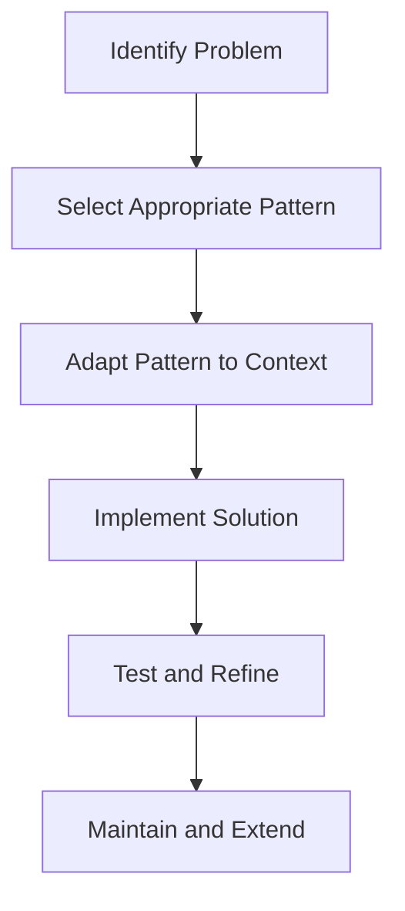

## 1.1 What are Design Patterns?

In the realm of software engineering, design patterns play a pivotal role in shaping robust and maintainable software architectures. As we delve into the world of design patterns, particularly in Python, we aim to unravel their essence, purpose, and application. This guide will provide you with a comprehensive understanding of design patterns, their components, classifications, and their relevance to Python programming.

### Introduction to Design Patterns

Design patterns are essentially reusable solutions to common problems that occur in software design. They are not ready-to-use code snippets but rather templates that can be adapted to solve specific issues within a given context. The concept of design patterns was popularized by the "Gang of Four" (Erich Gamma, Richard Helm, Ralph Johnson, and John Vlissides) in their seminal book, "Design Patterns: Elements of Reusable Object-Oriented Software."

#### Definition of Design Patterns

A design pattern is a general repeatable solution to a commonly occurring problem within a given context in software design. It is a description or template for how to solve a problem that can be used in many different situations. Design patterns provide a standard terminology and are specific to particular scenarios.

### Purpose and Importance of Design Patterns

Design patterns serve several critical purposes in software development:

1. **Efficient Problem-Solving**: By leveraging proven solutions, developers can solve design problems more efficiently. Patterns encapsulate best practices that have been refined over time, reducing the need to reinvent the wheel.

2. **Enhanced Communication**: Design patterns provide a shared vocabulary among developers. When a team discusses a "Singleton" or "Observer," everyone understands the concept, which facilitates clearer communication and collaboration.

3. **Improved Code Maintainability**: Patterns often lead to code that is easier to understand and maintain. They encourage the use of well-structured, modular designs that are easier to extend and refactor.

4. **Facilitation of Design Reuse**: Patterns allow for the reuse of design ideas across different projects, promoting consistency and reducing development time.

### Components of a Design Pattern

Each design pattern typically consists of several key components:

- **Name**: A meaningful identifier that conveys the essence of the pattern.
- **Problem**: A description of the problem the pattern addresses, including its context and forces.
- **Solution**: A general arrangement of elements (classes, objects, interfaces) that solve the problem.
- **Consequences**: The results and trade-offs of applying the pattern, including its impact on a system's flexibility, scalability, and performance.

Let's break these components down further:

#### Name

The name of a design pattern is crucial as it provides a common language for developers to discuss design solutions. For example, names like "Factory Method" or "Decorator" immediately convey specific design strategies.

#### Problem

The problem component outlines the issue the pattern aims to solve. It includes the context in which the problem occurs and the forces that must be balanced. Understanding the problem is essential to applying the pattern effectively.

#### Solution

The solution describes the core of the pattern. It provides a blueprint for how to solve the problem, detailing the relationships and interactions between classes or objects. It's important to note that the solution is abstract and needs to be adapted to fit the specific needs of a project.

#### Consequences

Consequences highlight the results of applying the pattern, including both benefits and potential drawbacks. This component helps developers understand the trade-offs involved and decide whether the pattern is suitable for their situation.

### Classification of Design Patterns

Design patterns are broadly classified into three main categories: Creational, Structural, and Behavioral patterns. Each category addresses different aspects of software design.

#### Creational Patterns

Creational patterns focus on the process of object creation. They help make a system independent of how its objects are created, composed, and represented. Common creational patterns include:

- **Singleton**: Ensures a class has only one instance and provides a global point of access to it.
- **Factory Method**: Defines an interface for creating an object but lets subclasses alter the type of objects that will be created.
- **Builder**: Separates the construction of a complex object from its representation, allowing the same construction process to create different representations.

#### Structural Patterns

Structural patterns deal with object composition and typically help ensure that if one part of a system changes, the entire system doesn't need to do so. They focus on how classes and objects are composed to form larger structures. Examples include:

- **Adapter**: Allows incompatible interfaces to work together by wrapping an existing class with a new interface.
- **Composite**: Composes objects into tree structures to represent part-whole hierarchies, allowing clients to treat individual objects and compositions uniformly.
- **Decorator**: Attaches additional responsibilities to an object dynamically, providing a flexible alternative to subclassing for extending functionality.

#### Behavioral Patterns

Behavioral patterns are concerned with algorithms and the assignment of responsibilities between objects. They describe not just patterns of objects or classes but also the patterns of communication between them. Examples include:

- **Observer**: Defines a one-to-many dependency between objects so that when one object changes state, all its dependents are notified and updated automatically.
- **Strategy**: Defines a family of algorithms, encapsulates each one, and makes them interchangeable, allowing the algorithm to vary independently from clients that use it.
- **Command**: Encapsulates a request as an object, thereby allowing for parameterization of clients with queues, requests, and operations.

### Examples of Common Design Patterns

To give you a taste of what design patterns entail, let's briefly describe a few common ones:

- **Singleton**: Ensures a class has only one instance and provides a global point of access to it. This is useful for managing shared resources like configuration settings or connection pools.

- **Observer**: Used when there is a one-to-many relationship between objects, such as when an object should notify other objects without making assumptions about who those objects are. This is commonly used in event handling systems.

- **Strategy**: Allows a class's behavior or its algorithm to be changed at runtime. This pattern is particularly useful for implementing different algorithms based on the context.

### Misconceptions and Clarifications

Design patterns are often misunderstood as rigid rules that must be followed. However, it's important to clarify that:

- **Design Patterns are Guidelines**: They are not mandatory rules but guidelines to be applied judiciously. The goal is to solve problems effectively, not to force a pattern where it doesn't fit.

- **Patterns are Not Code**: Patterns are templates for solving problems, not concrete code. They require adaptation to fit the specific needs of a project.

- **Not All Problems Need a Pattern**: While design patterns are powerful tools, not every problem requires a pattern-based solution. Overuse can lead to unnecessary complexity.

### Relevance to Python

Python, with its dynamic nature and rich set of features, offers unique opportunities and challenges in implementing design patterns. Some patterns may be implemented differently in Python due to its language features, such as first-class functions, dynamic typing, and powerful built-in libraries.

For example, the Singleton pattern can be implemented using Python's module system, which naturally supports single-instance modules. Similarly, Python's decorators provide a straightforward way to implement the Decorator pattern.

### Visual Aids

To better understand the concept of design patterns, let's visualize how they fit into the software development process:

**Diagram Description**: This flowchart illustrates the process of applying design patterns in software development, starting from identifying the problem to maintaining and extending the solution.

### Conclusion

Design patterns are invaluable tools in the software engineer's toolkit, offering reusable solutions to common design problems. They facilitate efficient problem-solving, enhance communication, and improve code maintainability. As we continue our journey into the world of design patterns, we will explore their history and evolution, gaining a deeper understanding of their role in modern software development.

Remember, this is just the beginning. As you progress, you'll build more complex and interactive systems. Keep experimenting, stay curious, and enjoy the journey!

## Quiz Time!



### What is a design pattern in software engineering?

- [x] A general repeatable solution to a commonly occurring problem within a given context
- [ ] A specific code implementation for solving a problem
- [ ] A mandatory rule for software design
- [ ] A programming language feature

> **Explanation:** A design pattern is a general repeatable solution to a commonly occurring problem within a given context in software design.

### Which component of a design pattern provides a blueprint for solving a problem?

- [ ] Name
- [ ] Problem
- [x] Solution
- [ ] Consequences

> **Explanation:** The solution component of a design pattern provides a blueprint for solving the problem.

### What is the primary purpose of design patterns?

- [ ] To enforce strict coding standards
- [x] To provide reusable solutions to common design problems
- [ ] To replace all programming languages
- [ ] To eliminate the need for testing

> **Explanation:** The primary purpose of design patterns is to provide reusable solutions to common design problems.

### Which category of design patterns focuses on object creation?

- [x] Creational Patterns
- [ ] Structural Patterns
- [ ] Behavioral Patterns
- [ ] Functional Patterns

> **Explanation:** Creational patterns focus on the process of object creation.

### What is a common misconception about design patterns?

- [ ] They are guidelines
- [ ] They are templates
- [x] They are mandatory rules
- [ ] They are adaptable

> **Explanation:** A common misconception is that design patterns are mandatory rules, but they are actually guidelines.

### How does Python's module system relate to the Singleton pattern?

- [x] It naturally supports single-instance modules
- [ ] It prevents the implementation of Singleton
- [ ] It requires complex code to implement Singleton
- [ ] It is unrelated to Singleton

> **Explanation:** Python's module system naturally supports single-instance modules, which aligns with the Singleton pattern.

### Which design pattern allows behavior to be changed at runtime?

- [ ] Singleton
- [ ] Observer
- [x] Strategy
- [ ] Adapter

> **Explanation:** The Strategy pattern allows a class's behavior or its algorithm to be changed at runtime.

### What is the role of the "Consequences" component in a design pattern?

- [ ] To provide a name for the pattern
- [ ] To describe the problem being solved
- [ ] To outline the solution
- [x] To highlight the results and trade-offs of applying the pattern

> **Explanation:** The "Consequences" component highlights the results and trade-offs of applying the pattern.

### Which pattern is used to notify multiple objects of a state change?

- [ ] Singleton
- [x] Observer
- [ ] Strategy
- [ ] Factory Method

> **Explanation:** The Observer pattern is used when there is a one-to-many relationship between objects, notifying multiple objects of a state change.

### True or False: Design patterns are specific to object-oriented programming.

- [ ] True
- [x] False

> **Explanation:** While many design patterns are associated with object-oriented programming, they can be adapted to other paradigms as well.


