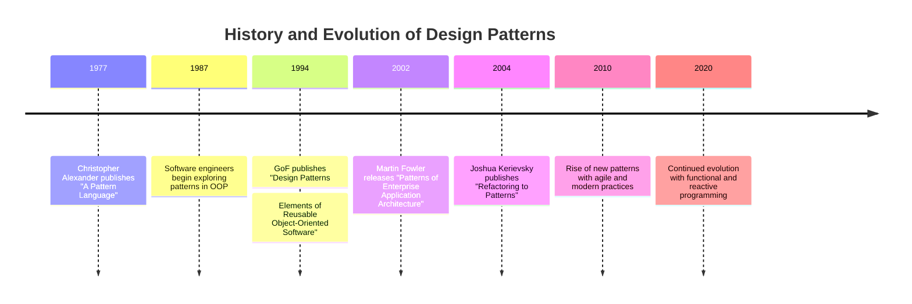

## 1.2 History and Evolution of Design Patterns

Design patterns have become a cornerstone of software engineering, providing reusable solutions to common problems. However, their origins and evolution are deeply rooted in a different discipline—architecture. This section explores the fascinating journey of design patterns from their architectural beginnings to their pivotal role in modern software development, particularly in Python.

### Origins of Design Patterns

The concept of design patterns originated in the field of architecture, primarily through the work of Christopher Alexander. In the late 1970s, Alexander introduced the idea of design patterns in his book "A Pattern Language: Towns, Buildings, Construction." He proposed that architectural design could be broken down into a series of patterns, each representing a solution to a recurring problem in a specific context. These patterns were meant to be used in combination to create harmonious and functional spaces.

#### Christopher Alexander's Influence

Alexander's work emphasized the importance of context and the relationships between patterns. His approach was holistic, focusing on the human experience and the environment. This idea of patterns resonated with software engineers who were grappling with the complexities of designing large-scale systems. The notion that design could be modular, reusable, and context-sensitive was revolutionary and laid the groundwork for the adoption of design patterns in software engineering.

### Transfer to Software Engineering

In the late 1980s and early 1990s, the software engineering community began to explore the applicability of Alexander's ideas to software design. The transfer of these concepts was not straightforward, as software systems differ significantly from physical structures. However, the underlying principle of solving recurring problems with reusable solutions was highly relevant.

#### The Role of Object-Oriented Programming

The rise of object-oriented programming (OOP) during this period provided a fertile ground for the application of design patterns. OOP's focus on encapsulation, inheritance, and polymorphism aligned well with the pattern-based approach. Software engineers started to document and share patterns that addressed common challenges in OOP, such as object creation, communication, and structure.

### The Gang of Four (GoF)

The pivotal moment in the history of design patterns came with the publication of "Design Patterns: Elements of Reusable Object-Oriented Software" in 1994. Authored by Erich Gamma, Richard Helm, Ralph Johnson, and John Vlissides—collectively known as the Gang of Four (GoF)—this book cataloged 23 design patterns that addressed common problems in software design.

#### Impact of the GoF Book

The GoF book had a profound impact on software development. It provided a common vocabulary for discussing design solutions and established a framework for evaluating and applying patterns. The patterns described in the book, such as Singleton, Observer, and Factory Method, became foundational to object-oriented design.

The GoF patterns emphasized the importance of design over coding. They encouraged developers to think about the architecture and structure of their systems before diving into implementation. This shift in mindset contributed to the maturation of software engineering as a discipline.

### Evolution Over Time

Since the publication of the GoF book, design patterns have continued to evolve. As programming paradigms and languages have changed, so too have the patterns used by developers. The rise of agile methodologies and modern development practices has also influenced the evolution of design patterns.

#### New Patterns and Adaptations

With the advent of new programming paradigms, such as functional programming and reactive programming, new patterns have emerged. These patterns address challenges specific to these paradigms, such as managing state and handling asynchronous events. Additionally, existing patterns have been adapted to fit the idioms and features of modern languages.

For example, Python's dynamic typing and first-class functions have led to unique implementations of traditional patterns. The Decorator pattern, for instance, is often implemented using Python's built-in decorator syntax, which allows for elegant and concise code.

### Influence on Software Engineering

Design patterns have significantly shaped best practices in object-oriented design. They provide a toolkit for solving design problems and facilitate communication among developers. Patterns have become an integral part of software engineering education and professional development.

#### Role in Education and Professional Development

Design patterns are commonly taught in computer science curricula, often as part of courses on software design and architecture. Understanding patterns is considered essential for aspiring software engineers, as it equips them with the skills to design robust and maintainable systems.

In the professional world, design patterns are used to guide architectural decisions and code reviews. They serve as a benchmark for evaluating the quality of software designs and are often used as a basis for refactoring legacy code.

### Design Patterns in Python's Context

Python's features, such as dynamic typing, first-class functions, and metaprogramming capabilities, influence the implementation of design patterns. While the core concepts of patterns remain the same, Python's unique characteristics allow for more flexible and expressive implementations.

#### Importance of Historical Context

Understanding the historical context of design patterns is crucial when applying them in Python. While Python offers powerful tools for implementing patterns, it is important to appreciate the original intent and purpose of each pattern. This understanding helps developers make informed decisions about when and how to use patterns in their code.

### Notable Contributors and Publications

Beyond the GoF, many other authors and publications have contributed to the evolution of design patterns. Works such as "Patterns of Enterprise Application Architecture" by Martin Fowler and "Refactoring to Patterns" by Joshua Kerievsky have expanded the catalog of patterns and provided guidance on their application in specific contexts.

#### Contributions from the Open-Source Community

The open-source community has played a significant role in the evolution of design patterns. Developers have shared their experiences and insights, leading to the discovery of new patterns and the refinement of existing ones. Online resources, such as pattern repositories and forums, provide a wealth of knowledge for developers seeking to learn and apply design patterns.

### Visual Timeline

To better understand the evolution of design patterns, let's visualize key milestones in their history. The following timeline highlights significant events and publications that have shaped the development of design patterns.

### Conclusion

The history and evolution of design patterns is a testament to the power of shared knowledge and collaboration. From their origins in architecture to their widespread adoption in software engineering, design patterns have transformed the way we approach software design. As we continue to explore new paradigms and technologies, design patterns will undoubtedly evolve, providing us with the tools to tackle the challenges of tomorrow.

In the next section, we will delve into the importance of design patterns in modern software development, exploring how they contribute to the creation of maintainable and scalable systems.

## Quiz Time!



### Who introduced the concept of design patterns in architecture?

- [x] Christopher Alexander
- [ ] Erich Gamma
- [ ] Martin Fowler
- [ ] Ralph Johnson

> **Explanation:** Christopher Alexander introduced the concept of design patterns in architecture with his book "A Pattern Language."

### What programming paradigm provided fertile ground for the application of design patterns?

- [x] Object-Oriented Programming
- [ ] Functional Programming
- [ ] Procedural Programming
- [ ] Reactive Programming

> **Explanation:** Object-oriented programming (OOP) provided fertile ground for the application of design patterns due to its focus on encapsulation, inheritance, and polymorphism.

### Which book is considered seminal in the field of design patterns?

- [x] "Design Patterns: Elements of Reusable Object-Oriented Software"
- [ ] "Patterns of Enterprise Application Architecture"
- [ ] "Refactoring to Patterns"
- [ ] "A Pattern Language"

> **Explanation:** "Design Patterns: Elements of Reusable Object-Oriented Software," authored by the Gang of Four, is considered seminal in the field of design patterns.

### What is the primary benefit of using design patterns in software development?

- [x] Reusable solutions to common problems
- [ ] Faster code execution
- [ ] Reduced memory usage
- [ ] Increased code complexity

> **Explanation:** The primary benefit of using design patterns is that they provide reusable solutions to common problems, improving code maintainability and scalability.

### How have design patterns evolved with changes in programming paradigms?

- [x] New patterns have emerged, and existing patterns have been adapted.
- [ ] Patterns have become obsolete.
- [ ] Patterns have remained unchanged.
- [ ] Patterns have become less relevant.

> **Explanation:** Design patterns have evolved with changes in programming paradigms, leading to the emergence of new patterns and adaptations of existing ones.

### What role do design patterns play in software engineering education?

- [x] They are essential for understanding robust and maintainable system design.
- [ ] They are optional and rarely taught.
- [ ] They are only relevant for advanced developers.
- [ ] They are primarily used for optimization.

> **Explanation:** Design patterns are considered essential in software engineering education for understanding robust and maintainable system design.

### Which Python feature allows for unique implementations of traditional design patterns?

- [x] Dynamic typing and first-class functions
- [ ] Static typing
- [ ] Low-level memory management
- [ ] Complex syntax

> **Explanation:** Python's dynamic typing and first-class functions allow for unique implementations of traditional design patterns.

### What is the significance of understanding the historical context of design patterns?

- [x] It helps developers make informed decisions about pattern usage.
- [ ] It is only relevant for historians.
- [ ] It is not necessary for modern development.
- [ ] It complicates the application of patterns.

> **Explanation:** Understanding the historical context of design patterns helps developers make informed decisions about when and how to use patterns in their code.

### Which book expanded the catalog of design patterns for enterprise applications?

- [x] "Patterns of Enterprise Application Architecture"
- [ ] "Design Patterns: Elements of Reusable Object-Oriented Software"
- [ ] "Refactoring to Patterns"
- [ ] "A Pattern Language"

> **Explanation:** "Patterns of Enterprise Application Architecture" by Martin Fowler expanded the catalog of design patterns for enterprise applications.

### True or False: The open-source community has played a significant role in the evolution of design patterns.

- [x] True
- [ ] False

> **Explanation:** The open-source community has played a significant role in the evolution of design patterns by sharing experiences and insights, leading to the discovery of new patterns and refinement of existing ones.


