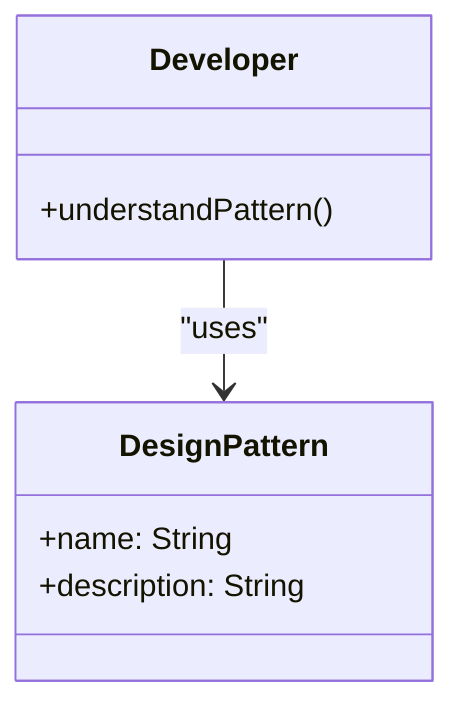

## 1.3 Importance of Design Patterns in Software Development

Design patterns are a cornerstone in the realm of software development, offering a blueprint for solving common design problems. They encapsulate best practices and provide a shared language that enhances communication among developers. In this section, we will delve into why design patterns are indispensable for writing maintainable, scalable, and efficient code, and how they contribute to the overall quality of software projects.

### Enhancing Code Reusability and Maintainability

Design patterns promote code reuse by offering proven solutions to recurring problems. When developers encounter a familiar issue, they can apply a design pattern to resolve it efficiently, rather than reinventing the wheel. This not only saves time but also ensures that the solution is robust and well-tested.

For example, consider the Singleton pattern, which ensures a class has only one instance and provides a global point of access to it. This pattern is widely used in scenarios where a single instance is required to coordinate actions across a system, such as in logging or configuration management.

```python
class Singleton:
    _instance = None

    def __new__(cls, *args, **kwargs):
        if not cls._instance:
            cls._instance = super(Singleton, cls).__new__(cls, *args, **kwargs)
        return cls._instance

singleton1 = Singleton()
singleton2 = Singleton()

print(singleton1 is singleton2)  # Output: True
```

In this example, the Singleton pattern ensures that only one instance of the class exists, promoting reusability and maintainability by centralizing control.

#### Impact on Maintainability

By adhering to standardized approaches, design patterns make code more maintainable. They provide a clear structure that is easier to understand, modify, and extend. This is particularly beneficial in large projects where multiple developers are involved. When everyone follows the same patterns, the codebase becomes more cohesive and less prone to errors.

### Facilitating Better Communication

Design patterns create a common language among developers, simplifying design discussions and documentation. When a developer mentions a "Factory Method" or "Observer Pattern," others immediately understand the concept, reducing the need for lengthy explanations.

#### Shared Vocabulary

This shared vocabulary is crucial in collaborative environments. It allows developers to convey complex ideas succinctly and ensures that everyone is on the same page. This is particularly important when onboarding new team members, as they can quickly grasp the architecture by recognizing familiar patterns.



In the diagram above, we see how developers interact with design patterns, using them to facilitate communication and understanding within a team.

### Improving Design Quality

Design patterns help avoid common pitfalls and anti-patterns by guiding developers towards best practices and robust architectures. They encapsulate decades of experience and provide a roadmap for building high-quality software.

#### Avoiding Anti-Patterns

Anti-patterns are common solutions that can cause more harm than good. By following design patterns, developers can steer clear of these traps and ensure that their code is efficient and maintainable. For instance, the "God Object" anti-pattern, where a single class takes on too many responsibilities, can be avoided by applying the Single Responsibility Principle, often implemented through design patterns.

### Accelerating Development

Using design patterns can significantly speed up the development process. By providing ready-made solutions, patterns reduce the need to solve common problems from scratch. This allows developers to focus on the unique aspects of their projects, accelerating time-to-market.

#### Example: Factory Method

The Factory Method pattern defines an interface for creating objects but lets subclasses alter the type of objects that will be created. This pattern is particularly useful when the exact type of object to be created is determined at runtime.

```python
from abc import ABC, abstractmethod

class Product(ABC):
    @abstractmethod
    def operation(self) -> str:
        pass

class ConcreteProductA(Product):
    def operation(self) -> str:
        return "Result of ConcreteProductA"

class ConcreteProductB(Product):
    def operation(self) -> str:
        return "Result of ConcreteProductB"

class Creator(ABC):
    @abstractmethod
    def factory_method(self) -> Product:
        pass

    def some_operation(self) -> str:
        product = self.factory_method()
        return f"Creator: The same creator's code has just worked with {product.operation()}"

class ConcreteCreatorA(Creator):
    def factory_method(self) -> Product:
        return ConcreteProductA()

class ConcreteCreatorB(Creator):
    def factory_method(self) -> Product:
        return ConcreteProductB()

def client_code(creator: Creator) -> None:
    print(f"Client: I'm not aware of the creator's class, but it still works.\n"
          f"{creator.some_operation()}")

client_code(ConcreteCreatorA())
client_code(ConcreteCreatorB())
```

In this example, the Factory Method pattern allows for the creation of different products without modifying the client code, demonstrating how patterns can streamline development.

### Educational Value

Design patterns play a crucial role in learning object-oriented design and programming. They serve as a tool for teaching design principles and techniques, providing a practical framework for understanding complex concepts.

#### Teaching Design Principles

By studying design patterns, developers gain insights into the principles of good design, such as encapsulation, abstraction, and modularity. These principles are fundamental to creating software that is both flexible and robust.

### Adaptability and Scalability

Design patterns facilitate building systems that can adapt to change and scale effectively. They provide a flexible architecture that can accommodate new requirements without significant rework.

#### Supporting Scalability

Patterns such as the Observer and Strategy patterns are particularly useful in scalable systems. The Observer pattern, for instance, allows objects to be notified of changes in other objects, enabling dynamic and responsive systems.

```python
class Subject:
    def __init__(self):
        self._observers = []

    def attach(self, observer):
        self._observers.append(observer)

    def detach(self, observer):
        self._observers.remove(observer)

    def notify(self):
        for observer in self._observers:
            observer.update(self)

class Observer:
    def update(self, subject):
        pass

class ConcreteObserver(Observer):
    def update(self, subject):
        print("Observer has been notified.")

subject = Subject()
observer = ConcreteObserver()
subject.attach(observer)
subject.notify()
```

This example illustrates how the Observer pattern can be used to create scalable systems by decoupling the subject from its observers.

### Real-World Applications

Design patterns have been widely adopted in the industry, with many successful projects relying on them to improve software quality. For instance, the Model-View-Controller (MVC) pattern is a staple in web development frameworks like Django and Ruby on Rails, providing a clear separation of concerns that enhances maintainability and scalability.

#### Industry Acceptance

The widespread acceptance of design patterns is a testament to their effectiveness. They are taught in computer science curricula and are a key component of many software engineering certifications.

### Potential Drawbacks

While design patterns offer many benefits, overreliance on them can lead to complexity. It's important to apply patterns judiciously, ensuring that they are used to solve real problems rather than being applied for their own sake.

#### Avoiding Overuse

Developers should be mindful of the potential for over-engineering. Patterns should be used as tools, not as rigid rules. The goal is to enhance the design, not to complicate it unnecessarily.

### Conclusion

Design patterns are integral to software development, offering a wealth of benefits that enhance code quality, maintainability, and scalability. They provide a shared language that facilitates communication, accelerate development by offering ready-made solutions, and serve as an educational tool for learning design principles. However, it's important to use them wisely, avoiding overreliance and ensuring that they are applied to solve real problems. As we move forward, we'll explore the specific benefits of using design patterns in Python, building on the foundation we've established here.

## Quiz Time!



### What is one primary benefit of using design patterns in software development?

- [x] They promote code reuse by providing proven solutions.
- [ ] They eliminate the need for documentation.
- [ ] They ensure that all code is bug-free.
- [ ] They replace the need for testing.

> **Explanation:** Design patterns promote code reuse by offering proven solutions to common problems, making code more efficient and maintainable.

### How do design patterns facilitate better communication among developers?

- [x] By creating a common language that simplifies design discussions.
- [ ] By eliminating the need for meetings.
- [ ] By automating code reviews.
- [ ] By replacing all documentation with diagrams.

> **Explanation:** Design patterns create a shared vocabulary that simplifies design discussions and ensures everyone is on the same page.

### What is a potential drawback of overusing design patterns?

- [x] It can lead to unnecessary complexity.
- [ ] It can make code execution slower.
- [ ] It can increase the number of bugs.
- [ ] It can reduce the number of developers needed.

> **Explanation:** Overusing design patterns can lead to unnecessary complexity, making the code harder to understand and maintain.

### Which design pattern ensures a class has only one instance?

- [x] Singleton
- [ ] Observer
- [ ] Factory Method
- [ ] Strategy

> **Explanation:** The Singleton pattern ensures a class has only one instance and provides a global point of access to it.

### How do design patterns contribute to accelerating development?

- [x] By reducing the need to solve common problems from scratch.
- [ ] By eliminating the need for testing.
- [ ] By automating code writing.
- [ ] By reducing the need for documentation.

> **Explanation:** Design patterns accelerate development by providing ready-made solutions to common problems, allowing developers to focus on unique aspects of their projects.

### What role do design patterns play in learning object-oriented design?

- [x] They serve as a tool for teaching design principles and techniques.
- [ ] They replace the need for formal education.
- [ ] They automate the learning process.
- [ ] They eliminate the need for mentors.

> **Explanation:** Design patterns are a valuable tool for teaching design principles and techniques, helping developers understand complex concepts.

### How do design patterns support scalability?

- [x] By providing a flexible architecture that can accommodate new requirements.
- [ ] By reducing the number of servers needed.
- [ ] By automating scaling processes.
- [ ] By eliminating the need for databases.

> **Explanation:** Design patterns support scalability by offering a flexible architecture that can adapt to new requirements without significant rework.

### What is an example of a design pattern that facilitates scalability?

- [x] Observer
- [ ] Singleton
- [ ] Factory Method
- [ ] Template Method

> **Explanation:** The Observer pattern facilitates scalability by allowing objects to be notified of changes in other objects, enabling dynamic and responsive systems.

### True or False: Design patterns are only useful in large projects.

- [ ] True
- [x] False

> **Explanation:** Design patterns are useful in projects of all sizes, providing benefits such as code reuse, maintainability, and improved communication.

### What is the primary goal of using design patterns in software development?

- [x] To enhance code quality, maintainability, and scalability.
- [ ] To eliminate the need for testing.
- [ ] To automate code writing.
- [ ] To replace all documentation with diagrams.

> **Explanation:** The primary goal of using design patterns is to enhance code quality, maintainability, and scalability by providing proven solutions to common problems.


