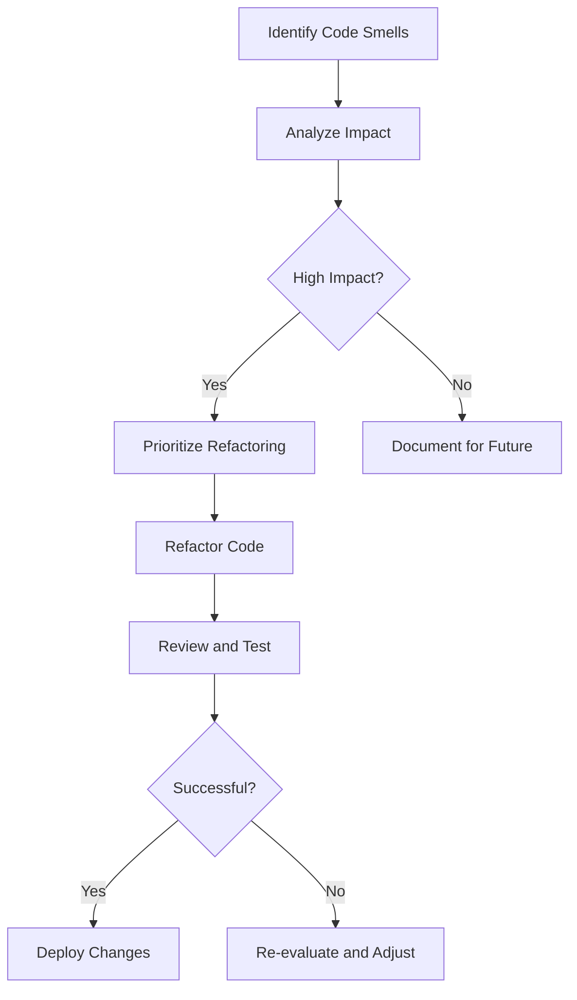

## 10.4.1 Identifying Refactoring Opportunities

In the realm of software development, maintaining clean and efficient code is crucial for the longevity and scalability of a project. Refactoring is the process of restructuring existing code without changing its external behavior, aimed at improving nonfunctional attributes. In this section, we will explore how to identify refactoring opportunities, focusing on code smells and using design patterns to guide improvements.

### Understanding Code Smells

**Code smells** are indicators of potential problems in the code that may hinder its readability, maintainability, or scalability. They are not bugs but rather symptoms of deeper issues within the code structure. Recognizing these smells is the first step towards effective refactoring.

#### Common Code Smells in Python

1. **Duplicated Code**: Repeated code blocks across the application, leading to maintenance challenges.
2. **Long Methods**: Methods that are too lengthy, making them hard to understand and maintain.
3. **Large Classes**: Classes with too many responsibilities, violating the Single Responsibility Principle.
4. **Tight Coupling**: Classes that are overly dependent on each other, reducing flexibility.
5. **Poor Naming Conventions**: Unclear or misleading names that obscure the purpose of variables, methods, or classes.
6. **Lack of Cohesion**: Classes or methods that do not have a clear, focused purpose.
7. **Misuse of Inheritance**: Over-reliance on inheritance where composition would be more appropriate.

### Indicators for Refactoring

Identifying when to refactor is as important as knowing how to refactor. Here are some signs that indicate the need for refactoring:

- **Code Duplication**: If you find yourself copying and pasting code, it's time to refactor. Consider using the DRY (Don't Repeat Yourself) principle to eliminate redundancy.
- **Complex Methods**: Methods that are difficult to understand or modify should be simplified. Break them down into smaller, more manageable pieces.
- **Large Classes**: Classes with too many methods or attributes can be split into smaller classes, each with a single responsibility.
- **Tight Coupling**: If changes in one class necessitate changes in another, consider using design patterns like Dependency Injection or Facade to reduce coupling.
- **Poor Naming**: Refactor names to be descriptive and meaningful, enhancing code readability.
- **Lack of Cohesion**: Ensure each class or method has a clear, singular purpose. This can often be achieved by applying the Single Responsibility Principle.
- **Inheritance Misuse**: If inheritance is leading to complex hierarchies, consider refactoring to use composition instead.

### Analyzing Legacy Code

Legacy code can be daunting, but with the right approach, it can be refactored effectively. Here are strategies to assess and improve existing codebases:

1. **Code Reviews**: Regularly review code with peers to identify areas for improvement.
2. **Static Analysis Tools**: Use tools like `pylint` or `flake8` to automatically detect code smells and style issues.
3. **Unit Tests**: Ensure there are comprehensive tests before refactoring to prevent regression.
4. **Incremental Refactoring**: Tackle refactoring in small, manageable increments rather than large overhauls.

#### Tools for Identifying Problematic Areas

- **Pylint**: A Python tool that checks for errors in Python code, enforces a coding standard, and looks for code smells.
- **Flake8**: A tool for enforcing coding style (PEP 8) and identifying common programming errors.
- **SonarQube**: An open-source platform for continuous inspection of code quality.

### Prioritizing Refactoring Efforts

Not all code smells need to be addressed immediately. Prioritize refactoring efforts based on:

- **Impact**: Focus on areas that will have the greatest impact on code quality and maintainability.
- **Risk**: Consider the risk of introducing bugs during refactoring. High-risk areas may require more thorough testing.
- **Effort**: Estimate the effort required for refactoring and balance it against the potential benefits.

### Documentation and Communication

Effective refactoring requires clear documentation and communication with the team:

- **Document Findings**: Keep a record of identified code smells and proposed refactoring solutions.
- **Communicate with the Team**: Discuss refactoring plans with the team to ensure alignment and gather feedback.
- **Create a Refactoring Plan**: Develop a prioritized backlog of refactoring tasks to guide efforts.

### Real-World Examples

Let's explore a few real-world scenarios where identifying and addressing code smells led to significant improvements:

#### Case Study 1: Reducing Code Duplication

A team working on a web application noticed repeated code blocks for handling user authentication across multiple modules. By refactoring these into a single authentication service, they reduced code duplication and improved maintainability.

```python
def authenticate_user(username, password):
    # Authentication logic
    pass

def login_user(username, password):
    if authenticate_user(username, password):
        # Login logic
        pass

def register_user(username, password):
    if authenticate_user(username, password):
        # Registration logic
        pass

class AuthenticationService:
    def authenticate(self, username, password):
        # Authentication logic
        pass

auth_service = AuthenticationService()

def login_user(username, password):
    if auth_service.authenticate(username, password):
        # Login logic
        pass

def register_user(username, password):
    if auth_service.authenticate(username, password):
        # Registration logic
        pass
```

#### Case Study 2: Simplifying Complex Methods

A data processing script contained a method with over 200 lines of code, making it difficult to understand and modify. By breaking it down into smaller helper methods, the team improved readability and reduced the potential for errors.

```python
def process_data(data):
    # Complex data processing logic
    pass

def clean_data(data):
    # Data cleaning logic
    pass

def transform_data(data):
    # Data transformation logic
    pass

def process_data(data):
    cleaned_data = clean_data(data)
    transformed_data = transform_data(cleaned_data)
    # Further processing
```

### Encouraging a Proactive Approach

Refactoring should be a continuous process rather than a one-time effort. Encourage developers to regularly look for and address refactoring opportunities:

- **Code Reviews**: Use code reviews as an opportunity to identify potential refactoring areas.
- **Pair Programming**: Collaborate with peers to spot code smells and discuss refactoring strategies.
- **Automated Tools**: Integrate static analysis tools into the development workflow to catch issues early.

### Visualizing Refactoring Opportunities

To better understand the process of identifying refactoring opportunities, let's visualize the workflow using a flowchart.



### Try It Yourself

To solidify your understanding of identifying refactoring opportunities, try the following exercises:

1. **Exercise 1**: Identify code smells in a small Python project you have worked on. Document the smells and propose refactoring solutions.
2. **Exercise 2**: Use `pylint` or `flake8` to analyze a codebase and identify areas for improvement. Refactor one of the identified issues.
3. **Exercise 3**: Pair up with a colleague and conduct a code review focused on identifying refactoring opportunities. Discuss potential improvements and document your findings.

### Knowledge Check

To ensure you have grasped the key concepts, here are some questions to consider:

1. What are code smells, and why are they important in identifying refactoring opportunities?
2. How can tools like `pylint` and `flake8` assist in identifying code smells?
3. Why is it important to prioritize refactoring efforts, and what factors should be considered?
4. How can design patterns guide the refactoring process?
5. What role do code reviews and pair programming play in identifying refactoring opportunities?

### Embrace the Journey

Remember, refactoring is an ongoing journey towards cleaner, more maintainable code. By regularly identifying and addressing refactoring opportunities, you contribute to the long-term success of your projects. Keep experimenting, stay curious, and enjoy the process of continuous improvement!

## Quiz Time!



### What is a code smell?

- [x] An indicator of potential problems in the code
- [ ] A bug in the code
- [ ] A feature request
- [ ] A design pattern

> **Explanation:** A code smell is an indicator of potential problems in the code that may hinder its readability, maintainability, or scalability.

### Which of the following is a common code smell?

- [x] Duplicated Code
- [ ] Well-documented code
- [ ] Efficient algorithms
- [ ] Properly named variables

> **Explanation:** Duplicated code is a common code smell that can lead to maintenance challenges.

### What is the DRY principle?

- [x] Don't Repeat Yourself
- [ ] Do Repeat Yourself
- [ ] Don't Refactor Yourself
- [ ] Do Refactor Yourself

> **Explanation:** The DRY principle stands for "Don't Repeat Yourself," emphasizing the elimination of code duplication.

### What tool can be used to identify code smells in Python?

- [x] Pylint
- [ ] Photoshop
- [ ] Excel
- [ ] Word

> **Explanation:** Pylint is a tool that checks for errors in Python code and enforces coding standards.

### Why is it important to prioritize refactoring efforts?

- [x] To focus on areas with the greatest impact
- [ ] To refactor all code at once
- [ ] To avoid any changes
- [ ] To ignore code smells

> **Explanation:** Prioritizing refactoring efforts helps focus on areas that will have the greatest impact on code quality and maintainability.

### What is tight coupling?

- [x] Classes that are overly dependent on each other
- [ ] Classes that are independent
- [ ] Classes that are loosely connected
- [ ] Classes that have no dependencies

> **Explanation:** Tight coupling refers to classes that are overly dependent on each other, reducing flexibility.

### How can design patterns help in refactoring?

- [x] By providing proven solutions to common design problems
- [ ] By introducing new code smells
- [ ] By making code less readable
- [ ] By complicating the code

> **Explanation:** Design patterns provide proven solutions to common design problems, guiding the refactoring process.

### What is the role of code reviews in refactoring?

- [x] To identify potential refactoring areas
- [ ] To introduce new code smells
- [ ] To avoid any changes
- [ ] To ignore code quality

> **Explanation:** Code reviews help identify potential refactoring areas and improve code quality.

### What is the Single Responsibility Principle?

- [x] A class should have only one reason to change
- [ ] A class should have multiple responsibilities
- [ ] A class should never change
- [ ] A class should have no responsibilities

> **Explanation:** The Single Responsibility Principle states that a class should have only one reason to change, ensuring focused responsibilities.

### True or False: Refactoring should be a one-time effort.

- [ ] True
- [x] False

> **Explanation:** Refactoring should be a continuous process rather than a one-time effort, contributing to the long-term success of projects.


