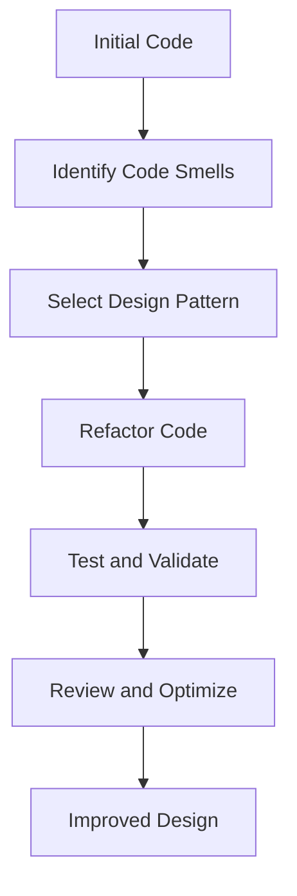

## 10.4.2 Applying Patterns to Improve Design

Refactoring is an essential process in software development that involves restructuring existing code without changing its external behavior. By applying design patterns during refactoring, we can significantly enhance the design, making the codebase more maintainable, scalable, and easier to understand. In this section, we will delve into the strategies for selecting appropriate patterns, the step-by-step refactoring process, practical examples, and the benefits of pattern-based refactoring.

### Selecting the Right Pattern

Choosing the right design pattern is crucial for effective refactoring. Here are some criteria and guidelines to help you select suitable patterns based on specific problems:

#### Criteria for Choosing Design Patterns

1. **Identify the Problem**: Clearly define the problem you are trying to solve. Is it related to object creation, structure, or behavior?
2. **Analyze Code Smells**: Look for common code smells such as duplicated code, long methods, or complex conditionals. These often indicate areas where patterns can be applied.
3. **Consider Flexibility and Extensibility**: Choose patterns that enhance the flexibility and extensibility of your code.
4. **Evaluate Complexity**: Ensure that the pattern does not introduce unnecessary complexity. The goal is to simplify, not complicate.
5. **Understand the Context**: Consider the specific context and constraints of your project, such as performance requirements or team expertise.

#### Mapping Code Smells to Patterns

- **Duplicated Code**: Consider the Template Method or Strategy Pattern to encapsulate varying behaviors.
- **Long Methods**: Use the Command Pattern to encapsulate method logic into separate classes.
- **Complex Conditionals**: Apply the Strategy Pattern to replace conditionals with polymorphic behavior.
- **Tight Coupling**: Use the Observer or Mediator Pattern to decouple components.

### Step-by-Step Refactoring Process

Refactoring with design patterns requires a systematic approach to ensure that the code remains functional and the design is improved. Here is a step-by-step guide:

#### Preparation Steps

1. **Ensure Tests Are in Place**: Before refactoring, make sure you have comprehensive tests that cover the existing functionality. This will help you verify that the behavior remains consistent after changes.
2. **Identify Refactoring Opportunities**: Analyze the codebase to identify areas that could benefit from design patterns.
3. **Select Appropriate Patterns**: Based on the identified problems and code smells, choose the most suitable design patterns.

#### Refactoring Steps

1. **Isolate the Code to Refactor**: Begin by isolating the section of code you plan to refactor. This helps minimize the impact on the rest of the codebase.
2. **Apply the Pattern**: Implement the chosen design pattern. This may involve creating new classes or interfaces, modifying existing ones, or reorganizing code.
3. **Test and Validate**: Run your tests to ensure that the refactored code behaves as expected. Make adjustments as necessary.
4. **Review and Optimize**: Review the refactored code for readability and performance. Optimize as needed without compromising the design.

### Practical Examples

Let's explore some practical examples of refactoring code by applying design patterns. We'll use the Factory Method and Strategy Patterns to demonstrate how they can simplify and improve code design.

#### Example 1: Using Factory Method to Simplify Object Creation

**Before Refactoring:**

```python
class NotificationService:
    def send_notification(self, type, message):
        if type == "email":
            # Send email
            print(f"Sending email: {message}")
        elif type == "sms":
            # Send SMS
            print(f"Sending SMS: {message}")
        else:
            raise ValueError("Unknown notification type")

service = NotificationService()
service.send_notification("email", "Hello, World!")
```

**After Refactoring with Factory Method:**

```python
from abc import ABC, abstractmethod

class Notification(ABC):
    @abstractmethod
    def send(self, message):
        pass

class EmailNotification(Notification):
    def send(self, message):
        print(f"Sending email: {message}")

class SMSNotification(Notification):
    def send(self, message):
        print(f"Sending SMS: {message}")

class NotificationFactory:
    @staticmethod
    def create_notification(type):
        if type == "email":
            return EmailNotification()
        elif type == "sms":
            return SMSNotification()
        else:
            raise ValueError("Unknown notification type")

factory = NotificationFactory()
notification = factory.create_notification("email")
notification.send("Hello, World!")
```

**Explanation:**

- **Before Refactoring**: The `NotificationService` class directly handles the creation and sending of notifications, leading to a violation of the Single Responsibility Principle.
- **After Refactoring**: The Factory Method Pattern is used to delegate the creation of notification objects to a factory class, resulting in a cleaner and more maintainable design.

#### Example 2: Using Strategy Pattern to Replace Conditional Logic

**Before Refactoring:**

```python
class PaymentProcessor:
    def process_payment(self, method, amount):
        if method == "credit_card":
            # Process credit card payment
            print(f"Processing credit card payment of {amount}")
        elif method == "paypal":
            # Process PayPal payment
            print(f"Processing PayPal payment of {amount}")
        else:
            raise ValueError("Unknown payment method")

processor = PaymentProcessor()
processor.process_payment("credit_card", 100)
```

**After Refactoring with Strategy Pattern:**

```python
from abc import ABC, abstractmethod

class PaymentStrategy(ABC):
    @abstractmethod
    def pay(self, amount):
        pass

class CreditCardPayment(PaymentStrategy):
    def pay(self, amount):
        print(f"Processing credit card payment of {amount}")

class PayPalPayment(PaymentStrategy):
    def pay(self, amount):
        print(f"Processing PayPal payment of {amount}")

class PaymentProcessor:
    def __init__(self, strategy: PaymentStrategy):
        self._strategy = strategy

    def process_payment(self, amount):
        self._strategy.pay(amount)

strategy = CreditCardPayment()
processor = PaymentProcessor(strategy)
processor.process_payment(100)
```

**Explanation:**

- **Before Refactoring**: The `PaymentProcessor` class uses conditionals to determine the payment method, making it difficult to extend with new methods.
- **After Refactoring**: The Strategy Pattern encapsulates each payment method in its own class, allowing easy addition of new methods and improving code flexibility.

### Testing During Refactoring

Testing is a critical component of the refactoring process. It ensures that the refactored code maintains the same functionality as the original. Here are some key points to consider:

- **Use Tests to Guide Refactoring**: Tests should validate the behavior of the code before and after refactoring. They act as a safety net, allowing you to make changes confidently.
- **Automate Testing**: Use automated testing frameworks like `unittest` or `pytest` to run tests efficiently.
- **Test Edge Cases**: Ensure that edge cases are covered in your tests to prevent unexpected behavior.
- **Refactor Tests if Necessary**: If the refactoring changes the structure of the code significantly, you may need to update your tests to reflect these changes.

### Benefits of Pattern-Based Refactoring

Applying design patterns during refactoring offers several benefits:

- **Improved Code Readability**: Patterns provide a clear and recognizable structure, making the code easier to read and understand.
- **Enhanced Flexibility**: Patterns like Strategy and Factory Method allow for easy extension and modification of code without affecting existing functionality.
- **Increased Extensibility**: Patterns facilitate the addition of new features by providing a scalable framework.
- **Reduced Code Duplication**: Patterns help eliminate redundant code by encapsulating common behaviors.

### Tools and Techniques

Several tools and techniques can aid in the refactoring process:

- **UML Diagrams**: Use UML diagrams to visualize design changes and understand the relationships between classes and objects.
- **Refactoring Catalogs**: Reference refactoring catalogs or cheat sheets to identify common refactoring techniques and patterns.
- **Code Review Tools**: Utilize code review tools to get feedback from peers and ensure the refactoring aligns with best practices.

### Common Challenges

Refactoring with design patterns can present challenges. Here are some common issues and tips for overcoming them:

- **Increased Complexity**: Introducing patterns can sometimes add complexity. To mitigate this, ensure that the pattern is necessary and adds value.
- **Resistance from Team Members**: Team members may resist changes, especially if they are unfamiliar with design patterns. Encourage collaboration and provide training to build understanding.
- **Incremental Refactoring**: Avoid large-scale refactoring in one go. Instead, refactor incrementally to minimize risk and disruption.

### Encouraging Best Practices

To promote consistent design improvements, consider the following best practices:

- **Continuous Learning**: Stay updated on new design patterns and refactoring techniques through books, articles, and online courses.
- **Knowledge Sharing**: Encourage team members to share their experiences and insights on design patterns and refactoring.
- **Regular Code Reviews**: Conduct regular code reviews to identify refactoring opportunities and ensure adherence to best practices.

### Try It Yourself

To solidify your understanding, try refactoring a piece of code using a design pattern. For example, take a class with complex conditionals and apply the Strategy Pattern to simplify it. Experiment with different patterns and observe how they improve the design.

### Visualizing the Refactoring Process

Below is a visual representation of the refactoring process using design patterns, illustrating the transition from a tightly coupled design to a more modular and flexible architecture.



**Diagram Description**: This flowchart outlines the refactoring process, starting from identifying code smells to achieving an improved design through the application of design patterns.

### Conclusion

Refactoring with design patterns is a powerful technique for enhancing software design. By selecting appropriate patterns and following a systematic process, you can improve code readability, flexibility, and maintainability. Remember, refactoring is an ongoing process, and continuous learning and collaboration are key to achieving consistent design improvements.

## Quiz Time!



### Which of the following is a key benefit of using design patterns during refactoring?

- [x] Improved code readability
- [ ] Increased code complexity
- [ ] Reduced testing requirements
- [ ] Faster execution time

> **Explanation:** Design patterns provide a clear structure, making the code easier to read and understand.


### What is the first step in the refactoring process using design patterns?

- [ ] Apply the pattern
- [ ] Test and validate
- [x] Ensure tests are in place
- [ ] Review and optimize

> **Explanation:** Ensuring tests are in place is crucial to verify that the refactored code maintains the same functionality.


### Which design pattern is suitable for replacing complex conditional logic?

- [ ] Factory Method
- [x] Strategy
- [ ] Observer
- [ ] Singleton

> **Explanation:** The Strategy Pattern encapsulates varying behaviors, making it ideal for replacing complex conditionals.


### What is a common challenge when refactoring with design patterns?

- [ ] Reduced code duplication
- [ ] Enhanced flexibility
- [x] Increased complexity
- [ ] Improved extensibility

> **Explanation:** Introducing patterns can sometimes add complexity, which needs to be managed carefully.


### How can UML diagrams assist in the refactoring process?

- [x] By visualizing design changes
- [ ] By automating code refactoring
- [ ] By reducing code execution time
- [ ] By generating test cases

> **Explanation:** UML diagrams help visualize design changes and understand relationships between classes.


### Which of the following is a criterion for choosing a design pattern?

- [ ] The pattern's popularity
- [x] The specific problem being solved
- [ ] The number of lines of code
- [ ] The programming language used

> **Explanation:** The specific problem being solved is a key criterion for selecting an appropriate design pattern.


### What should be done if refactoring changes the structure of the code significantly?

- [ ] Ignore the changes
- [x] Update the tests
- [ ] Remove the design pattern
- [ ] Increase code comments

> **Explanation:** Tests should be updated to reflect significant changes in the code structure.


### Which pattern is used to simplify object creation logic?

- [x] Factory Method
- [ ] Strategy
- [ ] Observer
- [ ] Command

> **Explanation:** The Factory Method Pattern delegates object creation to a factory class, simplifying the logic.


### What is the role of tests during refactoring?

- [ ] To increase code complexity
- [ ] To reduce code readability
- [x] To ensure consistent behavior
- [ ] To eliminate code duplication

> **Explanation:** Tests ensure that the refactored code maintains the same behavior as the original.


### True or False: Refactoring should be done in large-scale changes to minimize disruption.

- [ ] True
- [x] False

> **Explanation:** Refactoring should be done incrementally to minimize risk and disruption.


