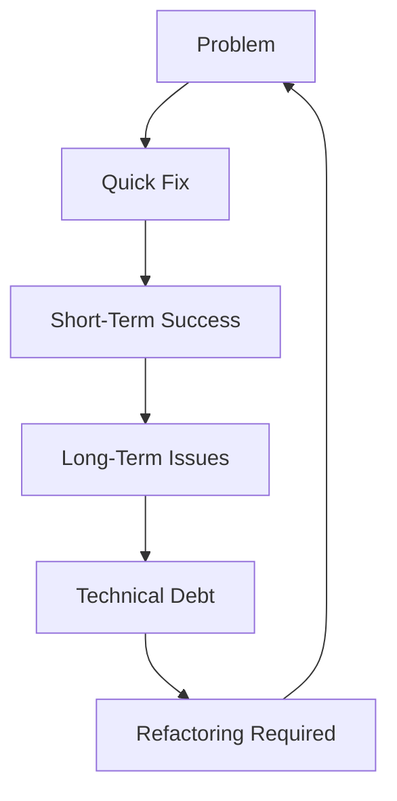

## 11.1 Definition and Impact of Anti-Patterns

In the realm of software engineering, understanding both design patterns and anti-patterns is crucial for creating robust, maintainable, and scalable applications. While design patterns offer proven solutions to common problems, anti-patterns represent the opposite: they are common responses to recurring problems that are ineffective and counterproductive.

### Introducing Anti-Patterns

#### What are Anti-Patterns?

Anti-patterns are solutions that may seem effective at first glance but ultimately lead to negative consequences in software development. They are the "path of least resistance" that developers might take, often due to lack of experience, pressure to deliver quickly, or misunderstanding of the problem at hand. Unlike design patterns, which are well-documented and widely accepted as best practices, anti-patterns are cautionary tales of what not to do.

#### Origins and Relevance

The term "anti-pattern" was popularized by Andrew Koenig in his 1995 article "Patterns and Antipatterns." It gained further traction with the publication of the book "AntiPatterns: Refactoring Software, Architectures, and Projects in Crisis" by William J. Brown et al. This concept is highly relevant in modern development as it helps teams identify and rectify poor practices that can lead to technical debt and project failure.

### Importance of Recognizing Anti-Patterns

#### Negative Impact on Code Quality

Anti-patterns can significantly degrade code quality, making it difficult to understand, maintain, and extend. They often lead to code that is brittle, tightly coupled, and riddled with bugs. This can result in increased time and effort for debugging and refactoring, ultimately slowing down development.

#### Contribution to Technical Debt

Technical debt refers to the implied cost of additional rework caused by choosing an easy solution now instead of a better approach that would take longer. Anti-patterns are a major contributor to technical debt, as they create a backlog of issues that need to be addressed later, often at a higher cost.

#### Complicating Future Development

When anti-patterns are present in a codebase, they can complicate future development efforts. New features become harder to implement, and the risk of introducing new bugs increases. This can lead to a vicious cycle where developers are constantly firefighting instead of innovating.

### Contrast with Design Patterns

#### Misapplied Design Patterns

Design patterns can become anti-patterns when misapplied. For example, using the Singleton pattern excessively can lead to a God Object anti-pattern, where a single class takes on too many responsibilities. It's crucial to understand the context and intent of a design pattern to avoid turning it into an anti-pattern.

#### Fine Line Between Effective Solutions and Harmful Practices

The line between a design pattern and an anti-pattern can be thin. For instance, the use of inheritance can be beneficial in certain scenarios but can lead to the Fragile Base Class anti-pattern if not managed properly. Developers must exercise caution and judgment to ensure that their solutions remain effective.

### Consequences of Anti-Patterns

#### Real-World Scenarios

In real-world scenarios, anti-patterns can lead to project failures or necessitate significant refactoring efforts. For example, a project that relies heavily on copy-paste programming may become unmanageable as the codebase grows, leading to duplicated bugs and inconsistent behavior across the application.

#### Case Study: The Big Ball of Mud

The "Big Ball of Mud" is a classic anti-pattern where a system lacks a perceivable architecture. This often occurs in projects that have evolved over time without a clear design strategy. The result is a tangled mess of code that is difficult to understand and modify. Teams working on such projects often face high turnover rates, as developers become frustrated with the lack of structure.

### Encouragement to Vigilance

#### Awareness and Prevention

Developers should remain vigilant against anti-patterns by continuously learning and staying informed about best practices. Code reviews are an effective way to detect and prevent anti-patterns, as they provide an opportunity for team members to share knowledge and identify potential issues early.

#### Continuous Learning

Encouraging a culture of continuous learning and improvement can help teams avoid anti-patterns. This includes attending workshops, reading relevant literature, and participating in online communities where developers share insights and experiences.

### Visual Aids and Examples

#### Diagram: Anti-Pattern Lifecycle



*Caption: This diagram illustrates the lifecycle of an anti-pattern, starting with a problem and leading to a quick fix that eventually results in long-term issues and technical debt.*

#### Code Example: Singleton Misuse

```python
class Singleton:
    _instance = None

    def __new__(cls, *args, **kwargs):
        if not cls._instance:
            cls._instance = super(Singleton, cls).__new__(cls, *args, **kwargs)
        return cls._instance

class GlobalState(Singleton):
    def __init__(self):
        self.state = {}

global_state = GlobalState()
global_state.state['key'] = 'value'
```

*Explanation: In this example, the Singleton pattern is misused to manage global state, leading to tight coupling and testing difficulties. A better approach would be to use dependency injection to manage state.*

### Encouragement to Experiment

#### Try It Yourself

To better understand the impact of anti-patterns, try modifying the Singleton misuse example above. Experiment with refactoring the code to use dependency injection instead of a global state. Notice how this change improves testability and reduces coupling.

### Knowledge Check

#### Key Takeaways

- Anti-patterns are ineffective solutions that can degrade code quality and increase technical debt.
- Recognizing and avoiding anti-patterns is crucial for maintaining a healthy codebase.
- Misapplied design patterns can become anti-patterns, highlighting the importance of understanding context and intent.
- Continuous learning and code reviews are effective strategies for detecting and preventing anti-patterns.

### Embrace the Journey

Remember, understanding anti-patterns is just the beginning. As you progress in your software development journey, you'll encounter various challenges that require thoughtful solutions. Stay curious, keep learning, and enjoy the process of becoming a more skilled and knowledgeable developer.

## Quiz Time!



### What is an anti-pattern in software development?

- [x] A common but ineffective solution to a recurring problem
- [ ] A well-documented best practice for solving a problem
- [ ] A design pattern that is always beneficial
- [ ] A type of algorithm used in software engineering

> **Explanation:** Anti-patterns are common solutions that seem effective but ultimately lead to poor practices and negative consequences.

### How do anti-patterns differ from design patterns?

- [x] Anti-patterns are ineffective solutions, while design patterns are proven solutions.
- [ ] Anti-patterns are always beneficial, while design patterns are not.
- [ ] Anti-patterns are used in hardware design, while design patterns are used in software.
- [ ] Anti-patterns are a subset of design patterns.

> **Explanation:** Anti-patterns represent ineffective solutions, whereas design patterns are established best practices for solving common problems.

### What is a major consequence of anti-patterns?

- [x] Increased technical debt
- [ ] Improved code readability
- [ ] Faster development times
- [ ] Reduced code complexity

> **Explanation:** Anti-patterns contribute to technical debt by creating a backlog of issues that need to be addressed later.

### Which of the following can turn a design pattern into an anti-pattern?

- [x] Misapplication of the pattern
- [ ] Proper understanding of the pattern
- [ ] Correct implementation of the pattern
- [ ] Appropriate use of the pattern

> **Explanation:** Misapplying a design pattern can lead to it becoming an anti-pattern, as it may no longer solve the intended problem effectively.

### What is a common result of the "Big Ball of Mud" anti-pattern?

- [x] Lack of perceivable architecture
- [ ] Highly modular code
- [ ] Clear separation of concerns
- [ ] Efficient code execution

> **Explanation:** The "Big Ball of Mud" anti-pattern results in a system with no clear architecture, making it difficult to understand and modify.

### Why is it important to recognize anti-patterns?

- [x] To maintain code quality and prevent technical debt
- [ ] To increase the complexity of the codebase
- [ ] To ensure faster project delivery
- [ ] To reduce the need for code reviews

> **Explanation:** Recognizing anti-patterns helps maintain code quality and prevent the accumulation of technical debt.

### How can developers prevent the occurrence of anti-patterns?

- [x] Through continuous learning and code reviews
- [ ] By ignoring best practices
- [ ] By avoiding design patterns altogether
- [ ] By focusing solely on quick fixes

> **Explanation:** Continuous learning and code reviews are effective strategies for detecting and preventing anti-patterns.

### What is a potential risk of using Singleton for global state management?

- [x] Tight coupling and difficulty in testing
- [ ] Improved modularity
- [ ] Enhanced code readability
- [ ] Simplified dependency management

> **Explanation:** Using Singleton for global state management can lead to tight coupling and make testing more difficult.

### What is the main focus of anti-patterns?

- [x] Highlighting ineffective solutions and practices
- [ ] Providing a blueprint for solving complex problems
- [ ] Offering a framework for software design
- [ ] Ensuring optimal performance

> **Explanation:** Anti-patterns focus on highlighting ineffective solutions and practices that can lead to negative consequences.

### True or False: Anti-patterns are always intentional.

- [ ] True
- [x] False

> **Explanation:** Anti-patterns are not always intentional; they often arise from a lack of experience or pressure to deliver quickly.


