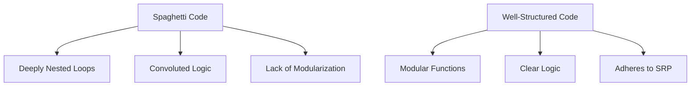

## 11.2.1 Spaghetti Code

Spaghetti code is a term that has become synonymous with poorly structured and difficult-to-maintain code. It is characterized by complex and tangled control structures that make it challenging to read, understand, and modify. In this section, we will delve into the nature of spaghetti code, its causes, impacts, and how we can improve our codebase by refactoring and applying design patterns in Python.

### Defining Spaghetti Code

Spaghetti code arises from unstructured programming practices where the code lacks a clear organization. It often results from a lack of planning and foresight during the development process. Here are some typical characteristics of spaghetti code:

- **Excessive Nesting**: Deeply nested loops and conditional statements that make the code difficult to follow.
- **Lack of Modularization**: Code that is not broken down into functions or classes, leading to large monolithic blocks.
- **Convoluted Logic**: Complex and intertwined logic that is hard to decipher.
- **Inconsistent Naming**: Variables and functions with unclear or inconsistent names that add to the confusion.

Spaghetti code is often the result of quick fixes and patches applied over time without considering the overall structure and design of the codebase.

### Causes of Spaghetti Code

Several factors contribute to the creation of spaghetti code:

- **Rushed Development**: Under tight deadlines, developers may prioritize delivering features quickly over writing clean and maintainable code.
- **Lack of Planning**: Without a clear design or architecture, code can quickly become disorganized as new features are added.
- **Absence of Coding Standards**: Without established guidelines, developers may write code in inconsistent styles, leading to a fragmented codebase.
- **Feature Creep**: Continuously adding features without refactoring existing code can lead to a tangled mess.
- **Inexperienced Developers**: Developers who are new to programming may not yet have the skills to write structured and organized code.

### Impact on Projects

Spaghetti code can have several negative impacts on a project:

- **Difficult Debugging**: The tangled nature of spaghetti code makes it hard to trace bugs and understand how different parts of the code interact.
- **Challenging Testing**: Writing tests for spaghetti code is difficult because of its complexity and lack of modularity.
- **Hindered Feature Development**: Adding new features becomes risky and time-consuming as changes in one part of the code can have unforeseen effects elsewhere.
- **Increased Bug Introduction**: The complexity and lack of clarity increase the likelihood of introducing new bugs when making changes.

### Python Examples of Spaghetti Code

Let's look at some examples of spaghetti code in Python to illustrate these issues.

#### Example 1: Deeply Nested Loops

```python
def process_data(data):
    for item in data:
        if item.is_valid():
            for sub_item in item.sub_items:
                if sub_item.needs_processing():
                    for value in sub_item.values:
                        if value > 10:
                            result = value * 2
                            print(f"Processed value: {result}")
```

In this example, the logic is deeply nested, making it difficult to follow. Each level of nesting adds complexity and reduces readability.

#### Example 2: Convoluted Conditional Statements

```python
def calculate_discount(price, customer_type, is_holiday):
    if customer_type == 'regular':
        if is_holiday:
            discount = 0.1
        else:
            if price > 100:
                discount = 0.05
            else:
                discount = 0.02
    elif customer_type == 'member':
        if is_holiday:
            discount = 0.15
        else:
            discount = 0.1
    else:
        discount = 0
    return price * (1 - discount)
```

This code snippet shows how convoluted logic can make it difficult to understand the conditions under which different discounts are applied.

### Strategies for Improvement

To improve spaghetti code, we can employ several strategies:

#### Refactoring Techniques

1. **Break Code into Functions and Classes**: Divide large blocks of code into smaller, reusable functions or classes. This helps in isolating functionality and improving readability.

   ```python
   # Refactored version of the nested loop example
   def process_value(value):
       if value > 10:
           result = value * 2
           print(f"Processed value: {result}")

   def process_sub_item(sub_item):
       if sub_item.needs_processing():
           for value in sub_item.values:
               process_value(value)

   def process_item(item):
       if item.is_valid():
           for sub_item in item.sub_items:
               process_sub_item(sub_item)

   def process_data(data):
       for item in data:
           process_item(item)
   ```

2. **Use Design Patterns**: Introduce design patterns to provide structure and organization to the code. Patterns such as Strategy, Factory, and Observer can help manage complexity.

3. **Adhere to the Single Responsibility Principle (SRP)**: Ensure that each function or class has a single responsibility. This reduces the likelihood of creating complex and intertwined logic.

#### Tools and Practices

- **Linting Tools**: Use tools like `pylint` or `flake8` to detect code complexity and style issues. These tools can help identify areas of the code that need refactoring.
- **Regular Code Reviews**: Conduct regular code reviews to ensure adherence to coding standards and identify potential issues early.
- **Pair Programming**: Engage in pair programming to encourage collaboration and knowledge sharing, which can lead to better code quality.

### Visual Aids

To better understand the difference between spaghetti code and well-structured code, let's look at a diagram illustrating these concepts.



**Diagram Description**: The diagram above contrasts spaghetti code with well-structured code. Spaghetti code is characterized by deeply nested loops, convoluted logic, and a lack of modularization. In contrast, well-structured code consists of modular functions, clear logic, and adherence to the Single Responsibility Principle.

### Knowledge Check

- **Question**: What are the main characteristics of spaghetti code?
- **Question**: How can design patterns help in refactoring spaghetti code?
- **Question**: What role do linting tools play in identifying spaghetti code?

### Embrace the Journey

Remember, refactoring spaghetti code is a journey, not a destination. As you progress in your development career, you'll encounter various challenges that will test your ability to write clean and maintainable code. Keep experimenting, stay curious, and enjoy the journey!

## Quiz Time!



### What is a primary characteristic of spaghetti code?

- [x] Excessive nesting
- [ ] Modular structure
- [ ] Clear logic
- [ ] Adherence to SRP

> **Explanation:** Spaghetti code is often characterized by excessive nesting, which makes it difficult to follow and maintain.

### Which of the following is NOT a cause of spaghetti code?

- [ ] Rushed development
- [x] Adherence to coding standards
- [ ] Lack of planning
- [ ] Feature creep

> **Explanation:** Adherence to coding standards helps prevent spaghetti code by promoting consistency and organization.

### What impact does spaghetti code have on a project?

- [x] Difficult debugging
- [ ] Easier testing
- [ ] Faster feature development
- [ ] Reduced bug introduction

> **Explanation:** Spaghetti code makes debugging difficult due to its complex and tangled structure.

### How can design patterns help refactor spaghetti code?

- [x] By providing structure and organization
- [ ] By increasing code complexity
- [ ] By removing all functions
- [ ] By adding more nested loops

> **Explanation:** Design patterns provide a structured approach to organizing code, reducing complexity and improving maintainability.

### What is a recommended tool for detecting code complexity?

- [x] `pylint`
- [ ] `numpy`
- [ ] `matplotlib`
- [ ] `requests`

> **Explanation:** `pylint` is a linting tool that can detect code complexity and style issues in Python.

### Which principle should be adhered to when refactoring spaghetti code?

- [x] Single Responsibility Principle
- [ ] Multiple Responsibility Principle
- [ ] No Responsibility Principle
- [ ] Complex Responsibility Principle

> **Explanation:** The Single Responsibility Principle (SRP) ensures that each function or class has a single responsibility, reducing complexity.

### What is a benefit of regular code reviews?

- [x] Identifying potential issues early
- [ ] Increasing code complexity
- [ ] Reducing collaboration
- [ ] Eliminating all bugs

> **Explanation:** Regular code reviews help identify potential issues early and ensure adherence to coding standards.

### What is a common practice to improve code quality?

- [x] Pair programming
- [ ] Solo programming
- [ ] Ignoring code standards
- [ ] Avoiding refactoring

> **Explanation:** Pair programming encourages collaboration and knowledge sharing, leading to better code quality.

### What is a visual aid used to illustrate the difference between spaghetti code and well-structured code?

- [x] Diagrams
- [ ] Videos
- [ ] Audio clips
- [ ] Text documents

> **Explanation:** Diagrams can effectively illustrate the differences between spaghetti code and well-structured code.

### True or False: Spaghetti code is easy to maintain and extend.

- [ ] True
- [x] False

> **Explanation:** Spaghetti code is difficult to maintain and extend due to its complex and tangled structure.


