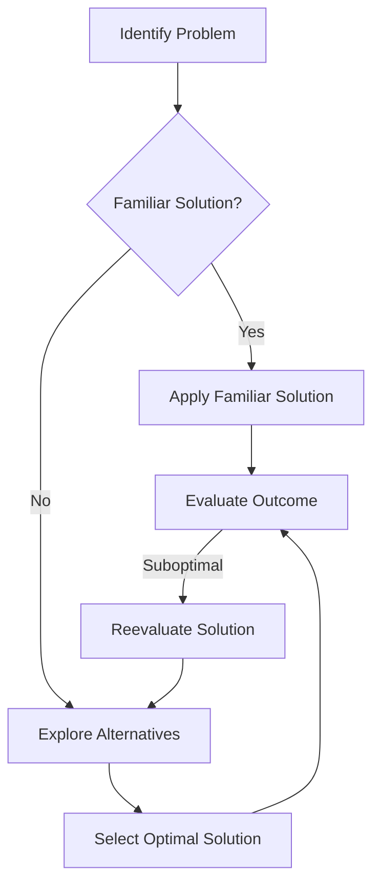

## 11.2.2 Golden Hammer

The Golden Hammer anti-pattern is a prevalent issue in software development, where developers tend to overuse familiar tools or technologies for solving a wide range of problems, regardless of their suitability. This section delves into the intricacies of the Golden Hammer anti-pattern, its causes, consequences, and how to avoid it, particularly in the context of Python programming.

### Understanding the Golden Hammer Anti-Pattern

The term "Golden Hammer" originates from the adage, "If all you have is a hammer, everything looks like a nail." This metaphor aptly describes the tendency of developers to apply a known solution to various problems, even when it may not be the most appropriate choice. In software development, this can manifest as the over-reliance on a specific programming language, framework, or library, often due to familiarity or past success with that tool.

#### The Metaphor in Software Development

In the realm of software development, the Golden Hammer anti-pattern can lead to the application of a single technology or solution across diverse problems. This approach can be tempting because it leverages existing knowledge and reduces the learning curve. However, it often results in suboptimal solutions that do not fully address the unique requirements of each problem.

### Causes of the Golden Hammer Anti-Pattern

Several factors contribute to the prevalence of the Golden Hammer anti-pattern in software development:

1. **Comfort with Familiar Tools**: Developers often gravitate towards tools and technologies they are comfortable with, leading to their overuse.

2. **Resistance to Learning New Technologies**: The rapid pace of technological advancement can be overwhelming, and some developers may resist learning new tools, opting instead to use familiar ones.

3. **Organizational Inertia**: Companies may have established technology stacks and processes, making it difficult to introduce new tools or methodologies.

4. **Time Constraints**: Tight deadlines can pressure developers to use known solutions rather than exploring potentially better alternatives.

5. **Success Bias**: Past successes with a particular tool can create a bias towards using it again, even when it may not be the best fit for the current problem.

### Negative Consequences of the Golden Hammer

The overuse of a single solution can lead to several negative consequences:

1. **Suboptimal Solutions**: Applying a one-size-fits-all approach can result in solutions that do not fully address the problem's unique requirements.

2. **Reduced Efficiency**: Inappropriate tools can lead to inefficiencies in development and execution, increasing the time and resources needed to complete a project.

3. **Increased Technical Debt**: Over-reliance on a single technology can lead to technical debt, as future changes may require significant refactoring or re-implementation.

4. **Stifled Innovation**: The unwillingness to explore new technologies can stifle innovation and limit the potential for discovering more effective solutions.

5. **Scalability Issues**: A solution that works well for small-scale problems may not scale effectively, leading to performance bottlenecks as the system grows.

### The Golden Hammer in Python Development

Python developers are not immune to the Golden Hammer anti-pattern. Here are some common scenarios where this pattern might manifest:

#### Overusing Libraries and Frameworks

Python's rich ecosystem of libraries and frameworks is one of its greatest strengths. However, it can also lead to over-reliance on certain tools. For example:

- **Using Django for Simple Scripts**: Django is a powerful web framework, but using it for simple scripts or small-scale applications can be overkill. A lightweight framework like Flask or even a simple script might be more appropriate.

- **Overusing Pandas for Small Data**: While Pandas is excellent for data manipulation, using it for small datasets where simple Python lists or dictionaries would suffice can lead to unnecessary complexity.

- **Applying Machine Learning Libraries for Basic Statistics**: Libraries like scikit-learn are powerful for machine learning, but using them for basic statistical analysis can be excessive when simpler tools like NumPy or SciPy would do.

#### Scenarios of Misapplication

- **Complex Frameworks for Simple Tasks**: Developers might use complex frameworks like TensorFlow for tasks that could be accomplished with simpler tools, leading to unnecessary complexity and resource usage.

- **Overengineering with Design Patterns**: While design patterns are valuable, applying them indiscriminately can lead to overengineered solutions that are difficult to maintain.

### Strategies to Avoid the Golden Hammer

To avoid falling into the Golden Hammer trap, consider the following strategies:

1. **Continual Learning**: Encourage a culture of continual learning and exploration of new technologies. Stay updated with the latest developments in the field.

2. **Evaluate Solutions Based on Requirements**: Before choosing a tool or technology, evaluate its suitability based on the specific requirements of the problem at hand.

3. **Conduct Proof-of-Concept Studies**: Before committing to a technology stack, conduct proof-of-concept studies to test its effectiveness for the given problem.

4. **Promote Flexibility and Adaptability**: Foster a mindset of flexibility and adaptability in development, encouraging the exploration of alternative solutions.

5. **Encourage Cross-Functional Collaboration**: Collaborate with team members from different backgrounds to gain diverse perspectives on potential solutions.

### Best Practices for Avoiding the Golden Hammer

1. **Conduct Regular Code Reviews**: Regular code reviews can help identify instances where a tool or technology is being overused and suggest alternatives.

2. **Use Design Patterns Judiciously**: Apply design patterns where they add value, but avoid using them indiscriminately.

3. **Encourage Experimentation**: Allow developers the freedom to experiment with new tools and technologies, fostering a culture of innovation.

4. **Document Decision-Making Processes**: Maintain clear documentation of the decision-making process for choosing technologies, including the rationale for selecting or rejecting certain tools.

5. **Balance Familiarity with Innovation**: Strive to balance the use of familiar tools with the exploration of new technologies that may offer better solutions.

### Case Studies: Lessons from the Golden Hammer

#### Case Study 1: The Pitfalls of Overusing Django

A small startup decided to use Django for all its web development needs, including simple landing pages and small-scale applications. While Django's comprehensive features were beneficial for larger projects, they proved cumbersome for smaller tasks. The team eventually realized that using a lighter framework like Flask for simpler projects improved efficiency and reduced development time.

#### Case Study 2: Rediscovering Simplicity with Pandas

A data analysis team consistently used Pandas for all data manipulation tasks, even when dealing with small datasets. This led to unnecessary complexity and slower performance. By switching to simpler data structures like lists and dictionaries for smaller tasks, the team improved performance and reduced code complexity.

#### Case Study 3: Overengineering with Machine Learning

A company applied machine learning libraries to solve a problem that could have been addressed with basic statistical methods. The complexity of the machine learning models led to increased maintenance costs and longer development cycles. By reevaluating the problem and choosing simpler statistical methods, the team achieved faster results with less overhead.

### Visualizing the Golden Hammer Anti-Pattern

To better understand the Golden Hammer anti-pattern, let's visualize the decision-making process that can lead to its occurrence:

**Diagram Description**: This flowchart illustrates the decision-making process that can lead to the Golden Hammer anti-pattern. It shows how the tendency to apply familiar solutions can result in suboptimal outcomes, prompting a reevaluation and exploration of alternative solutions.

### Knowledge Check

To reinforce your understanding of the Golden Hammer anti-pattern, consider the following questions:

1. What is the Golden Hammer anti-pattern, and how does it manifest in software development?
2. Identify some common causes of the Golden Hammer anti-pattern.
3. Discuss the negative consequences of over-relying on a single technology or solution.
4. Provide examples of the Golden Hammer anti-pattern in Python development.
5. What strategies can developers use to avoid the Golden Hammer anti-pattern?
6. How can conducting proof-of-concept studies help in avoiding the Golden Hammer?
7. Why is it important to balance familiarity with innovation in software development?
8. Describe a case study where the Golden Hammer led to project issues.
9. How can regular code reviews help in identifying and addressing the Golden Hammer?
10. What role does continual learning play in preventing the Golden Hammer anti-pattern?

### Embrace the Journey

Remember, the journey to becoming a proficient developer involves learning from both successes and mistakes. The Golden Hammer anti-pattern serves as a reminder to remain open to new ideas and technologies, ensuring that we choose the best tools for the job. Keep experimenting, stay curious, and enjoy the journey of software development!

## Quiz Time!



### What is the Golden Hammer anti-pattern?

- [x] The overuse of a familiar solution for all problems
- [ ] The use of multiple tools for a single problem
- [ ] The avoidance of new technologies
- [ ] The preference for open-source tools

> **Explanation:** The Golden Hammer anti-pattern refers to the tendency to apply a known solution to diverse problems, regardless of its suitability.

### Which of the following is a cause of the Golden Hammer anti-pattern?

- [x] Comfort with familiar tools
- [ ] Lack of available tools
- [ ] High cost of new technologies
- [ ] Preference for manual processes

> **Explanation:** Developers often gravitate towards tools they are comfortable with, leading to the overuse of those tools.

### What is a negative consequence of the Golden Hammer anti-pattern?

- [x] Increased technical debt
- [ ] Reduced learning opportunities
- [ ] Improved team collaboration
- [ ] Enhanced code readability

> **Explanation:** Over-reliance on a single technology can lead to technical debt, as future changes may require significant refactoring.

### In Python development, what is an example of the Golden Hammer anti-pattern?

- [x] Using Django for simple scripts
- [ ] Using Flask for complex applications
- [ ] Applying NumPy for numerical computations
- [ ] Using scikit-learn for machine learning tasks

> **Explanation:** Using Django for simple scripts can be overkill and is an example of the Golden Hammer anti-pattern.

### How can developers avoid the Golden Hammer anti-pattern?

- [x] Encourage continual learning
- [ ] Stick to a single technology stack
- [ ] Avoid experimenting with new tools
- [ ] Rely solely on past experiences

> **Explanation:** Encouraging continual learning helps developers stay updated with new technologies and avoid the Golden Hammer.

### What is a best practice for avoiding the Golden Hammer?

- [x] Conduct proof-of-concept studies
- [ ] Use the same tool for all projects
- [ ] Avoid code reviews
- [ ] Stick to familiar solutions

> **Explanation:** Conducting proof-of-concept studies allows developers to test the effectiveness of a technology for a given problem.

### Why is flexibility important in software development?

- [x] It allows for the exploration of alternative solutions
- [ ] It ensures the use of a single solution
- [ ] It reduces the need for documentation
- [ ] It limits the use of new technologies

> **Explanation:** Flexibility in development encourages the exploration of alternative solutions, which can lead to more optimal outcomes.

### What role do regular code reviews play in addressing the Golden Hammer?

- [x] Identifying overuse of a tool or technology
- [ ] Ensuring the use of a single solution
- [ ] Reducing team collaboration
- [ ] Limiting the exploration of new tools

> **Explanation:** Regular code reviews can help identify instances where a tool or technology is being overused and suggest alternatives.

### How can case studies help in understanding the Golden Hammer?

- [x] By providing real-world examples of its impact
- [ ] By limiting the exploration of new solutions
- [ ] By promoting the use of a single tool
- [ ] By reducing the need for documentation

> **Explanation:** Case studies provide real-world examples of the impact of the Golden Hammer, helping developers understand its consequences.

### True or False: The Golden Hammer anti-pattern can lead to stifled innovation.

- [x] True
- [ ] False

> **Explanation:** The Golden Hammer can stifle innovation by discouraging the exploration of new technologies and solutions.


