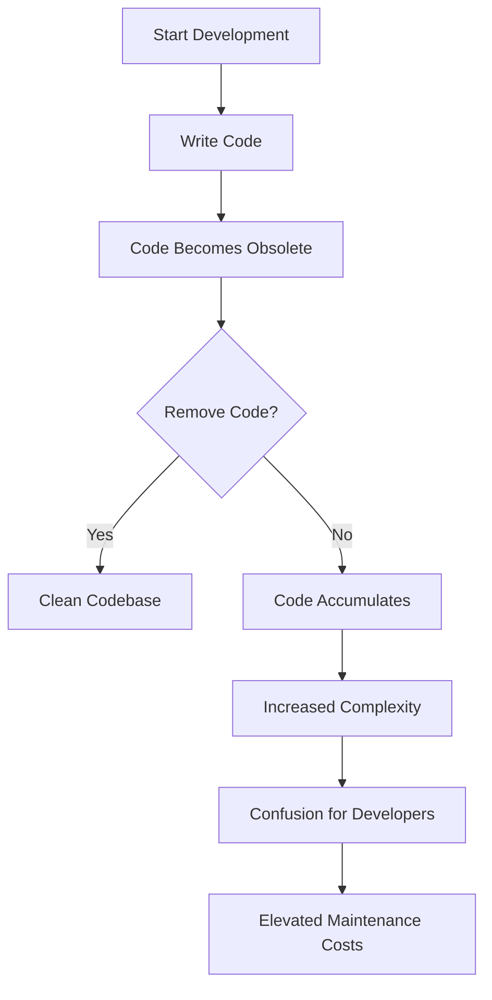

## 11.2.3 Lava Flow

In the realm of software development, maintaining a clean and efficient codebase is crucial for long-term success. However, one common anti-pattern that plagues many projects is known as "Lava Flow". This term describes the accumulation of obsolete or unused code that remains in the codebase without serving any meaningful purpose. In this section, we will delve into the concept of Lava Flow, its causes, impacts, and strategies for mitigation and prevention.

### Defining Lava Flow

The term "Lava Flow" was coined to describe how dead code can solidify in a codebase much like hardened lava. Just as lava flows from a volcano and eventually cools and solidifies into rock, unused code can accumulate and become a permanent part of the codebase. This can happen when developers are hesitant to remove code due to uncertainty about its purpose or potential future use. Over time, this results in a cluttered and confusing codebase that is difficult to maintain.

#### Origin of the Term

The concept of Lava Flow originated from the observation that, in many software projects, code that is no longer needed is often left in place rather than being removed. This can occur for various reasons, such as fear of breaking existing functionality, lack of understanding of the code's purpose, or simply oversight. As a result, the codebase becomes littered with unused or obsolete code, much like a landscape dotted with hardened lava flows.

### Causes of Lava Flow

Understanding the causes of Lava Flow is essential for addressing and preventing this anti-pattern. Several factors contribute to the accumulation of unused code in a project:

1. **Inadequate Documentation**: When code is poorly documented, developers may be unsure of its purpose or whether it is safe to remove. This uncertainty can lead to a reluctance to delete code, resulting in its accumulation over time.

2. **Fear of Removing Code**: Developers may fear that removing code could inadvertently break existing functionality or introduce bugs. This fear can be exacerbated by a lack of comprehensive testing or an understanding of the code's dependencies.

3. **High Turnover of Developers**: Frequent changes in the development team can lead to a lack of ownership and understanding of the codebase. New developers may be hesitant to remove code they did not write, especially if they are unsure of its purpose.

4. **Rapid Development Cycles**: In fast-paced development environments, there may be pressure to deliver features quickly, leading to shortcuts and temporary solutions that are never revisited or cleaned up.

5. **Legacy Code**: Older codebases often contain remnants of previous implementations or features that are no longer relevant but have not been removed.

### Impact on Development

The presence of Lava Flow in a codebase can have several negative impacts on software development:

- **Increased Codebase Complexity**: Unused code adds unnecessary complexity to the codebase, making it more difficult to understand and navigate.

- **Confusion for New Developers**: New team members may struggle to understand the purpose of unused code, leading to confusion and potential errors.

- **Elevated Maintenance Costs**: Maintaining a codebase with a significant amount of unused code can be time-consuming and costly, as developers must spend additional time understanding and working around the clutter.

- **Reduced Code Quality**: The presence of obsolete code can obscure the logic and structure of the codebase, reducing overall code quality and increasing the likelihood of bugs.

### Examples in Python

To illustrate the concept of Lava Flow, let's consider some examples of unused code in a Python project.

#### Example 1: Commented-Out Code

```python
def calculate_discount(price, discount):
    # This function was used for a previous discount calculation method
    # def old_discount_method(price, discount):
    #     return price - (price * discount / 100)
    
    return price * (1 - discount / 100)
```

In this example, the commented-out code represents a previous discount calculation method that is no longer used. Leaving it in the codebase serves no purpose and can lead to confusion.

#### Example 2: Unused Functions

```python
def unused_function():
    print("This function is not called anywhere in the codebase.")

def main():
    print("Main function executing.")
    # Uncomment the following line to use the unused function
    # unused_function()

main()
```

Here, the `unused_function` is defined but never called. Such functions can accumulate over time, cluttering the codebase.

### Solutions for Mitigation

To address the Lava Flow anti-pattern, consider the following strategies:

1. **Regular Code Clean-Up Sessions**: Schedule regular sessions dedicated to reviewing and cleaning up the codebase. This can help identify and remove obsolete code before it becomes a problem.

2. **Code Reviews**: Encourage thorough code reviews that scrutinize the necessity of code blocks. Reviewers should question the purpose of any code that appears unused or obsolete.

3. **Effective Use of Version Control**: Use version control systems like Git to safely remove unused code. With version control, you can always retrieve deleted code if it turns out to be necessary later.

4. **Automated Testing**: Implement comprehensive automated tests to ensure that removing unused code does not break existing functionality. This can alleviate the fear of removing code and encourage a cleaner codebase.

### Preventative Measures

Preventing Lava Flow from occurring in the first place is ideal. Here are some preventative measures to consider:

1. **Thorough Documentation**: Maintain comprehensive documentation that clearly explains the purpose and functionality of code. This can reduce uncertainty and make it easier to identify unused code.

2. **Encourage Code Removal**: Foster a culture where removing obsolete code is acceptable and supported. Developers should feel empowered to clean up the codebase without fear of repercussions.

3. **Refactoring Practices**: Regularly refactor the codebase to improve its structure and remove unnecessary code. This can help prevent the accumulation of Lava Flow.

4. **Onboarding and Knowledge Transfer**: Ensure that new developers are properly onboarded and have access to knowledge transfer sessions. This can help them understand the codebase and feel confident in making changes.

### Tools for Detecting Lava Flow

Several tools can assist in identifying and addressing Lava Flow in a Python codebase:

1. **Static Analysis Tools**: Tools like `pylint`, `flake8`, and `pyflakes` can detect unreachable code, unused variables, and other potential issues.

2. **Code Coverage Tools**: Use code coverage tools like `coverage.py` to identify parts of the codebase that are not covered by tests. Uncovered code may be unused and a candidate for removal.

3. **Dependency Analysis Tools**: Tools like `snakefood` can analyze dependencies and help identify unused imports or modules.

### Visualizing Lava Flow

To better understand the concept of Lava Flow, let's visualize the process of code accumulation and its impact on the codebase using a flowchart.



**Diagram Description**: This flowchart illustrates the process of code becoming obsolete and the decision point of whether to remove it. If not removed, the code accumulates, leading to increased complexity, confusion, and maintenance costs.

### Try It Yourself

To better understand how Lava Flow can be addressed, try the following exercise:

1. **Identify Unused Code**: Review a section of your codebase and identify any unused or obsolete code. This could be commented-out code, unused functions, or redundant imports.

2. **Remove Unused Code**: Safely remove the identified unused code using your version control system. Ensure that you have adequate test coverage to verify that the removal does not break existing functionality.

3. **Document Your Changes**: Update any relevant documentation to reflect the changes you made. This can help prevent future Lava Flow by ensuring that the purpose of the remaining code is clear.

### Knowledge Check

- **Question**: Why is it important to remove unused code from a codebase?
- **Challenge**: Identify a section of code in your project that may be considered Lava Flow and propose a plan for its removal.

### Summary

Lava Flow is a common anti-pattern that can negatively impact a codebase by increasing complexity, causing confusion, and elevating maintenance costs. By understanding its causes and impacts, and implementing strategies for mitigation and prevention, developers can maintain a clean and efficient codebase. Regular code clean-up sessions, thorough documentation, and the use of static analysis tools are all effective ways to address Lava Flow and ensure the long-term health of a software project.

## Quiz Time!



### What is the primary characteristic of the Lava Flow anti-pattern?

- [x] Accumulation of obsolete or unused code
- [ ] Excessive use of global variables
- [ ] Over-reliance on third-party libraries
- [ ] Lack of error handling

> **Explanation:** Lava Flow refers to the accumulation of obsolete or unused code in a codebase.

### Which of the following is a common cause of Lava Flow?

- [x] Fear of removing code
- [ ] Over-documentation
- [ ] Excessive code comments
- [ ] Frequent code refactoring

> **Explanation:** Fear of removing code due to uncertainty about its purpose or potential future use is a common cause of Lava Flow.

### How does Lava Flow impact new developers?

- [x] Causes confusion and potential errors
- [ ] Provides clear guidance on code usage
- [ ] Simplifies the onboarding process
- [ ] Reduces the need for documentation

> **Explanation:** New developers may struggle to understand the purpose of unused code, leading to confusion and potential errors.

### What is a recommended strategy for mitigating Lava Flow?

- [x] Regular code clean-up sessions
- [ ] Increasing code complexity
- [ ] Adding more comments
- [ ] Avoiding version control

> **Explanation:** Regular code clean-up sessions help identify and remove obsolete code, mitigating Lava Flow.

### Which tool can help detect unreachable code in Python?

- [x] pylint
- [ ] Jupyter Notebook
- [ ] Docker
- [ ] TensorFlow

> **Explanation:** pylint is a static analysis tool that can detect unreachable code and other potential issues in Python.

### What is the role of version control in addressing Lava Flow?

- [x] Allows safe removal of unused code
- [ ] Increases code redundancy
- [ ] Prevents code changes
- [ ] Encourages code duplication

> **Explanation:** Version control systems allow developers to safely remove unused code, as it can be retrieved if necessary.

### Why is thorough documentation important in preventing Lava Flow?

- [x] Reduces uncertainty about code purpose
- [ ] Increases codebase complexity
- [ ] Encourages code duplication
- [ ] Prevents code refactoring

> **Explanation:** Thorough documentation helps developers understand the purpose of code, reducing uncertainty and preventing Lava Flow.

### What is a preventative measure for Lava Flow?

- [x] Encouraging code removal
- [ ] Avoiding code reviews
- [ ] Increasing code comments
- [ ] Adding more global variables

> **Explanation:** Encouraging code removal helps prevent the accumulation of unused code, addressing Lava Flow.

### How can automated testing help mitigate Lava Flow?

- [x] Ensures removal of unused code doesn't break functionality
- [ ] Increases code complexity
- [ ] Reduces test coverage
- [ ] Prevents code changes

> **Explanation:** Automated testing ensures that removing unused code does not break existing functionality, mitigating Lava Flow.

### True or False: Lava Flow can lead to elevated maintenance costs.

- [x] True
- [ ] False

> **Explanation:** The presence of obsolete code can increase maintenance costs due to additional time spent understanding and working around the clutter.



Remember, maintaining a clean codebase is an ongoing process. Regularly review and refactor your code to prevent the accumulation of Lava Flow, and encourage a culture of code cleanliness and clarity within your development team. Keep experimenting, stay curious, and enjoy the journey of software development!
