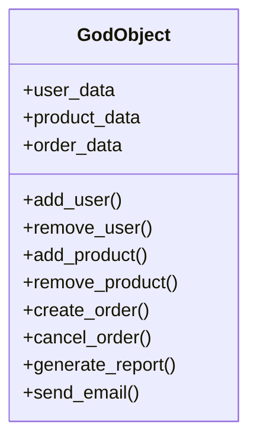
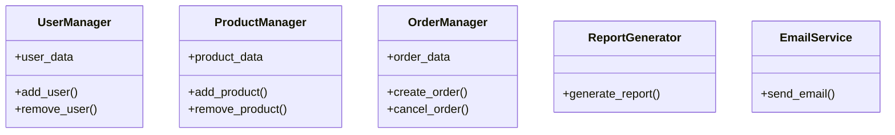

## 11.2.4 God Object

In the realm of software design, the term "God Object" refers to a class that has taken on too many responsibilities, effectively becoming an all-encompassing entity within a program. This anti-pattern is a common pitfall that can lead to code that is difficult to maintain, extend, and test. In this section, we will delve into the intricacies of the God Object anti-pattern, explore its causes and consequences, and provide strategies for refactoring such objects into more manageable and modular components.

### Understanding the God Object Anti-Pattern

#### Definition

A God Object is a class that centralizes the functionalities of a system to the point where it controls too many aspects of the program. This class often contains a large number of methods and attributes, handling diverse responsibilities that should ideally be distributed across multiple classes. The God Object violates key software design principles, such as the **Single Responsibility Principle (SRP)** and modularity, leading to a tightly coupled and monolithic codebase.

#### Violations of Design Principles

1. **Single Responsibility Principle (SRP)**: According to SRP, a class should have only one reason to change, meaning it should only have one job or responsibility. A God Object, by definition, has multiple responsibilities, making it susceptible to frequent changes and bugs.

2. **Modularity**: Modularity is about dividing a program into separate components or modules, each with a specific role. A God Object undermines modularity by consolidating various functionalities into a single class, making it difficult to isolate and manage different parts of the code.

### Causes of the God Object Anti-Pattern

Understanding why God Objects emerge is crucial for preventing them in future projects. Here are some common causes:

1. **Minimizing the Number of Classes**: Developers may mistakenly believe that having fewer classes simplifies the code. While this might reduce the number of files, it increases the complexity within a single class, leading to a God Object.

2. **Misunderstanding of Object-Oriented Design**: A lack of understanding of object-oriented principles can lead developers to create classes that do too much. Proper object-oriented design involves creating small, focused classes that collaborate to achieve the desired functionality.

3. **Expedient Coding Practices**: In the rush to meet deadlines, developers might opt for quick fixes that involve adding more responsibilities to existing classes rather than designing new ones. This expediency can result in God Objects over time.

4. **Lack of Planning**: Without a clear design plan, developers might start with a single class and continue to add features to it as the project grows, inadvertently creating a God Object.

### Consequences of the God Object Anti-Pattern

The presence of a God Object in a codebase can lead to several negative consequences:

1. **Maintenance Difficulties**: A God Object is challenging to maintain because changes in one part of the class can have unintended side effects on other parts. This increases the risk of introducing bugs when making modifications.

2. **Testing Challenges**: Testing a God Object is cumbersome due to its size and complexity. It becomes difficult to isolate and test individual functionalities, leading to incomplete or ineffective test coverage.

3. **Limited Extensibility**: Adding new features to a God Object is problematic because it is already handling too many responsibilities. This can lead to further bloating of the class and increased complexity.

4. **Unintended Side Effects**: Modifying a God Object can inadvertently affect unrelated functionalities, as the class is tightly coupled with various parts of the system.

### Python-Specific Examples of God Objects

Let's explore a Python example where a single class handles diverse responsibilities, illustrating the characteristics of a God Object.

```python
class GodObject:
    def __init__(self):
        self.user_data = {}
        self.product_data = {}
        self.order_data = {}

    def add_user(self, user_id, user_info):
        self.user_data[user_id] = user_info

    def remove_user(self, user_id):
        if user_id in self.user_data:
            del self.user_data[user_id]

    def add_product(self, product_id, product_info):
        self.product_data[product_id] = product_info

    def remove_product(self, product_id):
        if product_id in self.product_data:
            del self.product_data[product_id]

    def create_order(self, order_id, order_info):
        self.order_data[order_id] = order_info

    def cancel_order(self, order_id):
        if order_id in self.order_data:
            del self.order_data[order_id]

    def generate_report(self):
        # Complex logic to generate a report
        pass

    def send_email(self, email_address, content):
        # Logic to send an email
        pass
```

In this example, the `GodObject` class is responsible for managing users, products, and orders, as well as generating reports and sending emails. This violates the Single Responsibility Principle, as the class is handling multiple distinct functionalities.

### Strategies for Refactoring God Objects

Refactoring a God Object involves decomposing it into smaller, more cohesive classes. Here are some strategies to guide the restructuring process:

1. **Identify Responsibilities**: Start by identifying the distinct responsibilities within the God Object. Each responsibility should ideally be handled by a separate class.

2. **Apply SOLID Principles**: Use the SOLID principles as a guide for refactoring. For instance, the Single Responsibility Principle can help you determine how to split the class into smaller units.

3. **Use Composition Over Inheritance**: Favor composition over inheritance to create flexible and reusable components. Composition allows you to build complex functionalities by combining simpler objects.

4. **Create Interfaces or Abstract Classes**: Define interfaces or abstract classes to specify common behaviors. This can help in creating a more structured and modular design.

5. **Incremental Refactoring**: Refactor the God Object incrementally, testing each change to ensure that the functionality remains intact. This approach reduces the risk of introducing new bugs.

#### Refactored Example

Let's refactor the `GodObject` into smaller, more manageable classes:

```python
class UserManager:
    def __init__(self):
        self.user_data = {}

    def add_user(self, user_id, user_info):
        self.user_data[user_id] = user_info

    def remove_user(self, user_id):
        if user_id in self.user_data:
            del self.user_data[user_id]

class ProductManager:
    def __init__(self):
        self.product_data = {}

    def add_product(self, product_id, product_info):
        self.product_data[product_id] = product_info

    def remove_product(self, product_id):
        if product_id in self.product_data:
            del self.product_data[product_id]

class OrderManager:
    def __init__(self):
        self.order_data = {}

    def create_order(self, order_id, order_info):
        self.order_data[order_id] = order_info

    def cancel_order(self, order_id):
        if order_id in self.order_data:
            del self.order_data[order_id]

class ReportGenerator:
    def generate_report(self):
        # Complex logic to generate a report
        pass

class EmailService:
    def send_email(self, email_address, content):
        # Logic to send an email
        pass
```

In this refactored example, we have decomposed the `GodObject` into five smaller classes, each handling a specific responsibility. This approach improves modularity, maintainability, and testability.

### Best Practices to Avoid God Objects

1. **Design with Separation of Concerns**: From the outset, design your classes with a clear separation of concerns. Each class should have a well-defined role and responsibility.

2. **Embrace Composition**: Use composition to build complex functionalities from simpler components. This promotes reusability and flexibility.

3. **Regular Code Reviews**: Conduct regular code reviews to identify potential God Objects early in the development process. Peer reviews can help spot design flaws that might lead to a God Object.

4. **Continuous Refactoring**: Make refactoring a regular part of your development process. Continuously improve the design of your code to prevent the emergence of God Objects.

5. **Educate the Team**: Ensure that all team members understand the principles of good object-oriented design. Training and workshops can help reinforce these concepts.

### Visualizing the God Object

To better understand the impact of a God Object, let's compare a class diagram of a God Object with a well-structured class hierarchy.



In the diagram above, the `GodObject` class is overloaded with responsibilities, leading to a complex and tightly coupled design.



In this refactored diagram, responsibilities are distributed across multiple classes, each with a specific focus. This design enhances modularity and makes the system easier to maintain and extend.

### Knowledge Check

1. **What is a God Object?**: A class that centralizes too many responsibilities, violating principles like SRP and modularity.

2. **Why do God Objects emerge?**: Due to minimizing class count, misunderstanding OOP, expedient coding, and lack of planning.

3. **What are the consequences of a God Object?**: Maintenance difficulties, testing challenges, limited extensibility, and unintended side effects.

4. **How can you refactor a God Object?**: By decomposing it into smaller classes, applying SOLID principles, and using composition.

5. **What are best practices to avoid God Objects?**: Design with separation of concerns, embrace composition, conduct code reviews, and educate the team.

### Embrace the Journey

Remember, avoiding God Objects is just one step in the journey towards writing clean, maintainable code. As you continue to learn and grow as a developer, you'll encounter new challenges and opportunities to apply these principles. Keep experimenting, stay curious, and enjoy the journey!

## Quiz Time!



### What is a God Object?

- [x] A class that centralizes too many responsibilities
- [ ] A class that follows the Single Responsibility Principle
- [ ] A class that is well-modularized
- [ ] A class that uses composition over inheritance

> **Explanation:** A God Object is a class that centralizes too many responsibilities, violating principles like SRP.

### Which principle does a God Object violate?

- [x] Single Responsibility Principle
- [ ] Open/Closed Principle
- [ ] Liskov Substitution Principle
- [ ] Interface Segregation Principle

> **Explanation:** A God Object violates the Single Responsibility Principle by handling multiple responsibilities.

### What is a common cause of God Objects?

- [x] Minimizing the number of classes
- [ ] Following SOLID principles
- [ ] Using composition over inheritance
- [ ] Conducting regular code reviews

> **Explanation:** Minimizing the number of classes can lead to God Objects as responsibilities are centralized.

### What is a consequence of having a God Object?

- [x] Maintenance difficulties
- [ ] Improved modularity
- [ ] Easier testing
- [ ] Increased flexibility

> **Explanation:** A God Object leads to maintenance difficulties due to its complexity and tight coupling.

### How can you refactor a God Object?

- [x] Decompose it into smaller classes
- [ ] Add more methods to it
- [ ] Increase its responsibilities
- [ ] Use more inheritance

> **Explanation:** Refactoring a God Object involves decomposing it into smaller, focused classes.

### What is a best practice to avoid God Objects?

- [x] Design with separation of concerns
- [ ] Minimize the number of classes
- [ ] Centralize responsibilities
- [ ] Avoid code reviews

> **Explanation:** Designing with separation of concerns helps avoid the creation of God Objects.

### What is a visual indicator of a God Object?

- [x] A class diagram with many methods and attributes
- [ ] A class diagram with few methods
- [ ] A class diagram with clear separation of responsibilities
- [ ] A class diagram with many small classes

> **Explanation:** A God Object is often indicated by a class diagram with many methods and attributes.

### What is a benefit of refactoring a God Object?

- [x] Improved modularity
- [ ] Increased complexity
- [ ] More responsibilities in one class
- [ ] Less code reuse

> **Explanation:** Refactoring a God Object improves modularity by distributing responsibilities across multiple classes.

### Which design principle can guide the refactoring of a God Object?

- [x] SOLID principles
- [ ] DRY principle
- [ ] KISS principle
- [ ] YAGNI principle

> **Explanation:** SOLID principles can guide the refactoring of a God Object into smaller, cohesive classes.

### True or False: A God Object is an example of good software design.

- [ ] True
- [x] False

> **Explanation:** False. A God Object is an anti-pattern and is not an example of good software design.


