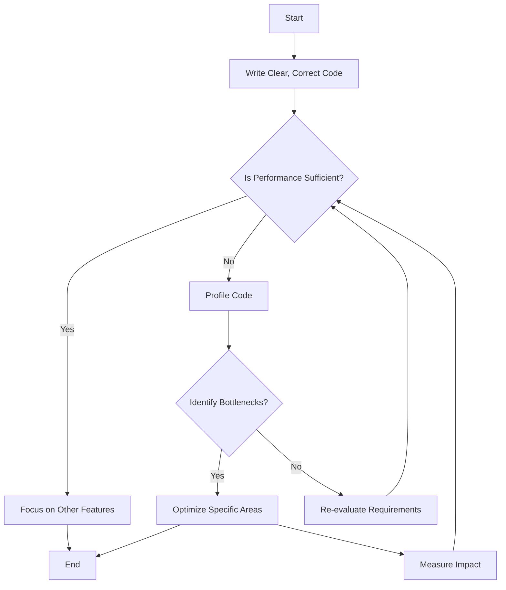

## 11.2.5 Premature Optimization

In the world of software development, the phrase "premature optimization is the root of all evil" is often quoted to caution developers against the pitfalls of optimizing code too early in the development process. This section will delve into the concept of premature optimization, explore its causes and negative effects, and provide guidance on appropriate optimization strategies and best practices in Python programming.

### Defining Premature Optimization

Premature optimization refers to the practice of trying to make code run faster or use fewer resources before there is a clear need to do so. This often happens before the code is fully functional or before performance bottlenecks have been identified. The phrase "premature optimization is the root of all evil" was popularized by Donald Knuth, a renowned computer scientist, to emphasize that focusing on optimization too early can lead to more harm than good.

#### Why Premature Optimization is Counterproductive

1. **Complexity Over Clarity**: Optimizing code prematurely can lead to complex and convoluted code that is difficult to read and maintain. This complexity can obscure the original intent of the code, making it harder for other developers (or even the original author) to understand and modify it in the future.

2. **Diverted Focus**: When developers focus on optimization too early, they may neglect the core functionality of the application. This can result in a product that is fast but doesn't meet user needs or requirements.

3. **Wasted Effort**: Often, the parts of the code that developers think need optimization are not the actual bottlenecks. Premature optimization can lead to wasted effort on parts of the code that don't significantly impact performance.

### Causes of Premature Optimization

Understanding why developers fall into the trap of premature optimization can help in avoiding it. Here are some common causes:

1. **Overestimating Performance Needs**: Developers may assume that their application will need to handle more data or more users than it actually will, leading them to optimize for scenarios that may never occur.

2. **Personal Habits and Preferences**: Some developers have a natural inclination towards writing the most efficient code possible, even when it's not necessary. This can stem from a desire to demonstrate technical prowess or from habits formed in environments where performance was a critical concern.

3. **Misunderstanding of Optimization**: Developers may not fully understand where the real performance bottlenecks are likely to occur, leading them to optimize the wrong parts of the code.

### Negative Effects of Premature Optimization

Premature optimization can have several negative effects on a project:

1. **Reduced Code Readability and Maintainability**: Optimized code is often more complex and less intuitive than straightforward code. This can make it harder to maintain and extend, increasing the likelihood of bugs and errors.

2. **Increased Development Time**: Time spent on premature optimization is time not spent on developing core features or fixing bugs. This can delay the delivery of the product and increase development costs.

3. **Potential for Introducing Bugs**: Optimization often involves low-level changes to the code, which can introduce subtle bugs that are difficult to detect and fix.

### Premature Optimization in the Python Context

Python is a high-level, interpreted language known for its readability and ease of use. However, its dynamic nature can sometimes lead developers to misuse language features in the name of optimization. Here are some examples:

#### Example 1: Using Complex Algorithms Unnecessarily

```python
def find_maximum(arr):
    # Using a divide-and-conquer approach
    if len(arr) == 1:
        return arr[0]
    else:
        mid = len(arr) // 2
        left_max = find_maximum(arr[:mid])
        right_max = find_maximum(arr[mid:])
        return max(left_max, right_max)

def find_maximum_simple(arr):
    return max(arr)

```

In this example, the divide-and-conquer approach is more complex and harder to understand than simply using Python's built-in `max()` function, which is both efficient and readable.

#### Example 2: Misusing Language Features

```python
squared_numbers = [print(x**2) for x in range(10)]

for x in range(10):
    print(x**2)

```

Using list comprehensions for side effects is a misuse of the feature, as it sacrifices readability for a perceived performance gain.

### Appropriate Optimization Strategies

To avoid the pitfalls of premature optimization, consider the following strategies:

1. **Write Clear, Correct Code First**: Focus on writing code that is clear, correct, and easy to understand. Ensure that the code meets all functional requirements before considering optimization.

2. **Profile Code to Identify Bottlenecks**: Use profiling tools to identify actual performance bottlenecks in your code. Python provides several tools, such as `cProfile` and `timeit`, to help with this.

3. **Optimize Based on Evidence**: Once bottlenecks have been identified, optimize those specific areas of the code. This ensures that your efforts are focused where they will have the most impact.

4. **Iterative Development**: Adopt an iterative development approach, where performance considerations are addressed in later stages of development, after the core functionality is complete.

### Best Practices for Avoiding Premature Optimization

1. **Use Readable Algorithms**: Unless performance metrics dictate otherwise, prefer algorithms that are easy to read and understand. This will make your code more maintainable in the long run.

2. **Document Optimization Decisions**: When you do optimize code, document the reasons for doing so and the impact it has on performance. This will help future developers understand the rationale behind the changes.

3. **Emphasize Code Maintainability**: Prioritize code maintainability over optimization. This means writing code that is easy to read, understand, and modify.

4. **Educate and Collaborate**: Share knowledge about the dangers of premature optimization with your team. Encourage collaboration and code reviews to catch instances of premature optimization early.

5. **Stay Informed**: Keep up-to-date with best practices and new developments in the Python community. This will help you make informed decisions about when and how to optimize your code.

### Try It Yourself

To better understand the impact of premature optimization, try modifying the code examples provided. Experiment with different algorithms and constructs to see how they affect readability and performance. Use Python's profiling tools to measure the performance of your code and identify any actual bottlenecks.

### Visualizing the Impact of Premature Optimization

Let's visualize the process of identifying and addressing performance bottlenecks using a flowchart:



This flowchart illustrates the iterative process of writing clear code, evaluating performance, and optimizing only when necessary.

### References and Links

- [Donald Knuth's Quote on Premature Optimization](https://en.wikipedia.org/wiki/Program_optimization#When_to_optimize)
- [Python Profiling Tools](https://docs.python.org/3/library/profile.html)
- [Python's `timeit` Module](https://docs.python.org/3/library/timeit.html)

### Knowledge Check

1. What is premature optimization, and why is it considered harmful?
2. List some common causes of premature optimization.
3. Describe the negative effects of premature optimization on a project.
4. Provide examples of premature optimization in Python.
5. What strategies can be used to avoid premature optimization?
6. Why is it important to profile code before optimizing it?
7. How can documenting optimization decisions benefit future developers?
8. What role does iterative development play in avoiding premature optimization?
9. How can code reviews help prevent premature optimization?
10. Why should developers prioritize code maintainability over optimization?

### Embrace the Journey

Remember, premature optimization is a common pitfall that even experienced developers can fall into. By focusing on writing clear, correct code and optimizing only when necessary, you can create maintainable and efficient software. Keep experimenting, stay curious, and enjoy the journey of continuous learning and improvement in Python programming.

## Quiz Time!



### What is premature optimization?

- [x] Optimizing code before identifying actual performance bottlenecks
- [ ] Optimizing code after identifying performance bottlenecks
- [ ] Writing code without considering performance
- [ ] Writing code with a focus on readability

> **Explanation:** Premature optimization refers to optimizing code before there is a clear need or before identifying actual performance bottlenecks.

### Why is premature optimization considered harmful?

- [x] It can lead to complex code that's hard to read and maintain
- [ ] It always improves code performance
- [ ] It makes code easier to understand
- [ ] It reduces development time

> **Explanation:** Premature optimization often results in complex code that is difficult to read and maintain, without necessarily improving performance.

### What is a common cause of premature optimization?

- [x] Overestimating performance needs
- [ ] Underestimating performance needs
- [ ] Focusing on code readability
- [ ] Following best practices

> **Explanation:** Developers may overestimate the performance needs of their application, leading them to optimize unnecessarily.

### Which of the following is a negative effect of premature optimization?

- [x] Increased development time
- [ ] Improved code readability
- [ ] Reduced code complexity
- [ ] Faster delivery of features

> **Explanation:** Premature optimization can increase development time as developers spend time optimizing parts of the code that may not need it.

### What should be the first step in avoiding premature optimization?

- [x] Write clear, correct code first
- [ ] Optimize code immediately
- [ ] Use complex algorithms
- [ ] Focus on performance from the start

> **Explanation:** The first step should be to write clear, correct code that meets functional requirements before considering optimization.

### How can profiling help in optimization?

- [x] By identifying actual performance bottlenecks
- [ ] By making code more complex
- [ ] By increasing code readability
- [ ] By reducing development time

> **Explanation:** Profiling helps identify actual performance bottlenecks, allowing developers to focus their optimization efforts where they are most needed.

### Why is documenting optimization decisions important?

- [x] It helps future developers understand the rationale behind changes
- [ ] It makes code harder to read
- [ ] It reduces code performance
- [ ] It increases development time

> **Explanation:** Documenting optimization decisions provides context and understanding for future developers, aiding in maintenance and further development.

### What role does iterative development play in optimization?

- [x] It allows performance considerations to be addressed later
- [ ] It focuses on optimization from the start
- [ ] It reduces code readability
- [ ] It eliminates the need for profiling

> **Explanation:** Iterative development allows developers to focus on core functionality first and address performance considerations in later stages.

### How can code reviews help prevent premature optimization?

- [x] By catching instances of premature optimization early
- [ ] By making code more complex
- [ ] By reducing code readability
- [ ] By increasing development time

> **Explanation:** Code reviews provide an opportunity for peers to identify and address premature optimization before it becomes a problem.

### Should developers prioritize code maintainability over optimization?

- [x] True
- [ ] False

> **Explanation:** Developers should prioritize code maintainability to ensure that the code is easy to read, understand, and modify, which is crucial for long-term project success.


