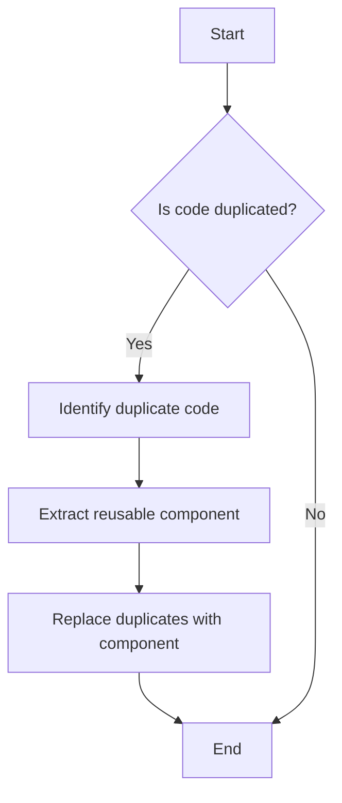

## 11.2.6 Copy-Paste Programming

Copy-paste programming, a common anti-pattern, involves duplicating code across different parts of a codebase instead of creating reusable components. This practice undermines the DRY (Don't Repeat Yourself) principle, leading to increased maintenance efforts and potential inconsistencies. In this section, we will delve into the causes, consequences, and strategies to avoid copy-paste programming in Python.

### Understanding Copy-Paste Programming

Copy-paste programming occurs when developers duplicate code blocks rather than abstracting them into reusable functions, classes, or modules. This approach might seem like a quick solution, especially under tight deadlines, but it introduces several long-term issues. Let's explore how this practice conflicts with the DRY principle and why it's detrimental to code quality.

#### The DRY Principle

The DRY principle, which stands for "Don't Repeat Yourself," is a fundamental concept in software development that emphasizes reducing repetition in code. By adhering to this principle, developers can create more maintainable, scalable, and error-free codebases. When code is duplicated, any change or bug fix must be applied to each instance, increasing the likelihood of errors and inconsistencies.

### Causes of Copy-Paste Programming

Several factors contribute to the prevalence of copy-paste programming. Understanding these causes can help developers recognize and address them effectively.

#### Tight Deadlines

Under pressure to deliver features quickly, developers might resort to copying and pasting code as a shortcut. While this might save time initially, it leads to increased maintenance efforts in the long run.

#### Lack of Understanding of Abstraction

Some developers might not fully understand how to abstract code into reusable components. This lack of knowledge can lead to repeated code blocks instead of leveraging functions, classes, or modules.

#### Laziness or Oversight

In some cases, developers might simply overlook the importance of code reusability or choose the path of least resistance by duplicating code.

### Consequences of Copy-Paste Programming

Copy-paste programming can have several negative consequences, impacting both the codebase and the development process.

#### Code Bloat

Duplicated code increases the size of the codebase, making it more difficult to navigate and understand. This code bloat can slow down development and increase the time required to onboard new team members.

#### Error-Prone Updates

When code is duplicated, any updates or bug fixes must be applied to each instance. This process is error-prone and can lead to inconsistencies if some instances are overlooked.

#### Difficulties in Bug Fixing

Bugs that exist in multiple places due to code duplication are harder to track down and fix. Developers must identify all instances of the duplicated code and ensure that fixes are applied consistently.

### Examples of Copy-Paste Programming in Python

Let's look at some examples of copy-paste programming in Python to understand how it manifests in code.

#### Example 1: Repeated Code Blocks in Functions

```python
def calculate_area_of_rectangle(width, height):
    area = width * height
    print(f"The area of the rectangle is {area} square units.")
    return area

def calculate_area_of_triangle(base, height):
    area = 0.5 * base * height
    print(f"The area of the triangle is {area} square units.")
    return area

def calculate_area_of_circle(radius):
    area = 3.14159 * radius * radius
    print(f"The area of the circle is {area} square units.")
    return area
```

In this example, the code for printing the area is duplicated across multiple functions. This repetition can be avoided by abstracting the print logic into a separate function.

#### Example 2: Similar Code in Different Modules

```python
def connect_to_database():
    connection = create_connection()
    print("Connected to the database.")
    return connection

def connect_to_api():
    connection = create_connection()
    print("Connected to the API.")
    return connection
```

Here, the logic for creating a connection and printing a message is duplicated across different modules. This can be refactored into a shared utility function.

### Strategies to Avoid Duplication

To combat copy-paste programming, developers should employ strategies that promote code reusability and abstraction.

#### Abstraction Through Functions

Encourage the use of functions to encapsulate repeated logic. By creating a function for commonly used code, you can reduce duplication and improve maintainability.

```python
def print_area(shape, area):
    print(f"The area of the {shape} is {area} square units.")

def calculate_area_of_rectangle(width, height):
    area = width * height
    print_area("rectangle", area)
    return area

def calculate_area_of_triangle(base, height):
    area = 0.5 * base * height
    print_area("triangle", area)
    return area

def calculate_area_of_circle(radius):
    area = 3.14159 * radius * radius
    print_area("circle", area)
    return area
```

#### Using Classes and Inheritance

Leverage object-oriented programming principles like classes and inheritance to share behavior across different parts of the codebase.

```python
class Shape:
    def __init__(self, name):
        self.name = name

    def print_area(self, area):
        print(f"The area of the {self.name} is {area} square units.")

class Rectangle(Shape):
    def calculate_area(self, width, height):
        area = width * height
        self.print_area(area)
        return area

class Triangle(Shape):
    def calculate_area(self, base, height):
        area = 0.5 * base * height
        self.print_area(area)
        return area

class Circle(Shape):
    def calculate_area(self, radius):
        area = 3.14159 * radius * radius
        self.print_area(area)
        return area
```

#### Composition Over Inheritance

Use composition to combine behaviors from different classes, allowing for more flexible code reuse.

```python
class Printer:
    def print_area(self, shape, area):
        print(f"The area of the {shape} is {area} square units.")

class Rectangle:
    def __init__(self, printer):
        self.printer = printer

    def calculate_area(self, width, height):
        area = width * height
        self.printer.print_area("rectangle", area)
        return area

class Triangle:
    def __init__(self, printer):
        self.printer = printer

    def calculate_area(self, base, height):
        area = 0.5 * base * height
        self.printer.print_area("triangle", area)
        return area

class Circle:
    def __init__(self, printer):
        self.printer = printer

    def calculate_area(self, radius):
        area = 3.14159 * radius * radius
        self.printer.print_area("circle", area)
        return area
```

### Refactoring Techniques

Refactoring is the process of restructuring existing code without changing its external behavior. It is a crucial step in eliminating code duplication and improving code quality.

#### Identifying Duplicate Code

The first step in refactoring is identifying duplicate code. This can be done through code reviews, static analysis tools, or simply by recognizing patterns during development.

#### Extracting Reusable Components

Once duplicate code is identified, extract it into reusable components such as functions, classes, or modules. This process involves isolating the common logic and replacing the duplicated instances with calls to the new component.

```python
def create_connection():
    # Logic to create a connection
    pass

def connect_to_service(service_name):
    connection = create_connection()
    print(f"Connected to the {service_name}.")
    return connection

connect_to_service("database")
connect_to_service("API")
```

### Benefits of Reusability

By avoiding copy-paste programming and promoting reusability, developers can achieve several benefits:

#### Improved Maintainability

Reusable components are easier to maintain and update. Changes made to a single component automatically propagate to all instances, reducing the risk of inconsistencies.

#### Consistency Across Codebase

Reusability ensures that similar logic is implemented consistently across the codebase, reducing the likelihood of errors and improving code quality.

#### Reduced Code Size

By eliminating duplicate code, the overall size of the codebase is reduced, making it easier to navigate and understand.

### Visualizing Code Duplication

To better understand the impact of code duplication, let's visualize a simple scenario using a flowchart.



This flowchart illustrates the process of identifying and refactoring duplicate code into reusable components.

### Try It Yourself

To reinforce your understanding of avoiding copy-paste programming, try modifying the code examples provided. Experiment with different abstraction techniques, such as creating additional classes or functions, to see how they impact code reusability and maintainability.

### References and Further Reading

For more information on avoiding code duplication and promoting reusability, consider exploring the following resources:

- [DRY Principle on Wikipedia](https://en.wikipedia.org/wiki/Don%27t_repeat_yourself)
- [Refactoring: Improving the Design of Existing Code by Martin Fowler](https://martinfowler.com/books/refactoring.html)
- [Python's Official Documentation on Classes](https://docs.python.org/3/tutorial/classes.html)

### Knowledge Check

As you progress in your journey to avoid copy-paste programming, remember that the key is to focus on creating reusable, maintainable, and consistent code. Keep experimenting, stay curious, and enjoy the process of refining your coding skills!

## Quiz Time!



### What is the primary principle that copy-paste programming violates?

- [x] DRY (Don't Repeat Yourself)
- [ ] KISS (Keep It Simple, Stupid)
- [ ] YAGNI (You Aren't Gonna Need It)
- [ ] SOLID Principles

> **Explanation:** Copy-paste programming violates the DRY principle, which emphasizes reducing repetition in code.

### Which of the following is NOT a cause of copy-paste programming?

- [ ] Tight deadlines
- [ ] Lack of understanding of abstraction
- [x] Use of design patterns
- [ ] Laziness or oversight

> **Explanation:** The use of design patterns is not a cause of copy-paste programming; it is a strategy to avoid it.

### What is a consequence of copy-paste programming?

- [x] Code bloat
- [ ] Improved performance
- [ ] Reduced maintenance efforts
- [ ] Increased security

> **Explanation:** Copy-paste programming leads to code bloat, making the codebase larger and harder to maintain.

### How can developers avoid copy-paste programming?

- [x] By using abstraction through functions, classes, or modules
- [ ] By increasing code duplication
- [ ] By ignoring code reviews
- [ ] By avoiding the use of version control

> **Explanation:** Developers can avoid copy-paste programming by using abstraction to create reusable components.

### Which of the following is a benefit of reusability?

- [x] Improved maintainability
- [ ] Increased code size
- [ ] More complex code
- [ ] Less consistency

> **Explanation:** Reusability improves maintainability by reducing duplication and ensuring consistency across the codebase.

### What is the first step in refactoring to eliminate duplicate code?

- [x] Identifying duplicate code
- [ ] Writing new tests
- [ ] Increasing code duplication
- [ ] Ignoring code reviews

> **Explanation:** The first step in refactoring is identifying duplicate code so that it can be extracted into reusable components.

### Which of the following techniques can be used to share behavior across different parts of the codebase?

- [x] Inheritance
- [ ] Code duplication
- [ ] Ignoring abstraction
- [ ] Avoiding functions

> **Explanation:** Inheritance is a technique that allows sharing behavior across different parts of the codebase.

### What is a common tool used to identify duplicate code?

- [x] Static analysis tools
- [ ] Version control systems
- [ ] Code obfuscators
- [ ] Debuggers

> **Explanation:** Static analysis tools can be used to identify duplicate code and help refactor it into reusable components.

### True or False: Copy-paste programming leads to reduced code size.

- [ ] True
- [x] False

> **Explanation:** Copy-paste programming increases code size due to duplication, leading to code bloat.

### Which of the following is a strategy to avoid code duplication?

- [x] Composition over inheritance
- [ ] Increasing code duplication
- [ ] Ignoring code reviews
- [ ] Avoiding abstraction

> **Explanation:** Composition over inheritance is a strategy that promotes code reuse and helps avoid duplication.


