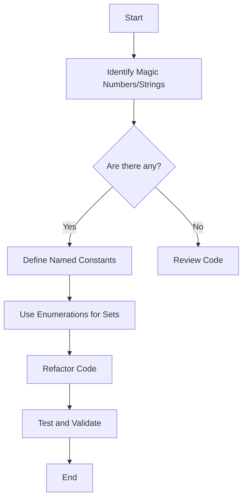

## 11.2.7 Magic Numbers and Strings

In the realm of software development, clarity and maintainability are paramount. One common anti-pattern that can obscure code and make it difficult to maintain is the use of magic numbers and strings. This section will delve into what magic numbers and strings are, the problems they cause, and how to avoid them using best practices in Python.

### What Are Magic Numbers and Strings?

Magic numbers and strings refer to the use of literal values in code without explanation or context. These are hard-coded values that appear in the code, seemingly without reason, and can be numbers, strings, or even booleans. They are called "magic" because their purpose is not immediately clear to someone reading the code.

#### Examples of Magic Numbers and Strings

Consider the following Python code snippet:

```python
def calculate_discount(price):
    return price * 0.9  # Magic number 0.9
```

Here, `0.9` is a magic number. Without context, it's unclear why this specific value is used. Is it a discount rate? A tax rate? A conversion factor?

Similarly, consider this example with strings:

```python
def get_user_role(role):
    if role == "admin":
        return "Administrator access granted."
    elif role == "user":
        return "User access granted."
    else:
        return "No access."
```

In this case, the strings `"admin"` and `"user"` are magic strings. Their meaning is not immediately clear, and they are prone to typos and inconsistencies.

### Problems Caused by Magic Numbers and Strings

Magic numbers and strings can lead to several issues in codebases:

1. **Obscured Meaning**: The purpose of the literal value is not clear, making it difficult for others (or even the original author) to understand the code later.

2. **Maintenance Challenges**: If the value needs to be changed, it must be updated in every place it appears, increasing the risk of errors.

3. **Error-Prone**: Magic strings are particularly susceptible to typos, which can lead to subtle bugs that are hard to trace.

4. **Lack of Context**: Without descriptive names, the intent behind the value is lost, making it harder to reason about the code.

### Examples in Python

Let's explore some examples to illustrate the negative impact of magic numbers and strings:

#### Example 1: Magic Numbers

```python
def calculate_area(radius):
    return 3.14159 * radius * radius  # Magic number for pi
```

The number `3.14159` is used directly here, but it would be better to use a named constant to clarify its purpose.

#### Example 2: Magic Strings

```python
def connect_to_database(db_type):
    if db_type == "mysql":
        return "Connecting to MySQL database..."
    elif db_type == "sqlite":
        return "Connecting to SQLite database..."
    else:
        return "Unknown database type."
```

The strings `"mysql"` and `"sqlite"` are magic strings. Using named constants or an enumeration would improve clarity.

### Solutions to Avoid Magic Numbers and Strings

To mitigate the issues caused by magic numbers and strings, we can use named constants and enumerations. These techniques provide context and make the code more readable and maintainable.

#### Using Named Constants

Named constants are variables that are assigned a value once and not changed. They provide a descriptive name for the value, making the code easier to understand.

```python
PI = 3.14159

def calculate_area(radius):
    return PI * radius * radius
```

By defining `PI` as a named constant, we make it clear that this value represents the mathematical constant pi.

#### Using Enumerations

Python's `enum` module allows us to define enumerations, which are a set of symbolic names bound to unique, constant values. Enumerations are particularly useful for replacing magic strings.

```python
from enum import Enum

class DatabaseType(Enum):
    MYSQL = "mysql"
    SQLITE = "sqlite"

def connect_to_database(db_type):
    if db_type == DatabaseType.MYSQL:
        return "Connecting to MySQL database..."
    elif db_type == DatabaseType.SQLITE:
        return "Connecting to SQLite database..."
    else:
        return "Unknown database type."
```

By using an enumeration, we eliminate the magic strings and provide a clear set of possible values for `db_type`.

### Best Practices for Avoiding Magic Numbers and Strings

To ensure your code is clear and maintainable, follow these best practices:

1. **Use Descriptive Names**: Choose names for constants that convey their purpose and meaning.

2. **Group Related Constants**: Organize constants logically, such as grouping them in a class or module.

3. **Use Enumerations for Fixed Sets**: When dealing with a fixed set of related values, use enumerations to provide context and prevent errors.

4. **Document Constants**: Even with named constants, include comments or documentation to explain their purpose.

5. **Avoid Hard-Coding Values**: Whenever possible, avoid embedding literal values directly in code. Use configuration files or environment variables for values that may change.

### Benefits of Avoiding Magic Numbers and Strings

By replacing magic numbers and strings with named constants and enumerations, you gain several advantages:

- **Improved Code Clarity**: The code becomes easier to read and understand, as the purpose of each value is clear.

- **Easier Maintenance**: Changes to values are centralized, reducing the risk of errors and making updates simpler.

- **Reduced Errors**: By using enumerations, you minimize the risk of typos and inconsistencies in string values.

- **Enhanced Collaboration**: Clear code is easier for team members to work with, facilitating collaboration and code reviews.

### Try It Yourself

Let's put these concepts into practice. Try modifying the following code to replace magic numbers and strings with named constants and enumerations:

```python
def calculate_final_price(price, discount_type):
    if discount_type == "student":
        return price * 0.8  # Magic number for student discount
    elif discount_type == "senior":
        return price * 0.85  # Magic number for senior discount
    else:
        return price
```

**Exercise**: Define named constants for the discount rates and use an enumeration for the discount types. Test your changes to ensure the code still functions correctly.

### Visualizing the Impact of Magic Numbers and Strings

To better understand the impact of magic numbers and strings, consider the following flowchart that illustrates the process of refactoring code to use named constants and enumerations:



This flowchart outlines a systematic approach to identifying and replacing magic numbers and strings in your code.

### References and Further Reading

For more information on best practices in Python and avoiding magic numbers and strings, consider the following resources:

- [Python's `enum` module documentation](https://docs.python.org/3/library/enum.html)
- [PEP 8 - Style Guide for Python Code](https://www.python.org/dev/peps/pep-0008/)
- [Clean Code: A Handbook of Agile Software Craftsmanship by Robert C. Martin](https://www.amazon.com/Clean-Code-Handbook-Software-Craftsmanship/dp/0132350882)

### Knowledge Check

Before we conclude, let's reinforce what we've learned with a few key takeaways:

- Magic numbers and strings are literal values used without context, leading to unclear and error-prone code.
- Named constants and enumerations provide clarity and reduce maintenance challenges.
- Descriptive naming and logical grouping of constants enhance code readability.
- Avoiding magic numbers and strings leads to improved collaboration and fewer errors.

Remember, this is just the beginning. As you continue to refine your coding practices, keep experimenting with these techniques to write clearer, more maintainable code. Stay curious, and enjoy the journey!

## Quiz Time!



### What is a magic number in programming?

- [x] A literal number used in code without explanation
- [ ] A number that is dynamically calculated
- [ ] A number stored in a configuration file
- [ ] A number that is part of a mathematical constant

> **Explanation:** A magic number is a literal value used in code without context or explanation, making it unclear to readers.

### Why are magic strings problematic?

- [x] They can lead to typos and inconsistencies
- [ ] They are always incorrect
- [ ] They are too long
- [ ] They are stored in variables

> **Explanation:** Magic strings are problematic because they are prone to typos and inconsistencies, leading to potential bugs.

### Which Python module is used for creating enumerations?

- [x] `enum`
- [ ] `collections`
- [ ] `math`
- [ ] `random`

> **Explanation:** The `enum` module in Python is used to create enumerations, providing a set of symbolic names bound to unique, constant values.

### What is a benefit of using named constants?

- [x] Improved code clarity
- [ ] Increased execution speed
- [ ] Reduced code length
- [ ] Automatic error correction

> **Explanation:** Named constants improve code clarity by providing descriptive names for values, making the code easier to understand.

### How can you avoid magic numbers in your code?

- [x] Use named constants
- [x] Use enumerations
- [ ] Use more comments
- [ ] Use shorter variable names

> **Explanation:** Using named constants and enumerations helps avoid magic numbers by providing context and clarity.

### What is a common practice for organizing related constants?

- [x] Group them logically
- [ ] Scatter them throughout the code
- [ ] Use random names
- [ ] Store them in a database

> **Explanation:** Grouping related constants logically helps organize the code and makes it easier to maintain.

### What is the purpose of using enumerations?

- [x] To define a set of symbolic names for unique values
- [ ] To increase code execution speed
- [ ] To reduce memory usage
- [ ] To automatically generate code

> **Explanation:** Enumerations define a set of symbolic names for unique values, providing context and reducing errors.

### What is a key takeaway from avoiding magic numbers and strings?

- [x] Improved code readability and maintainability
- [ ] Faster code execution
- [ ] Increased code length
- [ ] Automatic bug fixing

> **Explanation:** Avoiding magic numbers and strings improves code readability and maintainability by providing context and clarity.

### True or False: Magic numbers make code easier to understand.

- [ ] True
- [x] False

> **Explanation:** False. Magic numbers obscure the meaning of code, making it harder to understand.

### What should you do if you find a magic number in your code?

- [x] Replace it with a named constant
- [ ] Leave it as is
- [ ] Delete it
- [ ] Convert it to a string

> **Explanation:** Replace a magic number with a named constant to provide context and improve code clarity.


