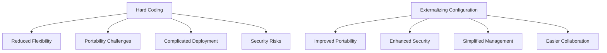

## 11.2.8 Hard Coding

### Understanding Hard Coding in Software Development

Hard coding is a practice in software development where fixed values or configuration data are embedded directly into the source code. These values could include URLs, database credentials, file paths, or any other environment-specific information that the application relies on. While it might seem convenient during the initial stages of development, hard coding can lead to significant issues as the software evolves and scales.

### Negative Impacts of Hard Coding

#### Reduced Flexibility

Hard-coded values make software inflexible. When a value needs to change, developers must modify the source code, which can be time-consuming and error-prone. This inflexibility becomes particularly problematic in environments where configurations frequently change, such as in cloud-based applications or when deploying software across different environments (development, testing, production).

#### Portability Challenges

Software portability refers to the ease with which software can be transferred from one environment to another. Hard coding ties the software to a specific environment, making it difficult to move. For instance, a hard-coded file path might work on a developer's machine but fail on a production server due to differences in directory structures.

#### Complicated Deployment and Scaling

Hard coding complicates deployment processes. Each environment might require different configurations, and managing these differences through code changes is cumbersome. This practice also hinders scaling efforts, as scaling often involves deploying software across multiple environments with varying configurations.

#### Security Risks

Embedding sensitive information such as API keys or database credentials directly in the code poses security risks. If the source code is exposed, these credentials can be easily compromised, leading to unauthorized access and potential data breaches.

### Examples of Hard Coding in Python

Let's explore some common scenarios where hard coding occurs in Python applications:

#### Example 1: Hard-Coded URLs

```python
def fetch_data():
    url = "http://example.com/api/data"
    response = requests.get(url)
    return response.json()

```

#### Example 2: Hard-Coded Database Credentials

```python
def connect_to_database():
    connection = psycopg2.connect(
        dbname="mydatabase",
        user="admin",
        password="secretpassword",
        host="localhost"
    )
    return connection

```

#### Example 3: Hard-Coded File Paths

```python
def read_file():
    file_path = "/home/user/data/input.txt"
    with open(file_path, 'r') as file:
        data = file.read()
    return data

```

### Strategies for Externalizing Configuration

To avoid the pitfalls of hard coding, it's essential to externalize configuration data. Here are some strategies to achieve this in Python:

#### Using Configuration Files

Configuration files allow you to separate configuration data from your code. Formats like JSON, YAML, or INI are commonly used for this purpose.

**Example: Using `configparser` for INI Files**

```python
import configparser

config = configparser.ConfigParser()
config.read('config.ini')

db_name = config['database']['name']
db_user = config['database']['user']
db_password = config['database']['password']
```

**Sample `config.ini` File**

```ini
[database]
name = mydatabase
user = admin
password = secretpassword
```

#### Leveraging Environment Variables

Environment variables provide a secure and flexible way to manage configuration data. They can be set differently for each environment, ensuring that sensitive information is not stored in the codebase.

**Example: Using Environment Variables**

```python
import os

db_name = os.getenv('DB_NAME')
db_user = os.getenv('DB_USER')
db_password = os.getenv('DB_PASSWORD')
```

**Setting Environment Variables**

```bash
export DB_NAME=mydatabase
export DB_USER=admin
export DB_PASSWORD=secretpassword
```

#### Command-Line Arguments

Command-line arguments allow you to pass configuration data to your application at runtime. This approach is useful for scripts and command-line tools.

**Example: Using `argparse` for Command-Line Arguments**

```python
import argparse

parser = argparse.ArgumentParser(description='Process some integers.')
parser.add_argument('--db-name', required=True, help='The name of the database')
parser.add_argument('--db-user', required=True, help='The database user')
parser.add_argument('--db-password', required=True, help='The database password')

args = parser.parse_args()

db_name = args.db_name
db_user = args.db_user
db_password = args.db_password
```

#### Using Libraries like `dotenv`

The `dotenv` library allows you to load environment variables from a `.env` file, providing a convenient way to manage configuration data.

**Example: Using `dotenv`**

```python
from dotenv import load_dotenv
import os

load_dotenv()

db_name = os.getenv('DB_NAME')
db_user = os.getenv('DB_USER')
db_password = os.getenv('DB_PASSWORD')
```

**Sample `.env` File**

```plaintext
DB_NAME=mydatabase
DB_USER=admin
DB_PASSWORD=secretpassword
```

### Best Practices for Configuration Management

#### Separate Code from Configuration

Always separate your code from configuration data. This separation enhances flexibility, making it easier to adapt your application to different environments without modifying the source code.

#### Secure Sensitive Information

Ensure that sensitive information, such as passwords and API keys, is stored securely. Use environment variables or secure vaults to manage this data, and avoid committing it to version control systems.

#### Use Version Control for Configuration Files

While sensitive information should not be stored in version control, configuration files that do not contain sensitive data should be versioned. This practice helps track changes and ensures consistency across environments.

#### Validate Configuration Data

Implement validation checks for configuration data to catch errors early. This validation can prevent runtime errors caused by missing or incorrect configuration values.

### Benefits of Externalizing Configuration

#### Improved Portability

Externalizing configuration data makes your application more portable. You can easily move it across environments by simply updating configuration files or environment variables.

#### Enhanced Security

By avoiding hard coding, you reduce the risk of exposing sensitive information. Environment variables and secure vaults provide a safer way to manage credentials and other sensitive data.

#### Simplified Configuration Management

Externalizing configuration simplifies the management of different environments. You can maintain separate configuration files or environment variable sets for development, testing, and production, ensuring that each environment is correctly configured.

#### Easier Collaboration

When configuration data is externalized, team members can work on the same codebase without worrying about environment-specific settings. This practice fosters collaboration and reduces the risk of configuration-related errors.

### Visualizing the Impact of Hard Coding

To better understand the impact of hard coding and the benefits of externalizing configuration, let's visualize the process using a flowchart.



**Diagram Description**: This flowchart illustrates the negative impacts of hard coding, such as reduced flexibility, portability challenges, complicated deployment, and security risks. It also highlights the benefits of externalizing configuration, including improved portability, enhanced security, simplified management, and easier collaboration.

### Try It Yourself

Let's put these concepts into practice. Modify the following code examples to externalize the configuration data:

#### Exercise 1: Externalize the URL

```python
def fetch_data():
    url = "http://example.com/api/data"
    response = requests.get(url)
    return response.json()

```

#### Exercise 2: Secure Database Credentials

```python
def connect_to_database():
    connection = psycopg2.connect(
        dbname="mydatabase",
        user="admin",
        password="secretpassword",
        host="localhost"
    )
    return connection

```

### Knowledge Check

Before we conclude, let's reinforce what we've learned with a few questions:

1. What is hard coding, and why is it considered an anti-pattern?
2. How does hard coding affect software flexibility and portability?
3. What are some strategies for externalizing configuration data in Python?
4. Why is it important to secure sensitive information, and how can this be achieved?
5. What are the benefits of using environment variables for configuration management?

### Embrace the Journey

Remember, avoiding hard coding is just the beginning of writing flexible and secure software. As you progress, you'll learn to apply these principles to more complex systems. Keep experimenting, stay curious, and enjoy the journey!

## Quiz Time!



### What is hard coding in software development?

- [x] Embedding fixed values directly into the source code.
- [ ] Using dynamic values that change at runtime.
- [ ] Storing configuration data in external files.
- [ ] Utilizing environment variables for configuration.

> **Explanation:** Hard coding involves embedding fixed values directly into the source code, making it inflexible and less portable.

### Which of the following is a negative impact of hard coding?

- [x] Reduced flexibility.
- [ ] Improved security.
- [ ] Enhanced portability.
- [ ] Simplified deployment.

> **Explanation:** Hard coding reduces flexibility, making it difficult to change configurations without modifying the source code.

### What is a common strategy for externalizing configuration data?

- [x] Using configuration files.
- [ ] Hard coding values.
- [ ] Embedding data in the source code.
- [ ] Ignoring configuration management.

> **Explanation:** Using configuration files is a common strategy to externalize configuration data, separating it from the source code.

### How can environment variables enhance security?

- [x] By storing sensitive information outside the source code.
- [ ] By embedding credentials directly in the code.
- [ ] By making code less portable.
- [ ] By complicating deployment processes.

> **Explanation:** Environment variables enhance security by storing sensitive information outside the source code, reducing the risk of exposure.

### What is a benefit of externalizing configuration data?

- [x] Improved portability.
- [ ] Increased hard coding.
- [ ] Reduced security.
- [ ] Complicated management.

> **Explanation:** Externalizing configuration data improves portability, allowing software to be easily moved across environments.

### Which library can be used to manage environment variables from a file?

- [x] dotenv
- [ ] argparse
- [ ] configparser
- [ ] os

> **Explanation:** The `dotenv` library can be used to manage environment variables from a `.env` file.

### Why is it important to validate configuration data?

- [x] To prevent runtime errors caused by incorrect values.
- [ ] To increase the complexity of the code.
- [ ] To embed sensitive information in the code.
- [ ] To reduce flexibility.

> **Explanation:** Validating configuration data prevents runtime errors caused by missing or incorrect values, ensuring the application runs smoothly.

### What is a disadvantage of hard coding database credentials?

- [x] Security risks due to exposed credentials.
- [ ] Improved security.
- [ ] Simplified configuration management.
- [ ] Enhanced portability.

> **Explanation:** Hard coding database credentials poses security risks as they can be easily exposed if the source code is compromised.

### Which of the following is NOT a strategy for externalizing configuration?

- [ ] Using environment variables.
- [ ] Utilizing command-line arguments.
- [ ] Employing configuration files.
- [x] Hard coding values in the source code.

> **Explanation:** Hard coding values in the source code is not a strategy for externalizing configuration; it is the practice to avoid.

### True or False: Hard coding improves the security of an application.

- [ ] True
- [x] False

> **Explanation:** False. Hard coding does not improve security; it can expose sensitive information and make the application vulnerable.


