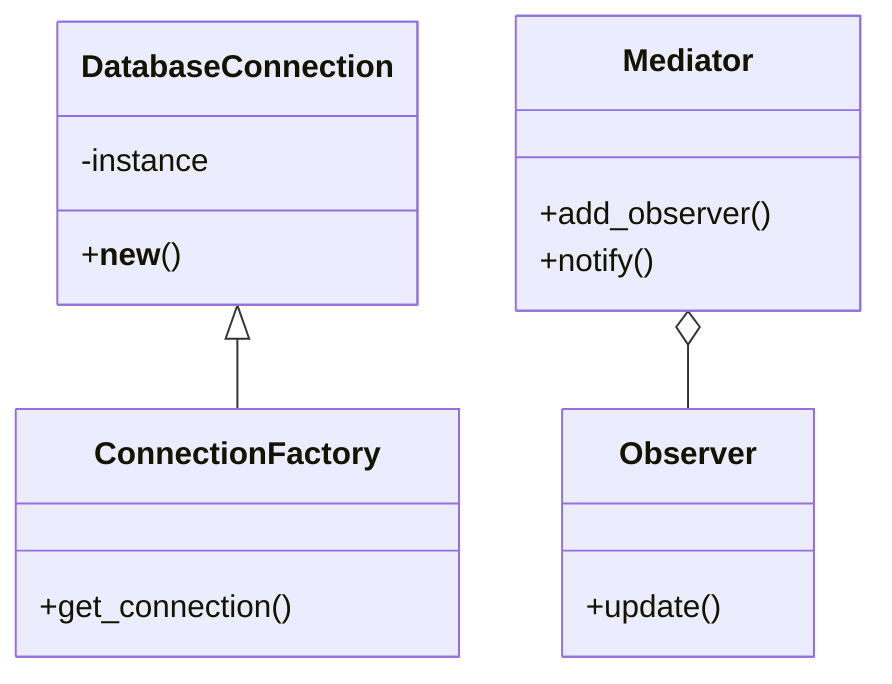
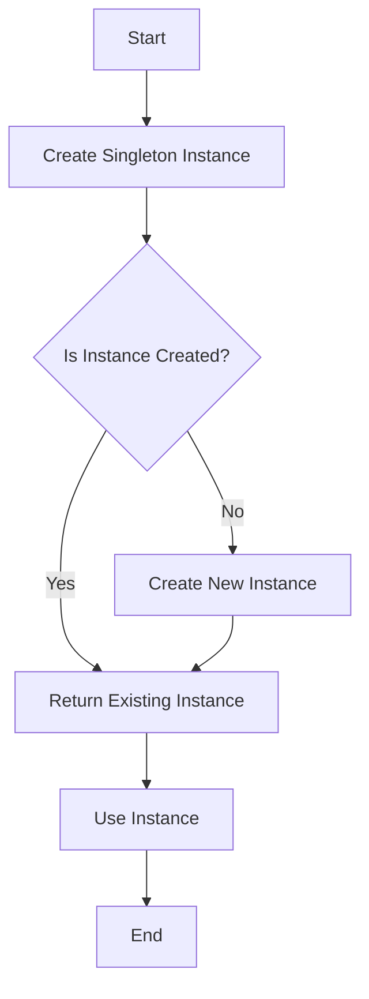

## 12.1 Combining Patterns Effectively

In the ever-evolving landscape of software development, design patterns serve as a powerful toolkit for solving recurring design problems. However, the complexity of modern applications often demands more than a single pattern can offer. Combining multiple design patterns can address intricate design challenges, enhance flexibility, and improve code maintainability. In this section, we will explore strategies for effectively integrating multiple patterns within a software project.

### Introduction to Combining Patterns

Combining design patterns is not just about mixing different solutions; it's about creating a cohesive architecture that leverages the strengths of each pattern to address complex problems. By integrating multiple patterns, developers can:

- **Enhance Flexibility**: Patterns like Strategy and Factory Method can be combined to allow for dynamic behavior changes and flexible object creation.
- **Improve Maintainability**: Patterns such as Observer and Mediator can be used together to decouple components and simplify communication.
- **Solve Complex Problems**: Some design challenges are too intricate for a single pattern. Combining patterns can provide a more comprehensive solution.

#### Scenarios for Combining Patterns

Consider a scenario where you are developing a complex e-commerce platform. You might use the following pattern combinations:

- **Singleton and Factory Method**: To manage a single instance of a database connection while allowing for flexible creation of different types of database objects.
- **Observer and Mediator**: To handle user interface updates and manage interactions between different UI components without tight coupling.
- **Decorator and Strategy**: To dynamically add features to products and allow for different pricing strategies.

### Strategies for Integration

Successfully combining patterns requires a systematic approach. Here are some strategies to consider:

#### Understanding Relationships and Interactions

Before integrating patterns, it's crucial to understand how they interact. Some patterns naturally complement each other, while others may conflict. For example:

- **Factory Method and Singleton**: The Factory Method can be used to control the instantiation of a Singleton, ensuring that only one instance is created.
- **Composite and Iterator**: The Composite pattern can be used to create a tree structure, while the Iterator pattern can traverse it.

#### Selecting Compatible Patterns

When selecting patterns to combine, consider the following guidelines:

- **Complementary Strengths**: Choose patterns that address different aspects of a problem. For example, use Strategy for algorithm selection and Decorator for adding functionality.
- **Non-Overlapping Responsibilities**: Ensure that patterns do not overlap in their responsibilities, which can lead to redundancy and complexity.

#### Systematic Integration

Integrate patterns incrementally, starting with a core pattern and gradually adding others. This approach allows for easier testing and debugging.

### Pattern Interaction and Collaboration

Certain patterns are designed to work well together, forming a robust architecture. Let's explore some common combinations:

#### Factory Method with Singleton

The Factory Method pattern provides an interface for creating objects, while the Singleton pattern ensures that a class has only one instance. Together, they can manage object creation and lifecycle efficiently.

```python
class DatabaseConnection:
    _instance = None

    def __new__(cls, *args, **kwargs):
        if not cls._instance:
            cls._instance = super(DatabaseConnection, cls).__new__(cls, *args, **kwargs)
        return cls._instance

class ConnectionFactory:
    @staticmethod
    def get_connection():
        return DatabaseConnection()

connection1 = ConnectionFactory.get_connection()
connection2 = ConnectionFactory.get_connection()
assert connection1 is connection2  # Both references point to the same instance
```

#### Observer with Mediator

The Observer pattern allows objects to be notified of state changes, while the Mediator pattern centralizes communication between objects. This combination can be used to manage complex interactions in a decoupled manner.

```python
class Mediator:
    def __init__(self):
        self._observers = []

    def add_observer(self, observer):
        self._observers.append(observer)

    def notify(self, event):
        for observer in self._observers:
            observer.update(event)

class Observer:
    def update(self, event):
        print(f"Observer received event: {event}")

mediator = Mediator()
observer = Observer()
mediator.add_observer(observer)
mediator.notify("Event 1")
```

### Design Principles

When combining patterns, it's essential to adhere to design principles such as SOLID to maintain a clean and maintainable architecture.

#### SOLID Principles

- **Single Responsibility Principle (SRP)**: Each class should have one responsibility. When combining patterns, ensure that each pattern addresses a specific concern.
- **Open/Closed Principle (OCP)**: Classes should be open for extension but closed for modification. Use patterns like Decorator and Strategy to extend behavior without altering existing code.
- **Liskov Substitution Principle (LSP)**: Subtypes should be substitutable for their base types. Ensure that pattern implementations adhere to this principle.
- **Interface Segregation Principle (ISP)**: Clients should not be forced to depend on interfaces they do not use. When combining patterns, ensure that interfaces remain focused and relevant.
- **Dependency Inversion Principle (DIP)**: Depend on abstractions, not concretions. Use patterns like Factory Method and Dependency Injection to adhere to this principle.

#### High Cohesion and Low Coupling

Maintain high cohesion by ensuring that classes and patterns have focused responsibilities. Achieve low coupling by minimizing dependencies between patterns, which enhances flexibility and reusability.

### Best Practices

Combining patterns can introduce complexity. Follow these best practices to manage it effectively:

#### Incremental Implementation and Testing

Implement patterns incrementally and test each integration thoroughly. This approach helps identify issues early and ensures that each pattern works as expected.

#### Thorough Documentation

Document how patterns are integrated, including their roles and interactions. This documentation aids future maintenance and helps new team members understand the architecture.

### Potential Pitfalls

While combining patterns can be beneficial, it can also lead to challenges:

#### Overuse of Patterns

Using too many patterns can make the design overly complex and difficult to maintain. Use patterns judiciously and only when they add value.

#### Complexity and Maintenance Challenges

Combining patterns can introduce complexity. Ensure that the benefits of integration outweigh the added complexity and that the design remains maintainable.

### Examples and Case Studies

Let's explore a real-world example of combining patterns in a web application:

#### Case Study: E-commerce Platform

In an e-commerce platform, we might use the following pattern combinations:

- **Singleton and Factory Method**: To manage a single instance of a payment gateway while allowing for flexible creation of different payment methods.
- **Observer and Mediator**: To handle cart updates and manage interactions between different components, such as inventory and order processing.
- **Decorator and Strategy**: To dynamically add discounts and promotions to products and allow for different pricing strategies.

```python
class PaymentGateway:
    _instance = None

    def __new__(cls, *args, **kwargs):
        if not cls._instance:
            cls._instance = super(PaymentGateway, cls).__new__(cls, *args, **kwargs)
        return cls._instance

class PaymentFactory:
    @staticmethod
    def get_payment_method(method):
        if method == "credit_card":
            return CreditCardPayment()
        elif method == "paypal":
            return PayPalPayment()
        else:
            raise ValueError("Unknown payment method")

class CreditCardPayment:
    def process_payment(self, amount):
        print(f"Processing credit card payment of {amount}")

class PayPalPayment:
    def process_payment(self, amount):
        print(f"Processing PayPal payment of {amount}")

gateway = PaymentGateway()
payment_method = PaymentFactory.get_payment_method("credit_card")
payment_method.process_payment(100)
```

### Visual Aids

To better understand the interactions between patterns, let's use UML diagrams and flowcharts.

#### UML Diagram: Pattern Interactions



This diagram illustrates the interaction between the Singleton and Factory Method patterns, as well as the Observer and Mediator patterns.

#### Flowchart: Dynamic Behavior



This flowchart demonstrates the dynamic behavior of creating and using a Singleton instance.

### Conclusion

Combining design patterns effectively requires a deep understanding of each pattern's strengths and interactions. By following systematic strategies, adhering to design principles, and being mindful of potential pitfalls, developers can create robust and maintainable architectures. Remember to document your integrations thoroughly and test incrementally. As you continue to explore design patterns, think critically about how they can be combined to address complex design challenges.

## Quiz Time!



### Which of the following is a benefit of combining design patterns?

- [x] Enhancing flexibility
- [ ] Increasing code duplication
- [ ] Making code less maintainable
- [ ] Reducing code readability

> **Explanation:** Combining design patterns can enhance flexibility by leveraging the strengths of multiple patterns to address complex problems.

### What is a potential pitfall of overusing design patterns?

- [x] Increased complexity
- [ ] Improved performance
- [ ] Enhanced readability
- [ ] Simplified architecture

> **Explanation:** Overusing design patterns can lead to increased complexity, making the architecture harder to understand and maintain.

### Which design principle emphasizes that classes should be open for extension but closed for modification?

- [ ] Single Responsibility Principle
- [x] Open/Closed Principle
- [ ] Liskov Substitution Principle
- [ ] Dependency Inversion Principle

> **Explanation:** The Open/Closed Principle states that classes should be open for extension but closed for modification, allowing for behavior changes without altering existing code.

### How can the Factory Method and Singleton patterns be combined effectively?

- [x] Use Factory Method to control Singleton instantiation
- [ ] Use Singleton to create multiple Factory Methods
- [ ] Use Factory Method to duplicate Singleton instances
- [ ] Use Singleton to replace Factory Method

> **Explanation:** The Factory Method can be used to control the instantiation of a Singleton, ensuring that only one instance is created.

### What is a key consideration when selecting patterns to combine?

- [x] Complementary strengths
- [ ] Overlapping responsibilities
- [ ] Maximum complexity
- [ ] Minimum documentation

> **Explanation:** When selecting patterns to combine, choose those with complementary strengths that address different aspects of a problem.

### What is the role of the Mediator pattern when combined with the Observer pattern?

- [x] Centralizing communication
- [ ] Duplicating observers
- [ ] Eliminating notifications
- [ ] Increasing coupling

> **Explanation:** The Mediator pattern centralizes communication between objects, reducing dependencies and simplifying interactions.

### Which of the following is a best practice for combining design patterns?

- [x] Incremental implementation and testing
- [ ] Implementing all patterns at once
- [ ] Avoiding documentation
- [ ] Ignoring design principles

> **Explanation:** Incremental implementation and testing help identify issues early and ensure that each pattern works as expected.

### What is the primary goal of maintaining high cohesion and low coupling?

- [x] Enhancing flexibility and reusability
- [ ] Increasing code duplication
- [ ] Reducing code readability
- [ ] Making code less maintainable

> **Explanation:** High cohesion and low coupling enhance flexibility and reusability by ensuring that classes and patterns have focused responsibilities and minimal dependencies.

### In the provided case study, which pattern combination is used to manage a single instance of a payment gateway?

- [x] Singleton and Factory Method
- [ ] Observer and Mediator
- [ ] Decorator and Strategy
- [ ] Composite and Iterator

> **Explanation:** The Singleton and Factory Method patterns are used to manage a single instance of a payment gateway while allowing for flexible creation of different payment methods.

### True or False: Combining design patterns always leads to a simpler architecture.

- [ ] True
- [x] False

> **Explanation:** Combining design patterns can introduce complexity, and it's important to ensure that the benefits of integration outweigh the added complexity.


