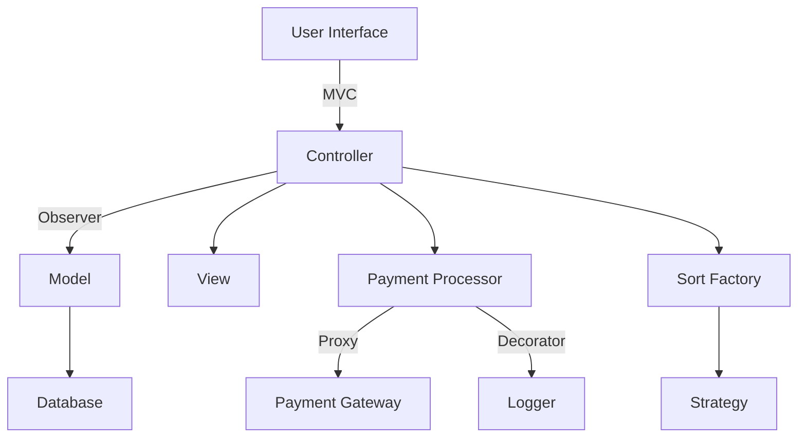
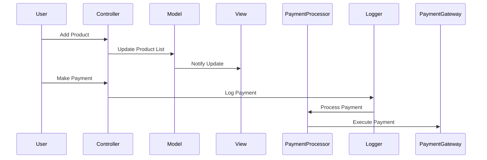

## 12.2 Case Study: Complex Application Architecture

In this section, we delve into a case study of a complex application architecture that leverages multiple design patterns to address intricate design challenges. This case study will provide insights into how various patterns can be integrated to create a robust, scalable, and maintainable system.

### Introduction to the Case Study

Let's explore an e-commerce platform designed to handle a vast array of products, user interactions, and transactions. The platform's primary goal is to offer a seamless shopping experience while efficiently managing backend operations such as inventory, order processing, and user management.

### Application Requirements and Challenges

The e-commerce platform faced several requirements and challenges:

- **Scalability**: The platform needed to handle thousands of concurrent users and transactions.
- **Maintainability**: The codebase had to be easy to maintain and extend as new features were added.
- **Performance**: Fast response times were crucial for user satisfaction.
- **Security**: Sensitive user data and transactions required robust security measures.
- **Integration**: The system had to integrate with third-party services for payment processing, shipping, and analytics.

These requirements necessitated the use of multiple design patterns to address the complexity and ensure a high-quality application.

### Patterns Employed

The following design patterns were employed in the application:

1. **Model-View-Controller (MVC)**: Used to separate concerns, allowing independent development and testing of the user interface, business logic, and data access layers.

2. **Singleton**: Ensured a single instance of critical components like configuration managers and logging services.

3. **Factory Method**: Facilitated the creation of product objects without specifying their concrete classes, enhancing flexibility.

4. **Observer**: Enabled real-time updates to the user interface and other components when data changed.

5. **Decorator**: Added dynamic behavior to objects, such as logging and authentication, without altering their structure.

6. **Facade**: Provided a simplified interface to complex subsystems, making them easier to use.

7. **Proxy**: Controlled access to sensitive resources, such as payment gateways, adding an extra layer of security.

8. **Strategy**: Allowed dynamic switching between different algorithms for tasks like sorting and filtering.

### Integration of Patterns

The integration of these patterns was crucial for the system's success. Here's how they interacted and complemented each other:

- **MVC and Observer**: The MVC pattern was combined with the Observer pattern to ensure that changes in the model were automatically reflected in the view, providing a responsive user interface.

- **Factory Method and Strategy**: The Factory Method pattern was used to create strategy objects, allowing the system to dynamically select and apply different algorithms based on user preferences or data characteristics.

- **Decorator and Proxy**: These patterns were layered to add logging and authentication to sensitive operations, such as payment processing, without modifying the core logic.

- **Facade and Singleton**: The Facade pattern was used to simplify interactions with complex subsystems, while the Singleton pattern ensured that only one instance of these facades existed, reducing resource usage.

### Implementation Details

Let's dive into the implementation details of some critical components, with code examples to illustrate how these patterns were applied.

#### Model-View-Controller (MVC) and Observer

The MVC pattern was implemented to separate the user interface, business logic, and data access layers. The Observer pattern was used to keep the view updated with changes in the model.

```python
class ProductModel:
    def __init__(self):
        self._observers = []
        self._products = []

    def add_observer(self, observer):
        self._observers.append(observer)

    def notify_observers(self):
        for observer in self._observers:
            observer.update(self)

    def add_product(self, product):
        self._products.append(product)
        self.notify_observers()

class ProductView:
    def update(self, model):
        print("Product list updated:")
        for product in model._products:
            print(f"- {product}")

model = ProductModel()
view = ProductView()
model.add_observer(view)

model.add_product("Laptop")
model.add_product("Smartphone")
```

In this example, the `ProductModel` class maintains a list of products and notifies observers whenever the product list changes. The `ProductView` class updates the display when notified.

#### Factory Method and Strategy

The Factory Method pattern was used to create strategy objects for different sorting algorithms.

```python
class SortStrategy:
    def sort(self, data):
        raise NotImplementedError("Sort method not implemented.")

class QuickSortStrategy(SortStrategy):
    def sort(self, data):
        return sorted(data)  # Simplified for illustration

class MergeSortStrategy(SortStrategy):
    def sort(self, data):
        return sorted(data)  # Simplified for illustration

class SortFactory:
    @staticmethod
    def create_sort_strategy(strategy_type):
        if strategy_type == "quick":
            return QuickSortStrategy()
        elif strategy_type == "merge":
            return MergeSortStrategy()
        else:
            raise ValueError("Unknown strategy type.")

data = [5, 3, 8, 1]
strategy = SortFactory.create_sort_strategy("quick")
sorted_data = strategy.sort(data)
print(sorted_data)
```

The `SortFactory` class creates instances of sorting strategies based on the specified type, allowing the system to switch algorithms dynamically.

#### Decorator and Proxy

The Decorator and Proxy patterns were used to add logging and authentication to sensitive operations.

```python
class PaymentProcessor:
    def process_payment(self, amount):
        print(f"Processing payment of ${amount}")

class PaymentLoggerDecorator:
    def __init__(self, processor):
        self._processor = processor

    def process_payment(self, amount):
        print(f"Logging payment of ${amount}")
        self._processor.process_payment(amount)

class PaymentProxy:
    def __init__(self, processor, user_authenticated):
        self._processor = processor
        self._user_authenticated = user_authenticated

    def process_payment(self, amount):
        if self._user_authenticated:
            self._processor.process_payment(amount)
        else:
            print("Authentication required.")

processor = PaymentProcessor()
logged_processor = PaymentLoggerDecorator(processor)
proxy_processor = PaymentProxy(logged_processor, user_authenticated=True)

proxy_processor.process_payment(100)
```

In this example, the `PaymentLoggerDecorator` adds logging functionality, while the `PaymentProxy` controls access based on user authentication.

### Benefits Achieved

The integration of multiple design patterns provided several benefits:

- **Scalability**: The system could handle increased load by efficiently managing resources and distributing tasks.
- **Maintainability**: The separation of concerns and modular design made the codebase easier to understand and extend.
- **Performance**: The use of efficient algorithms and caching strategies improved response times.
- **Security**: Patterns like Proxy and Singleton ensured secure access to sensitive resources.
- **Flexibility**: The system could adapt to changing requirements by swapping out components or adding new ones without significant refactoring.

### Lessons Learned

Reflecting on the development process, several lessons were learned:

- **Pattern Selection**: Choosing the right patterns for the right problems was crucial. Overusing patterns can lead to unnecessary complexity.
- **Integration**: Ensuring seamless integration between patterns required careful planning and testing.
- **Customization**: Adapting standard patterns to fit specific needs was often necessary, but it required a deep understanding of the patterns' principles.
- **Documentation**: Comprehensive documentation was essential for maintaining the system and onboarding new developers.

### Visual Representations

To better understand the system's architecture, let's look at some visual representations.

#### Architectural Diagram



This diagram illustrates the overall architecture, highlighting the interaction between different components and design patterns.

#### Sequence Diagram



This sequence diagram shows the flow of interactions during key processes, such as adding a product and making a payment.

### Conclusion

In this case study, we explored how multiple design patterns were integrated to build a complex e-commerce platform. By leveraging patterns like MVC, Observer, Factory Method, and others, the system achieved scalability, maintainability, and performance. The lessons learned highlight the importance of careful pattern selection, integration, and documentation.

Remember, this is just the beginning. As you progress in your projects, consider how these insights can be applied to create more efficient and robust systems. Keep experimenting, stay curious, and enjoy the journey!

## Quiz Time!



### Which design pattern is used to separate concerns in the e-commerce platform?

- [x] Model-View-Controller (MVC)
- [ ] Singleton
- [ ] Factory Method
- [ ] Observer

> **Explanation:** The MVC pattern is used to separate the user interface, business logic, and data access layers.

### What is the primary benefit of using the Observer pattern in the application?

- [x] Real-time updates to the user interface
- [ ] Simplified object creation
- [ ] Enhanced security
- [ ] Improved performance

> **Explanation:** The Observer pattern enables real-time updates to the user interface when data changes.

### How does the Factory Method pattern enhance flexibility in the system?

- [x] By allowing the creation of objects without specifying their concrete classes
- [ ] By controlling access to sensitive resources
- [ ] By adding dynamic behavior to objects
- [ ] By providing a simplified interface to complex subsystems

> **Explanation:** The Factory Method pattern allows the creation of objects without specifying their concrete classes, enhancing flexibility.

### Which pattern is used to add logging functionality to the payment processing system?

- [x] Decorator
- [ ] Proxy
- [ ] Singleton
- [ ] Strategy

> **Explanation:** The Decorator pattern is used to add logging functionality to the payment processing system.

### What is the role of the Proxy pattern in the application?

- [x] Controlling access to sensitive resources
- [ ] Separating concerns
- [ ] Creating objects without specifying concrete classes
- [ ] Adding dynamic behavior to objects

> **Explanation:** The Proxy pattern is used to control access to sensitive resources, such as payment gateways.

### Which pattern ensures a single instance of critical components like configuration managers?

- [x] Singleton
- [ ] Factory Method
- [ ] Observer
- [ ] Decorator

> **Explanation:** The Singleton pattern ensures a single instance of critical components like configuration managers.

### How does the Strategy pattern contribute to the system's flexibility?

- [x] By allowing dynamic switching between different algorithms
- [ ] By providing real-time updates
- [ ] By controlling access to resources
- [ ] By simplifying object creation

> **Explanation:** The Strategy pattern allows dynamic switching between different algorithms, contributing to the system's flexibility.

### What is a key lesson learned from the case study?

- [x] Pattern selection is crucial for addressing specific problems
- [ ] Overusing patterns always leads to better design
- [ ] Integration between patterns is not important
- [ ] Documentation is unnecessary for maintaining the system

> **Explanation:** Pattern selection is crucial for addressing specific problems, and overusing patterns can lead to unnecessary complexity.

### Which diagram illustrates the interaction between different components and design patterns?

- [x] Architectural Diagram
- [ ] Sequence Diagram
- [ ] Class Diagram
- [ ] Flowchart

> **Explanation:** The Architectural Diagram illustrates the interaction between different components and design patterns.

### True or False: The use of multiple design patterns improved the system's scalability, maintainability, and performance.

- [x] True
- [ ] False

> **Explanation:** The use of multiple design patterns improved the system's scalability, maintainability, and performance by addressing specific challenges and requirements.


