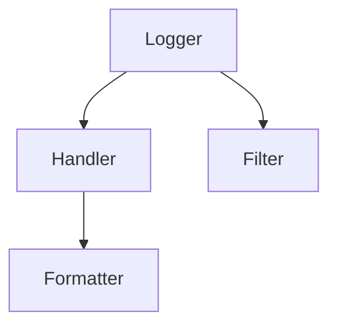

## 13.1 Singleton in Logging Module

In this section, we'll delve into the Singleton pattern's application within Python's built-in `logging` module. This exploration will guide you through understanding how the Singleton pattern ensures a single, globally accessible logger instance throughout an application, enhancing consistency and manageability in logging practices.

### Introduction to Singleton in the Logging Module

#### What is the Singleton Pattern?

The Singleton pattern is a design pattern that restricts the instantiation of a class to a single instance. This pattern is particularly useful when exactly one object is needed to coordinate actions across a system. By ensuring that a class has only one instance, the Singleton pattern provides a global point of access to that instance.

#### Singleton in Python's Logging Module

Python's `logging` module leverages the Singleton pattern to manage loggers efficiently. When you request a logger using `logging.getLogger(name)`, the module ensures that the same logger instance is returned each time for a given name. This behavior is crucial for maintaining consistent logging across different parts of an application, allowing for centralized configuration and management.

### Understanding the `logging` Module

#### Significance of the `logging` Module

The `logging` module in Python is a powerful and flexible logging system that is part of the standard library. It provides a way to configure different loggers, handlers, and formatters to capture and output log messages in various formats and destinations. This module is essential for debugging, monitoring, and auditing applications, offering a robust solution for logging needs.

#### Hierarchy of Loggers, Handlers, Formatters, and Filters

- **Loggers**: These are the primary entry points for logging. They are responsible for dispatching log messages to the appropriate handlers based on the log level.
- **Handlers**: These send the log messages to their final destination, such as the console, a file, or a network socket.
- **Formatters**: These define the layout of the log messages, specifying how the log record's attributes should be presented.
- **Filters**: These provide a finer-grained facility for determining which log records to output.

The following diagram illustrates the relationship between these components:



### Implementation Details

#### Using `logging.getLogger(name)`

The `logging.getLogger(name)` function is the key to the Singleton behavior in the logging module. When you call this function with a specific name, it either returns an existing logger with that name or creates a new one if it doesn't exist. This ensures that all parts of your application using the same logger name share the same logger instance.

```python
import logging

logger = logging.getLogger('my_logger')

logger.setLevel(logging.DEBUG)

console_handler = logging.StreamHandler()

formatter = logging.Formatter('%(asctime)s - %(name)s - %(levelname)s - %(message)s')
console_handler.setFormatter(formatter)

logger.addHandler(console_handler)

logger.debug('This is a debug message')
logger.info('This is an info message')
logger.warning('This is a warning message')
```

In this example, calling `logging.getLogger('my_logger')` ensures that any subsequent calls with the same name return the same logger instance, maintaining consistent logging behavior.

### Benefits of Singleton in Logging

#### Consistent Logging Behavior

Using the Singleton pattern in the logging module ensures that all parts of an application share the same logger configuration. This consistency is crucial for maintaining uniform log formats, levels, and destinations across different modules.

#### Simplified Configuration Management

By centralizing logger configuration, the Singleton pattern simplifies the management of logging settings. Changes to the logger's configuration automatically propagate to all parts of the application using that logger, reducing the risk of misconfiguration.

### Customizing Loggers

#### Setting Logging Levels and Handlers

You can customize loggers by setting different logging levels and adding various handlers to direct log messages to different destinations.

```python
logger.setLevel(logging.INFO)

file_handler = logging.FileHandler('app.log')
file_handler.setFormatter(formatter)
logger.addHandler(file_handler)

logger.info('This message will appear in both the console and the file')
```

#### Adding Handlers

Handlers like `StreamHandler` and `FileHandler` can be added to loggers to direct log output to the console or a file, respectively. You can also create custom handlers for more complex logging requirements.

### Thread Safety and the Logging Module

#### Thread Safety in Logging

The logging module is designed to be thread-safe, allowing multiple threads to log messages concurrently without interference. This is achieved through internal locking mechanisms that ensure log records are processed atomically.

#### Best Practices for Multi-threaded Logging

When logging from multiple threads, it's important to avoid creating new loggers or handlers within each thread. Instead, configure loggers and handlers at the application level and share them across threads to maintain consistency and reduce overhead.

### Best Practices

#### Use Module-level Loggers

Using `__name__` as the logger name is a common practice that ensures each module has its own logger. This approach allows for fine-grained control over logging levels and handlers for different parts of an application.

```python
logger = logging.getLogger(__name__)
```

#### Centralize Logger Configuration

Configure loggers in a central location, such as a configuration file or a dedicated logging setup module, to avoid duplication and ensure consistency across your application.

#### Avoid Multiple Configurations

Avoid reconfiguring loggers multiple times within an application, as this can lead to unexpected behavior and duplicate log entries.

### Use Cases and Examples

#### Scenarios Requiring Consistent Logging

In large-scale applications or libraries, consistent logging configuration is crucial for effective monitoring and debugging. For example, in a microservices architecture, each service can use a logger with the same configuration to ensure uniform log formats and levels across the system.

#### Sample Code for Effective Logging

```python
import logging
import logging.config

LOGGING_CONFIG = {
    'version': 1,
    'disable_existing_loggers': False,
    'formatters': {
        'standard': {
            'format': '%(asctime)s - %(name)s - %(levelname)s - %(message)s'
        },
    },
    'handlers': {
        'console': {
            'class': 'logging.StreamHandler',
            'formatter': 'standard',
            'level': 'DEBUG',
        },
        'file': {
            'class': 'logging.FileHandler',
            'formatter': 'standard',
            'filename': 'app.log',
            'level': 'INFO',
        },
    },
    'loggers': {
        '': {  # root logger
            'handlers': ['console', 'file'],
            'level': 'DEBUG',
            'propagate': True
        }
    }
}

logging.config.dictConfig(LOGGING_CONFIG)

logger = logging.getLogger(__name__)

logger.debug('Debug message')
logger.info('Info message')
logger.warning('Warning message')
```

### Limitations and Alternatives

#### Limitations of Singleton in Logging

While the Singleton pattern provides consistency, it can also lead to challenges in testing and flexibility. For example, if you need to change the logger's configuration for a specific test case, the Singleton pattern may complicate this process.

#### Alternative Logging Approaches

Consider using third-party libraries like `loguru` for more advanced logging features or custom implementations if your application has unique logging requirements.

### Conclusion

Understanding the Singleton pattern's role in Python's logging module is crucial for effective logging practices. By leveraging this pattern, you can ensure consistent, manageable logging configurations across your applications. Remember to centralize logger configurations, use module-level loggers, and adhere to best practices for multi-threaded logging to maximize the benefits of the logging module.

## Quiz Time!



### What is the primary purpose of the Singleton pattern in the logging module?

- [x] To ensure a single, globally accessible logger instance
- [ ] To allow multiple instances of loggers
- [ ] To enhance the performance of logging
- [ ] To provide multiple logging formats

> **Explanation:** The Singleton pattern ensures a single, globally accessible logger instance, maintaining consistency across an application.

### How does `logging.getLogger(name)` demonstrate the Singleton pattern?

- [x] It returns the same logger instance for a given name
- [ ] It creates a new logger instance each time
- [ ] It deletes existing logger instances
- [ ] It changes the logger's configuration

> **Explanation:** `logging.getLogger(name)` returns the same logger instance for a given name, ensuring consistent logging behavior.

### What is the role of a `Handler` in the logging module?

- [x] To send log messages to their final destination
- [ ] To format log messages
- [ ] To filter log messages
- [ ] To create loggers

> **Explanation:** A `Handler` sends log messages to their final destination, such as a file or the console.

### Why is thread safety important in the logging module?

- [x] To allow multiple threads to log messages concurrently without interference
- [ ] To prevent log messages from being formatted
- [ ] To ensure loggers are deleted after use
- [ ] To create new loggers for each thread

> **Explanation:** Thread safety allows multiple threads to log messages concurrently without interference, ensuring consistent logging.

### What is a best practice for naming loggers in modules?

- [x] Use `__name__` as the logger name
- [ ] Use a hardcoded string
- [ ] Use a random number
- [ ] Use the module's file path

> **Explanation:** Using `__name__` as the logger name ensures each module has its own logger, allowing for fine-grained control.

### What is a potential pitfall of reconfiguring loggers multiple times?

- [x] It can lead to unexpected behavior and duplicate log entries
- [ ] It improves logging performance
- [ ] It enhances the readability of logs
- [ ] It reduces the number of log messages

> **Explanation:** Reconfiguring loggers multiple times can lead to unexpected behavior and duplicate log entries.

### What is an advantage of centralizing logger configuration?

- [x] It ensures consistency and reduces duplication
- [ ] It allows each module to have its own configuration
- [ ] It increases the complexity of logging
- [ ] It limits the flexibility of logging

> **Explanation:** Centralizing logger configuration ensures consistency and reduces duplication across an application.

### Which of the following is a common handler used in the logging module?

- [x] `StreamHandler`
- [ ] `LogHandler`
- [ ] `OutputHandler`
- [ ] `ConsoleHandler`

> **Explanation:** `StreamHandler` is a common handler used to direct log messages to the console.

### True or False: The logging module is not thread-safe.

- [ ] True
- [x] False

> **Explanation:** The logging module is thread-safe, allowing multiple threads to log messages concurrently without interference.

### What is a limitation of using the Singleton pattern in the logging module?

- [x] It can complicate testing and flexibility
- [ ] It enhances the performance of logging
- [ ] It allows multiple logger instances
- [ ] It simplifies logger configuration

> **Explanation:** The Singleton pattern can complicate testing and flexibility, as it enforces a single instance of a logger.



Remember, mastering the use of the Singleton pattern in Python's logging module is just the beginning. As you continue to develop your applications, keep experimenting with different logging configurations and strategies to find what works best for your needs. Stay curious, and enjoy the journey of enhancing your software development skills!
