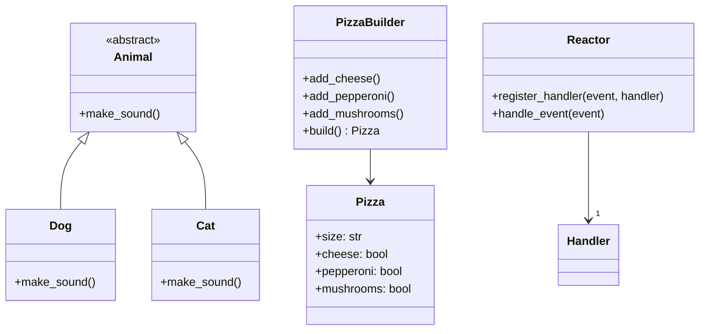

## 13.5 Third-Party Libraries Implementing Patterns

In the world of software development, leveraging third-party libraries can significantly streamline the process of implementing design patterns. These libraries provide out-of-the-box solutions and utilities that align with common patterns, reducing the need for boilerplate code and enhancing the reliability of your applications. In this section, we will explore some key libraries that facilitate the implementation of design patterns in Python.

### Importance of Third-Party Libraries

Third-party libraries play a crucial role in modern software development. They offer pre-built functionalities that developers can integrate into their applications, saving time and effort. By using these libraries, developers can focus on the unique aspects of their projects rather than reinventing the wheel. Here are some reasons why leveraging third-party libraries is beneficial:

- **Efficiency**: Libraries provide ready-to-use components that can be easily integrated into your codebase, speeding up development.
- **Reliability**: Established libraries are often well-tested and maintained, reducing the likelihood of bugs and errors.
- **Community Support**: Popular libraries have active communities that contribute to their development and provide support through forums and documentation.
- **Focus on Core Logic**: By offloading common functionalities to libraries, developers can concentrate on the core logic and unique features of their applications.

### Overview of Selected Libraries

In this section, we will delve into three specific libraries that are part of Python's standard library. These libraries are chosen for their ability to directly facilitate the implementation of design patterns:

- **The `abc` Module and Abstract Base Classes**: This module helps in defining abstract base classes, which are essential for implementing certain design patterns like Template Method and Strategy.
- **The `dataclasses` Module for Builder Pattern**: This module simplifies the creation of classes that are primarily used to store data, making it easier to implement the Builder pattern.
- **The `asyncio` Module for Asynchronous Patterns**: This module provides a framework for writing asynchronous code, which is crucial for implementing patterns like Reactor and Active Object.

### Criteria for Library Selection

The libraries discussed in this section are part of Python's standard library, ensuring their reliability and support. They have been selected based on the following criteria:

- **Relevance to Design Patterns**: Each library directly facilitates the implementation of one or more design patterns.
- **Standard Library Inclusion**: Being part of the standard library means these modules are maintained by the Python Software Foundation, ensuring long-term support and compatibility.
- **Ease of Use**: These libraries are designed to be easy to use, with clear documentation and examples.

### Encourage Exploration

As we explore these libraries, we encourage you to delve deeper into their documentation and experiment with them in your own projects. Understanding how these libraries work and how they can be applied will enhance your ability to implement design patterns effectively.

### Transition to Subsections

In the following subsections, we will take a closer look at each library and its role in implementing design patterns. We will provide examples and explanations to help you understand how to leverage these libraries in your own projects.

---

### 13.5.1 The `abc` Module and Abstract Base Classes

The `abc` module in Python provides infrastructure for defining abstract base classes (ABCs). ABCs are a powerful tool for implementing design patterns that rely on polymorphism and abstraction, such as the Template Method and Strategy patterns.

#### Understanding Abstract Base Classes

Abstract base classes are classes that cannot be instantiated directly. They are used to define a common interface for a group of subclasses. By using ABCs, you can enforce that certain methods must be implemented by any concrete subclass, ensuring consistency across different implementations.

```python
from abc import ABC, abstractmethod

class Animal(ABC):
    @abstractmethod
    def make_sound(self):
        pass

class Dog(Animal):
    def make_sound(self):
        return "Woof!"

class Cat(Animal):
    def make_sound(self):
        return "Meow!"
```

In this example, `Animal` is an abstract base class with an abstract method `make_sound`. Both `Dog` and `Cat` must implement the `make_sound` method.

#### Implementing the Template Method Pattern

The Template Method pattern defines the skeleton of an algorithm in an operation, deferring some steps to subclasses. Abstract base classes are ideal for implementing this pattern.

```python
from abc import ABC, abstractmethod

class DataProcessor(ABC):
    def process(self):
        self.load_data()
        self.process_data()
        self.save_data()

    @abstractmethod
    def load_data(self):
        pass

    @abstractmethod
    def process_data(self):
        pass

    @abstractmethod
    def save_data(self):
        pass

class CSVDataProcessor(DataProcessor):
    def load_data(self):
        print("Loading CSV data")

    def process_data(self):
        print("Processing CSV data")

    def save_data(self):
        print("Saving CSV data")
```

In this example, `DataProcessor` defines a template method `process`, which calls abstract methods that must be implemented by subclasses like `CSVDataProcessor`.

#### Benefits of Using the `abc` Module

- **Enforcement of Method Implementation**: Ensures that all subclasses implement the necessary methods.
- **Code Reusability**: Promotes code reuse by defining common behavior in the abstract base class.
- **Flexibility**: Allows for different implementations of the same interface, facilitating polymorphism.

### 13.5.2 The `dataclasses` Module for Builder Pattern

The `dataclasses` module, introduced in Python 3.7, provides a decorator and functions for automatically adding special methods to user-defined classes. This module is particularly useful for implementing the Builder pattern, which involves constructing complex objects step by step.

#### Understanding Data Classes

Data classes are classes that are primarily used to store data. By using the `@dataclass` decorator, you can automatically generate special methods like `__init__`, `__repr__`, and `__eq__`.

```python
from dataclasses import dataclass

@dataclass
class Car:
    make: str
    model: str
    year: int
```

In this example, the `Car` class is a simple data class with three attributes. The `@dataclass` decorator automatically adds an initializer and other methods.

#### Implementing the Builder Pattern

The Builder pattern is used to construct complex objects step by step. Data classes simplify this process by providing a clear and concise way to define the data structure.

```python
from dataclasses import dataclass

@dataclass
class Pizza:
    size: str
    cheese: bool = False
    pepperoni: bool = False
    mushrooms: bool = False

class PizzaBuilder:
    def __init__(self):
        self._pizza = Pizza(size="Medium")

    def add_cheese(self):
        self._pizza.cheese = True
        return self

    def add_pepperoni(self):
        self._pizza.pepperoni = True
        return self

    def add_mushrooms(self):
        self._pizza.mushrooms = True
        return self

    def build(self):
        return self._pizza

builder = PizzaBuilder()
pizza = builder.add_cheese().add_pepperoni().build()
print(pizza)
```

In this example, the `PizzaBuilder` class provides methods to add ingredients to a `Pizza` object, demonstrating the Builder pattern.

#### Benefits of Using the `dataclasses` Module

- **Reduced Boilerplate Code**: Automatically generates common methods, reducing the amount of code you need to write.
- **Improved Readability**: Provides a clear and concise way to define data structures.
- **Flexibility**: Easily extendable to include additional attributes or methods.

### 13.5.3 The `asyncio` Module for Asynchronous Patterns

The `asyncio` module provides a framework for writing asynchronous code using the `async` and `await` syntax. This module is essential for implementing asynchronous patterns like Reactor and Active Object.

#### Understanding Asynchronous Programming

Asynchronous programming allows you to write code that can perform tasks concurrently, without blocking the execution of other tasks. This is particularly useful for I/O-bound operations, such as network requests or file I/O.

```python
import asyncio

async def fetch_data():
    print("Fetching data...")
    await asyncio.sleep(2)
    print("Data fetched!")

async def main():
    await fetch_data()

asyncio.run(main())
```

In this example, `fetch_data` is an asynchronous function that simulates a network request using `await asyncio.sleep`.

#### Implementing the Reactor Pattern

The Reactor pattern is used to handle service requests by dispatching them synchronously to handlers. The `asyncio` module provides the necessary tools to implement this pattern.

```python
import asyncio

class Reactor:
    def __init__(self):
        self._handlers = {}

    def register_handler(self, event, handler):
        self._handlers[event] = handler

    async def handle_event(self, event):
        handler = self._handlers.get(event)
        if handler:
            await handler()

async def on_data_received():
    print("Data received!")

reactor = Reactor()
reactor.register_handler("data_received", on_data_received)

asyncio.run(reactor.handle_event("data_received"))
```

In this example, the `Reactor` class manages event handlers and dispatches events to the appropriate handler.

#### Benefits of Using the `asyncio` Module

- **Concurrency**: Allows for concurrent execution of tasks, improving performance for I/O-bound operations.
- **Scalability**: Enables applications to handle a large number of connections or requests simultaneously.
- **Flexibility**: Provides a wide range of tools for managing asynchronous tasks and events.

### Visualizing the Role of Libraries in Pattern Implementation

To better understand the role of these libraries in implementing design patterns, let's visualize their interactions using a class diagram.



This diagram illustrates the relationships between abstract base classes, data classes, and the Reactor pattern, highlighting how these libraries facilitate pattern implementation.

### Try It Yourself

To deepen your understanding, try modifying the examples provided:

- **For the `abc` module**: Add a new subclass to the `Animal` hierarchy and implement a unique sound.
- **For the `dataclasses` module**: Extend the `PizzaBuilder` to include more ingredients and customize the `Pizza` class.
- **For the `asyncio` module**: Create additional events and handlers in the `Reactor` example to simulate a more complex event-driven system.

### References and Links

For further reading and exploration, check out the following resources:

- [Python `abc` Module Documentation](https://docs.python.org/3/library/abc.html)
- [Python `dataclasses` Module Documentation](https://docs.python.org/3/library/dataclasses.html)
- [Python `asyncio` Module Documentation](https://docs.python.org/3/library/asyncio.html)

### Knowledge Check

Before moving on, consider the following questions to test your understanding:

- How do abstract base classes enforce method implementation in subclasses?
- What are the benefits of using data classes in Python?
- How does the `asyncio` module facilitate asynchronous programming?

### Embrace the Journey

Remember, this is just the beginning. As you progress, you'll discover more libraries and tools that can enhance your ability to implement design patterns in Python. Keep experimenting, stay curious, and enjoy the journey!

## Quiz Time!



### What is the primary benefit of using third-party libraries in Python?

- [x] They provide pre-built functionalities that save development time.
- [ ] They increase the complexity of the codebase.
- [ ] They are difficult to integrate into existing projects.
- [ ] They replace the need for understanding core concepts.

> **Explanation:** Third-party libraries offer pre-built functionalities that can be easily integrated, saving development time and effort.

### Which Python module is used for defining abstract base classes?

- [x] abc
- [ ] dataclasses
- [ ] asyncio
- [ ] functools

> **Explanation:** The `abc` module provides infrastructure for defining abstract base classes in Python.

### What is the main advantage of using the `dataclasses` module?

- [x] It reduces boilerplate code by automatically generating special methods.
- [ ] It complicates the process of defining data structures.
- [ ] It is only useful for large-scale applications.
- [ ] It requires extensive configuration to use.

> **Explanation:** The `dataclasses` module reduces boilerplate code by automatically generating methods like `__init__`, `__repr__`, and `__eq__`.

### How does the `asyncio` module benefit asynchronous programming?

- [x] It allows for concurrent execution of tasks.
- [ ] It simplifies synchronous programming.
- [ ] It is only useful for CPU-bound operations.
- [ ] It eliminates the need for event loops.

> **Explanation:** The `asyncio` module enables concurrent execution of tasks, improving performance for I/O-bound operations.

### What design pattern is facilitated by the `abc` module?

- [x] Template Method
- [ ] Builder
- [ ] Reactor
- [ ] Singleton

> **Explanation:** The `abc` module facilitates the Template Method pattern by allowing the definition of abstract methods that must be implemented by subclasses.

### Which module is essential for implementing the Builder pattern?

- [x] dataclasses
- [ ] abc
- [ ] asyncio
- [ ] collections

> **Explanation:** The `dataclasses` module simplifies the creation of classes used in the Builder pattern by reducing boilerplate code.

### What is the role of the `asyncio` module in the Reactor pattern?

- [x] It provides tools for managing asynchronous tasks and events.
- [ ] It simplifies the creation of synchronous handlers.
- [ ] It is not related to the Reactor pattern.
- [ ] It only supports single-threaded applications.

> **Explanation:** The `asyncio` module provides tools for managing asynchronous tasks and events, which are essential for implementing the Reactor pattern.

### How can you extend the functionality of a data class?

- [x] By adding more attributes or methods.
- [ ] By using the `abc` module.
- [ ] By converting it to a regular class.
- [ ] By removing existing attributes.

> **Explanation:** You can extend the functionality of a data class by adding more attributes or methods to it.

### What is a key feature of abstract base classes?

- [x] They cannot be instantiated directly.
- [ ] They are used to store data.
- [ ] They simplify asynchronous programming.
- [ ] They automatically generate special methods.

> **Explanation:** Abstract base classes cannot be instantiated directly; they are used to define a common interface for subclasses.

### True or False: The `asyncio` module is only useful for network applications.

- [ ] True
- [x] False

> **Explanation:** While the `asyncio` module is particularly useful for network applications, it can be used for any I/O-bound operations that benefit from asynchronous programming.


