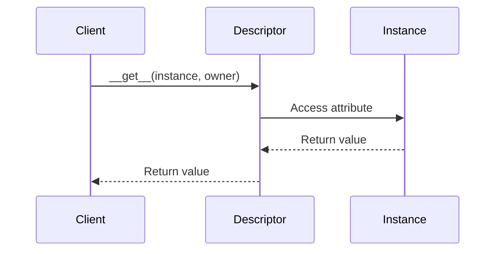

## 14.1.1 Descriptors and Design Patterns

In this section, we delve into the fascinating world of Python descriptors and their role in implementing design patterns. Descriptors provide a powerful mechanism for managing attribute access, enabling developers to enhance encapsulation and flexibility in their code. Let's explore how descriptors work, their benefits, and how they can be integrated with design patterns to create robust Python applications.

### Understanding Descriptors in Python

#### What Are Descriptors?

Descriptors are objects that define how attribute access is managed in Python. They allow you to customize the behavior of getting, setting, and deleting attributes. Descriptors are a fundamental part of Python's data model and are used internally by the language to implement properties, methods, and more.

#### The Descriptor Protocol

The descriptor protocol consists of three special methods that a class can implement to become a descriptor:

- `__get__(self, instance, owner)`: This method is called to retrieve an attribute value. It takes three arguments: `self` (the descriptor instance), `instance` (the instance of the owner class from which the attribute is accessed), and `owner` (the owner class itself).

- `__set__(self, instance, value)`: This method is called to set an attribute value. It takes three arguments: `self`, `instance`, and `value` (the new value to be set).

- `__delete__(self, instance)`: This method is called to delete an attribute. It takes two arguments: `self` and `instance`.

By implementing these methods, you can control how attributes are accessed, modified, and deleted.

### Benefits of Using Descriptors

Descriptors offer several advantages that make them a powerful tool in Python programming:

- **Controlled Attribute Access**: Descriptors allow you to control how attributes are accessed and modified, providing a centralized way to manage attribute behavior.

- **Data Validation**: You can use descriptors to enforce data validation rules, ensuring that attribute values meet specific criteria before they are set.

- **Lazy Loading**: Descriptors can be used to implement lazy loading, where an attribute's value is computed only when it is accessed for the first time.

- **Computed Attributes**: Descriptors enable you to define attributes whose values are computed dynamically based on other attributes or external data.

### Implementing Descriptors

Let's explore how to implement custom descriptors in Python and use them to enforce type checking or value constraints.

#### Creating a Custom Descriptor

Here's an example of a simple descriptor that enforces type checking for an attribute:

```python
class TypedAttribute:
    def __init__(self, name, expected_type):
        self.name = name
        self.expected_type = expected_type

    def __get__(self, instance, owner):
        return instance.__dict__.get(self.name)

    def __set__(self, instance, value):
        if not isinstance(value, self.expected_type):
            raise TypeError(f"Expected {self.expected_type}, got {type(value)}")
        instance.__dict__[self.name] = value

    def __delete__(self, instance):
        del instance.__dict__[self.name]

class Person:
    name = TypedAttribute("name", str)
    age = TypedAttribute("age", int)

p = Person()
p.name = "Alice"  # Works fine
p.age = 30        # Works fine
p.age = "thirty"  # Raises TypeError
```

In this example, the `TypedAttribute` descriptor ensures that the `name` attribute is always a string and the `age` attribute is always an integer.

#### Enforcing Value Constraints

You can also use descriptors to enforce value constraints, such as ensuring that a numeric attribute is within a specific range:

```python
class RangeAttribute:
    def __init__(self, name, min_value, max_value):
        self.name = name
        self.min_value = min_value
        self.max_value = max_value

    def __get__(self, instance, owner):
        return instance.__dict__.get(self.name)

    def __set__(self, instance, value):
        if not (self.min_value <= value <= self.max_value):
            raise ValueError(f"Value must be between {self.min_value} and {self.max_value}")
        instance.__dict__[self.name] = value

    def __delete__(self, instance):
        del instance.__dict__[self.name]

class Temperature:
    celsius = RangeAttribute("celsius", -273, 1000)

t = Temperature()
t.celsius = 25    # Works fine
t.celsius = -300  # Raises ValueError
```

### Design Patterns with Descriptors

Descriptors can facilitate the implementation of several design patterns by providing controlled access to attributes. Let's explore how descriptors can be integrated with the Singleton and Proxy patterns.

#### Singleton Pattern with Descriptors

The Singleton pattern ensures that a class has only one instance and provides a global access point to it. Descriptors can be used to control instance creation and ensure that only one instance exists.

```python
class SingletonDescriptor:
    _instance = None

    def __get__(self, instance, owner):
        if SingletonDescriptor._instance is None:
            SingletonDescriptor._instance = owner()
        return SingletonDescriptor._instance

class Singleton:
    instance = SingletonDescriptor()

s1 = Singleton.instance
s2 = Singleton.instance
print(s1 is s2)  # True
```

In this example, the `SingletonDescriptor` ensures that only one instance of the `Singleton` class is created.

#### Proxy Pattern with Descriptors

The Proxy pattern provides a surrogate or placeholder for another object to control access to it. Descriptors can be used to manage access to the underlying object.

```python
class ProxyDescriptor:
    def __init__(self, target):
        self.target = target

    def __get__(self, instance, owner):
        print(f"Accessing {self.target}")
        return getattr(instance, self.target)

    def __set__(self, instance, value):
        print(f"Setting {self.target} to {value}")
        setattr(instance, self.target, value)

class RealObject:
    def __init__(self):
        self._value = 0

    value = ProxyDescriptor("_value")

obj = RealObject()
obj.value = 42  # Output: Setting _value to 42
print(obj.value)  # Output: Accessing _value
```

In this example, the `ProxyDescriptor` controls access to the `_value` attribute of the `RealObject` class.

### Built-in Uses of Descriptors

Python uses descriptors internally to implement several built-in features, such as `property`, methods, static methods, and class methods.

#### The `property` Function

The `property` function is a built-in way to create managed attributes using descriptors. It allows you to define getter, setter, and deleter methods for an attribute.

```python
class Circle:
    def __init__(self, radius):
        self._radius = radius

    @property
    def radius(self):
        return self._radius

    @radius.setter
    def radius(self, value):
        if value < 0:
            raise ValueError("Radius cannot be negative")
        self._radius = value

c = Circle(5)
print(c.radius)  # Output: 5
c.radius = 10    # Works fine
c.radius = -1    # Raises ValueError
```

In this example, the `radius` attribute is managed using the `property` function, which internally uses descriptors to control access.

#### Methods and Static Methods

Methods in Python are implemented using descriptors. When you define a method in a class, Python automatically wraps it in a descriptor to manage its behavior.

```python
class MyClass:
    def instance_method(self):
        print("Instance method called")

    @staticmethod
    def static_method():
        print("Static method called")

obj = MyClass()
obj.instance_method()  # Output: Instance method called
MyClass.static_method()  # Output: Static method called
```

In this example, `instance_method` is an instance method, while `static_method` is a static method, both managed using descriptors.

### Best Practices for Using Descriptors

While descriptors are powerful, they should be used judiciously to maintain code readability and simplicity. Here are some best practices to consider:

- **Use Descriptors When Necessary**: Descriptors are best used when you need to manage attribute access in a centralized and reusable way. For simple attribute access, regular attributes are sufficient.

- **Document Descriptor Behavior**: Clearly document the behavior of your descriptors, including any validation rules or constraints they enforce. This helps other developers understand how to use them correctly.

- **Avoid Overcomplicating Code**: Descriptors can introduce complexity, so use them only when they provide a clear benefit. Avoid using descriptors for trivial tasks that can be achieved with simpler solutions.

### Potential Challenges with Descriptors

Descriptors can introduce complexity into your code, making it harder to understand and debug. Here are some tips for dealing with descriptor-related challenges:

- **Debugging Descriptors**: When debugging descriptors, pay attention to the `__get__`, `__set__`, and `__delete__` methods. Use print statements or logging to track attribute access and modifications.

- **Understanding Descriptor Behavior**: Descriptors can be tricky to understand, especially when combined with other features like inheritance. Take the time to experiment with descriptors and understand how they interact with other parts of your code.

### Use Cases for Descriptors

Descriptors are particularly useful in scenarios where attribute access needs to be controlled or customized. Here are some real-world use cases where descriptors can improve code design:

- **Library or Framework Development**: Descriptors are often used in libraries and frameworks to provide flexible and reusable components. For example, Django uses descriptors to implement its ORM (Object-Relational Mapping) system.

- **Data Validation and Transformation**: Descriptors can be used to validate and transform data before it is set as an attribute. This is useful in applications that require strict data integrity.

- **Lazy Loading and Caching**: Descriptors can be used to implement lazy loading and caching mechanisms, where data is loaded or computed only when needed.

### Try It Yourself

To deepen your understanding of descriptors, try modifying the code examples provided in this section. Experiment with different types of validation rules, lazy loading mechanisms, or computed attributes. By doing so, you'll gain hands-on experience with descriptors and their potential applications.

### Visualizing Descriptor Workflow

To better understand how descriptors work, let's visualize the workflow of attribute access using a sequence diagram:



This diagram illustrates the process of accessing an attribute through a descriptor. The client requests the attribute, the descriptor manages the access, and the instance provides the value.

### References and Further Reading

For more information on descriptors and their applications, consider exploring the following resources:

- [Python's Descriptor HowTo Guide](https://docs.python.org/3/howto/descriptor.html)
- [Fluent Python by Luciano Ramalho](https://www.oreilly.com/library/view/fluent-python/9781491946237/)
- [Effective Python by Brett Slatkin](https://effectivepython.com/)

## Quiz Time!



### What is a descriptor in Python?

- [x] An object that defines how attribute access is managed.
- [ ] A function that calculates attribute values.
- [ ] A built-in Python module for managing data.
- [ ] A type of Python exception.

> **Explanation:** Descriptors are objects that define how attribute access is managed in Python, allowing customization of getting, setting, and deleting attributes.

### Which method is part of the descriptor protocol?

- [x] __get__
- [ ] __call__
- [ ] __init__
- [ ] __str__

> **Explanation:** The `__get__` method is part of the descriptor protocol, used to retrieve an attribute value.

### What is a benefit of using descriptors?

- [x] They provide controlled attribute access.
- [ ] They automatically optimize code performance.
- [ ] They simplify all Python code.
- [ ] They replace the need for classes.

> **Explanation:** Descriptors provide controlled attribute access, allowing centralized management of attribute behavior.

### How can descriptors be used in design patterns?

- [x] To facilitate patterns like Singleton and Proxy.
- [ ] To replace all design patterns.
- [ ] To eliminate the need for classes.
- [ ] To automatically generate code.

> **Explanation:** Descriptors can facilitate design patterns like Singleton and Proxy by managing attribute access and instance creation.

### What does the `__set__` method do in a descriptor?

- [x] Sets an attribute value.
- [ ] Retrieves an attribute value.
- [ ] Deletes an attribute.
- [ ] Initializes a class.

> **Explanation:** The `__set__` method in a descriptor is used to set an attribute value.

### How does Python use descriptors internally?

- [x] To implement properties and methods.
- [ ] To manage memory allocation.
- [ ] To handle exceptions.
- [ ] To create variables.

> **Explanation:** Python uses descriptors internally to implement properties, methods, and other features that require controlled attribute access.

### What is a potential challenge of using descriptors?

- [x] They can introduce complexity.
- [ ] They automatically slow down code.
- [ ] They replace all functions.
- [ ] They eliminate the need for variables.

> **Explanation:** Descriptors can introduce complexity into code, making it harder to understand and debug.

### What is the purpose of the `property` function in Python?

- [x] To create managed attributes using descriptors.
- [ ] To define global variables.
- [ ] To handle exceptions.
- [ ] To optimize code performance.

> **Explanation:** The `property` function is used to create managed attributes using descriptors, allowing control over attribute access.

### How can descriptors improve code design?

- [x] By providing controlled attribute access and validation.
- [ ] By eliminating all classes.
- [ ] By automatically generating code.
- [ ] By replacing all functions.

> **Explanation:** Descriptors improve code design by providing controlled attribute access, validation, and transformation.

### Descriptors are only useful in Python's standard library.

- [ ] True
- [x] False

> **Explanation:** Descriptors are useful beyond Python's standard library and can be applied in various scenarios, including custom applications and frameworks.



Remember, mastering descriptors and their integration with design patterns can significantly enhance your Python programming skills. Keep experimenting, stay curious, and enjoy the journey!
