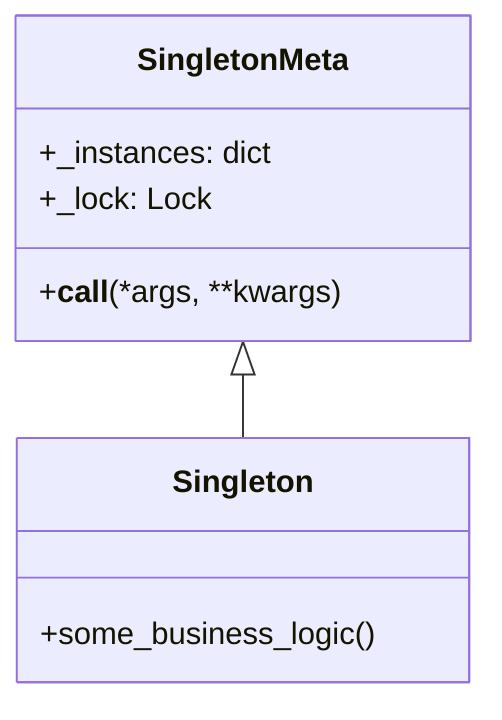

## 14.5.2 Secure Singleton Implementation

In this section, we delve into the intricacies of implementing a secure Singleton pattern in Python. We'll explore the potential vulnerabilities associated with Singletons and provide strategies to mitigate these risks, ensuring robust and secure software design.

### Review of Singleton Pattern

The Singleton pattern is a creational design pattern that restricts the instantiation of a class to a single object. This is useful when exactly one object is needed to coordinate actions across the system. Common use cases include configuration objects, logging, and managing connections to a database.

#### Key Characteristics of Singleton Pattern

- **Single Instance**: Ensures that a class has only one instance and provides a global point of access to it.
- **Lazy Initialization**: The instance is created only when it is needed for the first time.
- **Global Access**: The Singleton instance is accessible globally within the application.

### Security Concerns with Singletons

While the Singleton pattern is powerful, it introduces certain security concerns that need careful consideration:

#### Global Points of Access

Singletons can become global points of access, which can lead to:

- **Shared Mutable State**: If the Singleton holds mutable state, it can be modified by any part of the program, leading to unpredictable behavior.
- **Unauthorized Access**: Without proper access control, any part of the application can access and potentially misuse the Singleton.

#### Threading and Concurrency Issues

In a multi-threaded environment, Singleton implementations can face:

- **Race Conditions**: Multiple threads might simultaneously access the Singleton's instance creation logic, potentially leading to multiple instances.
- **Data Corruption**: Shared state can be corrupted if not properly synchronized.

### Implementing a Secure Singleton

To address these concerns, let's explore how to implement a secure Singleton in Python.

#### Thread-Safe Singleton Implementation

To ensure thread safety, we can use Python's `threading` module to synchronize access to the Singleton instance.

```python
import threading

class SingletonMeta(type):
    _instances = {}
    _lock: threading.Lock = threading.Lock()

    def __call__(cls, *args, **kwargs):
        # Double-checked locking mechanism
        if cls not in cls._instances:
            with cls._lock:
                if cls not in cls._instances:
                    cls._instances[cls] = super().__call__(*args, **kwargs)
        return cls._instances[cls]

class Singleton(metaclass=SingletonMeta):
    def some_business_logic(self):
        # Business logic here
        pass

singleton = Singleton()
```

**Explanation**: This implementation uses a metaclass `SingletonMeta` to control the instantiation process. The `_lock` ensures that only one thread can execute the instance creation code at a time, preventing race conditions.

#### Try It Yourself

Experiment with the above code by removing the lock and observing the behavior in a multi-threaded environment. This will help you understand the importance of thread safety.

### Controlling Access

To restrict access to the Singleton instance, consider implementing access control checks within the Singleton methods.

```python
class SecureSingleton(metaclass=SingletonMeta):
    def __init__(self):
        self._authorized_users = set()

    def authorize_user(self, user_id):
        self._authorized_users.add(user_id)

    def some_secure_method(self, user_id):
        if user_id not in self._authorized_users:
            raise PermissionError("Unauthorized access attempt.")
        # Secure business logic here

secure_singleton = SecureSingleton()
secure_singleton.authorize_user('user123')
secure_singleton.some_secure_method('user123')
```

**Explanation**: This example introduces a basic access control mechanism by maintaining a set of authorized users. The `some_secure_method` checks if the user is authorized before proceeding.

### Preventing Subclassing and Modification

To prevent subclassing or modification of the Singleton class, we can use metaclasses or other techniques.

#### Using Metaclasses to Prevent Subclassing

```python
class FinalMeta(type):
    def __new__(cls, name, bases, namespace):
        for base in bases:
            if isinstance(base, FinalMeta):
                raise TypeError(f"Cannot subclass final class {base.__name__}")
        return super().__new__(cls, name, bases, namespace)

class FinalSingleton(metaclass=FinalMeta, SingletonMeta):
    pass

# class Subclass(FinalSingleton):
```

**Explanation**: The `FinalMeta` metaclass prevents any class that uses it from being subclassed, ensuring the integrity of the Singleton.

### Immutable Singletons

Making Singleton instances immutable can enhance security by preventing unauthorized modifications.

```python
class ImmutableSingleton(metaclass=SingletonMeta):
    def __init__(self, value):
        self._value = value

    @property
    def value(self):
        return self._value

immutable_singleton = ImmutableSingleton(42)
print(immutable_singleton.value)
```

**Explanation**: By using properties and not providing setters, the `ImmutableSingleton` ensures that its state cannot be changed after initialization.

### Best Practices

- **Minimize Global State**: Avoid using Singletons as a catch-all for global state. Instead, encapsulate specific responsibilities.
- **Limit Responsibilities**: Ensure the Singleton has a focused responsibility to avoid becoming a "God Object."
- **Encapsulation**: Use encapsulation to protect the Singleton's state and behavior.

### Conclusion

In this section, we've explored how to implement a secure Singleton pattern in Python. By addressing potential vulnerabilities such as unauthorized access, threading issues, and subclassing, we can ensure that our Singleton implementations are robust and secure. Remember to exercise caution when using Singletons in security-critical applications, and always strive for minimal global state and encapsulation.

### Visualizing Singleton Security



**Diagram Description**: This class diagram illustrates the relationship between `SingletonMeta` and `Singleton`, highlighting the use of a lock to ensure thread safety.

### Further Reading

For more information on design patterns and secure coding practices, consider exploring the following resources:

- [Python's `threading` module documentation](https://docs.python.org/3/library/threading.html)
- [Design Patterns: Elements of Reusable Object-Oriented Software](https://en.wikipedia.org/wiki/Design_Patterns)
- [Secure Coding Guidelines](https://owasp.org/www-project-secure-coding-practices-quick-reference-guide/)

## Quiz Time!



### What is a key characteristic of the Singleton pattern?

- [x] It ensures a class has only one instance.
- [ ] It allows multiple instances of a class.
- [ ] It is used to create a new instance every time it is called.
- [ ] It is primarily used for sorting algorithms.

> **Explanation:** The Singleton pattern ensures that a class has only one instance and provides a global point of access to it.

### What is a potential risk of using Singletons?

- [x] Shared mutable state can lead to unpredictable behavior.
- [ ] Singletons always improve security.
- [ ] Singletons are inherently thread-safe.
- [ ] Singletons eliminate the need for access control.

> **Explanation:** Singletons can lead to shared mutable state, which can be modified by any part of the program, leading to unpredictable behavior.

### How can you ensure thread safety in a Singleton implementation?

- [x] Use a lock to synchronize access to the instance creation code.
- [ ] Allow multiple threads to create instances simultaneously.
- [ ] Avoid using any synchronization mechanisms.
- [ ] Use a global variable to store the instance.

> **Explanation:** Using a lock ensures that only one thread can execute the instance creation code at a time, preventing race conditions.

### What is the purpose of access control checks within Singleton methods?

- [x] To restrict access to authorized users only.
- [ ] To allow any user to modify the Singleton.
- [ ] To ensure the Singleton is always accessible.
- [ ] To prevent the Singleton from being used.

> **Explanation:** Access control checks restrict access to the Singleton's methods, ensuring that only authorized users can perform certain actions.

### How can you prevent subclassing of a Singleton class?

- [x] Use a metaclass that raises an error when subclassing is attempted.
- [ ] Allow any class to subclass the Singleton.
- [ ] Use a global variable to prevent subclassing.
- [ ] Avoid using any metaclasses.

> **Explanation:** A metaclass can be used to raise an error when an attempt is made to subclass the Singleton, ensuring its integrity.

### What is the benefit of making Singleton instances immutable?

- [x] It prevents unauthorized modifications to the instance.
- [ ] It allows the instance to be modified by any user.
- [ ] It makes the Singleton more flexible.
- [ ] It ensures the Singleton can be subclassed.

> **Explanation:** Making Singleton instances immutable prevents unauthorized modifications, enhancing security.

### What is a best practice when using Singletons?

- [x] Limit the Singleton's responsibilities to avoid becoming a "God Object."
- [ ] Use Singletons to manage all global state.
- [ ] Allow the Singleton to be modified by any part of the program.
- [ ] Avoid encapsulating the Singleton's state.

> **Explanation:** Limiting the Singleton's responsibilities helps prevent it from becoming a "God Object," which can lead to poor design.

### What is the role of encapsulation in Singleton design?

- [x] To protect the Singleton's state and behavior.
- [ ] To expose the Singleton's state to all parts of the program.
- [ ] To allow any user to modify the Singleton.
- [ ] To prevent the Singleton from being used.

> **Explanation:** Encapsulation protects the Singleton's state and behavior, ensuring it is used correctly and securely.

### What is a common use case for the Singleton pattern?

- [x] Managing connections to a database.
- [ ] Sorting algorithms.
- [ ] Data encryption.
- [ ] File compression.

> **Explanation:** The Singleton pattern is commonly used for managing connections to a database, where only one instance is needed.

### True or False: Singletons are always the best solution for managing global state.

- [ ] True
- [x] False

> **Explanation:** Singletons are not always the best solution for managing global state, as they can introduce security risks and design issues if not used carefully.



Remember, this is just the beginning. As you progress in your journey of mastering design patterns, you'll build more secure and efficient applications. Keep experimenting, stay curious, and enjoy the journey!
