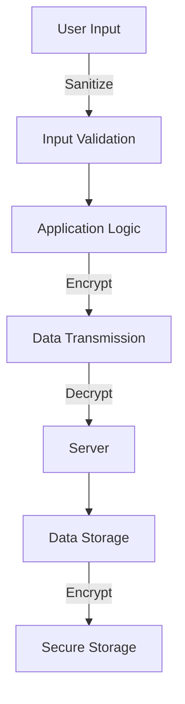

## 14.5 Security Design Patterns

### Introduction to Security Design Patterns

In the world of software development, security is not just an afterthought; it is a fundamental aspect that must be woven into the fabric of your application from the very beginning. Security design patterns are reusable solutions that address common security challenges in software design. These patterns provide a structured approach to identifying and mitigating potential vulnerabilities, ensuring that your applications are robust and secure.

Security design patterns are crucial because they encapsulate best practices and proven techniques for safeguarding applications against a wide range of threats. By understanding and applying these patterns, developers can build systems that are resilient to attacks, protecting both the application and its users.

### Common Security Principles

Before diving into specific security design patterns, it's essential to understand the foundational security principles that guide their implementation. These principles serve as the bedrock upon which secure systems are built:

- **Least Privilege**: This principle dictates that users and systems should have the minimum level of access necessary to perform their functions. By limiting access, you reduce the potential damage that can be caused by a compromised account or system.

- **Defense in Depth**: This approach involves layering multiple security measures to protect your system. If one layer is breached, others remain to provide protection. This redundancy is crucial for mitigating the risk of a single point of failure.

- **Secure Defaults**: Systems should be configured to be secure by default. This means that the default settings should be the most secure possible, requiring users to explicitly enable less secure options if necessary.

These principles are closely related to security design patterns, as they inform the design decisions that lead to secure systems. By adhering to these principles, developers can create applications that are inherently more secure.

### Overview of Security Patterns

Security design patterns are diverse, each addressing specific aspects of security. Here, we'll introduce some of the most common patterns and their purposes:

- **Authentication and Authorization Patterns**: These patterns focus on verifying the identity of users and controlling access to resources. Examples include the Single Sign-On (SSO) pattern and the Role-Based Access Control (RBAC) pattern.

- **Secure Communication Patterns**: Ensuring data integrity and confidentiality during transmission is critical. Patterns like the Secure Socket Layer (SSL) and Transport Layer Security (TLS) are widely used for this purpose.

- **Input Validation Patterns**: These patterns help prevent injection attacks by ensuring that all input is properly validated and sanitized. The Input Sanitization pattern is a key example.

- **Error Handling and Logging Patterns**: Proper error handling and logging are essential for detecting and responding to security incidents. Patterns like the Secure Logger and Exception Shielding help maintain security while managing errors.

- **Data Protection Patterns**: Protecting sensitive data at rest and in transit is vital. Patterns such as Data Encryption and Secure Storage are used to safeguard data.

In the following sections, we'll delve into specific security design patterns, exploring their implementation in Python and how they contribute to building secure applications.

### Integrating Security into Design

Security should be an integral part of the design process, not an afterthought. By considering security from the outset, developers can make informed design decisions that enhance the overall security posture of their applications.

When integrating security into design, it's important to balance security with other factors such as performance and usability. While security is paramount, overly restrictive measures can hinder user experience or degrade system performance. Striking the right balance requires careful consideration and often involves trade-offs.

Let's explore some strategies for integrating security into your design process:

- **Threat Modeling**: Identify potential threats and vulnerabilities early in the design phase. This proactive approach allows you to address security concerns before they become critical issues.

- **Security Reviews**: Conduct regular security reviews throughout the development lifecycle. These reviews help identify weaknesses and ensure that security measures are effective.

- **Secure Coding Practices**: Adhere to secure coding standards and guidelines. This includes practices such as input validation, proper error handling, and avoiding hard-coded credentials.

By embedding security into the design process, you can create applications that are not only secure but also efficient and user-friendly.

### Best Practices

To build secure applications, it's essential to follow best practices that reinforce security throughout the development lifecycle. Here are some key practices to consider:

- **Regular Security Assessments**: Conduct regular security assessments to identify vulnerabilities and address them promptly. This includes penetration testing, code reviews, and vulnerability scanning.

- **Code Reviews**: Implement a robust code review process to catch security issues early. Peer reviews can help identify potential vulnerabilities and ensure adherence to secure coding standards.

- **Security Training**: Provide ongoing security training for developers. Keeping your team informed about the latest security threats and best practices is crucial for maintaining a secure development environment.

- **Patch Management**: Stay up-to-date with security patches and updates for all software components. Timely patching helps protect against known vulnerabilities.

- **Incident Response Planning**: Develop and maintain an incident response plan to quickly and effectively respond to security incidents. This plan should include procedures for identifying, containing, and mitigating threats.

By following these best practices, you can create a security-conscious development environment that prioritizes the protection of your applications and data.

### Use Cases and Examples

To illustrate the importance of security design patterns, let's explore some real-world scenarios where these patterns have been used to prevent vulnerabilities:

#### Case Study: Preventing SQL Injection with Input Validation

SQL injection is a common attack vector that can be mitigated with proper input validation. By implementing the Input Sanitization pattern, developers can ensure that all user input is validated and sanitized before being processed by the application.

```python
import re

def sanitize_input(user_input):
    # Remove any potentially harmful characters
    sanitized = re.sub(r'[^\w\s]', '', user_input)
    return sanitized

user_input = "SELECT * FROM users WHERE username = 'admin'; --"
safe_input = sanitize_input(user_input)
print(f"Sanitized input: {safe_input}")
```

In this example, the `sanitize_input` function removes any potentially harmful characters from user input, preventing SQL injection attacks.

#### Case Study: Securing Communication with TLS

Transport Layer Security (TLS) is a widely used protocol for securing communication over networks. By implementing the TLS pattern, developers can ensure that data is transmitted securely between clients and servers.

```python
import ssl
import socket

def create_secure_socket():
    context = ssl.create_default_context()
    secure_socket = context.wrap_socket(socket.socket(socket.AF_INET), server_hostname='example.com')
    return secure_socket

secure_socket = create_secure_socket()
secure_socket.connect(('example.com', 443))
print("Secure connection established")
```

In this example, a secure socket is created using TLS, ensuring that data transmitted over the network is encrypted and protected from eavesdropping.

### Conclusion

Security is a critical aspect of software development that must be prioritized from the very beginning. By understanding and applying security design patterns, developers can build robust and secure applications that protect both the application and its users.

Remember, security is an ongoing process that requires continuous attention and adaptation. By staying informed about the latest threats and best practices, you can ensure that your applications remain secure in an ever-evolving threat landscape.

### Visualizing Security Design Patterns

To better understand the relationships and flow of security design patterns, let's visualize some of these concepts using a diagram.



**Diagram Description**: This diagram illustrates the flow of data through various security design patterns, including input validation, secure communication, and data protection. By following this flow, developers can ensure that data is protected at every stage of the application lifecycle.

### Try It Yourself

To deepen your understanding of security design patterns, try modifying the code examples provided in this section. Experiment with different input validation techniques, or explore how TLS can be used to secure communication in different scenarios. By actively engaging with these examples, you'll gain valuable insights into how security design patterns can be applied in real-world applications.

### Knowledge Check

To reinforce your understanding of security design patterns, consider the following questions:

- How does the principle of least privilege enhance security in software design?
- What are some common trade-offs when integrating security into the design process?
- How can input validation patterns help prevent SQL injection attacks?
- Why is it important to conduct regular security assessments and code reviews?

By reflecting on these questions, you'll solidify your grasp of the key concepts covered in this section.

### Embrace the Journey

As you continue your journey in software development, remember that security is an ever-present concern that requires constant vigilance. By embracing security design patterns and best practices, you'll be well-equipped to build applications that are both secure and resilient. Keep experimenting, stay curious, and enjoy the journey!

## Quiz Time!



### What is the primary purpose of security design patterns?

- [x] To provide reusable solutions for common security challenges
- [ ] To improve application performance
- [ ] To enhance user interface design
- [ ] To simplify code readability

> **Explanation:** Security design patterns provide reusable solutions for addressing common security challenges in software design.

### Which principle dictates that users should have the minimum level of access necessary?

- [x] Least Privilege
- [ ] Defense in Depth
- [ ] Secure Defaults
- [ ] Principle of Least Astonishment

> **Explanation:** The principle of least privilege ensures that users and systems have only the access necessary to perform their functions.

### What is the main benefit of defense in depth?

- [x] It provides multiple layers of security to protect against breaches
- [ ] It simplifies the security architecture
- [ ] It eliminates the need for encryption
- [ ] It reduces the cost of security implementation

> **Explanation:** Defense in depth involves layering multiple security measures to protect against breaches, ensuring redundancy in case one layer fails.

### How can input validation patterns prevent SQL injection attacks?

- [x] By ensuring that all input is properly validated and sanitized
- [ ] By encrypting all input data
- [ ] By using complex algorithms for data processing
- [ ] By storing input data in a secure database

> **Explanation:** Input validation patterns prevent SQL injection by validating and sanitizing user input to remove potentially harmful characters.

### What is a common trade-off when integrating security into the design process?

- [x] Balancing security with performance and usability
- [ ] Reducing the number of security layers
- [ ] Eliminating the need for user authentication
- [ ] Simplifying the user interface

> **Explanation:** Integrating security often involves balancing security measures with performance and usability to ensure a positive user experience.

### Why is it important to conduct regular security assessments?

- [x] To identify vulnerabilities and address them promptly
- [ ] To reduce the complexity of the codebase
- [ ] To improve application aesthetics
- [ ] To enhance user engagement

> **Explanation:** Regular security assessments help identify vulnerabilities and ensure that security measures are effective.

### What role does threat modeling play in security design?

- [x] It helps identify potential threats and vulnerabilities early in the design phase
- [ ] It simplifies the coding process
- [ ] It reduces the need for encryption
- [ ] It enhances application performance

> **Explanation:** Threat modeling is a proactive approach to identifying potential threats and vulnerabilities early in the design phase.

### How does the Secure Socket Layer (SSL) pattern contribute to secure communication?

- [x] By encrypting data transmitted over the network
- [ ] By simplifying the network architecture
- [ ] By reducing the number of network connections
- [ ] By improving data compression

> **Explanation:** The SSL pattern encrypts data transmitted over the network, ensuring confidentiality and integrity.

### What is the benefit of using the Secure Logger pattern?

- [x] It maintains security while managing errors and logging
- [ ] It simplifies the logging process
- [ ] It enhances application performance
- [ ] It reduces the size of log files

> **Explanation:** The Secure Logger pattern ensures that logging is performed securely, maintaining confidentiality and integrity.

### True or False: Security should be considered only after the application is fully developed.

- [ ] True
- [x] False

> **Explanation:** Security should be an integral part of the design process from the beginning, not an afterthought.


