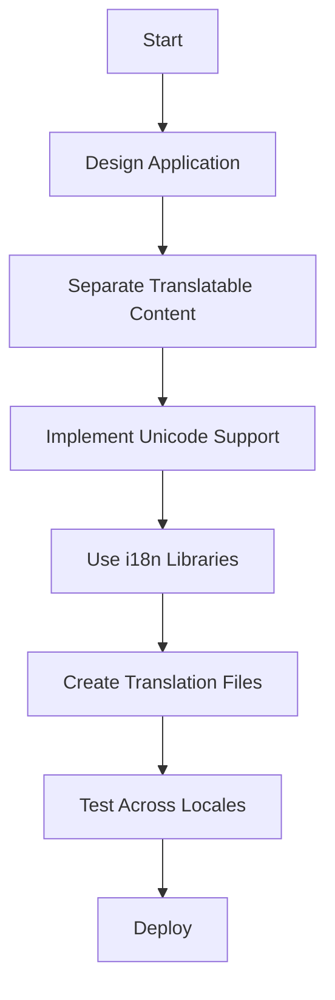

## 14.6 Internationalization Patterns

### Introduction to Internationalization (i18n)

Internationalization, often abbreviated as i18n, is the process of designing software applications in a way that they can be easily adapted to various languages and regions without requiring engineering changes to the source code. This is a crucial aspect of software development in today's globalized world, where applications are expected to cater to users from diverse linguistic and cultural backgrounds.

**Internationalization vs. Localization**

While internationalization refers to the design and development process that enables localization, localization (l10n) is the adaptation of the software for a specific region or language by translating text and adjusting other locale-specific elements. In essence, internationalization is about creating a framework that supports localization.

### Challenges of Internationalization

Developing software with internationalization in mind presents several challenges:

1. **Character Encoding**: Different languages use different character sets. Ensuring that your application can handle these variations is crucial. Unicode is the standard character encoding that supports most of the world's writing systems.

2. **Date and Time Formats**: Date and time representations vary widely across cultures. For example, the date format in the United States is MM/DD/YYYY, whereas in many European countries, it is DD/MM/YYYY.

3. **Currency and Number Formats**: Currency symbols, decimal separators, and thousands separators differ from one locale to another. For instance, the number 1,000.50 is represented as 1.000,50 in some European countries.

4. **Cultural Differences**: Beyond technical issues, cultural nuances such as color symbolism, imagery, and even text direction (e.g., right-to-left languages like Arabic) must be considered.

### Design Principles for i18n

To effectively internationalize your application, adhere to the following design principles:

- **Separation of Concerns**: Keep translatable content separate from the code. This can be achieved by using resource files or databases to store text strings.

- **Extensibility**: Design your application to easily accommodate new locales. This involves using locale-aware libraries and frameworks that can handle different formats and conventions.

- **Consistency**: Use consistent methods for formatting dates, times, and numbers across your application. This ensures a uniform user experience.

### Use of Unicode in Python

Python 3's default support for Unicode strings is a significant advantage for internationalization. In Python 3, all strings are Unicode by default, which simplifies handling text in multiple languages.

**Encoding and Decoding Practices**

When working with text data, it's essential to understand encoding and decoding:

```python
text = "Hello, world!"
encoded_text = text.encode('utf-8')

decoded_text = encoded_text.decode('utf-8')

print(decoded_text)  # Output: Hello, world!
```

Ensure that you consistently use UTF-8 encoding, as it is the most widely supported and can handle any character in the Unicode standard.

### Frameworks and Libraries

Several frameworks and libraries can assist with internationalization in Python:

- **`gettext`**: A standard library for managing translations. It allows you to mark strings in your code for translation and provides tools for creating and managing translation files.

- **`babel`**: A comprehensive internationalization library for Python that supports date, time, and number formatting, as well as message extraction and translation.

- **Django's Internationalization Framework**: If you're using Django, it comes with built-in support for internationalization and localization, making it easy to manage translations and locale-specific data.

#### Example: Using `gettext`

Here's a simple example of using `gettext` to manage translations:

```python
import gettext

gettext.bindtextdomain('myapp', 'locale')
gettext.textdomain('myapp')
_ = gettext.gettext

print(_("Hello, world!"))
```

In this example, the `gettext` function `_()` is used to mark strings for translation. The actual translations are stored in separate files, allowing you to easily switch languages.

### Best Practices

To ensure effective internationalization, follow these best practices:

- **Locale-Aware Functions**: Use functions that are aware of the current locale for formatting dates, times, and numbers. This ensures that your application respects the user's regional settings.

- **Regular Testing**: Test your application across different locales to catch any issues early. This includes checking text rendering, layout adjustments, and functionality.

- **Collaborate with Native Speakers**: When translating content, work with native speakers to ensure accuracy and cultural appropriateness.

### Conclusion

Internationalization is a vital aspect of modern software development, enabling applications to reach a global audience. By designing with internationalization in mind from the outset, you can create software that is flexible, adaptable, and ready for localization. Remember to consider internationalization early in the development process to avoid costly redesigns later.

### Try It Yourself

Experiment with the following code snippet by adding translations for additional languages:

```python
import gettext

gettext.bindtextdomain('myapp', 'locale')
gettext.textdomain('myapp')
_ = gettext.gettext

print(_("Hello, world!"))

```

### Visualizing Internationalization Workflow



This diagram illustrates the workflow for internationalizing an application, from design to deployment.

### Knowledge Check

- What is the difference between internationalization and localization?
- Why is Unicode important for internationalization?
- How can you separate translatable content from code?
- What are some challenges associated with internationalization?

### Embrace the Journey

Remember, internationalization is an ongoing process. As you expand your application's reach, you'll encounter new challenges and opportunities to improve. Keep experimenting, stay curious, and enjoy the journey of creating software that transcends borders!

## Quiz Time!



### What is the primary goal of internationalization in software development?

- [x] To design software that can be easily adapted to various languages and regions.
- [ ] To translate software into multiple languages.
- [ ] To ensure software is culturally appropriate for all users.
- [ ] To improve software performance across different locales.

> **Explanation:** Internationalization focuses on designing software that can be easily adapted to different languages and regions, enabling localization.

### Which of the following is a challenge associated with internationalization?

- [x] Character encoding
- [ ] Code optimization
- [ ] Memory management
- [ ] Network latency

> **Explanation:** Character encoding is a significant challenge in internationalization, as different languages use different character sets.

### What is the difference between internationalization and localization?

- [x] Internationalization is the process of designing software for adaptation, while localization is the adaptation itself.
- [ ] Internationalization is translating software, while localization is designing software.
- [ ] Internationalization is about cultural adaptation, while localization is about language adaptation.
- [ ] Internationalization and localization are the same.

> **Explanation:** Internationalization involves designing software to be adaptable, while localization is the actual adaptation process for specific regions or languages.

### How does Python 3 support internationalization?

- [x] By using Unicode strings by default
- [ ] By providing built-in translation functions
- [ ] By supporting multiple programming languages
- [ ] By optimizing code for different locales

> **Explanation:** Python 3 supports internationalization by using Unicode strings by default, which simplifies handling text in multiple languages.

### Which library is commonly used for managing translations in Python?

- [x] `gettext`
- [ ] `numpy`
- [ ] `pandas`
- [ ] `matplotlib`

> **Explanation:** `gettext` is a standard library in Python used for managing translations and internationalization.

### What is a best practice for internationalization?

- [x] Use locale-aware functions for formatting
- [ ] Hard-code all text strings
- [ ] Avoid using Unicode
- [ ] Translate content manually

> **Explanation:** Using locale-aware functions ensures that your application respects the user's regional settings, which is a best practice for internationalization.

### Why is it important to separate translatable content from code?

- [x] To facilitate easy translation and localization
- [ ] To improve code performance
- [ ] To reduce memory usage
- [ ] To enhance security

> **Explanation:** Separating translatable content from code makes it easier to translate and localize the application without modifying the source code.

### What is the role of Unicode in internationalization?

- [x] It provides a standard character encoding for most writing systems.
- [ ] It optimizes software for different locales.
- [ ] It translates text automatically.
- [ ] It enhances software security.

> **Explanation:** Unicode provides a standard character encoding that supports most of the world's writing systems, making it essential for internationalization.

### How can you test your application for internationalization?

- [x] By testing across different locales
- [ ] By optimizing code for performance
- [ ] By using only one language
- [ ] By hard-coding text strings

> **Explanation:** Testing across different locales helps identify issues related to internationalization, such as text rendering and layout adjustments.

### True or False: Internationalization should be considered early in the development process.

- [x] True
- [ ] False

> **Explanation:** Considering internationalization early in the development process helps avoid costly redesigns and ensures the application is ready for a global audience.


